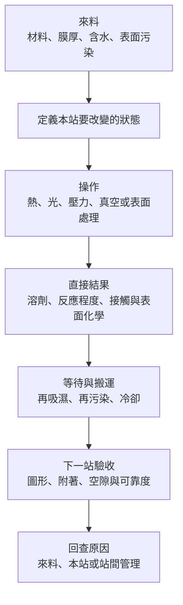

# 第 1 章：設備真正改變材料的哪個狀態？

## 開場問題

同一片板子、同一種膠，為什麼前一天黏得住，今天卻起泡？材料名稱與外觀沒變，不代表材料的**當下狀態**相同。

本書不先列志聖有哪些機器，而先追問：進站時材料帶著什麼，操作改變什麼，出站後下一道製程需要什麼？只有答完這三件事，「烘烤、照光、壓膜、清洗」才不會只剩設備名稱。

## 先看結構：材料名稱之外還有狀態

把工件想成「基板—介面—膜層」：基板支撐，介面決定接觸與附著，膜層承擔圖形、絕緣、保護或黏著等功能。載具可能在背面提供支撐，卻同時改變熱傳與變形。材料層次可回讀[材料與互連](../../gpm/html/03-materials-interconnect.html)。

| 要追蹤的狀態 | 不是什麼 | 可能影響下一站什麼 |
|---|---|---|
| 含水／表面吸附水 | 不等於配方中的溶劑 | 潤濕、附著及後續受熱的產氣風險 |
| 殘溶劑及其深度分布 | 不等於表面是否摸起來乾 | 顯影行為、起泡、膜層穩定性 |
| 固化或交聯程度 | 不等於單純蒸乾 | 可流動時間、力學性質、後續加工性 |
| 表面化學與污染 | 不等於肉眼是否乾淨 | 下一層能否鋪展與建立可靠介面 |
| 接觸、空隙與殘留應力 | 不等於平均壓力或外觀平整 | 脫層、翹曲及可靠度 |

例如光阻 softbake 主要降低殘溶劑，但過度加熱可能引起不需要的化學變化；相反地，固化膠材可能需要特定反應才能建立強度。**同樣「變硬」，不一定來自同一機制。** 這個差異由 T1、T2、T6 的材料案例支持，不能概括所有樹脂。

## 逐步製程：狀態如何接力

*圖 01-1｜本書自繪的材料狀態圖。這是教學因果圖，不是志聖或任何客戶的產線流程；箭頭不是「每項處理都必須做」。*

| 輸入 | 操作 | 輸出／目的 | 操作過頭的風險 |
|---|---|---|---|
| 帶溶劑光阻 | 適當 softbake 與排出揮發物 | 可曝光／顯影的膜層狀態 | 不需要的交聯或材料劣化 |
| 光敏材料 | 匹配波段與劑量 | 圖形潛像或固化反應，取決於用途 | 圖形偏移、過度照射或熱傷害 |
| 膜與起伏基板 | 在可流動窗口內建立接觸 | 提高貼合覆蓋、降低空隙 | 擠膠、變形或封住排氣通道 |
| 帶污染表面 | 選擇合適清洗／活化 | 下一層可接受的表面 | 攻擊保留材料、重新污染 |

後兩列是工程整理，具體能力仍需材料與設備共同驗證。沒有一台設備能因為名稱含「真空」或「電漿」，就自動消除所有氣泡與附著問題。

## 失敗會長什麼樣子

想像某膜層通過外觀檢查，但下一站受熱後出現空隙。至少有三條候選路徑：原先就封住空氣；材料後來放出揮發物；介面本來不牢，受熱應力使其分離。

這三種情況的修正不同。單純加壓可能暫時縮小空隙，卻沒有移走氣體；延長烘烤可能降低殘溶劑，卻也縮短膠的可流動窗口；加強表面處理可能改善介面，卻無法清掉膜內的氣泡。**觀察到同一缺陷，不應只憑設備名稱決定處方。**

## 如何檢查與控制

用三層證據縮小原因範圍：先記來料與歷史，再量設備作用，最後看材料及下游結果。

| 層次 | 最小紀錄 | 能排除的誤判 |
|---|---|---|
| 來料／歷史 | 材料批次、膜厚、儲存、前站、等待時間 | 把材料變異全算到設備上 |
| 設備作用 | 工件熱歷程、照射條件、壓力／真空順序、氣氛 | 把控制器設定當成材料實際經歷 |
| 材料結果 | 圖形、殘留、附著、空隙、翹曲及必要可靠度 | 把「參數有達到」當作「產品已合格」 |

若只換材料批次就改變結果，先確認批次與前處理；若缺陷固定在角落，再追空間分布；若隨等待時間增加，再追再吸濕、再污染或表面狀態變化。這是實驗定位的起點，不是靠外觀直接判定根因。

## 與志聖的連結

| 已確認事實 | 合理推論 | 尚待查證 |
|---|---|---|
| P1 有 PCB 曝光、P7 有先進封裝熱處理、P8 有晶圓乾膜壓膜、P12 有導線架電漿清洗產品，見[產品證據章](07-csun-product-evidence.md) | 光、熱、壓膜與表面處理可能在不同站點控制不同狀態 | 不能由技術類別推出某客戶、某平台或某項量產資格 |

## 理解檢查

??? question "1. 乾燥與固化為什麼不能當作同義詞？"
    乾燥主要關注揮發物移出；固化關注材料反應與性質形成。兩者可能同時發生，但終點、缺陷及控制方式不相同。

??? question "2. 氣泡經壓力處理後消失，能說原因已消除嗎？"
    不能。氣體可能只是被壓縮，卸壓或再受熱後又出現；還要確認氣體來源、排出路徑和介面完整性。

??? question "3. 為什麼要把等待與搬運畫在製程圖上？"
    出站狀態會隨時間改變。前處理當下合格，不代表經過排隊、冷卻或暴露後仍是相同表面。

??? question "4. 若新聞只說『具備熱製程技術』，還缺哪一段推理？"
    缺加工對象、要改變的材料狀態、具體站點與規格，也缺機型、客戶及驗證階段的直接證據。

## 來源與待查

[T1–T3、T5–T6](appendix-sources.md)分別支持光阻熱處理、曝光、表面準備及光固化機制；狀態圖與故障定位為跨來源教學整理。未建立適用所有材料的參數表。

下一章：[工件溫度與熱均勻性](02-thermal-uniformity.md)
