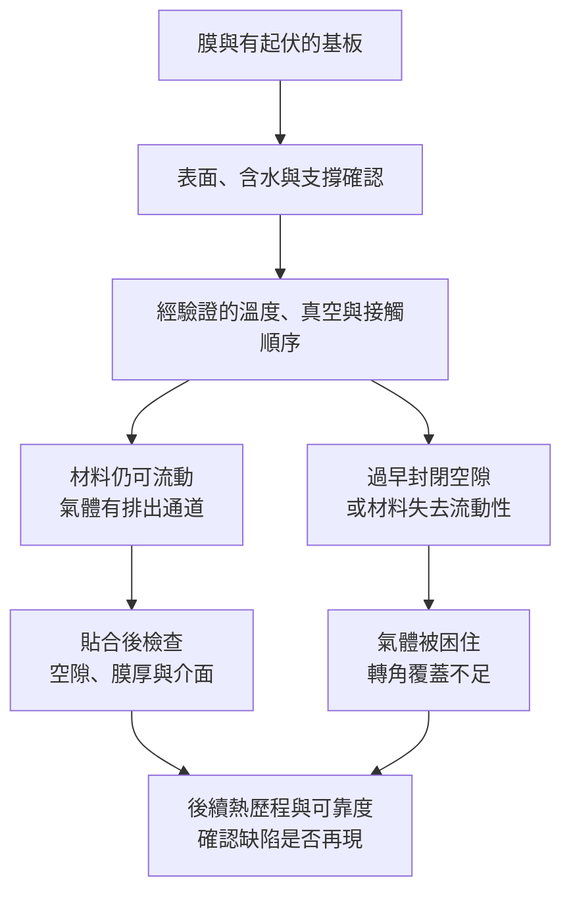

# 第 4 章：壓膜怎樣避免氣泡與貼合不均？

## 開場問題

一片有高低起伏的基板貼上膜後，平面區漂亮，線路旁卻留下空隙。操作員把壓力加大，空隙暫時縮小，後續加熱又出現。為什麼「壓得更用力」不是充分答案？

因為貼合要同時完成**材料能流到該去的位置、氣體有路離開、介面能保持接觸**。本章討論的是膜與基板的貼合，不是把晶粒精密放置並形成電性互連的 die bonding。

## 先看結構：膜、起伏、氣體與支撐

先看基板表面：凸起線路旁有轉角，凹處可能留著氣體；膜層在適當條件下可以順應表面，卻不一定在任何溫度、任何時間都能流動。背面的載具或支撐同時影響平整度與熱傳，這與[第 2 章](02-thermal-uniformity.md)相接。

| 控制量 | 能改變什麼 | 單獨不能保證什麼 |
|---|---|---|
| 溫度與時間 | 黏度、可流動時間及可能的固化進程 | 不是越熱越容易得到可靠貼合 |
| 壓力及其分布 | 促進接觸、驅動局部材料流動 | 平均壓力不代表轉角或凹處都接觸 |
| 真空及抽氣順序 | 降低腔體氣體量，為未封閉空隙提供排氣條件 | 無法保證已封閉氣泡或膜內揮發物全部消失 |
| 支撐、輥面／壓板與來料平整度 | 改變實際接觸與變形 | 同名壓膜機不一定適用另一種工件 |

這是貼合的工程因果模型，**不是所有膜都會隨升溫同樣變軟**；熱固性材料可能同時加速固化，必須依材料窗口判斷。

## 逐步製程：先排氣，還是先封邊？

以下為 **真空熱貼合的教學簡化流程**；輥壓式、連續式或不同膜材的實際順序可能不同。

| 步驟 | 輸入／操作 | 輸出／目的 |
|---|---|---|
| 表面與來料準備 | 確認顆粒、含水、膜材保存與基板起伏 | 排除壓合無法補救的來源 |
| 建立排氣條件 | 按經驗證程序抽氣、加熱與暫時接觸 | 使氣體尚有通道離開 |
| 貼合 | 在材料窗口內施加適當且分布可控的壓力 | 膜層順應起伏、減少空隙 |
| 結束與後續 | 按材料需求冷卻、固化、卸壓與檢查 | 接觸不只當下成立，後續也能維持 |

*圖 04-1｜本書自繪的缺陷形成圖。圖中兩條支線是機制對照，不是設備操作指令；加熱與抽氣的適當順序要由膜材及設備共同驗證。*

T1 的真空乾燥案例提醒：原本已夾在膜中的氣泡，可能在降壓時膨脹而造成缺陷。這是「真空不是萬靈丹」的材料例證，不是把光阻烘烤直接當成壓膜配方。

## 失敗會長什麼樣子

| 缺陷 | 可能原因 | 為什麼不能只加壓 |
|---|---|---|
| 轉角空隙 | 黏度／流動時間不夠、幾何遮蔽或困氣 | 無排氣通道時只壓縮氣體 |
| 局部凸點與薄區 | 顆粒、支撐不均或壓力集中 | 可能把缺陷壓進膜內或加重局部損傷 |
| 邊緣擠膠、膜厚不均 | 材料太易流動、壓力／時間不匹配 | 更高壓力可能讓有效膠量更少 |
| 後續才出現脫層 | 潛在弱介面、揮發物或熱應力 | 外觀貼合與長期介面可靠度不同 |

若空隙總跟著基板某個圖形位置，先查幾何及流動；若跟著機台固定區域，先查壓力、熱分布與支撐；若隨材料儲存時間改變，先查來料狀態。以上只是定位策略，仍需對照實驗。

## 如何檢查與控制

| 控制矩陣 | 驗收要問的問題 |
|---|---|
| 溫度 × 時間 × 壓力 × 真空順序 | 改一個參數時，其他條件是否保持；是否同時造成新的缺陷？ |
| 工件位置 × 起伏形貌 | 平面區合格是否掩蓋最深凹部與邊緣？ |
| 外觀 × 內部檢查 | 可見外觀不能看出全部埋藏空隙；依材料可用截面或適用的聲學等方法 |
| 初始結果 × 後續熱歷程 | 後續加熱或可靠度條件是否使空隙／脫層再現？ |

每種檢查有盲點：截面只代表切過的位置，聲學量測受材料與可達性限制；不能把「未檢出」寫成全工件零缺陷。實際方法依產品結構與允許的破壞性選擇。

## 與志聖的連結

| 已確認事實 | 合理推論 | 尚待查證 |
|---|---|---|
| P2 的 CSL-A25X 處理 PCB 乾膜；P8 的 WVL-A12D 是晶圓真空壓膜；P9 的 WVL-A12 另明列暫時接合，見[第 7 章](07-csun-product-evidence.md) | 接觸、熱與排氣控制經驗可成為跨應用的工程起點 | 不能由 PCB 壓膜推成晶粒接合、混合鍵合或某封裝平台量產供應 |

die bonding 還涉及晶粒搬運、位置與角度、接合介面及可能的電性互連；「都有壓力與溫度」遠不足以判定相同能力。

## 理解檢查

??? question "1. 抽真空後反而起泡，是否必然表示真空系統故障？"
    不必然。原本封閉的氣泡可能膨脹，材料也可能放出揮發物。要檢查來料、壓力變化與材料狀態，再判設備是否異常。

??? question "2. 為什麼平面測試片合格，不能代表有線路的基板合格？"
    起伏會改變排氣通道、局部接觸及所需流動距離；實際工件的最差幾何才是驗收對象。

??? question "3. 只有加熱後才出現脫層，應增加哪些觀察？"
    比較熱歷程前後的空隙、介面與翹曲，核對揮發物、固化及材料匹配；不要只增加貼合時的壓力。

??? question "4. 有真空壓膜機，為什麼不能直接宣稱有 die bonder？"
    加工對象、對位精度、介面目的與驗收項目不同。共用部分物理作用，不等於完整設備能力相同。

## 來源與待查

[T1、T3](appendix-sources.md)支持殘溶劑、真空氣泡及介面準備的限制；貼合流程、缺陷分支及控制矩陣是本書工程整理。公司個別膜材、真空壓力、壓力分布及空隙驗收條件依產品原始資料另列，不提供通用配方。

下一章：[清洗與表面處理的接口](05-surface-treatment.md)
