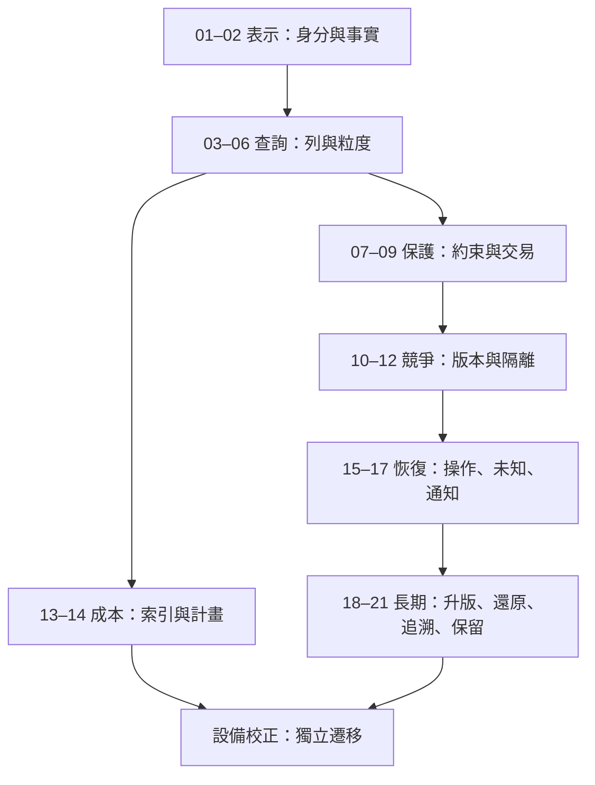

# 全書地圖：每一步增加一種判斷

不要先背一排隔離層級。先知道自己要保存什麼，才能說明哪種交錯會破壞它。

## 閱讀關卡

| 關卡 | 章節 | 可以前進的證據 |
|---|---|---|
| 表示事實 | [01](01-identity.md)、[02](02-normalization.md) | 分清缺陷、判定、模型版本；寫出候選鍵 |
| 讀對結果 | [03](03-query.md)、[04](04-null.md)、[05](05-joins.md)、[06](06-aggregation.md) | 不執行 SQL 也能算出每列、NULL 與 COUNT |
| 保護一次寫入 | [07](07-constraints.md)、[08](08-transactions.md)、[09](09-commit-durability.md) | 能提供非法輸入與中途失敗的反例 |
| 保護多人寫入 | [10](10-concurrent-updates.md)、[11](11-isolation.md)、[12](12-locks-deadlocks.md) | 畫出兩 session 時間線，解釋誰等待、誰失敗 |
| 量到讀取成本 | [13](13-indexes.md)、[14](14-query-plans.md) | 比較相同結果下的 logical reads 與維護成本 |
| 失聯仍可查核 | [15](15-operation-identity.md)、[16](16-unknown-outcome.md)、[17](17-outbox.md) | 舊操作不被新判定覆蓋；通知重複有契約 |
| 多年後仍可理解 | [18](18-migrations.md)、[19](19-restore.md)、[20](20-provenance.md)、[21](21-retention.md) | 還原並追到來源；清理後舊請求不悄悄重做 |

前七章可以先紙上推演。交易與隔離一定要在明確設定的資料庫觀察；無法連線時，可繼續讀原理，但不要把預測填進實測欄。

## 三種不同的版本

`model_version` 表示產生判定所用的模型；`version_no` 表示缺陷目前狀態的編修基線；資料庫 schema 版本表示欄位與契約的演進。它們回答不同問題，任何一個都不能代替其他兩個。時間戳則用來追溯，不自動提供可靠的因果全序。

讀到後半部時，回頭問：我在保護的是「目前值正確」、還是「某次操作的歷史結果不變」？兩者都需要，但查法與保留期限可能不同。

[實驗環境](labs.md) · [獨立練習](exercises.md)
