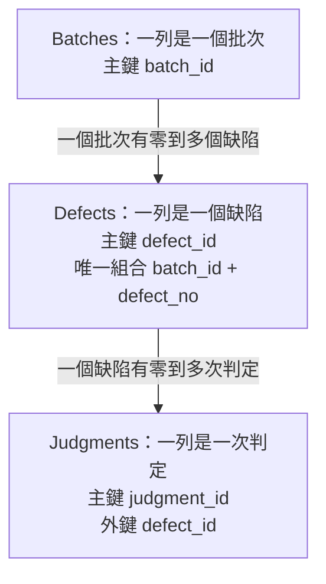

# 01｜同一個缺陷，怎麼知道是同一筆？

## 問題

AOI 在不同批次都可能編出「缺陷 1」。如果只用 defect_no 當身分，批次 A 的 defect 1 和批次 B 的 defect 1 會被誤認成同一筆。要先分清楚「人用來稱呼資料的業務身分」與「資料庫用來穩定參照一列的鍵」。

資料庫的表像一份有欄名的清單；每一列代表一個實體，每一欄描述它。這裡有三種實體：批次、缺陷、判定事件。批次有自己的 batch_id；每個批次可以有多個缺陷；每個缺陷可以有零次、一次或多次判定。判定是一次發生過的事件，重判應新增事件，不能把前一次分數覆蓋掉，否則歷史就無從對帳。

## 先預測

seed 裡有 (batch_id=10, defect_no=1) 與 (batch_id=20, defect_no=1)。它們是同一個缺陷嗎？如果把 defect_no 設成 Defects 的唯一鍵，插入第二筆時會怎樣？再預測 defect_id=1 的判定會有幾列。

## 看資料身分與關係

在本書的合成契約中，(batch_id, defect_no) 才是缺陷的業務身分；同一缺陷編號可以在不同批次重複。這種能唯一識別實體的最小欄位組合稱候選鍵。候選鍵若使用業務上看得懂的欄位，常稱自然鍵；若另外配置一個沒有業務含義的識別值，則是代理鍵。此 schema 用 defect_id 作主鍵與連接點，同時用 UNIQUE(batch_id, defect_no) 保護自然鍵規則。兩者回答不同問題：前者讓其他表穩定參照；後者阻止業務重複。

關係可讀成：

- 一個 Batches 列對應多個 Defects 列；每個缺陷必屬於一個已存在的批次。
- 一個 Defects 列對應零到多個 Judgments 列；每筆判定必屬於一個缺陷。

圖中的箭頭由父實體走向子實體；外鍵欄位存放在子表。先沿著「批次 → 缺陷 → 判定」確認一列代表什麼，再讀後面的 seed。

Foreign key 是存在性規則：Defects.batch_id 必須找到 Batches.batch_id，Judgments.defect_id 必須找到 Defects.defect_id。它不會替你決定兩表的結果粒度，也不表示兩列一定一對一。

完整建表與合成 seed 放在 [共同 schema 與 seed](examples/01-schema.sql)。讀到 seed 可先手算：

| 批次 | 缺陷編號 | defect_id | judgment_id（分數） |
|---|---:|---:|---|
| A | 1 | 1 | 101（80）、102（90） |
| A | 2 | 2 | 無 |
| B | 1 | 3 | 103（70） |

用自然鍵查資料時，兩個 defect_no=1 仍可區分：

~~~sql
SELECT b.batch_id, b.label, d.defect_no, d.defect_id
FROM dbo.Batches AS b
JOIN dbo.Defects AS d ON d.batch_id = b.batch_id
ORDER BY b.batch_id, d.defect_no;
~~~

這份輸出有三個缺陷列。排序欄位只是讓人容易讀；真正關聯依據是 ON 裡的 batch_id。若後續程式持有 defect_id=1，就能找到同一缺陷及其判定，不必每次拼接批次與缺陷號。

## 反例與選擇

錯誤設計是讓 defect_no 單獨 UNIQUE。它把「每個批次內不重複」錯說成「全資料庫不重複」。另一個可行設計是直接以 (batch_id, defect_no) 作複合主鍵；它同樣能識別缺陷，但每張引用缺陷的表都要攜帶兩欄。這裡選 defect_id 作代理主鍵，並保留複合 UNIQUE，讓引用簡單又不犧牲業務規則。代理鍵不會自動證明業務資料正確，單獨有 1、2、3 也不能阻止同批次重複的缺陷號。

判定表不能以 defect_id 為主鍵，因為 defect 1 有 101、102 兩次判定。事件 ID 識別一筆判定；缺陷 ID 識別判定屬於哪個實體。兩種身分不可混用。seed 中 version_no 全為 0，是載入既有歷史後的編修基線；它不是判定事件數，也不能用來推算歷史次數。

## 從業務句子檢查鍵

寫 schema 前，可以把一句話改成可檢查規則：「每個批次有一個 ID；同一批次內的缺陷號不重複；同一個缺陷可以被判定很多次。」第一句推出 batch_id 主鍵；第二句推出 (batch_id, defect_no) 唯一；第三句要求 Judgments 有自己的 judgment_id，並用 defect_id 指向 Defects。若少了最後一條，重判只能覆蓋舊資料，或靠不穩定的時間欄位猜哪列是哪次事件。

自然鍵也可能因業務規則改變而不再穩定，例如外部系統重新編碼缺陷；代理鍵能讓內部關聯不必跟著改，但不代表應把自然鍵規則刪掉。設計鍵時請分別回答：「什麼讓使用者認為這是同一個對象？」以及「資料庫需要哪個短而穩定的值來參照它？」同一欄位未必能同時做好兩件事。

完整 seed 腳本也預先建立後半部才使用的 Operations、目前指標與 sequence。第一次只追本章三張核心表；[實驗入口](labs.md) 說明完整資料契約。

## 無提示題

不看上一節的表格，自己列出三張表各自的一列代表什麼、每張表的主鍵，以及缺陷的業務鍵。再說明為什麼同一 defect_no 可以出現在兩個批次，卻不違反業務唯一性。

> 本章先以手算建立模型；對應 schema 與約束已在 Docker 引擎驗證，詳見 [驗證紀錄](verification.md)。

答案：[answers.md｜01 身分](answers.md#01-identity)。

來源：[Microsoft Learn：Primary and foreign key constraints](https://learn.microsoft.com/en-us/sql/relational-databases/tables/primary-and-foreign-key-constraints?view=sql-server-ver16)、[Microsoft Learn：Unique constraints and check constraints](https://learn.microsoft.com/en-us/sql/relational-databases/tables/unique-constraints-and-check-constraints?view=sql-server-ver16)
