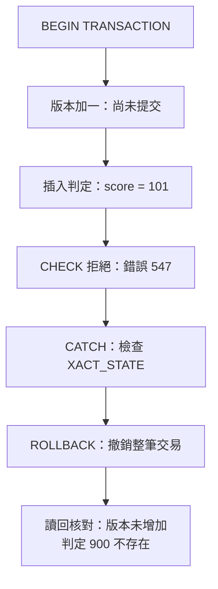

# 08｜交易與原子性：結果不能只成功一半

一次 AOI 重判至少會留下判定歷史，也可能更新缺陷的編修版本與「目前判定」指標。假設程式先把 `Defects.version_no` 加一，接著新增一筆 `Judgments`；第二步若因分數違反 `CHECK (score BETWEEN 0 AND 100)` 而失敗，第一步能否留下？先預測：如果兩句是各自自動提交，版本可能已經增加；若它們在同一筆交易內，應用明確回滾後，兩邊都回到交易開始前的狀態。

## 原子性保護什麼

交易把多個資料修改當成一個邏輯單位。`COMMIT` 表示這個單位完成；`ROLLBACK` 撤銷尚未提交的修改。原子性說的是「全做或全不做」，不會替我們決定分數是否合法、哪筆判定算最新，也不會自動把檔案或訊息服務納入同一交易。表上的主鍵、外鍵與 `CHECK` 仍然負責拒絕非法資料；交易負責讓相關表的改動一起成功或失敗。



這張圖對應下方故障片段。走到「版本加一」仍只是交易內的修改，不能把它當成已提交結果。

## 在第二步製造失敗

以下片段假設已在隔離的 `B02Lab` 建好教材 schema。它故意先更新缺陷 2 的版本，再以 101 分插入非法判定；預期 `INSERT` 因約束錯誤而進入 `CATCH`，之後檢查版本仍為原值、判定 900 不存在。這是原理片段，不是完整重置腳本；對應驗收檔已執行，實際得到錯誤 547、清理前 XACT_STATE=-1，版本與判定都回滾。

```sql
SET XACT_ABORT ON;
DECLARE @error_number int, @state_before_cleanup smallint;

BEGIN TRY
    BEGIN TRANSACTION;
    UPDATE dbo.Defects
      SET version_no = version_no + 1
      WHERE defect_id = 2;
    INSERT dbo.Judgments
      (judgment_id, defect_id, score, model_version, operator_name)
      VALUES (900, 2, 101, N'm1', N'atomicity'); -- 故意違反 CHECK
    COMMIT TRANSACTION;
END TRY
BEGIN CATCH
    SET @error_number = ERROR_NUMBER();
    SET @state_before_cleanup = XACT_STATE();
    IF XACT_STATE() <> 0 ROLLBACK TRANSACTION;
END CATCH;

SELECT @error_number AS error_number,
       @state_before_cleanup AS state_before_cleanup;
SELECT defect_id, version_no
FROM dbo.Defects WHERE defect_id = 2;
SELECT judgment_id
FROM dbo.Judgments WHERE judgment_id = 900;
```

`SET XACT_ABORT ON` 讓多數執行期錯誤中止交易；`TRY/CATCH` 捕捉錯誤，`XACT_STATE()` 判斷目前是否仍有交易，最後用 `ROLLBACK` 清理。別只看用戶端拋出例外：它描述請求如何失敗，不能單獨證明資料狀態。教材範例 [04-atomicity.sql](examples/04-atomicity.sql) 另以讀回斷言確認版本和判定列，並檢查交易已清理；真正的獨立連線讀回是額外證據。

## 反例與自我檢查

反例是先送一個 `UPDATE`，成功後再用另一個自動提交的 `INSERT`。兩句各自成功與否都可能被觀察到，兩者之間程序崩潰或約束失敗時，資料會停在中間狀態。把程式碼包在 `try` 區塊也不會自動產生資料庫交易。若成功路徑要新增判定並更新 `current_judgment_id`，指標更新也必須在同一交易內；本頁的故障片段只用「版本加一＋歷史列插入」示範原子性，`version_no` 是編修基線，不是判定事件數。

不要把交易留著等人工操作或外部網路回覆。交易期間的鎖可能讓其他工作等待；交易也只涵蓋此資料庫的本機工作。下一章再區分 `COMMIT` 的持久性承諾與用戶端有沒有收到回應。

**無提示題**：在 `Judgments` 寫入前新增一個可能失敗的步驟。說明沒有交易、交易提交、交易回滾三種情況下，`Defects` 與 `Judgments` 各自可能留下什麼。答題後看 [answers.md 的第 08 題](answers.md#ch08)。

**官方來源**：[Transactions（Transact-SQL）](https://learn.microsoft.com/en-us/sql/t-sql/language-elements/transactions-transact-sql?view=sql-server-ver16)、[SET XACT_ABORT](https://learn.microsoft.com/en-us/sql/t-sql/statements/set-xact-abort-transact-sql?view=sql-server-ver16)、[XACT_STATE](https://learn.microsoft.com/en-us/sql/t-sql/functions/xact-state-transact-sql?view=sql-server-ver16)。本書 SQL 語意以 SQL Server 2022、compatibility level 160 為目標；對應故障與清理證據見 [驗證紀錄](verification.md)。
