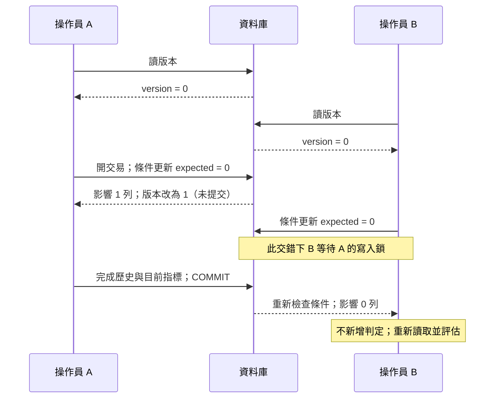

# 10｜並行更新：用版本條件拒絕過期寫入

兩位操作員幾乎同時重判同一缺陷。A、B 都讀到 `version_no = 0`，各自算出一筆結果。若兩邊都把「我讀到的 0」當成仍有效，資料庫該接受哪個？先預測：在第二次更新時重新檢查版本，應只有第一位成功；另一位得到明確衝突，而不是悄悄蓋掉前一筆。

## 版本代表什麼

`version_no` 是樂觀併發檢查用的版本，不代表 `Judgments` 的筆數，也不是時間戳或模型版號。教材 seed 已有缺陷 1 的判定 101、102，但 `version_no` 仍是 0，因為它表示載入歷史後的編修基線。要拒絕過期寫入，將「讀到的版本」放入 `UPDATE` 條件，並立即保存影響列數：

```sql
DECLARE @defect_id int = 1,
        @expected_version int = 0,
        @changed int;

UPDATE dbo.Defects
SET version_no = version_no + 1
WHERE defect_id = @defect_id
  AND version_no = @expected_version;
SET @changed = @@ROWCOUNT; -- 必須緊接 UPDATE
SELECT @changed AS updated_rows;
```

`updated_rows = 1` 表示條件吻合並取得該版本；`0` 表示資料已改變、缺陷不存在，或條件不吻合，需要回報衝突並查明。這只是一段核心判斷，不是完整寫入流程。成功時，新增 `Judgments`、更新 `Defects.current_judgment_id`，以及版本加一，都要在同一交易中；任何一步失敗就回滾。否則目前指標可能指錯判定，或歷史已新增但版本沒有一起推進。

## A 與 B 的交錯

雙 session 時間線如下，基準為 SQL Server 2022 compat 160、`READ_COMMITTED_SNAPSHOT OFF`。兩個 session 先各自讀版本 0；A 開交易，以 `WHERE defect_id = 1 AND version_no = 0` 更新版本，暫不提交。B 此時以同一個預期版本發出更新，等待 A 的寫入鎖。A 完成新增判定與設定目前指標後提交；B 接著重新檢查條件，因版本不再吻合而影響 0 列，所以 B 不應新增判定。若手動實驗，先在兩個 session 設 `SET LOCK_TIMEOUT 15000;`，把等待限制在 15 秒；若人為操作太慢而逾時，先回滾並重新排時間線。不要把交易留著無限等候。



由上往下讀事件順序。B 等到了鎖，不代表它原先讀到的版本仍有效；條件更新的列數才是判斷依據。

## 衝突後再評估

反例是先 `SELECT version_no`，應用程式在記憶體算 `expected + 1`，再用 `UPDATE ... SET version_no = @new_version WHERE defect_id = @id`。條件沒有包含舊版本；A 與 B 都可能寫入 1，最後值無法揭露兩次寫入競爭。另一個反例是只檢查 ADO／ODBC 呼叫沒有丟例外，卻不看影響列數。零列更新是業務衝突結果，應和 SQL 執行錯誤分開處理。

遇到衝突時，通常要重新讀取最新狀態、重新評估操作是否仍成立，再由操作者或明確策略決定是否重試。不能直接把舊分數改寫成新版本，因為新結果可能基於已變更的歷史或輸入。這個條件更新保護同一缺陷列；若規則是跨多個缺陷或全表的合計條件，單列版本不足以保證該規則，下一章會比較隔離層級。

**無提示題**：A、B 都讀到版本 4，A 的條件更新先成功並提交。寫出 B 應採取的三個步驟，並說明為什麼不能只把失敗的 `UPDATE` 重新送一次。答題後看 [answers.md 的第 10 題](answers.md#ch10)。

**官方來源**：[Transaction Locking and Row Versioning Guide](https://learn.microsoft.com/en-us/sql/relational-databases/sql-server-transaction-locking-and-row-versioning-guide?view=sql-server-ver16)、[UPDATE（Transact-SQL）](https://learn.microsoft.com/en-us/sql/t-sql/queries/update-transact-sql?view=sql-server-ver16)。對應雙連線條件更新已驗證 A=1 列、B=0 列，詳見 [驗證紀錄](verification.md)。
