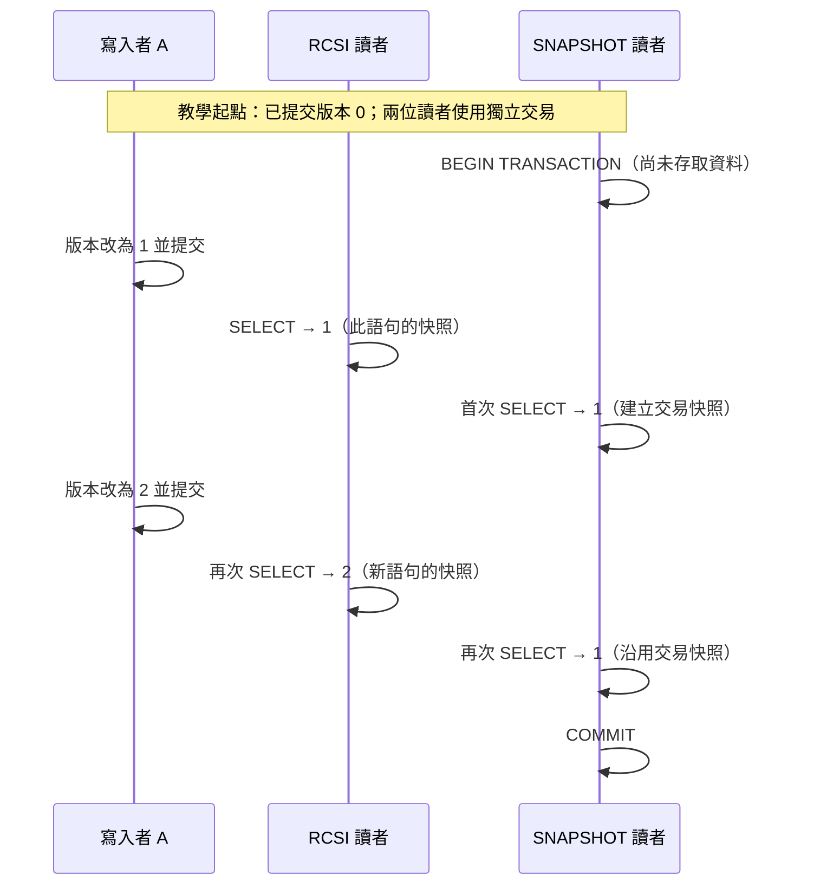

# 11｜隔離層級：同一個讀取，何時看見哪個版本

同一筆缺陷被另一個 session 更新時，讀者可能等待，也可能讀到前一個已提交版本；重複查詢時，兩次結果也可能不同。請先預測兩個問題：A 尚未提交的修改，B 是否能看見？B 在同一交易內讀兩次，結果是否一定相同？答案取決於隔離層級和資料庫選項，不能只看到 `READ COMMITTED` 就猜。

## 固定實驗基線

本書基線是 SQL Server 2022、compatibility level 160、`READ_COMMITTED_SNAPSHOT OFF`。在此基線下，`READ COMMITTED` 的一般讀取會用鎖避免讀到未提交資料；語句結束後讀鎖可以釋放，所以同一交易中的兩次 `SELECT` 可能看到兩次已提交的不同狀態。`READ UNCOMMITTED` 可讀到未提交值；若對方最後回滾，B 曾讀到的值從未成為正式資料，這就是髒讀。不要用 `NOLOCK` 來「修復」等待，因為它改變了可接受的正確性。

## 四種讀取視野

RCSI 是 READ_COMMITTED_SNAPSHOT 的縮寫；這個資料庫選項改變 READ COMMITTED 的讀取方式，與另選 SNAPSHOT 隔離層級不同。

雙 session 預測表：

| B 的讀取方式 | A 更新但未提交時 | B 兩次讀取之間 A 提交更新時 |
|---|---|---|
| READ COMMITTED，RCSI OFF（本書基線） | 同一列讀取通常等待寫入者釋放鎖 | 可先看到舊已提交值，再看到新已提交值 |
| READ COMMITTED，RCSI ON | 讀取舊的已提交版本，通常不等寫入者 | 每個陳述式各看開始時的已提交狀態，兩次可不同 |
| SNAPSHOT | 不讀 A 尚未提交的版本 | 整個交易維持第一次資料存取建立的交易快照 |
| SERIALIZABLE | 以鎖保護已讀資料與符合條件的範圍 | 可阻止會改變讀取範圍的插入，但等待與鎖競爭可能增加 |

圖中數字是獨立教學起點，並非驗收器執行到此時的固定值。重點是快照建立的時點：SNAPSHOT 的 `BEGIN` 早於版本 1，但首次資料存取在版本 1 提交之後。RCSI 與 SNAPSHOT 的比較假設已啟用各自需要的資料庫選項。

## 快照時間與跨列限制

RCSI 與 SNAPSHOT 都使用資料列版本，但時間範圍不同：RCSI 是每個陳述式的快照，SNAPSHOT 是整筆交易的快照。SQL Server 文件說明交易從 `BEGIN TRANSACTION` 開始，但 SNAPSHOT 的交易序號會在第一個存取資料的陳述式執行時分配。因此教學時間線要把 `BEGIN TRANSACTION` 和首次 `SELECT` 分開，不要用前者直接代替快照建立點。

SNAPSHOT 實驗需由管理者事先在隔離的 `B02Lab` 啟用 `ALLOW_SNAPSHOT_ISOLATION`；RCSI 對照也使用專用實驗庫，基線資料庫仍保持 OFF。不要在課堂中途對共用資料庫切換，也不要把設定語句貼到生產環境。

以下只描述同步點：B 設定 SNAPSHOT 並 `BEGIN TRANSACTION`，先暫停；A 更新缺陷 2 的版本並提交；B 才執行第一次讀取，此時建立快照並看到 A 的提交。之後 A 再更新並提交，B 第二次讀仍看到首次讀取時的版本。

比較 RCSI 時，B 以 READ COMMITTED 分兩次讀，中間讓 A 提交更新，兩次語句可能讀到不同已提交版本。每個 session 可設定 `SET LOCK_TIMEOUT 15000;`，確保鎖定案例有上限；逾時後先檢查並回滾自己的交易。

快照不等於可序列化。假設一條業務規則要求「至少保留一個可用資源」；A、B 各自從同一個快照看見有兩個資源，然後分別停用不同的一個。兩筆寫入改的是不同列，都可能提交，但合起來違反規則。這種 write skew 說明一致讀取無法單獨保護所有跨列不變條件；需要把規則改成可強制的約束、用鎖定／序列化交易保護，或設計單一競爭列。教材固定 schema 沒有資源狀態欄位，這是隔離原理反例，不是新增共享資料表欄位。

**無提示題**：SNAPSHOT session 在 `BEGIN TRANSACTION` 後尚未查任何表，另一 session 更新並提交。再由 SNAPSHOT session 第一次讀取，之後另一更新提交，最後重讀。列出兩次讀取預期值，並指出本書基線 RCSI OFF 時相同兩次 READ COMMITTED 查詢可能有何差異。答題後看 [answers.md 的第 11 題](answers.md#ch11)。

**官方來源**：[SET TRANSACTION ISOLATION LEVEL](https://learn.microsoft.com/en-us/sql/t-sql/statements/set-transaction-isolation-level-transact-sql?view=sql-server-ver16)、[Transaction Locking and Row Versioning Guide](https://learn.microsoft.com/en-us/sql/relational-databases/sql-server-transaction-locking-and-row-versioning-guide?view=sql-server-ver16)、[ALTER DATABASE SET Options](https://learn.microsoft.com/en-us/sql/t-sql/statements/alter-database-transact-sql-set-options?view=sql-server-ver16)。資料庫選項只在管理者準備的隔離實驗庫設定；RCSI 與 SNAPSHOT 的對應時間線已實測，數值與邊界見 [驗證紀錄](verification.md)。
