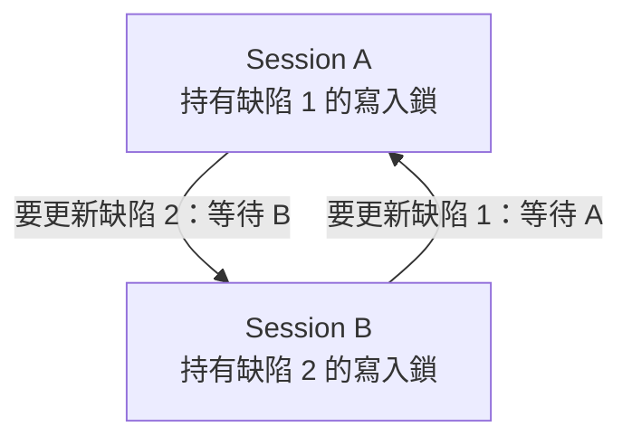

# 12｜鎖等待、死鎖與逾時：錯誤類型決定恢復方式

兩個 session 都「卡住」時，是否代表同一種錯誤？先預測：A 持有缺陷 1 的修改鎖，B 等待缺陷 1，這是等待；若 A 等 B 持有的缺陷 2，而 B 又等 A 持有的缺陷 1，等待形成環，資料庫才有死鎖。鎖等待可能一直持續到持鎖交易結束；死鎖會由 SQL Server 偵測並選一個交易當受害者；鎖等待逾時則是 session 的時間界線到期。三者處置不能混用。

## 兩個 session 形成循環

可在隔離 `B02Lab` 以兩個 session 手動重現鎖循環。每個 session 開始前執行 `SET LOCK_TIMEOUT 30000;`，將最長單次鎖等待限制為 30 秒。依序進行：

1. Session A 執行 `BEGIN TRAN; UPDATE dbo.Defects SET version_no=version_no+1 WHERE defect_id=1;`，暫不提交。
2. Session B 執行 `BEGIN TRAN; UPDATE dbo.Defects SET version_no=version_no+1 WHERE defect_id=2;`。
3. A 更新缺陷 2，該語句等待 B；趁它等待，B 再更新缺陷 1，形成 A 等 B、B 等 A 的循環。
4. SQL Server 偵測後選一方回報死結錯誤 1205 並回滾其交易；另一方的等待得以繼續。檢查兩邊狀態，將仍開啟的交易明確 `ROLLBACK`，使教材資料回到基線。

若手動協調太慢，先發出的語句可能得到鎖等待逾時 1222，這不表示成功重現死鎖；停止該次演練，檢查交易再回滾後重來。以下清理查詢可在語句完成或報錯後執行：

```sql
SELECT XACT_STATE() AS transaction_state;
IF XACT_STATE() <> 0 ROLLBACK TRANSACTION;
```



箭頭表示「等待誰」，不是資料流。只有 A → B 時是單向等待；補上 B → A 才形成此例的死鎖循環。圖不預先指定受害者，由引擎選擇並回報 1205。

## 依錯誤狀態恢復

`XACT_STATE() = 1` 表示交易仍可提交或回滾，`-1` 表示只能回滾，`0` 表示沒有作用中的使用者交易。死鎖受害者的交易會由引擎回滾；鎖逾時通常取消當前語句，但明確交易可能仍在，因此先查狀態並清理。用戶端的 command timeout 又是另一層：它可能停止等待或取消請求，但不能只靠用戶端計時器斷定伺服器交易已提交或回滾。

重試單位也不同。死鎖受害者的整筆交易已回滾，修正順序或確認操作可重入後，才考慮重跑整個邏輯工作；不應只重送交易中的最後一句，否則前置條件可能已變。鎖逾時時先結束／回滾仍存在的交易，重新讀取狀態後再決定是否重試。若逾時發生於 `COMMIT` 往返期間，結果還可能未知，不能因為「逾時」就當作回滾。

反例是把所有例外都放進同一個「睡一秒再重試 SQL」迴圈。這可能在仍持有鎖的交易中重試、重複寫入，或讓真正的死鎖根因持續存在。降低死鎖機率的常見方法是讓交易以一致順序存取列、縮短交易時間、只保留必要工作在交易內；這不保證死鎖永遠不發生，錯誤處理仍需存在。

**無提示題**：分別收到錯誤 1205、1222，以及應用程式自身的指令逾時。每種情況說明資料庫已知的交易狀態、下一個查核動作，以及可重試的最小安全單位。答題後看 [answers.md 的第 12 題](answers.md#ch12)。

**官方來源**：[Deadlocks Guide](https://learn.microsoft.com/en-us/sql/relational-databases/sql-server-deadlocks-guide?view=sql-server-ver16)、[SET LOCK_TIMEOUT](https://learn.microsoft.com/en-us/sql/t-sql/statements/set-lock-timeout-transact-sql?view=sql-server-ver16)、[XACT_STATE](https://learn.microsoft.com/en-us/sql/t-sql/functions/xact-state-transact-sql?view=sql-server-ver16)。對應雙連線已觀察到 1205 與獨立的 1222 案例；每個等待都有明確 session timeout，詳見 [驗證紀錄](verification.md)。
