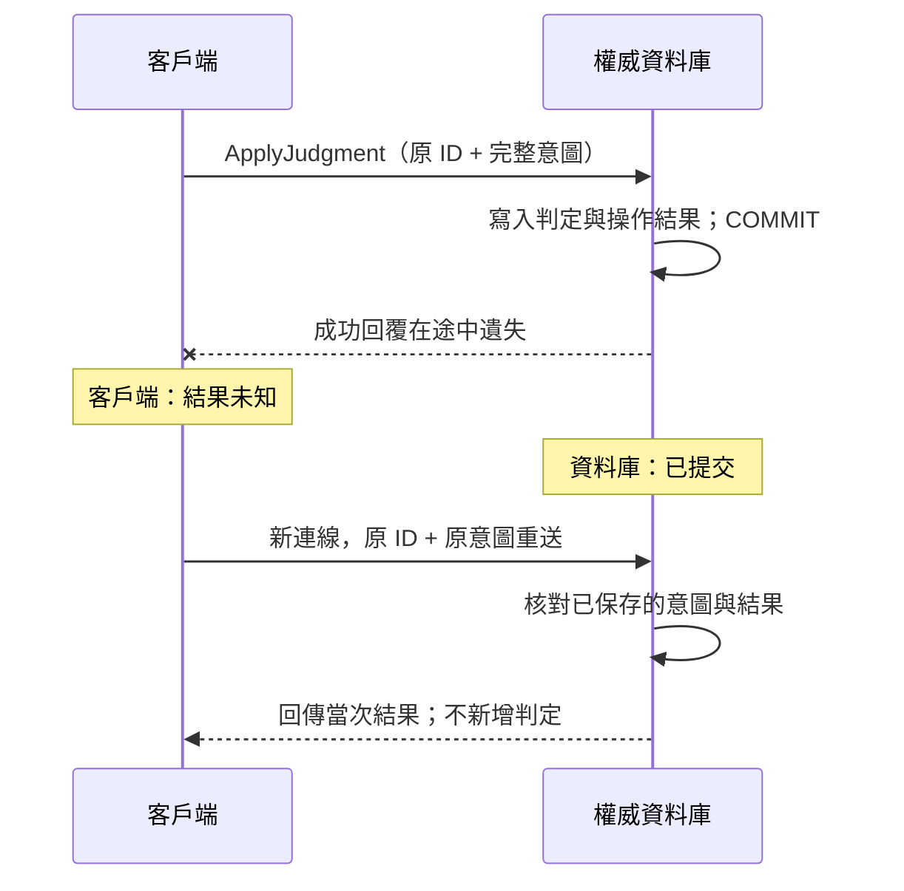
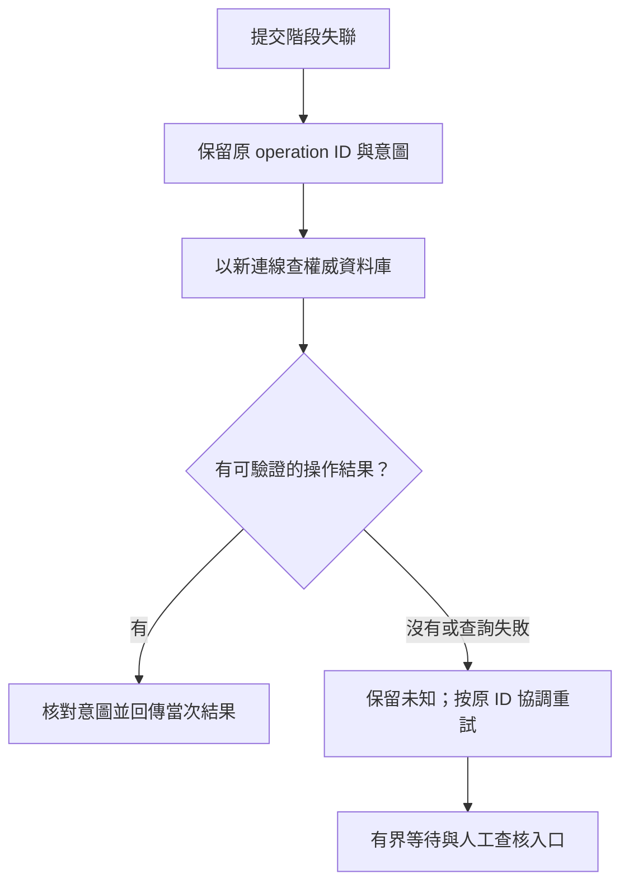

# 16｜沒有成功回覆，結果仍可能已提交

匯入器顯示 connection lost，操作人員問：「那我再按一次就好？」此時最重要的資訊不是例外的嚴重程度，而是失敗發生在交易的哪個階段，以及還有哪些獨立證據。把所有失敗都映射成 `false`，會把「確定未生效」和「還不知道」混在一起。

## 先預測

以下兩條時間線，客戶端都只看到連線中斷：

| 時間 | 情境 A | 情境 B |
|---|---|---|
| t1 | 伺服器收到修改 | 伺服器收到修改 |
| t2 | 提交完成 | 尚未提交，連線中斷 |
| t3 | 成功回覆途中遺失 | 伺服器終止並回滾該未提交交易 |
| t4 | 客戶端看見例外 | 客戶端看見例外 |

只看 t4，能分出 A/B 嗎？假設沒有其他寫入，依本書 ApplyJudgment 的契約推演：若只換新 ID、保留原 expected_version，A 與 B 各會怎樣？若又擅自把 expected_version 換成目前版本，哪種情境可能新增第二次判定？先想清楚操作去重與版本檢查各擋住什麼，再對照 [第 16 題解答](answers.md#q16)。



這是情境 A 的解說時間線，不是即時資料庫動畫。兩側註記同時成立：「已提交」描述資料狀態，「未知」描述客戶端掌握的證據。圖中的重送依賴本書程序與操作紀錄仍被保留；情境 B 必須另外查核，不能套用 A 的結論。

## 三種狀態比成功／失敗有用

- **已提交**：取得成功提交證據，或在權威資料庫查到符合完整意圖、可對帳的操作結果。
- **未提交**：例如伺服器明確回報已回滾，且該交易已結束；不能只用「我的連線物件已關閉」代替。
- **仍未知**：提交階段失聯，查核也沒有足夠證據。

這裡的未知是客戶端的知識狀態，資料庫最終可能只會提交或回滾。Microsoft 的 [連線復原文件](https://learn.microsoft.com/en-us/ef/core/miscellaneous/connection-resiliency#transaction-commit-failure-and-the-idempotency-issue) 明確指出提交期間失聯的這個問題；引用它是為了描述故障模型，本書不引入 EF Core。



## 查不到不等於不存在

假設 A 還在提交，B 在另一連線查詢。如果查詢使用資料列版本，它可能看到「這個查詢開始時尚無紀錄」。若讀到的是延遲副本，也可能還沒收到最新提交。即使查主庫，操作紀錄已被清理、查錯資料庫或查核本身逾時，也都不是「原本沒有寫入」的證明。

本書的操作程序使用交易內鍵範圍鎖，讓原 ID 的重入與原執行協調。重送既不換 ID，也不修改 expected version；若原交易已提交，回舊結果；若回滾且條件仍成立，才做首次提交。若等待逾時，未知仍然存在。這個推論依賴同一資料庫、同一程序、保留中的操作紀錄及正確權限；不是任何 API 都具有的保證。

查核流程可寫成以下狀態邏輯，它不是省略錯誤處理的可執行程式：

```text
保存待送操作（穩定 ID + 完整意圖）
呼叫 ApplyJudgment
若取得成功結果：核對 ID，保存成功證據
若收到明確業務衝突：保留原意圖與診斷，不自行更改版本
若通訊中斷：標記 unknown，關閉受損連線
以新連線查原 ID；查核失敗則仍 unknown
必要重送時仍用原 ID + 原意圖，限制嘗試次數與等待時間
仍無結論時交由對帳，不能顯示成「沒有寫入」
```

`XACT_STATE()` 只描述目前 session 的交易，不能在新 session 用它證明舊 session 回滾了。查到操作也要核對意圖與關聯判定，不能只看 ID 碰巧存在；這與 [交易狀態函式的範圍](https://learn.microsoft.com/en-us/sql/t-sql/functions/xact-state-transact-sql?view=sql-server-ver16) 一致。

## 區分兩種故障實驗

第一種是**應用層丟棄成功結果**：呼叫程序成功後，故意不把回傳結果記進客戶端狀態，再以原 ID 重送。它能測應用恢復路徑與去重；測試執行者其實知道第一次成功，沒有重現網路在提交窗口中斷。

第二種才是**真實連線中斷**：在隔離開發環境，使用可觀測的代理或連線故障工具，記錄送出、切斷、伺服器狀態與重連查核時間。切斷點不一定每次都落在 COMMIT 窗口；跑十次也不代表涵蓋所有窗口。只有伺服器新連線證據與客戶端診斷對得起來，才能把案例列成已提交或未提交。

[L06 實驗表](labs.md#l06) 留下獨立紀錄。本版另提供 [TCP 故障重現器](examples/verify_network.py)：真實代理丟棄伺服器回覆並關閉通道，客戶端觀察到 Communication link failure，重新查核發現已提交；原 ID 重送未重複。另一案例在 COMMIT 前關閉 TCP，確認原連線與交易消失且資料全回滾。這只涵蓋兩個受控窗口，不代表測遍 COMMIT 內部每個時點。一般逾時或手動 ROLLBACK 不能替代這些證據。

## 從恢復目標反推觀察資料

應用日誌至少保留操作 ID、目標資料庫、送出／收到診斷的時間、嘗試次數與狀態轉移；不記密碼或完整連線秘密。資料庫保留當次意圖及結果。兩端的時鐘可能有偏差，因此比對事件關係時不要只按毫秒排序，應加上 session ID、操作 ID 與前後關係。

重試也有成本：無上限的重試會延長等待並放大故障。超過預算後，顯示「待查核，操作 X」，讓對帳者知道要找哪個意圖。停止自動嘗試並不會讓未知變成未提交。

本次故障測試還觀察到舊連線 SPID=72 結束後，查核連線立刻取得同一個 72。因此 `session_id` 可用來定位當下工作，不能當永久連線身分；判定舊工作是否結束時，另外保存 connection ID 與 transaction ID，不能只查「72 還在不在」。

## 無提示題

一個 operation 在讀取副本查不到，主庫目前連不上。UI 能顯示「失敗，請建立新操作」嗎？請寫出能保存哪些證據、下一步能做什麼，以及哪一個觀察才足以回覆成功。

[答案](answers.md#q16) · [下一章：Outbox](17-outbox.md)
