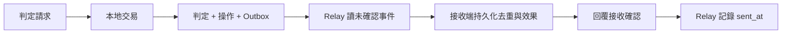

# 17｜資料已寫入，通知卻沒有送出

AOI 判定提交後，要通知另一個服務更新看板。最直接的程式是 `COMMIT` 後再呼叫通知 API；如果程序在兩者之間退出，資料正確，看板卻永遠不知道。把 API 改到 COMMIT 前面，通知可能先被看到，資料庫卻稍後回滾。

## 先預測

請畫出兩種順序的失敗窗口：先送通知再提交、先提交再送通知。哪一種能靠單一 SQL 交易保證外部 API 也一起提交？如果答案是「把 API 放在 BEGIN/COMMIT 裡」，請說明外部服務憑什麼接受這個 SQL ROLLBACK。

## 把「要通知」變成資料

Outbox 是本地待送事件表。應用在同一交易中保存判定、操作結果、待送事件；背景 relay 稍後讀取事件送到外部。這樣本地資料一旦提交，待送工作也存在。relay 是一個會失敗、會重啟的執行者，不是神奇的可靠通道。



以下是對 [操作程序](examples/05-apply.sql) 的**整合位置示意**，不是另一段可單獨執行的完整程序：

```sql
-- 首次操作分支：判定與 Operations 寫入後，COMMIT 前。
INSERT dbo.Outbox(event_id, judgment_id)
VALUES(@operation_id, @judgment_id);
-- COMMIT;
```

一個操作只有一種通知，所以本例可讓 event ID 等於 operation ID。若日後同一操作產生多種事件，則須新增事件身分與種類的契約，不能再套用一對一假設。重送舊操作時回舊結果，不再新增事件。

## 發送與記確認之間仍有空隙

| 中斷位置 | 已知持久狀態 | 重啟後行為 |
|---|---|---|
| 本地交易提交前 | 判定與事件一起回滾 | 原操作按原 ID 查核／重試 |
| 交易提交後、送出前 | Outbox 有事件，尚未送出 | relay 可補送 |
| 接收端已生效、回覆遺失 | 發送端不知道外部成功 | 可能重複送同一事件 |
| 收到回覆、sent_at 提交前 | 發送端仍記成未確認 | 也可能重複送 |
| sent_at 已提交 | 已收到約定的確認 | 可按保留契約清理 |

所以 Outbox 通常需要接收端承受重複。接收端把 `event_id` 的去重紀錄與自己的業務效果一起提交；否則「先標記已收，再產生效果」仍會有中斷窗口。若效果是寄信、外部付款或驅動設備，單一接收端 SQL 交易也包不住那些效果，需要對方的冪等介面或另外的對帳流程。

另外，確認的意思要說清楚：只是 HTTP 202、已放進記憶體佇列、還是業務效果已持久化？如果契約只承諾持久接收，`sent_at` 不能被 UI 解讀成「看板已更新」。

Microsoft 的 [Transactional Outbox 案例](https://learn.microsoft.com/en-us/azure/architecture/databases/guide/transactional-out-box-cosmos) 使用 Cosmos DB，說明本地原子保存與後續投遞的分工；本書的 SQL Server 表與實驗是自己的教學設計，不能把該案例當作 SQL Server 已驗證實作。

## 最小實驗只回答一個問題

[Outbox 局部腳本](examples/07-outbox.sql) 在同一測試庫建立 Outbox 與 `ReceiverEffects` 替身。先讓接收端生效，故意不寫 `sent_at`，再投遞同一 ID。替身的唯一鍵與交易內檢查使效果只保留一列。

這個腳本有意不整合完整 relay、網路或前章程序。它回答「確認遺失時為什麼會重送，以及接收端怎樣記住已處理」，不能證明跨系統可靠投遞。進一步作業是把上面的 Outbox INSERT 整合到首次操作的本地交易，故意讓 INSERT 失敗，驗證判定、操作、事件都沒有半套提交。具體驗收見 [L07](labs.md#l07)。

先用一個 relay 觀察完整過程，再考慮多個 relay。多執行者需要認領、租約或其他並行協調，而且即使認領做對，程序仍可能在送出後失聯；接收端去重責任不會消失。不必為一本原理書先建訊息叢集，但要知道目前沒有驗證哪些保證。

## 順序與保留也是契約

假如 X=80、Y=90 的通知顛倒到達，接收端只靠去重仍可能把目前值改回 80。可以在事件提供缺陷的業務版本，接收端只接受較新的版本，或收到通知後重新查權威目前值。`created_at` 不能替代可比較的業務版本；跨缺陷也不需要硬造全域順序。

清理 Outbox 不等於可以立刻清理接收端去重紀錄。尚在重送窗口內的事件仍可能再來，到期契約要連到 [保留期](21-retention.md)。

## 無提示題

接收端已寫入結果，relay 在更新 `sent_at` 前崩潰。重啟後你會重送嗎？假如另一個較新判定的通知已先到，接收端還需要哪些資訊才能避免目前值倒退？

[答案](answers.md#q17) · [下一章：資料庫升版](18-migrations.md)
