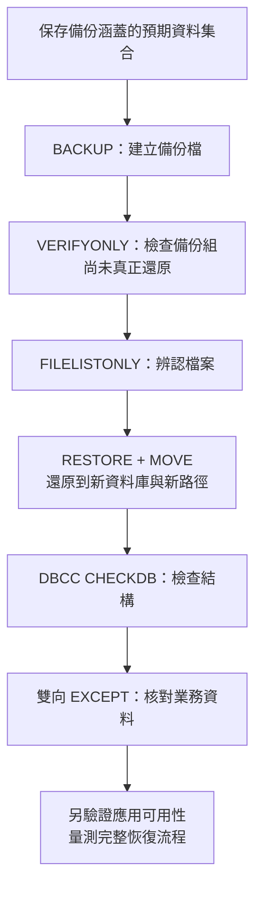

# 19｜有備份檔，不等於你恢復得回來

有人誤改一批判定，現在磁碟上有 `.bak`。你已知道它是哪個資料庫、哪個時間點的狀態嗎？還原能否放到隔離位置供你查資料，而不覆蓋來源庫？本章只演練：從合成 `B02Lab` 做一次完整備份，還原成新名稱，再比對幾項資料不變條件。本輪已完成此小資料實驗；實際版本、約 0.57 秒的還原／檢查／對帳總時間及其限制見 [驗證紀錄](verification.md)。

先預測：如果 `RESTORE VERIFYONLY` 成功，資料庫就一定可還原並包含你需要的判定嗎？若引擎找不到要寫入的新資料檔路徑，檢查備份媒體與實際 RESTORE 又各會回答哪個問題？

備份策略要先回答兩個業務問題。**RPO** 是可接受遺失多少已提交資料，決定備份點多密；**RTO** 是可接受多久才能恢復服務，需實際量還原、驗證和切回流程。這兩個值不能從 `.bak` 副檔名猜出來。完整備份後若仍有新交易，單靠那份備份只能回到它涵蓋的資料狀態。若要完整復原模式下的時間點還原，還需要適用且連續的後續交易記錄備份鏈；缺一段就不能聲稱能還原到任意時間。[SQL Server 復原模式與復原目標](https://learn.microsoft.com/en-us/sql/relational-databases/backup-restore/recovery-models-sql-server?view=sql-server-ver16)、[完整復原順序](https://learn.microsoft.com/en-us/sql/relational-databases/backup-restore/complete-database-restores-full-recovery-model?view=sql-server-ver16)



每一步通過只提供該步的證據；在任何一步失敗，就先保留診斷並處理原因。最後的應用恢復仍需另行演練，本書小資料還原測試的完成範圍見 [驗證紀錄](verification.md)。

## 先辨認備份檔由誰讀

由本書隔離實例的管理員執行備份與還原；目的資料夾需讓 SQL Server 服務帳號讀寫。一般 B02Writer 不負責這些管理操作。

`DISK` 路徑是 SQL Server Database Engine 所在主機／服務帳號可讀寫的位置，不必然是執行 SSMS 或命令列那台電腦的路徑。以下尖括號文字都是待替換欄位，不是實際路徑；先指定一個尚未使用且引擎可存取的唯一檔名，不把備份寫到會覆蓋其他資料的既有檔案。

```sql
BACKUP DATABASE [B02Lab]
TO DISK = N'<SQL-Server-主機可存取的唯一備份檔>'
WITH CHECKSUM;
```

先以 `RESTORE VERIFYONLY` 檢查備份組，再用 `RESTORE FILELISTONLY` 讀取備份內資料檔、記錄檔的 logical name。前者檢查完整性和媒體可讀性，但不會真正還原，也不驗證備份資料結構；後者提供下一步 `MOVE` 必須對應的邏輯名稱。[VERIFYONLY 的範圍](https://learn.microsoft.com/en-us/sql/t-sql/statements/restore-statements-verifyonly-transact-sql?view=sql-server-ver16)

```sql
RESTORE VERIFYONLY
FROM DISK = N'<同一個唯一備份檔>' WITH CHECKSUM;

RESTORE FILELISTONLY
FROM DISK = N'<同一個唯一備份檔>';
```

## 真的還原到另一個資料庫

先替目標資料庫選一個從未使用的名字，並確認它不存在。依 `FILELISTONLY` 結果，把每一個 logical name 對到目標 SQL Server 主機上可用的新檔案位置；下例的名稱與路徑仍是要替換的明確 placeholder。若備份有多個 data file，每個檔案都要有一個 `MOVE`。不要把目的地指向來源資料庫既有檔案。

```sql
USE [master];

IF DB_ID(N'B02RestoreLab_ReplaceWithUniqueName') IS NOT NULL
BEGIN
    ;THROW 51901, N'目標資料庫已存在；請換新名稱', 1;
END;

RESTORE DATABASE [B02RestoreLab_ReplaceWithUniqueName]
FROM DISK = N'<同一個唯一備份檔>'
WITH MOVE N'<FILELISTONLY 的 data logical name>'
         TO N'<新 data 檔的 SQL-Server-主機路徑>',
     MOVE N'<FILELISTONLY 的 log logical name>'
         TO N'<新 log 檔的 SQL-Server-主機路徑>',
     CHECKSUM, RECOVERY;
GO

DBCC CHECKDB ([B02RestoreLab_ReplaceWithUniqueName]) WITH NO_INFOMSGS;
```

這份腳本沒有 `WITH REPLACE`，也沒有刪除或重建資料庫的指令。換成你自己的唯一資料庫名稱和實際路徑後，再分段執行；如果目標名字已被使用就停下來另選名字。備份來源若不是自己產生的可信教材庫，應在非正式環境檢查與還原，不能因它能讀就直接信任其中資料庫物件。

## 查恢復出的資料，而不只看命令成功

在演練期間不要再寫入 `B02Lab`，或先保存此次備份涵蓋的預期資料集合。對照 Defects 的目前指標，再雙向比較 Judgments 的 ID 與內容；例如：

```sql
SELECT defect_id, version_no, current_judgment_id
FROM B02Lab.dbo.Defects
EXCEPT
SELECT defect_id, version_no, current_judgment_id
FROM B02RestoreLab_ReplaceWithUniqueName.dbo.Defects;

SELECT defect_id, version_no, current_judgment_id
FROM B02RestoreLab_ReplaceWithUniqueName.dbo.Defects
EXCEPT
SELECT defect_id, version_no, current_judgment_id
FROM B02Lab.dbo.Defects;
```

兩個方向都沒有差異列，只支持這三欄的集合相同；再以同樣方式比較 Judgments 與 Operations 中承載本案例不變條件的欄位，並確認目前指標仍連到同一缺陷的判定。單純比較 `COUNT(*)` 可能漏掉「少一列、又多一列」的替換；`DBCC CHECKDB` 檢查結構，也不能替你確認業務截止點。完整資料庫備份亦不等於另一個 SQL Server instance 的登入、排程、憑證和應用設定都已恢復，這些要獨立盤點。

本章手工演練要記錄：備份和還原使用的 SQL Server 版本、來源／目標名稱、選取的檔案清單、驗證查詢、是否能連回應用，以及實際量到的時間。未執行前，RTO 與可恢復範圍都留白；`VERIFYONLY` 成功只是一項媒體檢查，不是恢復演練完成。

## 換個情境想一次

`VERIFYONLY` 回報成功，但還原時發現路徑不存在。兩個結果能同時成立嗎？你還欠哪個驗收證據，才能說指定判定已恢復？

交卷後再對照[第 19 題解答](answers.md#q19)。來源：[SQL Server 備份與還原概觀](https://learn.microsoft.com/en-us/sql/relational-databases/backup-restore/back-up-and-restore-of-sql-server-databases?view=sql-server-ver16)、[VERIFYONLY](https://learn.microsoft.com/en-us/sql/t-sql/statements/restore-statements-verifyonly-transact-sql?view=sql-server-ver16)、[RESTORE 與 FILELISTONLY](https://learn.microsoft.com/en-us/sql/t-sql/statements/restore-statements-transact-sql?view=sql-server-ver16)。本章沒有填入任何推測的備份路徑或時間數字。
