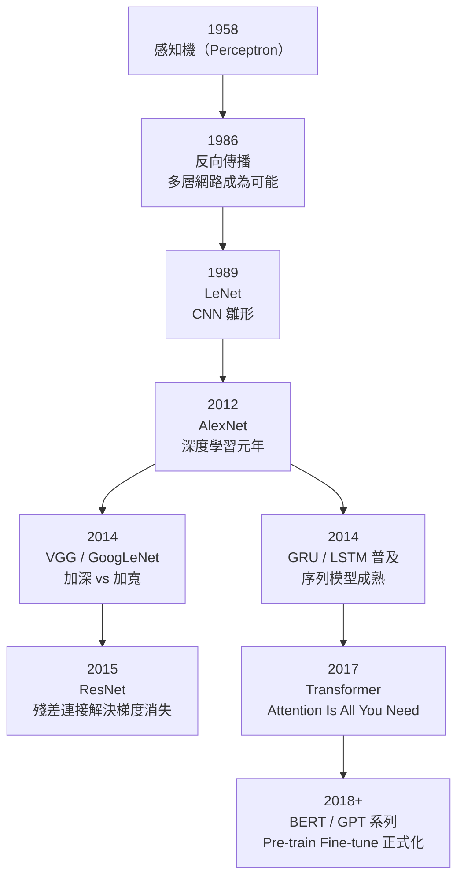
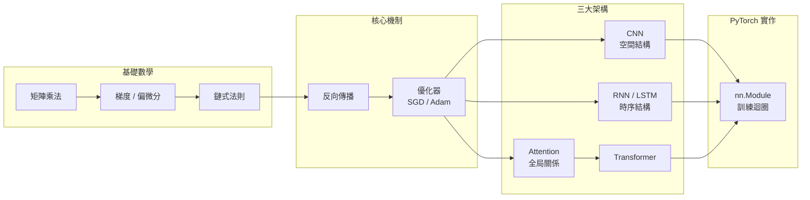

# 全書地圖：從感知機到 Transformer

## 深度學習演進時間線

## 概念依賴圖

## 各章節一句話摘要

| 章節 | 一句話 |
|------|--------|
| [類神經網路基礎](foundations/neural-network-basics.md) | 從單一神經元到多層感知機，建立前向傳播的直覺 |
| [反向傳播](foundations/backprop.md) | 鏈式法則讓梯度能從輸出反向流回輸入 |
| [CNN 基礎](cnn/cnn-fundamentals.md) | 卷積核透過滑動窗口共享權重，提取局部特徵 |
| [CNN 經典架構](cnn/cnn-architectures.md) | LeNet → AlexNet → VGG → ResNet 的演進脈絡 |
| [RNN 基礎](rnn/rnn-fundamentals.md) | 隱藏狀態在時步間傳遞，形成序列記憶 |
| [LSTM 與 GRU](rnn/lstm-gru.md) | 閘控機制解決 RNN 的梯度消失問題 |
| [注意力機制](transformer/attention.md) | Query-Key-Value 讓每個位置直接關注全局 |
| [Transformer 架構](transformer/transformer-architecture.md) | 多頭注意力 + FFN + 殘差 + 層正規化的完整組合 |
| [PyTorch 基礎](pytorch/pytorch-basics.md) | 張量操作、自動微分與 nn.Module |
| [完整訓練流程](pytorch/training-loop.md) | DataLoader → 前向 → 損失 → 反向 → 更新 |
