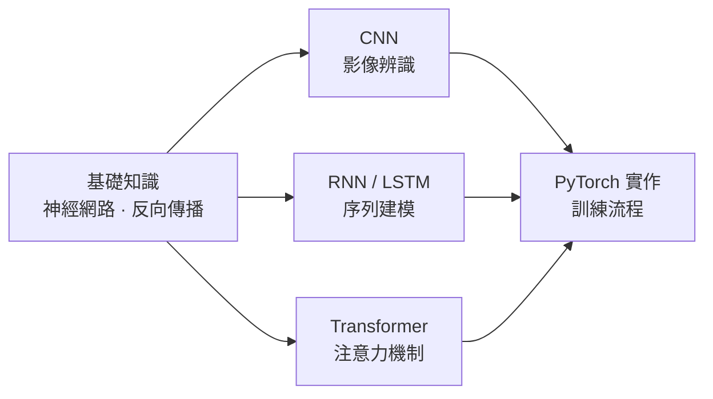

# 深度學習實戰

本書從數學直覺出發，以 PyTorch 為實作語言，系統性地帶你理解並動手實現三大核心架構：CNN、RNN 與 Transformer。

## 建議學習路徑

**完全新手**：從[基礎知識](foundations/neural-network-basics.md)開始，建立類神經網路的直覺與數學基礎。  
**有 ML 基礎**：可從[全書地圖](00-map.md)快速定位，直接跳入 CNN、RNN 或 Transformer 任一章節。  
**有實作需求**：可先跳到 [PyTorch 基礎操作](pytorch/pytorch-basics.md)，邊寫邊回頭查概念。

## 四大主題

| 主題 | 核心問題 |
|------|---------|
| [CNN](cnn/cnn-fundamentals.md) | 為什麼卷積比全連接更適合影像？ |
| [RNN / LSTM](rnn/rnn-fundamentals.md) | 模型如何「記住」序列的上下文？ |
| [Transformer](transformer/attention.md) | 注意力機制如何取代循環結構？ |
| [PyTorch 實作](pytorch/pytorch-basics.md) | 從張量操作到完整訓練流程 |

## 核心洞察

> 深度學習的三次架構革命——從 CNN 的局部感知野、RNN 的時序記憶，到 Transformer 的全局注意力——本質上都是在回答同一個問題：**如何讓模型在有限計算資源下，有效利用輸入的結構性**。
