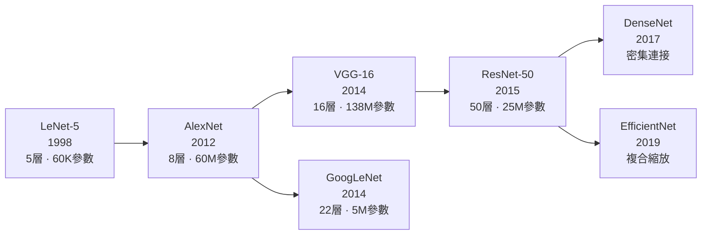
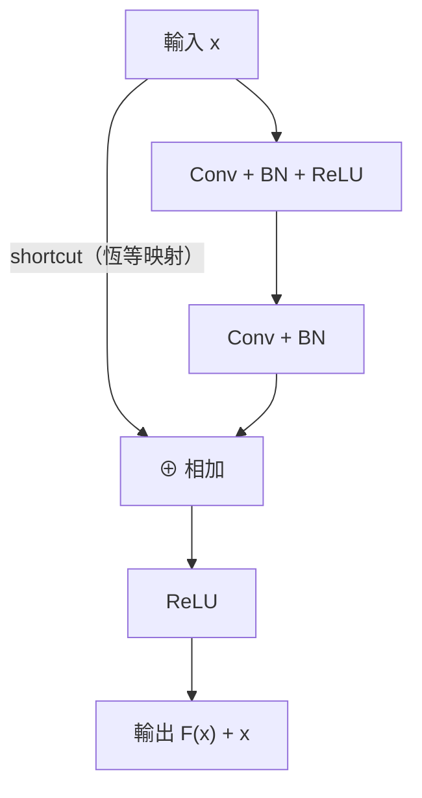

# CNN 經典架構：從 LeNet 到 ResNet

## 演進時間線

## LeNet-5（1998）

手寫數字辨識的奠基之作。架構：Conv → Pool → Conv → Pool → FC → FC → Output。
現代來看規模很小，但確立了「卷積提特徵，全連接做分類」的基本格局。

## AlexNet（2012）

ImageNet 競賽突破的轉折點，Top-5 錯誤率從 26% 降至 15%。關鍵貢獻：

- 使用 **ReLU** 取代 Sigmoid（訓練速度大幅提升）
- **Dropout** 正規化防止過擬合
- **數據增強**（翻轉、裁切）
- GPU 訓練

## VGG（2014）

用一個設計原則回答「深度有多重要」：**全部使用 3×3 小卷積核，只增加深度**。兩個 3×3 的感知野等同一個 5×5，但參數更少、非線性更多。

## GoogLeNet / Inception（2014）

提出 **Inception Module**：同時用 1×1、3×3、5×5 卷積並行，再 concat 結果。用 **1×1 卷積**做通道降維，將參數量從 VGG 的 138M 降至 5M。

## ResNet（2015）

解決了「網路越深、訓練越差」的退化問題（Degradation Problem）。核心：**殘差連接（Residual Connection）**。

殘差塊讓網路學習**殘差** $F(x)$ 而非直接目標函數 $H(x) = F(x) + x$。最壞情況下 $F(x) = 0$，網路退化為恆等映射，梯度至少有一條捷徑可回流。

## 各架構比較

| 架構 | 深度 | 參數量 | Top-1 (ImageNet) | 關鍵創新 |
|------|------|--------|-----------------|---------|
| LeNet-5 | 5 | 60K | ~99%（MNIST） | CNN 奠基 |
| AlexNet | 8 | 60M | 63.3% | ReLU, Dropout |
| VGG-16 | 16 | 138M | 74.4% | 小卷積核堆疊 |
| GoogLeNet | 22 | 5M | 74.8% | Inception, 1×1 卷積 |
| ResNet-50 | 50 | 25M | 76.1% | 殘差連接 |
| EfficientNet-B7 | — | 66M | 84.3% | 複合縮放 |

---

了解靜態的影像模型後，看看 [RNN](../rnn/rnn-fundamentals.md) 如何處理序列資料。
