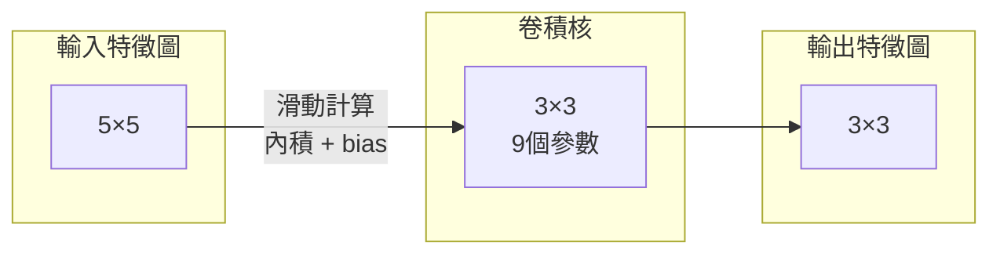
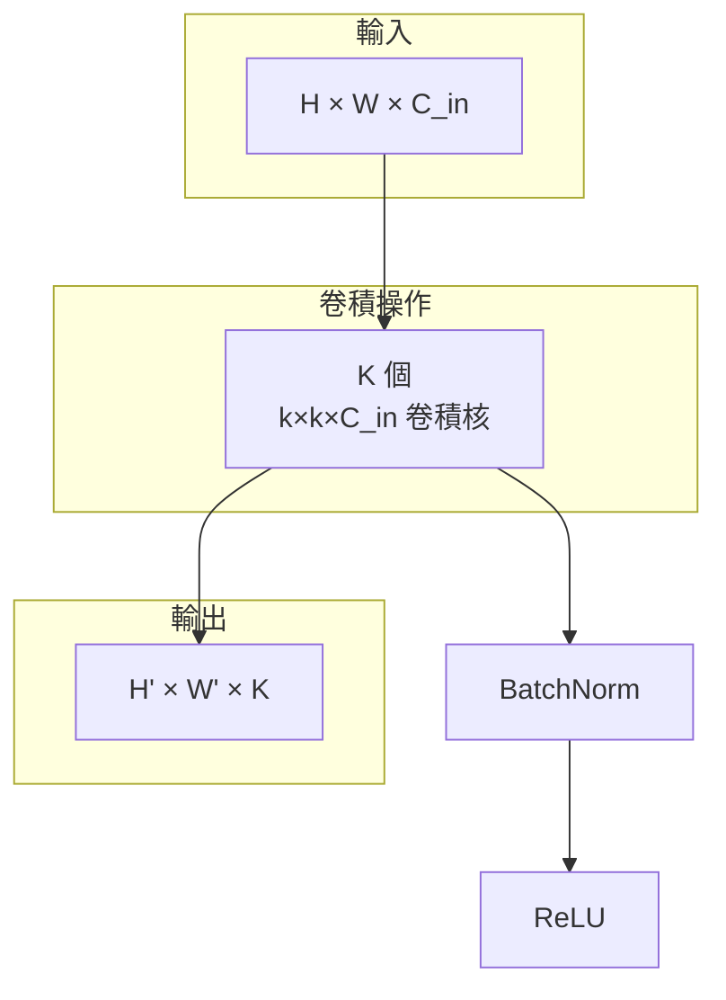
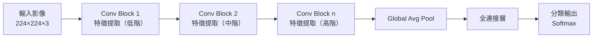

# CNN 基礎與原理

## 全連接的問題

對 $224 \times 224$ 的 RGB 影像，展平後是 $224 \times 224 \times 3 = 150{,}528$ 個輸入。若第一層有 1024 個神經元，光是第一層就有 **1.5 億個參數**——計算上不可行，而且無法利用影像的空間結構。

## 卷積的直覺

卷積核（kernel）是一塊小的可學習權重矩陣，在輸入上滑動，每次只看一個局部區域：

關鍵特性：
- **局部感知野**（Local Receptive Field）：每個輸出只依賴一小塊輸入
- **權重共享**（Weight Sharing）：同一個卷積核在整個輸入上共用參數
- **平移不變性**（Translation Invariance）：不管特徵出現在哪個位置，都能被偵測到

## 卷積層的運算

輸出尺寸計算（以 padding=0, stride=1 為例）：

$$H' = H - k + 1, \quad W' = W - k + 1$$

加入 padding $p$, stride $s$ 後：

$$H' = \left\lfloor \frac{H + 2p - k}{s} \right\rfloor + 1$$

## Pooling 層

降低特徵圖尺寸，增加感知野並降低計算量：

| 類型 | 操作 | 用途 |
|------|------|------|
| Max Pooling | 取區域最大值 | 保留最顯著特徵 |
| Average Pooling | 取區域平均 | 全局平均池化（GAP）常用於最後一層 |

## 完整 CNN 流程

淺層卷積學到邊緣、顏色；深層卷積學到更抽象的物體部位與語義概念。

---

了解 CNN 基礎後，看看[經典架構的演進](cnn-architectures.md)如何解決更深網路的挑戰。
