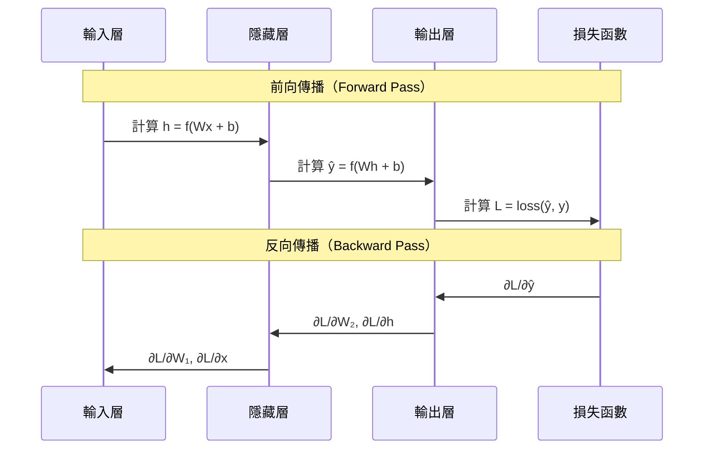

# 反向傳播與梯度下降

## 核心問題

訓練神經網路本質上是一個最佳化問題：找到讓損失函數 $L$ 最小的一組參數 $\theta$。梯度下降是目前最主流的解法。

## 梯度下降

沿著損失函數的反梯度方向更新參數：

$$\theta \leftarrow \theta - \eta \cdot \nabla_\theta L$$

- $\eta$：學習率（learning rate），控制每次更新的步幅
- $\nabla_\theta L$：損失對所有參數的梯度

問題在於：如何有效率地計算每一層、每一個參數的梯度？

## 鏈式法則

對於複合函數 $L = f(g(x))$：

$$\frac{dL}{dx} = \frac{dL}{df} \cdot \frac{df}{dg} \cdot \frac{dg}{dx}$$

反向傳播就是把這個規則系統性地套用在整個計算圖上。

## 反向傳播流程

每一層往回傳兩樣東西：
1. **對自身參數的梯度**（用來更新該層的 W 和 b）
2. **對輸入的梯度**（傳給前一層繼續計算）

## 梯度消失與梯度爆炸

深層網路中，梯度在反向傳播時會被連乘：

$$\frac{\partial L}{\partial W^{(1)}} = \frac{\partial L}{\partial \mathbf{h}^{(n)}} \cdot \prod_{l=2}^{n} \frac{\partial \mathbf{h}^{(l)}}{\partial \mathbf{h}^{(l-1)}} \cdot \frac{\partial \mathbf{h}^{(1)}}{\partial W^{(1)}}$$

- 若每層的梯度 $< 1$，連乘後趨近於 $0$：**梯度消失**（Vanishing Gradient）
- 若每層的梯度 $> 1$，連乘後爆炸：**梯度爆炸**（Exploding Gradient）

| 問題 | 常見解法 |
|------|---------|
| 梯度消失 | ReLU 激活、殘差連接（ResNet）、LSTM 閘控 |
| 梯度爆炸 | 梯度裁剪（Gradient Clipping）、正規化 |

## 現代優化器

| 優化器 | 特點 |
|--------|------|
| SGD | 基本，需手動調學習率；加 momentum 後效果較好 |
| Adam | 自適應學習率，大多數情況的預設選擇 |
| AdamW | Adam + 權重衰減修正，Transformer 訓練標準配備 |

---

了解了梯度流動之後，看看 [CNN](../cnn/cnn-fundamentals.md) 如何利用這套機制學習影像特徵。
