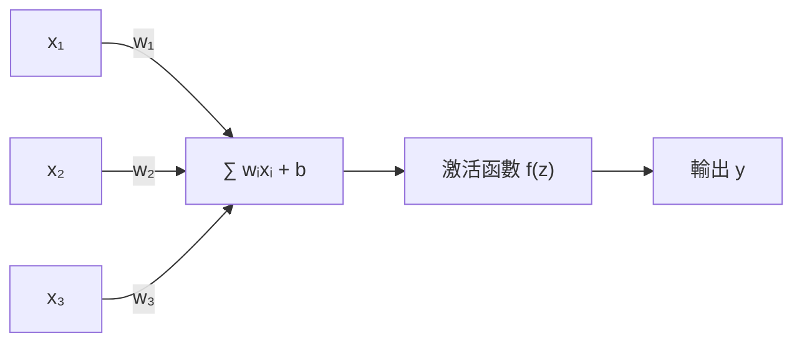
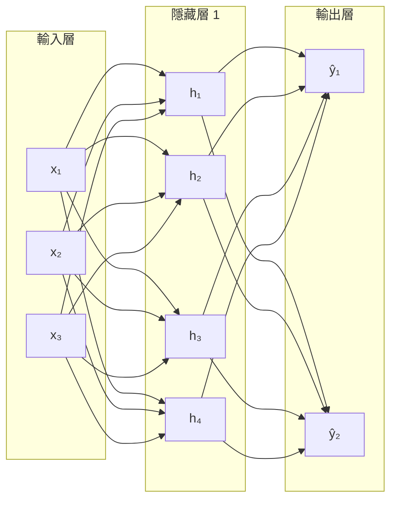

# 類神經網路基礎

## 生物神經元 vs 人工神經元

生物神經元接收多個突觸輸入，累積到閾值後發放訊號。人工神經元做的是同一件事的數學抽象：

輸出公式：

$$y = f\!\left(\sum_i w_i x_i + b\right)$$

其中 $w_i$ 是權重，$b$ 是偏置，$f$ 是非線性激活函數。

## 為什麼需要非線性激活函數？

若沒有非線性，任意堆疊多少層線性層，整體仍是線性變換——表達能力等同於單層。激活函數打破這個限制。

| 激活函數 | 公式 | 常見用途 |
|---------|------|---------|
| Sigmoid | $\sigma(z) = \frac{1}{1+e^{-z}}$ | 二元分類輸出層 |
| Tanh | $\tanh(z) = \frac{e^z - e^{-z}}{e^z + e^{-z}}$ | RNN 隱藏層 |
| ReLU | $\max(0, z)$ | 隱藏層（現代主流） |
| Softmax | $\frac{e^{z_i}}{\sum_j e^{z_j}}$ | 多分類輸出層 |

## 多層感知機（MLP）

將多個神經元排列成層，再將層堆疊：

- **寬度**：每層的神經元數，決定模型在該層能同時表示多少特徵。
- **深度**：層的數量，決定能學習多抽象的階層表示。

## 前向傳播

給定輸入 $\mathbf{x}$，依序計算每層的輸出：

$$\mathbf{h}^{(l)} = f\!\left(W^{(l)}\,\mathbf{h}^{(l-1)} + \mathbf{b}^{(l)}\right)$$

最終層輸出即預測值 $\hat{y}$。

## 損失函數

損失函數量化預測值與真實標籤的差距，是優化的目標：

| 任務 | 損失函數 | 說明 |
|------|---------|------|
| 回歸 | MSE $= \frac{1}{n}\sum(y-\hat{y})^2$ | 懲罰平方誤差 |
| 二元分類 | Binary Cross-Entropy | 對數概率損失 |
| 多分類 | Cross-Entropy $= -\sum y \log\hat{y}$ | 最常用 |

---

下一步：了解[反向傳播](backprop.md)如何用損失來更新所有權重。
