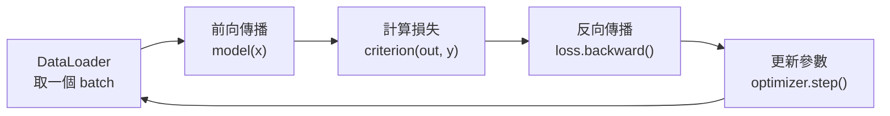

# 完整訓練流程

把前面的積木組裝起來：一個標準的監督式學習訓練迴圈，本質上是五個步驟的循環。



## 資料載入：Dataset 與 DataLoader

`Dataset` 定義「如何取單筆資料」，`DataLoader` 負責批次化、打亂與平行載入。

```python
from torch.utils.data import Dataset, DataLoader

class MyDataset(Dataset):
    def __init__(self, X, y):
        self.X, self.y = X, y

    def __len__(self):
        return len(self.X)

    def __getitem__(self, idx):
        return self.X[idx], self.y[idx]

train_loader = DataLoader(MyDataset(X_train, y_train),
                          batch_size=64, shuffle=True, num_workers=2)
```

## 訓練迴圈

```python
def train_one_epoch(model, loader, criterion, optimizer, device):
    model.train()                      # 啟用 Dropout / BatchNorm 訓練行為
    total_loss = 0.0
    for x, y in loader:
        x, y = x.to(device), y.to(device)

        optimizer.zero_grad()          # 清空上一輪累積的梯度
        out = model(x)                 # 前向
        loss = criterion(out, y)       # 損失
        loss.backward()                # 反向，計算梯度
        optimizer.step()               # 依梯度更新參數

        total_loss += loss.item() * x.size(0)
    return total_loss / len(loader.dataset)
```

!!! warning "別忘了 `optimizer.zero_grad()`"
    PyTorch 的梯度是**累加**的。若不在每個 batch 開頭清零，梯度會跨 batch 疊加，導致更新方向錯誤。

## 驗證迴圈

評估時要關閉梯度計算與訓練專屬行為：

```python
@torch.no_grad()                       # 不建計算圖，省記憶體、加速
def evaluate(model, loader, criterion, device):
    model.eval()                       # 關閉 Dropout，BatchNorm 改用統計量
    total_loss, correct = 0.0, 0
    for x, y in loader:
        x, y = x.to(device), y.to(device)
        out = model(x)
        total_loss += criterion(out, y).item() * x.size(0)
        correct += (out.argmax(1) == y).sum().item()
    n = len(loader.dataset)
    return total_loss / n, correct / n
```

## 完整骨架

```python
device = "cuda" if torch.cuda.is_available() else "cpu"
model = MLP(784, 256, 10).to(device)
criterion = nn.CrossEntropyLoss()
optimizer = torch.optim.AdamW(model.parameters(), lr=1e-3, weight_decay=1e-2)

best_acc = 0.0
for epoch in range(1, EPOCHS + 1):
    train_loss = train_one_epoch(model, train_loader, criterion, optimizer, device)
    val_loss, val_acc = evaluate(model, val_loader, criterion, device)
    print(f"epoch {epoch:02d} | train {train_loss:.4f} | val {val_loss:.4f} | acc {val_acc:.3f}")

    if val_acc > best_acc:             # 只存最佳模型
        best_acc = val_acc
        torch.save(model.state_dict(), "best.pt")
```

## `model.train()` vs `model.eval()`

| 模式 | Dropout | BatchNorm | 何時用 |
|------|---------|-----------|--------|
| `model.train()` | 啟用，隨機丟棄 | 用當前 batch 統計量 | 訓練 |
| `model.eval()` | 關閉，全部保留 | 用累積的移動平均 | 驗證 / 推論 |

忘了切換是新手最常見的 bug——驗證時還開著 Dropout，準確率會莫名偏低且不穩定。

## 常見陷阱速查

| 症狀 | 可能原因 |
|------|---------|
| Loss 不下降 | 學習率過大/過小、忘了 `zero_grad()`、標籤對應錯誤 |
| Loss 變 NaN | 學習率過大、除零、梯度爆炸（試試 `clip_grad_norm_`） |
| 訓練好、驗證差 | 過擬合——加 Dropout / weight decay / 資料增強 |
| 驗證準確率忽高忽低 | 忘了 `model.eval()`、batch size 太小 |
| GPU 記憶體爆掉 | batch 太大、驗證時忘了 `torch.no_grad()` |

---

至此你已經能獨立訓練一個模型。回到[全書地圖](../00-map.md)，挑下一個想深入的架構。
