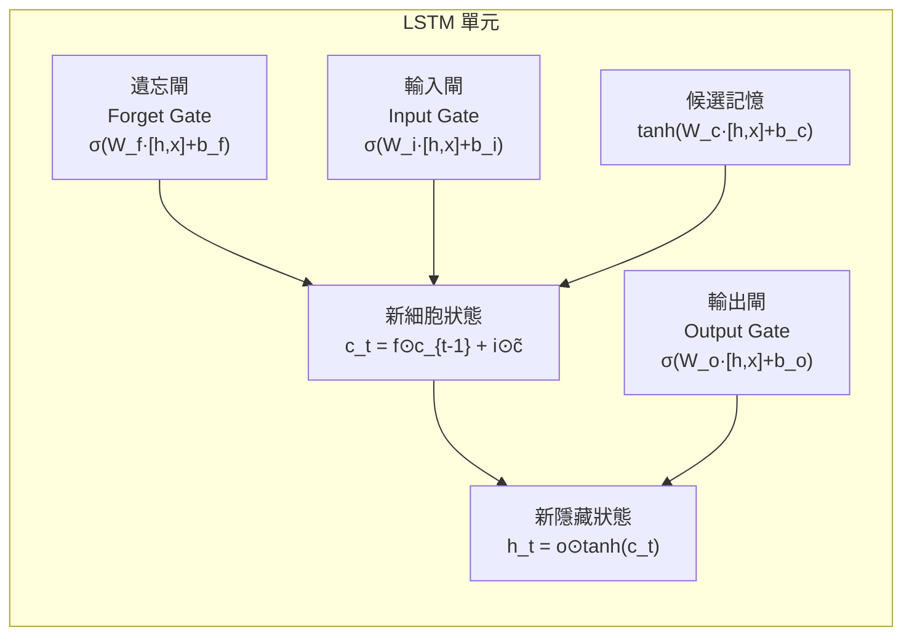
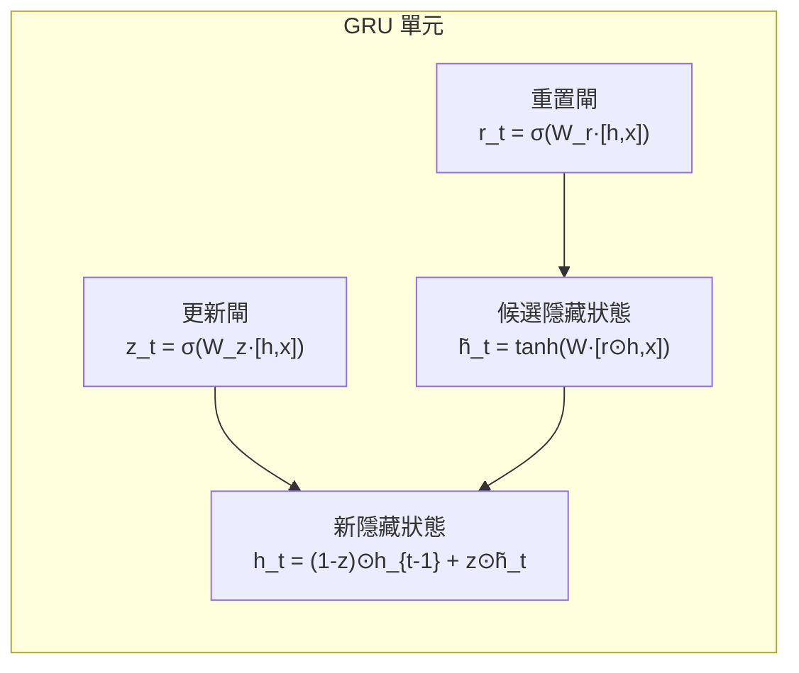

# LSTM 與 GRU：記憶的藝術

## 問題根源

標準 RNN 的隱藏狀態每個時步都會被新資訊覆寫，加上 BPTT 的梯度連乘，導致長距依賴難以學習。LSTM（1997）和 GRU（2014）用**閘控機制（Gating Mechanism）**解決這個問題。

## LSTM：長短期記憶

LSTM 維護兩個狀態：**隱藏狀態 $\mathbf{h}_t$**（短期）與**細胞狀態 $\mathbf{c}_t$**（長期記憶幹道）。

三個閘的角色：

| 閘 | 功能 |
|----|------|
| 遺忘閘 $f_t$ | 決定細胞狀態中哪些舊資訊要丟棄（0=全忘，1=全留） |
| 輸入閘 $i_t$ | 決定哪些新資訊要寫入細胞狀態 |
| 輸出閘 $o_t$ | 決定細胞狀態的哪些部分要輸出到隱藏狀態 |

細胞狀態 $\mathbf{c}_t$ 提供了一條梯度高速公路，使梯度能在長序列中維持流動。

## GRU：簡化版閘控單元

GRU 合併了遺忘閘與輸入閘為一個「更新閘」，移除了獨立的細胞狀態，參數比 LSTM 少約 25%。

## LSTM vs GRU 選擇指南

| 考量 | LSTM | GRU |
|------|------|-----|
| 表達能力 | 略強 | 略弱 |
| 參數量 | 較多 | 較少（約 75%） |
| 訓練速度 | 較慢 | 較快 |
| 適用場景 | 長序列、複雜依賴 | 中短序列、資源有限 |
| 實務建議 | 先試 LSTM | 速度優先或小資料集 |

## 局限性

LSTM/GRU 雖然解決了梯度消失，但仍是**序列處理**（每個時步依賴前一時步），無法平行化，訓練長文本效率低。這是 Transformer 崛起的主要動機。

---

看看 [Transformer 如何用注意力機制完全取代循環結構](../transformer/attention.md)。
