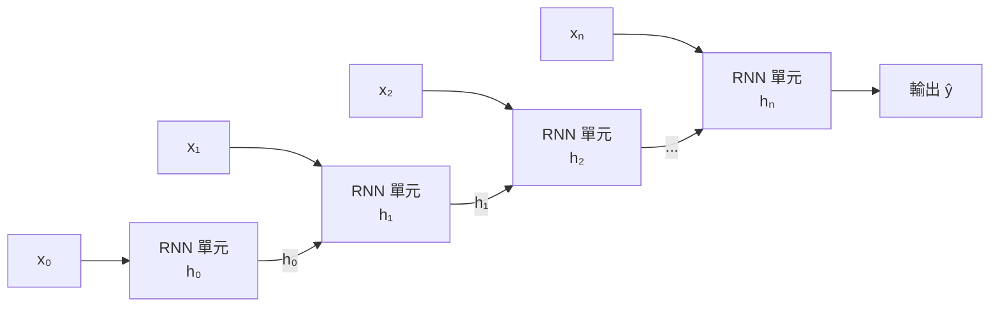
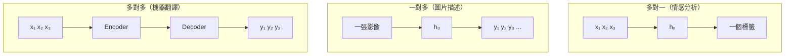
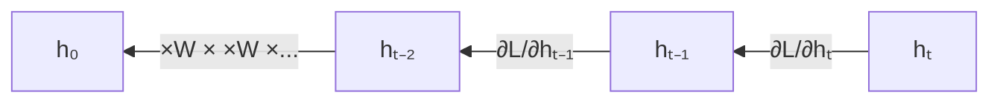

# RNN 基礎與序列建模

## 為什麼需要 RNN？

MLP 和 CNN 假設輸入是獨立的——一張影像、一筆特徵向量。但自然語言、時間序列、音訊都有**順序依賴**：「我吃了飯」與「飯吃了我」意思天差地遠。

RNN 透過**隱藏狀態（Hidden State）**在時步之間傳遞記憶：

$$\mathbf{h}_t = f\!\left(W_{hh}\,\mathbf{h}_{t-1} + W_{xh}\,\mathbf{x}_t + \mathbf{b}\right)$$

## 三種輸入輸出模式

## 時間展開（BPTT）

反向傳播在 RNN 中沿時間軸展開（Backpropagation Through Time, BPTT）。梯度需要經過 $T$ 個時步連乘傳回，這正是梯度消失問題在 RNN 中特別嚴重的原因。

**問題**：序列越長，早期輸入的梯度越小，模型對長程依賴的學習越差。

## 雙向 RNN（Bi-RNN）

許多任務需要同時看前文和後文（例如：命名實體辨識）。雙向 RNN 讓兩個 RNN 分別從左到右、從右到左處理序列，再合併兩個方向的隱藏狀態：

$$\mathbf{h}_t = [\overrightarrow{\mathbf{h}}_t;\overleftarrow{\mathbf{h}}_t]$$

---

RNN 的梯度消失問題促使了 [LSTM 與 GRU](lstm-gru.md) 的誕生。
