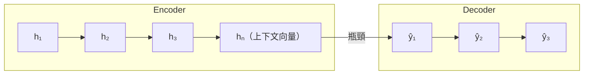
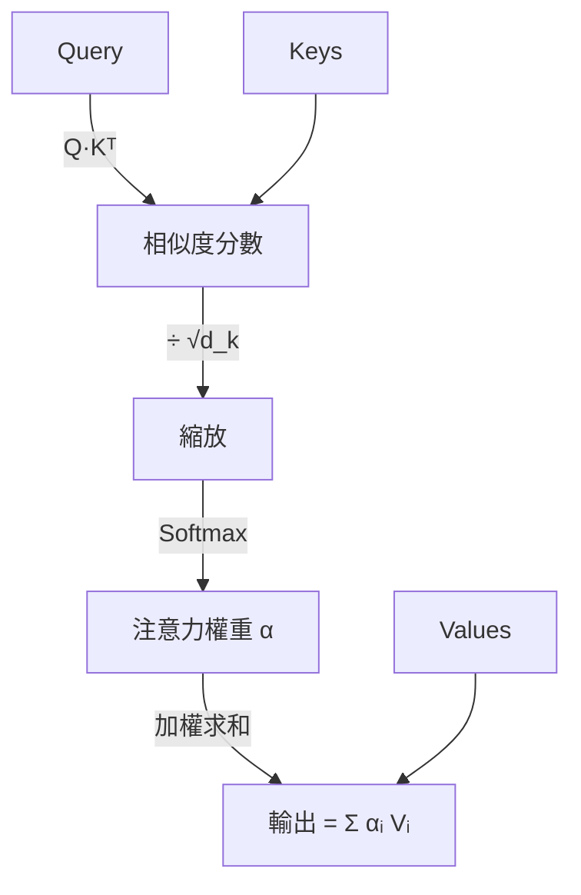
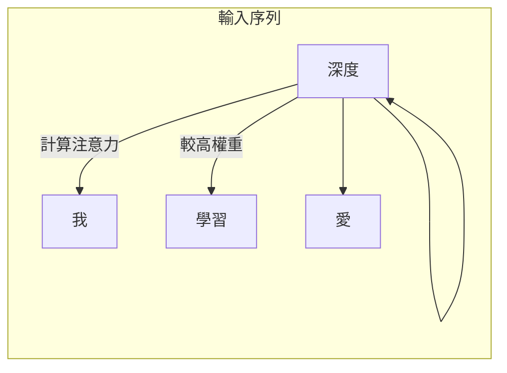

# 注意力機制詳解

## 動機：翻譯時人類怎麼看？

翻譯「貓追狗」時，翻譯「追」這個詞時，你的目光不會平均分佈在整句話上，而是更集中在「貓」和「狗」。注意力機制把這個直覺數學化。

## Seq2Seq 的瓶頸

早期機器翻譯用 Encoder-Decoder 架構，但整個輸入序列被壓縮成一個固定長度的向量，長句子的資訊會丟失。

注意力讓 Decoder 的每一步都能直接「查看」Encoder 的所有隱藏狀態，而不是只依賴最後一個。

## Query-Key-Value 框架

注意力可以理解為一個**軟性查詢**：

1. **Query（Q）**：我想找什麼？（Decoder 當前步的狀態）
2. **Key（K）**：每個位置的「標籤」（Encoder 的每個隱藏狀態）
3. **Value（V）**：實際取出的值（通常與 K 相同）

公式：

$$\text{Attention}(Q, K, V) = \text{Softmax}\!\left(\frac{QK^\top}{\sqrt{d_k}}\right)V$$

除以 $\sqrt{d_k}$ 是為了防止內積在高維度時過大，導致 Softmax 飽和（梯度消失）。

## 自注意力（Self-Attention）

Q、K、V 都來自同一個序列，讓每個位置都能關注序列中的任意其他位置：

「深度」這個詞可以同時關注「我」（主語）和「學習」（賓語），無論它們距離多遠。

## 多頭注意力（Multi-Head Attention）

不同的頭學習不同類型的關係（語法、語意、共指等）：

$$\text{MultiHead}(Q,K,V) = \text{Concat}(\text{head}_1,\ldots,\text{head}_h)\,W^O$$

其中每個頭：$\text{head}_i = \text{Attention}(QW_i^Q, KW_i^K, VW_i^V)$

---

了解注意力機制後，看看 [Transformer 如何把它組裝成完整架構](transformer-architecture.md)。
