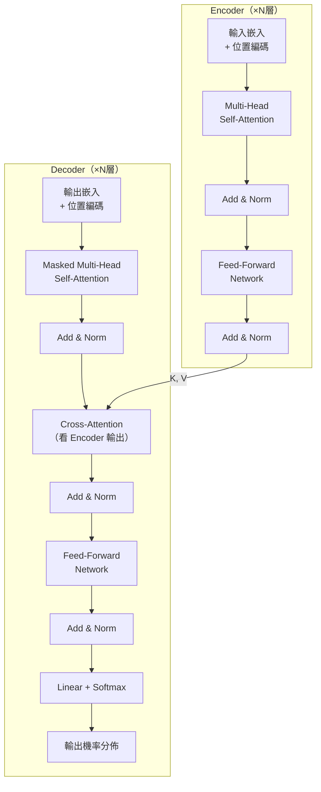
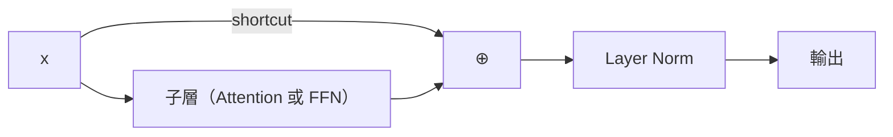

# Transformer 完整架構

## 總覽

Transformer（2017，"Attention Is All You Need"）完全拋棄了循環結構，純粹用注意力機制處理序列，實現了全面平行化。

## 位置編碼（Positional Encoding）

Self-Attention 本身沒有位置感——它不知道「第一個詞」和「第三個詞」誰先誰後。位置編碼把位置資訊加進嵌入向量：

$$PE_{(pos, 2i)} = \sin\!\left(\frac{pos}{10000^{2i/d_{model}}}\right), \quad PE_{(pos, 2i+1)} = \cos\!\left(\frac{pos}{10000^{2i/d_{model}}}\right)$$

正弦/餘弦形式讓模型能用線性變換推算出相對位置關係。

## Feed-Forward Network（FFN）

每個注意力層後接一個兩層全連接網路，在每個位置獨立計算：

$$\text{FFN}(x) = \max(0,\, xW_1 + b_1)\,W_2 + b_2$$

擴大維度（通常 $d_{ff} = 4 \times d_{model}$）再縮回，類似於一個「思考」空間。

## Add & Norm（殘差連接 + 層正規化）

- **殘差連接**：繼承 ResNet 的設計，保持梯度流動
- **Layer Norm**：對每個樣本的特徵維度做正規化（不像 BatchNorm 跨樣本），更適合序列資料

## Masked Self-Attention（Decoder 側）

Decoder 在推論時是自回歸的（一次生成一個 token），訓練時用 mask 確保位置 $t$ 只能看到位置 $1$ 到 $t-1$ 的資訊（不能偷看未來）。

## BERT vs GPT：兩種使用方式

| 模型 | Encoder/Decoder | 注意力方向 | 訓練任務 | 適合 |
|------|----------------|-----------|---------|------|
| BERT | Encoder Only | 雙向 | Masked LM | 分類、NER、QA |
| GPT | Decoder Only | 單向（自回歸） | 下一個 token 預測 | 文字生成 |
| T5 | Encoder + Decoder | 兩者皆有 | Text-to-Text | 翻譯、摘要 |

---

準備好用 PyTorch 實作了嗎？從 [PyTorch 基礎操作](../pytorch/pytorch-basics.md)開始。
