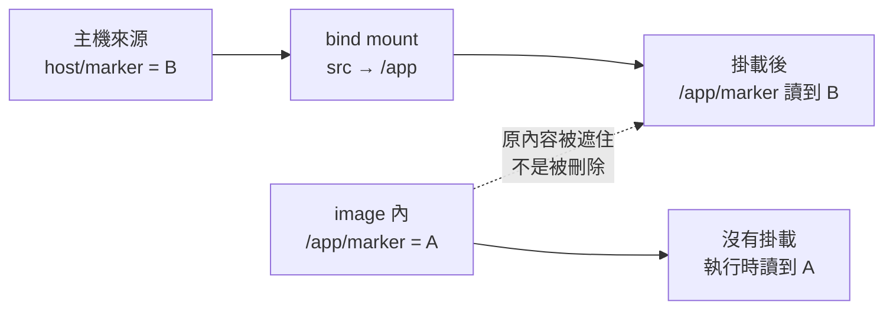

# 01｜明明 COPY 了，先把掛載拿掉

**現有掛載功能；需要建置小映像。** 已完成本版 Desktop Linux／arm64 核心實驗；適用環境與未驗邊界見[證據附錄](appendix-d-evidence.md)。

## 先把背景補齊：建置看到的檔案，不一定是執行時看到的檔案

Docker image 可以先想成一份只讀的基礎檔案系統；`docker build` 裡的 `COPY` 是把檔案放進這份基礎。`docker run` 時，Docker 再在上面建立容器自己的可寫層，並依命令列或 Compose 設定接上掛載。這三步不是同一個時間點，所以「build log 裡有檔案」只代表它曾經存在於 image，還沒有回答執行中的路徑最後由誰提供。

尤其要先分清兩個角色：image 裡的 `/app`，以及主機目錄被呈現在容器 `/app` 的 bind mount。後者一接上，容器從該路徑讀到的是主機來源；它不會把 image 的內容合併進來，而是讓原本那一層暫時不可見。本章用 image 內的 A 和主機目錄的 B 做最小對照，只改掛載這一個條件。



## 這一招其實在教什麼：辨認晚綁定的檔案邊界

這不是在教你永久拿掉 mount，而是在教你找出「哪一層最後提供這個路徑」。對 C++ 工程師來說，它像是 build output、工作目錄或 test fixture 在啟動時被另一個來源覆蓋；先固定 image ID，只改 mount，就是一次單變量 probe。你要驗的是檔案來源，不是順便驗證整個應用。

## 現場症狀：你改的可能不是壞掉的那一層

建置最後一行顯示成功，Dockerfile 也明明有 `COPY`，容器啟動時卻說腳本不存在。你把 COPY 改成絕對路徑、重建一次，再加上 `RUN ls`，建置紀錄甚至清楚列出那個檔案。到了執行時，它還是不見了。

這時值得先問一個很窄的問題：**執行中的 `/app`，還是映像裡那個 `/app` 嗎？**

Shiun 在 2024 年的中文踩坑紀錄描述過相近情境：E2E 啟動腳本在建置時存在，執行期的 bind mount 卻蓋住工作目錄。這是來源作者的案例；以下 A／B 標記是本書另設的最小實驗，本版已在 Desktop Linux VM 執行。[原始紀錄](https://shiun.me/blog/docker-overwriting-workdir-contents-with-bind-mounts-at-run-time/)

## 小招式：固定映像，只拿掉那個掛載

先對故障容器查看 `docker inspect` 的 `Mounts`，找出 `Destination` 指向哪裡。接著用**同一個 image ID**另開副本，不帶可疑掛載，讀一次同一路徑。這輪不要順手升版、清快取或改入口；變更多了，即使成功也不知道哪個動作有效。

如果原容器仍保留，觀察命令的形狀是：

```bash
docker inspect --format '{{json .Mounts}}' 容器名稱
docker inspect --format '{{.Image}}' 容器名稱
```

這兩行是操作示意，要換成自己的容器名稱；下面則使用完整且獨立的練習環境。先取得輸出，再做任何會改變現場的操作。容器已退出不妨礙 inspect；已刪除就不能藉原名稱取回它。

## 必要原理：掛載是遮住，不是抹掉

bind mount 把 daemon 主機的一個路徑呈現在容器內。目的地原本有檔案時，掛載期間看見的是來源目錄的內容，原來的映像資料被遮住。重建一個不含該掛載的容器，就能再觀察映像原來的內容；不需要靠重建映像把檔案「補回去」。[Docker bind mounts 文件](https://docs.docker.com/engine/storage/bind-mounts/)

用一張路徑表就夠了：

| 位置 | 內容 | 沒有掛載時 | 掛載後 |
|---|---|---|---|
| 映像內 `/app/marker` | A | 讀到 A | 被來源目錄遮住 |
| 主機 `host/marker` | B | 不會自動出現在容器 | 以 `/app/marker` 讀到 B |

重要的是目錄邊界。掛載 `/app` 會改變整個目錄的可見內容，並非只替換某個你正在編輯的檔案。若入口也放在這裡，連啟動指令都可能找不到。

## 親手實驗：先看 A，再看 B，再把 A 找回來

使用 Bash，在新的終端工作階段操作；Windows 請用 WSL 的 shell。需要能連線的 Linux container daemon。以下 tag 是首次下載的起點；拉取後固定基底 repository digest，同一輪比較不重新 pull。這個練習沒有 `VOLUME` 宣告，避免多出另一種掛載。

```bash
field_dir=$(mktemp -d "${TMPDIR:-/tmp}/field01.XXXXXX")
cd "$field_dir"
mkdir host
printf 'B\n' > host/marker
printf 'A\n' > marker
docker pull alpine:3.21
field_base=$(docker image inspect alpine:3.21 --format '{{index .RepoDigests 0}}')
docker image inspect alpine:3.21 --format '{{json .RepoDigests}}'

cat > Dockerfile <<'EOF'
ARG BASE=alpine:3.21
FROM ${BASE}
COPY marker /app/marker
CMD ["cat", "/app/marker"]
EOF

docker build --build-arg BASE="$field_base" -t field01:lab .
field_image=$(docker image inspect field01:lab --format '{{.Id}}')
docker run --name field01-plain "$field_image"
docker run --name field01-mounted \
  --mount "type=bind,src=$field_dir/host,dst=/app,readonly" \
  "$field_image"
docker inspect field01-mounted --format '{{json .Mounts}}'
docker run --rm "$field_image"
```

**先寫下預期輸出**：三次執行依序讀到 A、B、A；inspect 顯示目的地 `/app`，來源是本輪 `host`，且不可寫。最後一個容器仍使用相同 image ID，差別只有沒有掛載。若 `field01-*` 名稱已存在，先核對是不是上一輪自己的練習，不要刪除陌生容器以騰出名稱。

留下最小核對，避免目視看漏：

```bash
test "$(docker logs field01-plain)" = A
test "$(docker logs field01-mounted)" = B
```

這兩項檢查只核對本練習的標記，不替原應用背書。若 build 失敗，就停在那裡查錯，不要接著讀取電腦上舊的同名映像來湊結果。

再試一個會讓錯誤及早現形的操作：

```bash
if docker run --rm \
  --mount "type=bind,src=$field_dir/no-such-dir,dst=/app,readonly" \
  "$field_image"; then
  echo '非預期成功：請核對來源是否已存在'
else
  echo '記錄錯誤：預期是不存在的 bind source'
fi
```

此處保留 `--mount` 的預設行為，不加入自動建立來源的選項。缺少來源時，錯誤本身就是有用回饋。也要實際閱讀錯誤文字：網路或 daemon 故障同樣會進入 else，不能只憑非零退出碼認定命中預期原因。

## 本版實測記錄

同一測試映像的三次讀取依序為 **A、B、A**；Mounts 的目的地為 `/app`，`RW=false`。缺少 bind source 的反例在啟動前報錯。兩個保留容器與專用 tag 已移除。

## 結果解讀：A 回來了，才知道下一步查哪裡

若不掛載就讀到 A，而掛載後是 B，已足以支持「這個路徑在執行期被遮蔽」；下一步查來源路徑、目錄內容及配置合併。若兩組都沒有 A，應回到 [build context](08-build-context.md) 或 [階段產物](09-stop-at-stage.md)，因為映像可能根本沒拿到檔案。

另一種常見結果是 marker 對了，程式仍啟動失敗。這並不推翻遮蔽觀察，只表示你解開的是一個子問題。入口權限、工作目錄與依賴檔案仍有可能出錯。好招式的收益是縮小待查範圍，不必一次解完全部症狀。

## 失效反例與轉移的成本

無掛載副本能跑，不代表直接移除正式掛載就算修好。開發者可能依靠它即時同步原始碼；拿掉後每次變更都要重建或另行複製。更麻煩的是同事繼續編輯主機檔案，卻測到舊映像，於是原來的缺檔問題變成版本不同步。

遠端 daemon 也會改變判斷。bind source 指的是 daemon 主機路徑，不能拿本機 `ls` 的結果證明遠端來源存在。Desktop 的共享機制讓本機路徑看似透明，但仍要確認共享權限。這些條件沒有滿足時，先不要把失敗解釋成映像損壞。

若必須保留整個 `/app` 掛載，正式修法可能是把不應被覆蓋的入口移到別處，或收窄掛載目標。選哪個取決於檔案的生命週期；不要在同一輪 A／B 裡同時嘗試，否則會失去對照。

## 從土招到正式工程

若無掛載副本穩定找回檔案，正式方向不是把掛載一律刪掉，而是分開 source tree、build artifacts 與 runtime data，並在啟動檢查或 CI 中確認入口沒有被覆蓋。反覆需要同一組對照時，才把 image／mount 組合收進版本化的 Compose profile 或診斷 script。

## 收尾與撤回

確認記錄後，只移除本輪專用資源：

```bash
docker rm field01-plain field01-mounted
docker image rm field01:lab
printf '練習目錄保留供核對：%s\n' "$field_dir"
```

不需清除任何 volume 或其他 build cache。主機小目錄先保留，核對路徑後可自行刪除。回到原專案時恢復原掛載，將剛才找到的來源路徑差異單獨修正；如果反覆踩坑，才把 Mounts 核對收進啟動檢查。

下一步：[改了設定沒用，先看實際值](02-effective-config.md)；需要記錄模板時用[實驗紀錄卡](appendix-b-record.md)。
