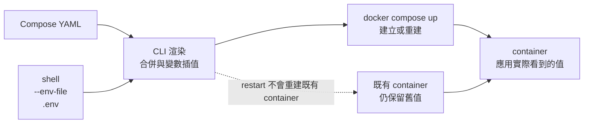

# 02｜改了設定沒用？先印出它真正吃到的值

**現有 Compose 功能；需重建測試容器。** 已完成本版 Desktop Linux／arm64 核心實驗；適用環境與未驗邊界見[證據附錄](appendix-d-evidence.md)。

## 先把背景補齊：Compose 檔、渲染結果和既有容器是三件事

Compose 檔描述的是「希望服務怎麼建立」；它不是正在執行的程序，也不是一份會自動回寫到既有容器的設定。執行指令時，Compose CLI 先讀 YAML、環境變數與 `--env-file`，把 `${...}` 渲染成模型，再把模型交給 Docker Engine。這一步成功，只表示設定能被解析，不表示應用真的讀到了你想要的值。

因此本章要分開觀察三個結果：第一，CLI 最後渲染出的值；第二，已經存在的 container 當初建立時拿到的值；第三，程式在 container 內實際看到的環境。`restart` 只會重啟第二個物件，不會用新 YAML 重做它；通常要由 `up` 判斷變更並重建，或明確使用 `--force-recreate`。先把這條時間線分開，才不會把 `.env` 優先序和「為什麼舊值還在」混成同一個問題。



## 這一招其實在教什麼：追設定的 provenance

這章對應 C++ 專案裡的 `argv`、環境變數、ini／yaml 與啟動設定：來源檔、渲染後的模型、程序建立時的 snapshot 不是同一件事。你要練的是問「值從哪裡來、何時被固定、最後哪個程序看見它」，而不是背一張優先序表。

## 現場症狀

改了 `.env`，反覆 `restart`，程式仍讀到舊值。先不要猜哪個檔案「應該」優先；把流程拆成 Compose 渲染模型、建立容器、應用讀值三層。這章只要看見 A → A → C：模型可以變，既有 container 仍留在 A，明確重建後才吃 C。

## 小招式

使用獨立暫存目錄和 `-p field02`；fixture 沒有 ports、volume 或依賴。先 pull，再 inspect 取得本機實際 RepoDigest，讓 A／C 對照不受 tag 漂移影響。

```bash
set -euo pipefail
WORK_DIR="$(mktemp -d "${TMPDIR:-/tmp}/field02.XXXXXX")"
docker compose version
docker pull alpine:3.21
FIELD02_IMAGE="$(docker image inspect --format '{{index .RepoDigests 0}}' alpine:3.21)"
test -n "$FIELD02_IMAGE"
export FIELD02_IMAGE
docker image inspect "$FIELD02_IMAGE" --format 'id={{.Id}} ref={{index .RepoDigests 0}}'
```

預期是 `FIELD02_IMAGE` 含本機的 `alpine@sha256:…` 參照；省略具體 digest 是為了不偽造版本證據。

## 必要原理

官方 `docker compose config` 會合併 Compose 檔、解析插值並輸出要交給 Engine 的模型；`config --environment` 列出插值環境；下列命令只保留假變數 FIELD_MODE，避免把其他 shell 值寫入紀錄。同名值的 shell 優先於 `--env-file`，明確 env file 又優先於預設 `.env`。所以每次比較要固定 `-f`、env file 和 project name。

`restart` 只是重啟既有 container，不會把 Compose 設定變更注入回去；`up` 會依變更重建，`--force-recreate` 可把意圖寫明。重建可能中斷服務並替換可寫層，故只對本章副本操作。`config` 成功也只代表模型可解析，不能證明應用讀了正確值。

## 完整最小實驗

```bash
cat > "$WORK_DIR/compose.yaml" <<'YAML'
services:
  app:
    image: "${FIELD02_IMAGE:?run pull and inspect first}"
    pull_policy: never
    network_mode: none
    environment:
      FIELD_MODE: "${FIELD_MODE:?set in shell or env file}"
    command: ["sh", "-c", "printf 'FIELD_MODE=%s\\n' \"$${FIELD_MODE}\"; sleep 600"]
YAML
printf '%s\n' 'FIELD_MODE=file-A' > "$WORK_DIR/env.a"
printf '%s\n' 'FIELD_MODE=file-C' > "$WORK_DIR/env.c"

unset FIELD_MODE
docker compose -p field02 --env-file "$WORK_DIR/env.a" -f "$WORK_DIR/compose.yaml" config --environment | sed -n '/^FIELD_MODE=/p'
env FIELD_MODE=shell-B docker compose -p field02 --env-file "$WORK_DIR/env.a" \
  -f "$WORK_DIR/compose.yaml" config --environment | sed -n '/^FIELD_MODE=/p'
docker compose -p field02 --env-file "$WORK_DIR/env.a" \
  -f "$WORK_DIR/compose.yaml" config --format yaml

docker compose -p field02 --env-file "$WORK_DIR/env.a" \
  -f "$WORK_DIR/compose.yaml" up -d --no-deps
value_a="$(docker compose -p field02 --env-file "$WORK_DIR/env.a" \
  -f "$WORK_DIR/compose.yaml" exec -T app sh -c 'printf "FIELD_MODE=%s\\n" "$FIELD_MODE"')"
id_a="$(docker compose -p field02 --env-file "$WORK_DIR/env.a" \
  -f "$WORK_DIR/compose.yaml" ps -q app)"
test "$value_a" = 'FIELD_MODE=file-A'
test -n "$id_a"

docker compose -p field02 --env-file "$WORK_DIR/env.c" \
  -f "$WORK_DIR/compose.yaml" restart app
value_restart="$(docker compose -p field02 --env-file "$WORK_DIR/env.c" \
  -f "$WORK_DIR/compose.yaml" exec -T app sh -c 'printf "FIELD_MODE=%s\\n" "$FIELD_MODE"')"
test "$value_restart" = 'FIELD_MODE=file-A'

docker compose -p field02 --env-file "$WORK_DIR/env.c" \
  -f "$WORK_DIR/compose.yaml" up -d --no-deps --force-recreate
value_c="$(docker compose -p field02 --env-file "$WORK_DIR/env.c" \
  -f "$WORK_DIR/compose.yaml" exec -T app sh -c 'printf "FIELD_MODE=%s\\n" "$FIELD_MODE"')"
id_c="$(docker compose -p field02 --env-file "$WORK_DIR/env.c" \
  -f "$WORK_DIR/compose.yaml" ps -q app)"
test "$value_c" = 'FIELD_MODE=file-C'
test -n "$id_c"
test "$id_a" != "$id_c"
printf 'created=%s\nrestart=%s\nrecreated=%s\nold_id=%s\nnew_id=%s\n' \
  "$value_a" "$value_restart" "$value_c" "$id_a" "$id_c" | tee "$WORK_DIR/values.txt"
```

預期：沒有 shell 值時，`config --environment` 顯示 A；臨時 shell 值顯示 B；第一次 exec 是 A。改 env file 後 `restart` 仍是 A；`up --force-recreate` 變 C 且 ID 改變。本版觀察另列於下方，重新操作仍需保存自己的實際輸出。

## 本版實測記錄

插值欄位分別顯示 file-A 與 shell-B。容器實際值依序為 **file-A → restart 後 file-A → recreate 後 file-C**，重建前後 container ID 不同；本輪 project 已清理。配置輸出只保留假欄位，沒有保存主機完整環境。

## 結果解讀

「模型 C、容器 A、重建後 C」把嫌疑縮到套用步驟；先查命令和 project，不必立刻改程式。「模型 C、容器 C、應用仍 A」則把 Compose 層排除，轉查程式讀檔、entrypoint、命令列預設或應用自己的優先序。shell 的 B 出現時，先撤掉同名 export 再比較；不要把「改了 .env」當成完整條件。

## 失效反例與代價

掛載檔案的應用可能在 `restart` 後自行重讀，所以某次看起來值有變；那是應用行為，不是 Compose 重新建立 environment。歷史 issue 也記錄過 `config --no-interpolate` 的美元轉義差異；這是舊版案例，不能宣稱現版必壞，更不能把渲染檔當無損模板回餵。`config` 通過不等於服務健康，也不等於秘密沒有出現在輸出。重建會短暫中斷並可能丟可寫層，不能對正式服務試刀。

## 從土招到正式工程

若這種差異反覆發生，把有效配置輸出、版本與重建命令收進可審查的部署腳本或 CI 檢查；讓啟動時印出的敏感資料維持遮罩。正式化的目標是讓「這個程序最後吃到什麼」可被重現與驗證，而不是要求每個人記住該按 `restart` 還是 `up`。

## 收尾與撤回

本章不使用 EXIT trap，先保留 config、ID 和 log 供核對；清理只針對 field02，且不移除陌生 orphan：

```bash
docker compose -p field02 --env-file "$WORK_DIR/env.c" \
  -f "$WORK_DIR/compose.yaml" down --volumes
```

保留 `$WORK_DIR` 讓 `config`、ID 和 stderr 可供核對；確認交接完成後，再由操作者刪除這個明確的 `mktemp` 路徑。反覆發生才把去敏的 `config` 比較收進部署流程；一次排錯到此撤回。

來源：案例 C08 [docker/compose issue #9160](https://github.com/docker/compose/issues/9160)；機制 [docker compose config](https://docs.docker.com/reference/cli/docker/compose/config/)、[Compose 變數插值](https://docs.docker.com/compose/how-tos/environment-variables/variable-interpolation/)、[docker compose restart](https://docs.docker.com/reference/cli/docker/compose/restart/)、[docker compose up](https://docs.docker.com/reference/cli/docker/compose/up/)。證據分級見 [附錄 D：證據與適用範圍](appendix-d-evidence.md)。
