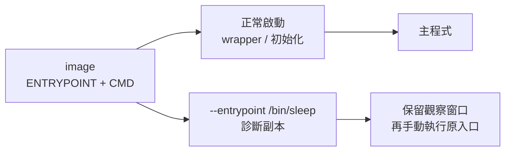

# 04｜一啟動就退出，先別讓它跑主程式

**現有入口覆寫；需建置診斷映像。** 已完成本版 Desktop Linux／arm64 核心實驗；適用環境與未驗邊界見[證據附錄](appendix-d-evidence.md)。

## 先把背景補齊：容器啟動時有一條入口鏈

`docker run` 不會直接「跑 image」；它會建立 container，接著依 image 的 `ENTRYPOINT` 和 `CMD` 組出要啟動的程序。`ENTRYPOINT` 通常是固定入口或 wrapper，`CMD` 可以提供預設參數；wrapper 若在檢查環境、準備檔案或轉交主程式前就失敗，主程式甚至還沒有開始工作。

`--entrypoint` 是在建立一個新的診斷 container 時換掉這條入口，不是把已退出的原容器復活，也不會自動還原原入口做過的初始化。因此有用的對照是：保留同一個 image、掛載、使用者、工作目錄與環境，只把入口暫時換成 image 裡已存在的等待程式。這樣看到的差異才比較能歸因於入口，而不是一口氣換了整個執行環境。



## 這一招其實在教什麼：找出控制邊界

`ENTRYPOINT`、wrapper、初始化與主程式的關係，對應 C++ 裡的 `main`、啟動 adapter、測試 harness 與真正的工作函式。暫時換入口不是正式修法，而是把一層控制拿掉，確認問題發生在 wrapper、環境，還是主程式本身。

## 現場症狀

容器一啟動就退出，log 只留下同一句錯誤；你還沒來得及看工作目錄、掛載、環境或可執行檔，程序已經結束。這時反覆 `docker run` 只能反覆得到同一個表面症狀。重建正式映像也沒有幫助，因為你還不知道失敗發生在入口 wrapper、初始化條件，還是主程式本身。

本章的小招式是另開一個診斷副本，明確把 entrypoint 換成映像裡已經有的 `/bin/sleep`，只留下有限的觀察窗口；接著在同一副本內手動執行原 entrypoint。你要比較的是「正常入口立即以 42 結束」與「替代入口能活著讓你檢查，手動執行原入口仍以 42 結束」。等待中的容器不是健康服務，也不是原來那個失敗瞬間的記憶體快照。

## 小招式：只繞過入口，保留其他條件

`--entrypoint` 只改啟動時使用的 entrypoint。把原本的 image、掛載、使用者、工作目錄與環境帶進副本，再把等待時間寫成明確的 `120` 秒。不要用無限等待把診斷遺留成一個新服務。

```bash
set -euo pipefail

WORK_DIR="$(mktemp -d "${TMPDIR:-/tmp}/field04.XXXXXX")"
SUFFIX="$(date +%Y%m%d%H%M%S)-$$"
IMAGE_TAG="field04-entrypoint:${SUFFIX}"
NORMAL_NAME="field04-normal-${SUFFIX}"
DEBUG_NAME="field04-debug-${SUFFIX}"

docker pull alpine:3.21
FIELD04_BASE_REF="$(docker image inspect --format '{{index .RepoDigests 0}}' alpine:3.21)"
test -n "$FIELD04_BASE_REF"
docker image inspect alpine:3.21 --format 'id={{.Id}} ref={{json .RepoDigests}}'

cat > "$WORK_DIR/entrypoint.sh" <<'SH'
#!/bin/sh
set -eu
if [ ! -f /work/field04.ready ]; then
  printf '%s\n' '[field04] missing /work/field04.ready' >&2
  exit 42
fi
exec sleep 60
SH
chmod 0755 "$WORK_DIR/entrypoint.sh"

cat > "$WORK_DIR/Dockerfile" <<EOF
FROM ${FIELD04_BASE_REF}
COPY entrypoint.sh /usr/local/bin/field04-entrypoint
ENTRYPOINT ["/usr/local/bin/field04-entrypoint"]
EOF

docker build --file "$WORK_DIR/Dockerfile" --tag "$IMAGE_TAG" "$WORK_DIR"
FIELD04_FIXTURE_ID="$(docker image inspect --format '{{.Id}}' "$IMAGE_TAG")"
test -n "$FIELD04_FIXTURE_ID"
docker image inspect "$IMAGE_TAG" --format 'fixture_id={{.Id}}'
```

預期是 build 讀取剛才取得的 base ref，fixture inspect 得到一個本機 image ID。`entrypoint.sh` 刻意尋找不存在的 `/work/field04.ready`，所以正常啟動的失敗是設計出來的，不能把它當 Docker 本身的 bug。

## 必要原理

Dockerfile 的 `ENTRYPOINT` 定義預設可執行檔；`CMD` 提供預設參數或命令。`docker run --entrypoint /bin/sleep image 120` 會把 entrypoint 換成 sleep，並把 `120` 當成它的參數。這個覆寫不會替你執行原本的初始化，也不會把已結束容器的程序狀態帶到新容器。

`docker exec` 是在已經活著的同一個診斷容器中另起程序，所以它能看到相同的檔案系統和掛載；它仍不是把原本 PID 1「暫停後接回來」。如果原入口在啟動時依賴一次性生成檔、隨機值或外部服務，手動重跑的條件可能與第一次不同。這也是為什麼要記錄 inspect 的 entrypoint、command、mounts 和 network mode，而不是只貼一段錯誤文字。

替代入口最好選 image 已有、且不需要額外下載的程式。Alpine 有 `/bin/sleep`；scratch 或 distroless 可能沒有 shell、sleep 或可供 exec 的工具，那時這一招無法直接套用，應改用停止後取檔或從旁邊借工具的方式。`sleep` 讓容器活著，不代表 readiness、依賴連線或主程式健康。

## 完整最小實驗

```bash
set +e
docker run --name "$NORMAL_NAME" --network none \
  --mount "type=bind,src=$WORK_DIR,dst=/work,readonly" \
  "$FIELD04_FIXTURE_ID"
normal_rc=$?
set -e
test "$normal_rc" -eq 42

docker inspect "$NORMAL_NAME" --format \
  'normal entrypoint={{json .Config.Entrypoint}} cmd={{json .Config.Cmd}} mounts={{json .Mounts}}'

docker run --name "$DEBUG_NAME" --detach --network none \
  --mount "type=bind,src=$WORK_DIR,dst=/work,readonly" \
  --entrypoint /bin/sleep "$FIELD04_FIXTURE_ID" 120

docker inspect "$DEBUG_NAME" --format \
  'debug entrypoint={{json .Config.Entrypoint}} cmd={{json .Config.Cmd}} mounts={{json .Mounts}}'

set +e
docker exec "$DEBUG_NAME" /usr/local/bin/field04-entrypoint
manual_rc=$?
set -e
test "$manual_rc" -eq 42
printf 'normal_rc=%s manual_rc=%s\n' "$normal_rc" "$manual_rc"
```

預期是第一個 `run` 印出 `[field04] missing /work/field04.ready`，`normal_rc` 為 42；normal inspect 的 entrypoint 是 `/usr/local/bin/field04-entrypoint`。debug 容器應回傳一個 container ID 並保持執行；debug inspect 的 entrypoint 應是 `/bin/sleep`、command 應含 `120`，mount 仍指向同一個唯讀 `/work`。`docker exec` 再跑原入口時，應得到同一個缺檔訊息和 42。這些 `test` 是最小檢查：若它們失敗，保留實際 stderr，不要把預期改成通過。

若你要檢查真正造成失敗的環境，可在 debug 容器內執行只讀命令，例如：

```bash
docker exec "$DEBUG_NAME" sh -c 'pwd; id; ls -la /work; command -v sleep'
```

這裡的 `pwd`、`id` 和 mount 內容是線索，不是根因的自動判定。若看到檔案存在，仍要查原入口是否使用錯誤路徑或在不同工作目錄執行；若檔案不存在，則已縮小到 fixture／掛載／初始化條件。

## 本版實測記錄

正常入口與診斷容器內的手動入口都以 **42** 退出，訊息都是缺少 `/work/field04.ready`。副本以 sleep 留出觀察窗口，inspect 證實入口不同、掛載相同；兩個容器與測試 tag 已清理。

## 結果解讀

正常副本和診斷副本的唯一預期差異是入口：image、mount、network 都相同。若手動入口仍以 42 結束，至少支持「失敗可由入口本身重現」，下一步查缺少的檔案、權限、工作目錄與環境值。若手動入口成功，則不要寫成「Docker 不穩」；追查 wrapper 在正常啟動時傳入的參數、shell form 的字串解析、一次性初始化或時間順序。

若 debug 容器自己很快退出，先看 entrypoint 是否真的被覆寫，以及 `/bin/sleep` 是否存在；不要把「替代入口也退出」解讀為原程式已修好。若 exec 報找不到 shell，只能說這個 image 不適合用 shell 觀察，不代表 mount 或檔案不存在。

## 失效反例與代價

第一個反例是把 sleep 副本當成正式啟動。它跳過了原入口與初始化；映像若有 `HEALTHCHECK`，探針仍可能在替代入口上失敗，留下的程序也只是在等時間到。任何「容器 Up」的結論都不等於服務 ready。第二個反例是只帶 `--entrypoint`，卻漏掉正式容器的 `--env`、`--user`、工作目錄或掛載，最後重現的是另一個容器。

第三個反例是 scratch／distroless。沒有 `/bin/sleep` 或 shell 時，這章的最小招式沒有工具可用；不要為了診斷就把工具硬塞進正式映像。要取停止後的一般檔案，轉到第 03 章用 `docker cp`；要測網路路徑，轉到第 05 章用明確的工具容器。這些替代招式都有自己的前提，不能宣稱保留原程序記憶體或共享 rootfs。

代價是多一個 image tag、container 和人工步驟；診斷窗口中也可能錯過只在第一次啟動出現的競態。只在隔離副本使用，記錄唯一改動，並在結果無法支持假設時停止擴大範圍。

## 從土招到正式工程

若團隊反覆需要繞過同一層，應把診斷入口命名並版本化，例如獨立 debug stage、明確的 diagnostic command 或測試 harness；同時保留正常入口的整合測試。臨時 `--entrypoint` 的價值是定位控制邊界，不是讓所有人永遠手動啟動內層程序。

## 收尾與撤回

本章保留原始資料供核對，先保留 inspect、錯誤輸出和 image ID 供核對。確認紀錄後，才執行下列只針對 suffix 資源的清理：

```bash
if docker container inspect "$NORMAL_NAME" >/dev/null 2>&1; then
  docker rm -f "$NORMAL_NAME"
fi
if docker container inspect "$DEBUG_NAME" >/dev/null 2>&1; then
  docker rm -f "$DEBUG_NAME"
fi
if docker image inspect "$IMAGE_TAG" >/dev/null 2>&1; then
  docker image rm "$IMAGE_TAG"
fi
```

保留 `$WORK_DIR` 供核對 Dockerfile、inspect 和 stderr；交接完成後再由操作者刪除這個明確的 `mktemp` 路徑。若原本是正式映像的入口故障，撤回就是移除 override 和診斷副本，確認正式 deployment 仍使用原 entrypoint。只有當同一入口問題反覆出現，才把「保留相關環境、替代入口、手動重跑、記錄 exit code」整理成團隊 debug runbook；不要把等待入口混進發布映像。

來源：案例 C03 [Override the entrypoint of docker containers](https://blog.karmacomputing.co.uk/override-the-entrypoint-of-docker-containers-any-container/)；機制 [docker container run](https://docs.docker.com/reference/cli/docker/container/run/)、[Dockerfile ENTRYPOINT／exec form](https://docs.docker.com/reference/dockerfile/#exec-form-entrypoint-example)、[Dockerfile shell／exec form](https://docs.docker.com/reference/dockerfile/#shell-and-exec-form)。研究筆記與證據分級見 [附錄 D：證據與適用範圍](appendix-d-evidence.md)。
