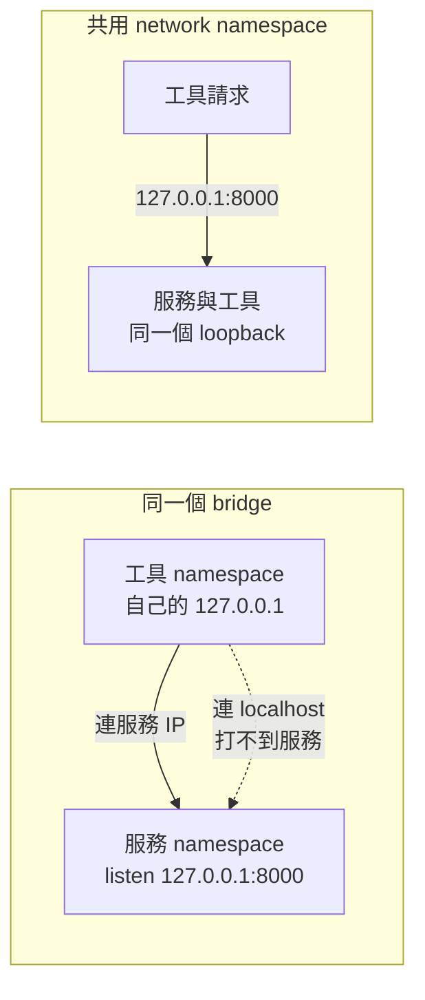

# 05｜裡面沒有 curl，從旁邊借一套

**現有網路功能；新增 HTTP fixture。** 已完成本版 Desktop Linux／arm64 核心實驗；適用環境與未驗邊界見[證據附錄](appendix-d-evidence.md)。

## 先把背景補齊：`localhost` 屬於 network namespace

容器的網路不是只有一條「Docker 網路」；每個容器通常有自己的 network namespace，裡面各自有介面、路由和 loopback。`127.0.0.1` 指的是目前這個 namespace 的自己，所以工具容器裡的 localhost，不是服務容器裡的 localhost。兩個容器加入同一個 bridge，只代表它們能透過各自的容器 IP 通訊，不會合併 loopback。

工具容器的價值是提供診斷程式，而不是修改正式 image。`--network container:<target>` 只共享目標的網路堆疊；它不共享檔案系統、程序或環境變數。於是本章會比較兩條明確路徑：同 bridge 連目標 IP，以及共用 namespace 後連目標的 `127.0.0.1`。先知道共享的是哪一層，才不會把「沒有 curl」誤解成「只能改正式映像」。



## 這一招其實在教什麼：借觀測能力，不改被測對象

工具容器的價值類似從 debugger、sidecar 或獨立診斷程式觀察一個 C++ service：把工具帶到現場，但盡量不改原服務的 image。真正要固定的是 network namespace、路徑、憑證與環境；否則借來的工具只證明「工具容器能連」，不代表應用本身能連。

## 現場症狀：極簡映像沒有工具，不代表服務不能測

正式映像可能只有執行檔和必要的憑證，沒有 shell、curl，甚至沒有套件管理器。看到 localhost 要測時，直覺做法往往是把 curl 安裝進正式映像再重新發布。這會改變映像內容，也把診斷工具和服務的生命週期綁在一起。

小招式是另開一次性工具容器，讓它借用目標容器的 network namespace。這一輪要分開兩種常被混在一起的做法：工具與服務加入同一個 bridge，工具用目標的容器 IP；工具用 --network container:目標，直接共用目標的 loopback。Docker 官方文件把這兩條路徑分開描述，並以綁在 127.0.0.1 的 Redis 示範後者。[Docker networking overview 原始文件](https://docs.docker.com/engine/network/)

本章用同一個 python:3.13-alpine 作服務與工具，工具程式只用 Python 標準庫 urllib。正式值班若已有核准的 curl 工具映像，可以把工具容器換成它並固定 image ID；這不會改變「同 bridge」和「共用 namespace」的判斷。不要因為本次 fixture 用 Python，就把 urllib 成功當成原程式的 TLS、proxy、DNS 或認證測試。

## 小招式：只把網路那一層借過來

先讓服務只綁 127.0.0.1，並在容器自己的 namespace 內確認它已經 listen。A 組工具在相同的 user-defined bridge 上，對目標容器 IP 發請求；B 組工具用 --network container:目標，對 127.0.0.1 發請求。服務和工具都不發布 host port，也不需要 privileged。

readiness 不用一個固定 sleep 來猜。下面的 wait_listen 每 0.2 秒讀一次明確的 FIELD05_LISTENING 訊息，最多 10 秒；超時就停下來看 log。請求本身另設一秒 timeout，避免網路錯誤變成無限等待。

## 必要原理：同一 bridge 不等於同一個 localhost

加入同一個 bridge 後，容器各自有 network interface、IP、route 和 loopback。服務只綁 127.0.0.1 時，它接受的是「服務自己那個 namespace 的 loopback」；工具容器自己的 127.0.0.1 是另一個 namespace。工具若改連目標的 bridge IP，仍然打不到只在 loopback listen 的 socket。

--network container:目標 則直接共用目標的 network stack，因此工具的 127.0.0.1 會指向目標的 loopback。這個模式也有限制：不能再另設 --publish、--dns、--hostname 等部分選項；目標要活著，而且兩個容器必須由同一個 daemon 管理。這是一次性觀察窗口，不是把工具的檔案系統、環境變數或憑證也複製過去。

## 親手實驗：127.0.0.1、同 bridge、共用 namespace

在 Bash 或 WSL 的新工作階段貼上。tag 只作首次下載；後面以擷取的 image ID 執行。HTTP 服務與 urllib 工具都固定用同一個 Python image，避免工具版本差異干擾這個對照。

```bash
set -Eeuo pipefail

field05_dir="$(mktemp -d -t field05.XXXXXX)"
field05_net="field05-net-$$"
field05_target="field05-target-$$"
field05_any="field05-any-$$"
field05_bridge="field05-bridge-$$"
field05_shared="field05-shared-$$"
field05_port=8123

field05_cleanup() {
  docker rm -f "$field05_target" "$field05_any" "$field05_bridge" "$field05_shared" \
    >/dev/null 2>&1 || true
  docker network rm "$field05_net" >/dev/null 2>&1 || true
}
field05_show_cleanup() {
  printf '若中途停止，請先執行：\n'
  printf 'docker rm -f %s %s %s %s 2>/dev/null || true\n' \
    "$field05_target" "$field05_any" "$field05_bridge" "$field05_shared"
  printf 'docker network rm %s 2>/dev/null || true\n' "$field05_net"
  printf '暫存證據仍在：%s\n' "$field05_dir"
}
field05_show_cleanup

docker pull python:3.13-alpine
FIELD05_PY_IMAGE_ID="$(docker image inspect --format '{{.Id}}' python:3.13-alpine)"
case "$FIELD05_PY_IMAGE_ID" in sha256:*) ;; *) echo 'python image ID 格式異常' >&2; exit 1 ;; esac
printf 'python image ID: %s\n' "$FIELD05_PY_IMAGE_ID" > "$field05_dir/image-ids.txt"

cat > "$field05_dir/server.py" <<'PY'
import os
from http.server import BaseHTTPRequestHandler, ThreadingHTTPServer

bind = os.environ.get("FIELD05_BIND", "127.0.0.1")
port = int(os.environ.get("FIELD05_PORT", "8123"))
assert bind in {"127.0.0.1", "0.0.0.0"}
assert 1 <= port <= 65535


class Handler(BaseHTTPRequestHandler):
    def do_GET(self):
        if self.path != "/field05":
            self.send_response(404)
            self.end_headers()
            return
        body = b"field05-ok\n"
        self.send_response(200)
        self.send_header("Content-Length", str(len(body)))
        self.end_headers()
        self.wfile.write(body)

    def log_message(self, format_string, *args):
        return


server = ThreadingHTTPServer((bind, port), Handler)
print(f"FIELD05_LISTENING bind={bind} port={port}", flush=True)
server.serve_forever()
PY

wait_listen() {
  local name="$1"
  local attempt
  for attempt in $(seq 1 50); do
    if docker logs "$name" 2>&1 | grep -Fq 'FIELD05_LISTENING'; then
      return 0
    fi
    sleep 0.2
  done
  docker logs "$name" >&2 || true
  echo "readiness 超時：$name" >&2
  return 1
}

docker network create "$field05_net" >/dev/null
docker run -d --name "$field05_target" --network "$field05_net" \
  -e FIELD05_BIND=127.0.0.1 -e FIELD05_PORT="$field05_port" \
  --mount "type=bind,src=$field05_dir/server.py,dst=/field05/server.py,readonly" \
  "$FIELD05_PY_IMAGE_ID" python -u /field05/server.py > "$field05_dir/target.id"
wait_listen "$field05_target"
field05_target_ip="$(docker inspect --format \
  '{{range .NetworkSettings.Networks}}{{.IPAddress}}{{end}}' "$field05_target")"
test -n "$field05_target_ip"

if docker run --rm --name "$field05_bridge" --network "$field05_net" -i \
    "$FIELD05_PY_IMAGE_ID" python - "$field05_target_ip" "$field05_port" \
    >"$field05_dir/bridge.out" 2>&1 <<'PY'
import sys
import urllib.request

host, port = sys.argv[1], sys.argv[2]
url = f"http://{host}:{port}/field05"
try:
    with urllib.request.urlopen(url, timeout=1.0) as response:
        body = response.read().decode()
        print(f"unexpected-status={response.status} body={body!r}")
except Exception as exc:
    print(f"field05-bridge-error={type(exc).__name__}: {exc}")
    raise SystemExit(1)
raise SystemExit(2)
PY
then
  echo '同 bridge 組非預期成功：請檢查服務是否真的只綁 127.0.0.1' >&2
  exit 1
fi
grep -Fq 'field05-bridge-error=' "$field05_dir/bridge.out"

if docker run --rm --name "$field05_shared" \
    --network "container:$field05_target" -i \
    "$FIELD05_PY_IMAGE_ID" python - "$field05_port" \
    >"$field05_dir/shared.out" 2>&1 <<'PY'
import sys
import urllib.request

port = sys.argv[1]
with urllib.request.urlopen(f"http://127.0.0.1:{port}/field05", timeout=1.0) as response:
    body = response.read().decode()
    assert response.status == 200
    assert body == "field05-ok\n"
    print(body, end="")
PY
then
  :
else
  echo '共用 namespace 組失敗，請讀 shared.out' >&2
  cat "$field05_dir/shared.out" >&2 || true
  exit 1
fi
grep -Fxq 'field05-ok' "$field05_dir/shared.out"

docker run -d --name "$field05_any" --network "$field05_net" \
  -e FIELD05_BIND=0.0.0.0 -e FIELD05_PORT="$field05_port" \
  --mount "type=bind,src=$field05_dir/server.py,dst=/field05/server.py,readonly" \
  "$FIELD05_PY_IMAGE_ID" python -u /field05/server.py > "$field05_dir/any.id"
wait_listen "$field05_any"
field05_any_ip="$(docker inspect --format \
  '{{range .NetworkSettings.Networks}}{{.IPAddress}}{{end}}' "$field05_any")"
test -n "$field05_any_ip"

docker run --rm --name "$field05_bridge" --network "$field05_net" -i \
  "$FIELD05_PY_IMAGE_ID" python - "$field05_any_ip" "$field05_port" \
  >"$field05_dir/any-bridge.out" 2>&1 <<'PY'
import sys
import urllib.request

host, port = sys.argv[1], sys.argv[2]
with urllib.request.urlopen(f"http://{host}:{port}/field05", timeout=1.0) as response:
    body = response.read().decode()
    assert response.status == 200
    assert body == "field05-ok\n"
    print(body, end="")
PY
grep -Fxq 'field05-ok' "$field05_dir/any-bridge.out"

printf '同 bridge（127.0.0.1）輸出：\n'
cat "$field05_dir/bridge.out"
printf '共用 namespace 輸出：\n'
cat "$field05_dir/shared.out"
printf '同 bridge（0.0.0.0）輸出：\n'
cat "$field05_dir/any-bridge.out"

docker logs "$field05_target" > "$field05_dir/target.log" 2>&1 || true
docker logs "$field05_any" > "$field05_dir/any.log" 2>&1 || true
field05_cleanup
printf '容器與 network 已清理；證據目錄保留：%s\n' "$field05_dir"
```

這段程式刻意不把固定 sleep 2 當 readiness。先等服務自己印出 listen 標記，再做網路對照；每次 urllib 也只有一秒。bridge.out 預期是連線錯誤，shared.out 預期只有 field05-ok，把服務改綁 0.0.0.0 後，any-bridge.out 預期成功。這些是重跑時的預期判準，服務起不來時先看 target log，不要把 daemon 故障解讀成網路 namespace 差異。

## 本版實測記錄

服務只綁 127.0.0.1 時，同 bridge 工具得到 **Connection refused**；共享 namespace 後取得 `field05-ok`。另建 bind 0.0.0.0 的副本，同 bridge 也取得相同回應。專用容器與 network 已清理；未測 TLS、認證或遠端網路。

## 結果解讀：成功只縮小「綁定位址」這條疑點

若 127.0.0.1 組的同 bridge 連不到，而共用 namespace 能取得 field05-ok，差異支持「服務只在自己的 loopback listen」這個假設。接著可查正式程式的 bind 設定、容器內 listen 位址與是否真的需要跨容器連線。0.0.0.0 反例若同 bridge 對容器 IP 成功，正好說明 bridge 網路本身不是這個 fixture 的阻礙。

若同 bridge 也成功，先別急著寫 Docker 壞了：可能服務實際綁成 0.0.0.0、執行了另一個設定，或請求打到別的 port。若共用 namespace 失敗，查看服務 log、port、路徑與 target 是否還活著。Docker 的 namespace 測試只回答 socket 路徑，不能代替應用的 CA、proxy 環境、認證 header、DNS library、重試或業務語意。

工具容器有自己的 root filesystem。即使它與 target 共用網路，工具的信任憑證、環境變數、名稱解析設定和 Python 套件仍可能不同；因此「urllib 成功」只說明從該 namespace 對該 URL 的一個請求成功。正式流程使用 curlimages/curl、netshoot 或公司核准的工具映像時，同樣先固定 image ID，並把工具版本、參數和 timeout 記錄下來。[netshoot 原始專案](https://github.com/nicolaka/netshoot)

## 失效反例與代價

--network container:目標 不是更強的 bridge。target 停止後沒有服務程序可供請求，不能把工具退出解讀成 bind 行為；而且某些網路選項被禁止，不能一邊共用 namespace 一邊期待獨立 publish port。若要測對外發布、DNS 解析或不同網路間的路由，應回到各自網路的測試，而不是硬套 localhost。

一次性工具會增加程序和測試流量，也可能觸發服務的 rate limit 或認證紀錄。若工具映像不符合主機架構，失敗原因是 image／平台，不是服務網路。不要為了 curl 加 --privileged；需要封包擷取時，那是另一個有權限邊界的實驗。

## 從土招到正式工程

若某條診斷命令常用，就固定工具 image digest、namespace 方式與必要參數，收進版本化 script；把它定位成觀測工具，不要偷偷變成服務的依賴。正式的健康檢查仍應從應用真正使用的協定、憑證與設定出發。

## 收尾與撤回

正常結束時，程式已明確移除 field05-* 容器與專用 network，但保留 field05_dir 供核對 bridge.out、shared.out、any-bridge.out、image ID 和 target log。這個目錄可在把原始輸出複製到[實驗紀錄卡模板](appendix-b-record.md)後手動刪除；不要用全域 prune。

若中途失敗，先用程式印出的兩行精準清理命令移除容器與 network，再讀暫存證據。回到正式服務時撤回的動作只是移除一次性工具容器；不需要把 curl 安裝回正式映像，也不應把診斷用 --network container: 留在部署命令裡。
