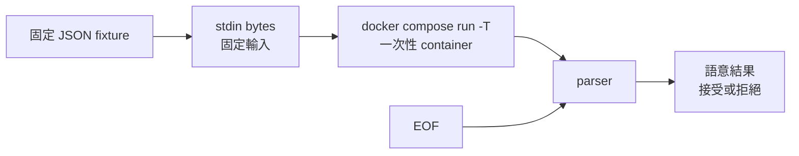

# 07｜不走介面，餵同一份輸入再跑一次

**現有 stdin 入口；新增測試解析器與 JSON。** 已完成本版 Desktop Linux／arm64 核心實驗；適用環境與未驗邊界見[證據附錄](appendix-d-evidence.md)。

## 先把背景補齊：stdin 是輸入通道，不是「重做按鈕」

程式從 stdin 讀到的是一串 bytes；它是否能重現一次操作，還取決於 parser、EOF、互動提示和輸入當下的環境。TTY 會改變一些程式對終端的判斷，但 `-T` 只是不配置 pseudo-TTY，不等於把 stdin 關掉。把檔案重導進去，仍要確認程式真的從 stdin 讀取、知道何時遇到 EOF，而且這份資料不會觸發真實副作用。

`docker compose run` 會依 service 設定建立一個一次性 container；它沿用 image、環境與其他設定，但命令可以被覆蓋，也不等於重新進入原本正在跑的 service。這使它適合做小型重播，卻不保證重建整個真實請求環境。本章先固定輸入 bytes，再把「能餵進去」和「語意上等同原操作」分成兩個判斷。



## 這一招其實在教什麼：建立可重現的輸入 seam

固定 stdin 就像把 C++ 的互動入口切成 fixture 或 replay harness：它能保留輸入 bytes 與解析結果，卻不會自動保留網路時序、外部服務、環境變數或競態。重播的價值是縮小變因，不是宣稱已重現整個 production。

## 現場症狀

一次失敗只能從 UI 點出來，重跑整批又要等很久；你把看似相同的請求存下來，重導給 Compose，卻遇到「input device is not a TTY」，或者腳本的後半段沒有執行。這裡其實有兩個問題：資料有沒有真的從 stdin 送進容器，以及程式把資料解析後是否得到正確語意。只看到命令結束，不能證明兩件事都成立。

本章的小招式是把一筆去敏 JSON 存成 fixture，讓一次性 service 明確以 stdin 讀它；每次使用 `-T` 關閉 pseudo-TTY，再比較兩次 stdout、exit code 和輸入 checksum。另送一筆 JSON 語法正確、必要欄位缺失的資料，故意證明「傳輸成功」和「應用接受」是兩個 assert。這個 replay 不模擬 UI 的時間、cookie、併發或外部依賴，只固定目前已保存的 bytes。

## 小招式：固定 stdin，另外判讀語意

`docker compose run` 建立一次性容器，沿用 service 的 image、command 和其他設定；傳給 `run` 的 command 會覆蓋 service 的預設 command。`-T`（`--no-tty`）只停用 pseudo-TTY 分配，**不是關掉 stdin**；Compose run 預設仍保持互動輸入，重導的檔案會交給程式。反過來，對完全不需要輸入的診斷命令，才把 stdin 明確接到 `/dev/null`。

`--no-deps` 只表示不要啟動 linked／相依 service，**不是網路隔離**。本章 service 額外設定 `network_mode: none`，把「不讓 fixture 對外連線」寫成獨立條件；如果你的正式測試需要網路，請另建專用 network 並說清楚，不要把 `--no-deps` 當防火牆。

## 必要原理

stdin 是一條位元組輸入管線，TTY 是終端裝置的互動屬性，應用自己的 JSON schema 又是第三層。關閉 TTY 不會替程式剝掉 stdin；它只避免程式把輸入當成終端而要求互動控制。這正是把檔案重導和 `-T` 同時寫出的原因：你要固定資料，也要讓終端條件不參與判斷。

Compose run 沿用 service 的 volumes、links 和其他設定，但不會自動建立 service 宣告的 published ports；本章沒有 ports，也沒有任何 dependency。即使加了 `--no-deps`，容器若仍掛在一般 network，程式仍可能連到能到達的主機或服務。`network_mode: none` 是另一個明確的測試選項，不能從 `--no-deps` 推導出來。

語法可讀只代表 JSON parser 成功。C06 的案例正好提醒：輸入可以被匯入，應用的欄位語意仍可能不如預期。失敗 fixture 因此也要保存；它是回歸資料候選，不是「只留下成功案例」的展示檔。

## 完整最小實驗

```bash
set -euo pipefail

WORK_DIR="$(mktemp -d "${TMPDIR:-/tmp}/field07.XXXXXX")"

docker compose version
docker pull python:3.13-alpine
FIELD07_IMAGE="$(docker image inspect --format '{{index .RepoDigests 0}}' python:3.13-alpine)"
test -n "$FIELD07_IMAGE"
docker image inspect "$FIELD07_IMAGE" --format 'id={{.Id}} ref={{index .RepoDigests 0}}'
printf 'FIELD07_IMAGE=%s\n' "$FIELD07_IMAGE" > "$WORK_DIR/compose.env"

cat > "$WORK_DIR/compose.yaml" <<'YAML'
services:
  replay:
    image: "${FIELD07_IMAGE:?run pull and inspect first}"
    pull_policy: never
    network_mode: none
    stdin_open: true
    tty: true
    entrypoint: ["python", "-u"]
    command:
      - -c
      - |
          import json
          import sys
          record = json.load(sys.stdin)
          if not isinstance(record, dict):
              print("semantic_error=record_not_object", file=sys.stderr)
              raise SystemExit(3)
          payload = record.get("payload")
          if (not isinstance(payload, dict)
                  or not record.get("event_id")
                  or not payload.get("mode")):
              print("semantic_error=missing_event_id_or_mode", file=sys.stderr)
              raise SystemExit(3)
          print("event_id={0} mode={1}".format(
              record["event_id"], payload["mode"]))
YAML

cat > "$WORK_DIR/input.valid.json" <<'JSON'
{"event_id":"replay-001","payload":{"mode":"field07"}}
JSON
cat > "$WORK_DIR/input.semantic-error.json" <<'JSON'
{"event_id":"replay-002","payload":{}}
JSON

docker compose --project-name field07 --env-file "$WORK_DIR/compose.env" \
  --file "$WORK_DIR/compose.yaml" config -q
before_checksum="$(sha256sum "$WORK_DIR/input.valid.json" | awk '{print $1}')"

docker compose --project-name field07 --env-file "$WORK_DIR/compose.env" \
  --file "$WORK_DIR/compose.yaml" run --rm --no-deps -i -T replay \
  < "$WORK_DIR/input.valid.json" > "$WORK_DIR/valid-1.out"
docker compose --project-name field07 --env-file "$WORK_DIR/compose.env" \
  --file "$WORK_DIR/compose.yaml" run --rm --no-deps -i -T replay \
  < "$WORK_DIR/input.valid.json" > "$WORK_DIR/valid-2.out"

valid_1="$(< "$WORK_DIR/valid-1.out")"
valid_2="$(< "$WORK_DIR/valid-2.out")"
test "$valid_1" = 'event_id=replay-001 mode=field07'
test "$valid_1" = "$valid_2"
after_checksum="$(sha256sum "$WORK_DIR/input.valid.json" | awk '{print $1}')"
test "$before_checksum" = "$after_checksum"

set +e
docker compose --project-name field07 --env-file "$WORK_DIR/compose.env" \
  --file "$WORK_DIR/compose.yaml" run --rm --no-deps -i -T replay \
  < "$WORK_DIR/input.semantic-error.json" \
  > "$WORK_DIR/semantic-error.out" 2> "$WORK_DIR/semantic-error.err"
semantic_rc=$?
set -e
test "$semantic_rc" -eq 3

set +e
docker compose --project-name field07 --env-file "$WORK_DIR/compose.env" \
  --file "$WORK_DIR/compose.yaml" run --rm --no-deps -i -T replay \
  < /dev/null > "$WORK_DIR/eof.out" 2> "$WORK_DIR/eof.err"
eof_rc=$?
set -e
test "$eof_rc" -ne 0
printf 'valid1=%s\nvalid2=%s\nsemantic_rc=%s eof_rc=%s\nchecksum=%s\n' \
  "$valid_1" "$valid_2" "$semantic_rc" "$eof_rc" "$before_checksum" | tee "$WORK_DIR/results.txt"
```

預期是兩次 valid output 都只有 `event_id=replay-001 mode=field07`，且 checksum 不變；語意錯誤輸入應退出 3，stderr 含 `semantic_error=missing_event_id_or_mode`；接 `/dev/null` 應讓 JSON parser 讀到 EOF 並以非零退出。本版實測另列於下方；重跑仍需核對退出碼與內容。這裡特別把 `-i` 和 `-T` 都寫出：前者保持 stdin 開啟，後者關閉 pseudo-TTY；兩者解決不同問題。`sha256sum` 是 Linux／WSL 常見的 coreutils；macOS 主機若沒有它，改用等價的 `shasum -a 256`，不要省略 checksum 對照。

若要用不經 Compose 的最小入口再核對一次，`docker run` 也要明確給 `-i`。下列 heredoc 的 stdin 是 Python 原始碼，不是 JSON fixture；它只檢查「檔案內容能送進容器的 stdin」這一層，避免把兩條輸入混成一件事：

```bash
docker run --rm -i --network none "$FIELD07_IMAGE" python - <<'PY'
print("python-source-received")
PY
```

若要把 JSON 真正交給程式 stdin，改用檔案重導給 `python -c`；不要同時用 heredoc 供應程式碼又期待同一條 stdin 還有另一份資料：

```bash
printf '%s\n' '{"event_id":"direct-001","payload":{"mode":"field07"}}' |
  docker run --rm -i --network none "$FIELD07_IMAGE" \
  python -c 'import json,sys; print(json.load(sys.stdin)["event_id"])'
```

如果要把「前後腳本是否都執行」留在紀錄中，可用一個只依賴本章參數的 driver。它不把 stdin 偷換成 TTY，也不吞掉錯誤：

```bash
cat > "$WORK_DIR/driver.sh" <<'BASH'
#!/usr/bin/env bash
set -u
printf '%s\n' before
set +e
docker compose --project-name field07 --env-file "$1" \
  --file "$2" run --rm --no-deps -i -T replay < /dev/null
rc=$?
set -e
printf 'after rc=%s\n' "$rc"
BASH
chmod 0755 "$WORK_DIR/driver.sh"
"$WORK_DIR/driver.sh" "$WORK_DIR/compose.env" "$WORK_DIR/compose.yaml" \
  > "$WORK_DIR/driver.out" 2> "$WORK_DIR/driver.err"
grep -q '^before$' "$WORK_DIR/driver.out"
grep -q '^after rc=' "$WORK_DIR/driver.out"
```

這個對照的重點是 `-T` 沒有讓 stdin 消失：前一個命令明確收到 `/dev/null`，所以 parser 會失敗，但 shell 仍能印出 `after`。在需要 replay 的命令上，則把固定 JSON 直接重導給該命令；不要用 `-T` 假裝「不會再讀輸入」。

## 本版實測記錄

兩次固定 JSON 都輸出 `event_id=replay-001 mode=field07`；checksum 未變。語意缺欄位以 **3** 退出，EOF 以 **1** 退出；直接 heredoc／JSON 管線與 driver 前後標記也完成核對。這沒有重現舊版 issue 的所有條件。

## 結果解讀

valid 兩次相同，支持的是同一份 bytes 經由 stdin 到達同一個 parser，且本章 service 在這組條件下輸出固定欄位。它不證明原 UI 的 request 等價，也不證明真實應用的資料庫寫入是冪等。checksum 不變只保護 fixture 沒被測試命令改寫，不能保證程式沒有外部副作用。

semantic-error 以 3 結束，代表 bytes 到達且 JSON 可以解析，但必要欄位缺失；這是有價值的反例。若它反而以 0 結束，先查程式是否只做語法解析、Compose 是否執行了你以為的 command，或輸入是否被別的 wrapper 消費。若 valid 兩次 stdout 不同，保存兩份輸出、image ref、Compose 版本和 checksum，再查時間、隨機值或環境，而不是先重試更多次。

`config -q` 成功只證明 Compose 模型可處理；run 失敗可能來自 image、command、stdin、程式語意或權限。`--no-deps` 下仍能連網的配置也不能被解讀成隔離；本章用 `network_mode: none` 才把這個變因拿掉。

## 失效反例與代價

只支援滑鼠、瀏覽器 cookie 或互動 prompt 的應用，沒有可重播的 stdin 入口；你需要先寫一個明確的測試 parser 或 API fixture。那是新增程式，不是 Docker 自動提供的 replay 開關。若輸入含秘密，去敏不是把欄位改成空字串就算完成；要確認替代值不會觸發真實收件人、資料庫或檔案路徑。

第二個反例是把預設 TTY 行為當成固定規則。Compose CLI 會依終端狀態自動判斷，舊版 `docker-compose` 的案例也可能和現在不同；腳本與檔案重導應明確寫 `-T`。第三個反例是以為 `--no-deps` 阻止網路；它只限制啟動相依服務，本章的 network none 才是隔離條件。

固定輸入把真實時間、併發、重試、外部回應和 volume 狀態拿掉；好處是重跑快，代價是代表性變窄。保留失敗 fixture 會增加維護與去敏責任，重要案例才收進回歸資料，不要把每次臨時輸出都永久保存。

## 從土招到正式工程

若同一份輸入反覆有用，把它去敏後收進版本庫，補上版本、設定、退出碼與副作用的驗收。再往前才判斷是否需要錄製事件時間線、建立 fake service 或加入整合測試；先用 fixture 找到 seam，通常比一開始打造完整重播系統更便宜。

## 收尾與撤回

本章不在 `trap` 裡自動清理，先保留 output、stderr、checksum 和 image ref 供核對。`run --rm` 已清掉一次性 container；若某次中斷留下 project 資源，先用本章同一份 env file 精確收掉：

```bash
docker compose --project-name field07 --env-file "$WORK_DIR/compose.env" \
  --file "$WORK_DIR/compose.yaml" down --volumes
```

保留 `$WORK_DIR` 供 stdout、stderr、checksum 和去敏 fixture 核對；交接完成後再由操作者刪除這個明確的 `mktemp` 路徑。若要把案例正式化，保留去敏輸入、checksum、預期欄位和退出碼，並在文件中標明它不涵蓋時序與外部副作用；不要在正式服務全域關閉 TTY 或 stdin。

來源：案例 C06 [ArchiveBox discussion #1093](https://github.com/ArchiveBox/ArchiveBox/discussions/1093)、案例 C07 [docker/compose issue #7776](https://github.com/docker/compose/issues/7776)；機制 [docker compose run](https://docs.docker.com/reference/cli/docker/compose/run/)。研究筆記與證據分級見 [附錄 D：證據與適用範圍](appendix-d-evidence.md)。
