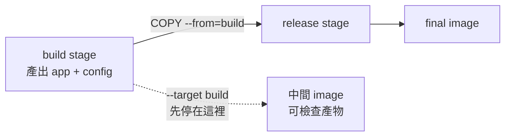

# 09｜不必跑到最後，建到上一站就停

**現有 target 功能；需重新建置。** 已完成本版 Desktop Linux／arm64 核心實驗；適用環境與未驗邊界見[證據附錄](appendix-d-evidence.md)。

## 先把背景補齊：多階段 build 是一串可觀察的檔案狀態

多階段 Dockerfile 不是一次把所有命令直接堆進 final image；每個 `FROM ... AS name` 都可以視為一個中間檔案系統狀態，後面的 stage 用 `COPY --from` 選擇性拿走產物。某個 build 命令成功，只代表它走過的命令沒有失敗，不代表 final stage 一定收到了你以為的檔案。

`--target` 讓 build 停在指定 stage，產生一個可 inspect 的中間 image。它特別適合問「產物在哪一站消失」：若 build stage 的契約已成立、release stage 的契約失敗，問題就在 stage 之間的複製或路徑，而不必先等待完整發布流程。中間 image 只是診斷材料，不是正式交付物；本章會為每一站先寫出可檢查的檔案契約。



## 這一招其實在教什麼：把中間產物變成檢查點

多階段 build 的 stage 就像 C++ 編譯流程中的中間 target：它不是只有最後 executable 才有意義。`--target` 讓你停在產物剛生成的位置，先確認檔案、權限與設定，再追最後一段交付；這比只看 final image 缺什麼更容易定位責任邊界。

## 現場症狀

多階段 Dockerfile 的最後映像少了一個檔案。你重新跑完整 build，它可能很快命中前面的 cache，也可能又等完編譯、測試與打包，最後才看到同一個缺檔。此時真正要問的是：「檔案在哪個 stage 還存在？」而不是「整個 build 有沒有成功」。

如果最後的 `COPY --from=build` 少寫一項，builder stage 仍可能有完整產物，release stage 卻沒有。反過來，若產物在 builder 就沒產生，修改 final 的 COPY 只會換一種錯誤。先停在已成功的上一站，可以把這兩個邊界分開。

## 小招式：`--target` 留住中間站

給產生產物的 stage 一個名字，例如 `build`。用 `--target build` 把它當成這次建置的最後 stage，並配 `--load` 載入本機 image store；接著用 `docker run` 或 `docker export` 檢查檔案。再以同一份 Dockerfile 建出預設 final image，逐一比較 stage 內與 final 內的路徑。

本章 A 組是 `field09:build`，B 組是故意漏檔的 `field09:release`。兩組都使用同一個 digest、同一份輸入與同一個產物命令；差異只在是否經過 final 的 COPY 邊界。補上那一行後才建 `field09:release-fixed`，避免把診斷 tag 誤當正式 image。

## 必要原理

每個 `FROM` 開始一個 stage。`COPY --from=build` 只把指定路徑從名為 `build` 的 stage 複製到下一個 stage；builder 裡其他檔案不會因為「同一個 Dockerfile」自動進入 final。命名 stage 比使用 `0`、`1` 穩定，因為日後插入另一個 `FROM` 不會悄悄改變數字。

`--target` 把指定 stage 當成結果的終點，後面的指令不會執行。BuildKit 也只處理該 target 依賴的 stages；無關的 stage 不會為了完整閱讀 Dockerfile 而執行。這讓診斷更快，但不會把失敗的 `RUN` 變成可進入的 checkpoint。若產物生成那一步已失敗，應在它之前加一個合理的檢查點或先修好產生步驟。

`--load` 是 `--output=type=docker` 的簡寫，作用是把單一平台的結果放入本機 `docker images`，好讓後續 `docker image inspect`、`docker run` 看到它。沒有明確輸出到本機時，build 成功的 log 不等於本機一定有可執行的 tag；這也是本章每個可執行 target 都明寫 `--load` 的原因。

### 檢查點要有可比較的契約

一個好的中間 stage 不只是「看起來比較早」。它要有可描述的輸出路徑、可重複的檔案內容，以及一個在失敗時仍能執行的檢查命令。本章的契約是 `/out/app` 與 `/out/config` 都存在，且 marker 內容固定；final 的契約則是 `/app` 和 `/etc/field09/config` 都存在。把路徑和 checksum 寫下來，比單看 build 成功更能定位交付邊界。

若正式專案產出的是目錄，先列出檔名與相對路徑，再逐項查 `COPY --from`；不要只檢查一個代表檔，就推論整個目錄完整。若產出含符號連結、執行權限或 owner，也要把這些屬性列進檢查，因為「檔案存在」不等於 final 可以使用。這些欄位是 stage 的觀測契約，不是要求每個正式 image 都帶除錯工具。

`--target` 的價值是縮短等待與縮小問題面，不是替代完整發布驗證。中間 image 只在本機使用，tag 名要和正式發布名稱分開；完成後以 image ID、tag、Dockerfile commit 和 base digest 交叉記錄，避免下一次測試拿到舊的中間產物。

## 完整可照做實驗：比較 build stage 與 release stage

fixture 使用兩個小文字檔作產物，不下載編譯器，也不碰現有 repo。`alpine:3.21` 是第一次下載起點；真正執行時先 pull，再以 `RepoDigests` 的完整 `alpine@sha256:...` 固定兩個 `FROM`。image `.Id` 只用來記錄與 inspect，不拿去寫入 Dockerfile。

```bash
set -Eeuo pipefail
ROOT="$(mktemp -d "${TMPDIR:-/tmp}/field09.XXXXXX")"
printf 'fixture=%s\n' "$ROOT"

docker --version
docker buildx version
docker compose version
if ! docker info >/dev/null 2>&1; then
  printf '%s\n' 'Docker daemon 不可用；本章操作稿到此為止，未宣稱實驗成功。' >&2
  exit 2
fi

docker pull alpine:3.21
BASE_REF="$(docker image inspect alpine:3.21 --format '{{index .RepoDigests 0}}')"
BASE_ID="$(docker image inspect alpine:3.21 --format '{{.Id}}')"
test -n "$BASE_REF"
printf 'base_ref=%s\nbase_id=%s\n' "$BASE_REF" "$BASE_ID" \
  | tee "$ROOT/base-record.txt"

cat > "$ROOT/Dockerfile" <<EOF
FROM $BASE_REF AS build
RUN mkdir -p /out && \\
    printf 'field09-binary-A\\n' > /out/app && \\
    printf 'field09-config-A\\n' > /out/config

FROM $BASE_REF AS release
COPY --from=build /out/app /app
CMD ["cat", "/app"]
EOF

docker buildx build --target build --load --progress=plain \
  -t field09:build "$ROOT" \
  2>&1 | tee "$ROOT/build-stage.log"
docker image inspect field09:build --format 'build image={{.Id}} tags={{json .RepoTags}}'
test "$(docker run --rm field09:build sh -c 'cat /out/app')" = 'field09-binary-A'
test "$(docker run --rm field09:build sh -c 'cat /out/config')" = 'field09-config-A'

docker buildx build --load --progress=plain \
  -t field09:release "$ROOT" \
  2>&1 | tee "$ROOT/build-release-missing.log"
docker image inspect field09:release --format 'release image={{.Id}} tags={{json .RepoTags}}'
test "$(docker run --rm field09:release)" = 'field09-binary-A'
set +e
docker run --rm field09:release sh -c 'test -f /etc/field09/config'
MISSING_CONFIG_STATUS=$?
set -e
test "$MISSING_CONFIG_STATUS" -ne 0
printf 'B（final 漏 COPY）預期失敗，status=%s\n' "$MISSING_CONFIG_STATUS"

cat > "$ROOT/Dockerfile" <<EOF
FROM $BASE_REF AS build
RUN mkdir -p /out && \\
    printf 'field09-binary-A\\n' > /out/app && \\
    printf 'field09-config-A\\n' > /out/config

FROM $BASE_REF AS release
COPY --from=build /out/app /app
COPY --from=build /out/config /etc/field09/config
CMD ["cat", "/app"]
EOF

docker buildx build --load --progress=plain \
  -t field09:release-fixed "$ROOT" \
  2>&1 | tee "$ROOT/build-release-fixed.log"
docker image inspect field09:release-fixed --format 'fixed image={{.Id}} tags={{json .RepoTags}}'
test "$(docker run --rm field09:release-fixed)" = 'field09-binary-A'
test "$(docker run --rm field09:release-fixed sh -c 'cat /etc/field09/config')" = 'field09-config-A'
```

中間 stage 與 final 都用 `--load`，所以 assertion 是對本機剛產生的 tag 執行；不要在 build 失敗時先 `inspect` 不存在的 tag。`set +e` 只包住預期的 `test -f` 失敗，接著仍會重寫 Dockerfile 並建出修正版。請把區塊存成獨立 Bash 腳本後執行，或在新 shell 逐段執行；fixture 目錄和三份 plain log 會保留。若命令在 `docker pull` 或 `docker info` 就失敗，原因是 daemon／網路，腳本以 status 2 結束，不能記成 stage 缺檔或讓自動化假通過。

## 本版實測記錄

前段 stage 同時存在 app 與 config；原 final 缺 config，補上 COPY 後兩項檔案檢查通過。三個 target 結果均以 `--load` 取得並核對，測試 tag 已移除。

## 結果解讀

若 `field09:build` 同時有 `/out/app` 與 `/out/config`，而 `field09:release` 只有 `/app`，診斷邊界就是 final 的 `COPY` 清單。`field09:release-fixed` 兩個 assertion 都成功，則只支持「漏複製設定檔」這個最小結論；它沒有證明應用程式能讀設定，也沒有證明所有架構平台的路徑都相同。

如果 A 組沒有 `/out/config`，先回到生成產物的 `RUN`；如果 A 組有、B 組也有，才查容器內實際工作目錄、檔案權限、entrypoint 或後續掛載。把 `docker run` 的檔案檢查和 `docker image inspect` 的 ID 一起記錄，能避免你看錯舊 tag。相同 tag 被重建時，請以新的 image ID 確認已換成修正版。

`--target build` 只建 `build` 及其相依內容。若 Dockerfile 另有 `debug`、`test` 或無關 stage，plain log 沒有它們不表示命令漏跑；這是 BuildKit 的依賴裁剪。若你要檢查某個無關 stage，請另一次明確寫 `--target`，不要從 final 的 log 推測。

本 fixture 沒有宣稱 stage 之間的檔案內容已做位元級相同；它只用兩個短 marker 驗證「存在於 build、缺在 release、補 COPY 後回來」。正式驗證可在每個 target 執行 `sha256sum`，並保存輸出，然後比較同一 base digest 下的 A/B。若 checksum 變了，先確認輸入、平台和產物生成時間是否固定，再判斷是 COPY 邊界或建置本身漂移。

`--load` 也帶來一個平台界線：官方語意是載入單一平台結果。若你的正式命令同時建 `linux/amd64` 與 `linux/arm64`，先把本章縮成一個平台的診斷副本，否則你可能是在檢查輸出 exporter，而不是 stage 邏輯。記錄 `docker buildx inspect` 的 builder 與平台能力；本版使用 docker driver、BuildKit v0.27.0，實際只驗證 Linux／arm64。

## 失效反例

不要把「建到上一站」理解成可以進入剛剛失敗的那一站。`RUN` 本身若因語法、依賴或網路失敗，並沒有可供 `docker run` 的成功 image。可檢查的 target 必須在失敗指令之前，或把失敗指令拆成可獨立判讀的步驟。

也不要把 debug stage 直接發布。它可能含 shell、編譯器、測試資料或中間憑證；這些工具對定位有用，卻不應隨正式 image 出貨。stage 名稱不是安全邊界，`COPY --from` 也不會替你審查產物內容。實驗 fixture 用假文字檔，正式專案仍要核對權限、所有者與機密清理。

若 final 有 bind mount 或 volume，`docker run` 看到的內容還會受到執行期掛載遮蔽；本章刻意不加掛載，避免把 build 邊界和執行期遮蔽混成一件事。遇到相同症狀時，可先回看 [08-build-context.md](08-build-context.md) 確認輸入，再回到本章查 stage 交付邊界。

## 從土招到正式工程

若某個 stage 的產物是交付契約，就把檔案清單、版本資訊與最小 smoke test 收進 CI；`--target` 可以保留成診斷入口，但不應讓工程師靠手動進中間 image 才知道 release 少了什麼。正式修法是讓交付邊界可被自動檢查。

## 收尾與撤回

核對完三個 tag 後，只移除本章命名的 image；不要用全域 prune 清掉其他 build 的 cache：

```bash
docker image rm field09:build field09:release field09:release-fixed
```

請先把 `base-record.txt`、三份 plain log、stage／release／fixed 的 image ID 和 checksum 自存到 [appendix-d-evidence.md](appendix-d-evidence.md)；獨立 fixture 目錄不由腳本自動刪除，確認證據已保存後再用明確的絕對路徑手動清理。正式 Dockerfile 若只是偶爾診斷，保留清楚的 stage 名稱即可；若每次發布都需要同一份產物檢查，再把 `--target` 與 checksum 檢查收進 CI。不要把診斷用的 `field09:build` 當成可部署 tag，也不要用同名 tag 蓋掉仍待比較的結果。下一章把同一種局部邊界用在 cache：只讓可疑 stage 重跑：[10-invalidate-one-stage.md](10-invalidate-one-stage.md)。

## 來源

- Docker Docs，[Multi-stage builds](https://docs.docker.com/build/building/multi-stage/)
- Docker Docs，[docker buildx build](https://docs.docker.com/reference/cli/docker/buildx/build/)
- 本章來源與適用範圍：[證據附錄](appendix-d-evidence.md)
