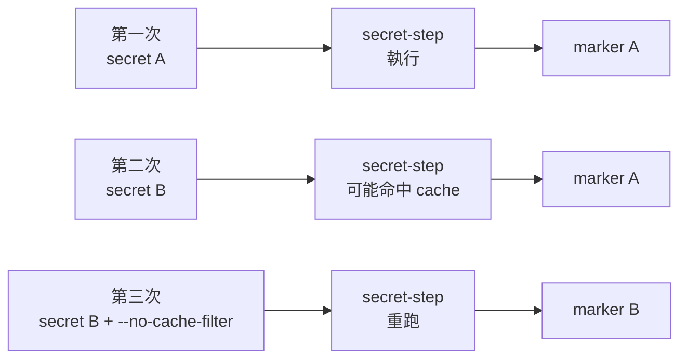

# 10｜懷疑快取，只讓那一段重跑

**現有局部快取功能；自訂 nonce；需重新建置。** 已完成本版 Desktop Linux／arm64 核心實驗；適用環境與未驗邊界見[證據附錄](appendix-d-evidence.md)。

## 先把背景補齊：快取記住的是建置邊界，不是所有檔案內容

BuildKit 會嘗試重用先前的 layer，但它必須依建置指令與已知輸入判斷是否可重用；它不會執行每個 `RUN`，再讀容器裡任意檔案來猜結果。Build secret 的內容刻意不放進 cache key，因此「secret 檔案換了」不一定會讓讀取它的 `RUN` 重跑。這是安全與可重現性邊界，不是把 secret 當普通 `COPY` 輸入。

stage 名稱則提供一個比較清楚的失效邊界。`--no-cache-filter secret-step` 會讓指定 stage 重新執行，依賴它的下游再跟著重算；它和全域 `--no-cache`、base image 更新、`RUN --mount=type=cache` 都是不同狀態。本章先用假的 A／B secret 看見「輸入變、輸出沒變」，再只刷新那一段，避免一開始就把整個 builder 清空。



## 這一招其實在教什麼：理解增量建置的失效邊界

BuildKit cache 和 C++ incremental build 的 stale object 很像：問題不一定是「快取壞了」，而是你以為某個輸入會影響 target，實際上它沒有進入那個步驟的 key。局部停用 cache 是診斷 probe，用來確認疑點，不是日常的清 cache 儀式。

## 現場症狀

你改了建置時會讀取的值，產物卻仍是舊的。第一個反應往往是 `--no-cache`，甚至直接 `docker builder prune`。前者讓所有 stage 都失去 layer cache，後者還會影響同一 builder 上別的專案；它們可以讓結果改變，卻不告訴你是哪個邊界有問題。

本章用一個完全假的 secret 產生 marker。第一次輸出 A，第二次只把 secret 換成 B，預期仍可能命中相同的 `RUN` cache；第三次以 `--no-cache-filter secret-step` 只讓讀 secret 的 stage 重跑，預期 marker 才變 B。這個現象用來定位 cache key 的缺口，不代表 Docker cache 有 bug。

## 小招式：命名 stage，局部停用 cache

給讀取 secret 的 stage 一個穩定名字，所有 build 都使用相同的 base digest、相同的 Dockerfile 與相同的假輸入。先用 A 建 `field10:a`，再用 B 建 `field10:b-cached`；兩次都留下 plain log 和 marker。若第二次命中 cache，記下「B 輸入、A 輸出」這個可觀察差異。

接著用 B 加 `--no-cache-filter secret-step`，建立 `field10:b-refresh`。該選項的參數是 stage 名稱，可以逗號分隔多個 stage；它不等於全域 `--no-cache`。依賴 `secret-step` 的下游會因上游改變而重算，但沒有相依的 stage 不應被這個局部選項平白刷新。

第一輪一定要有新的、非秘密的 run ID，否則前一輪留下的 `field10:a` cache 可能讓「第一次 A」其實是舊 B。用 `mktemp` 目錄名產生 ID，讓同一輪的 A、B、refresh 共用它；這個 ID 只是 cache 分隔標籤，不含 secret。第二輪再加一個明確的 `-nonce2` 後綴，先建 B、再用同一 nonce 建 A，觀察 B→A 是否仍保留 B，才能把「secret 內容不入 key」和「nonce 造成失效」分開。

## 必要原理

對 `RUN` 指令，cache lookup 主要看指令與已知的建置輸入；它不會讀取容器內任意檔案來猜結果。Build secret 的內容刻意不參與 cache key，所以只換 secret 值不保證重新執行。secret 的 ID 與 mount path 屬性則是建置描述的一部分，改變它們可能使 cache 失效。

若輸入版本本身是非秘密資訊，可以用一個人工維護的 nonce `ARG CACHEBUST`；值改變會造成後續 cache 失效。nonce 不是自動偵測，也不能放入 secret 本身。最小的定位動作是先用 `--no-cache-filter` 證明 stage 邊界，再決定要不要把版本 nonce 正式納入流程。

layer cache、base image、`RUN --mount=type=cache` 的工具快取和外部下載各是不同狀態。`--no-cache-filter secret-step` 不會替你拉取更新的 base，也不會清空 cache mount；這章沒有宣稱它們會同步刷新。若要更新 base，另行檢查 pull policy、digest 與輸出；若要驗證工具 cache，另做冷／暖對照。

讀 plain log 時，先看 stage 標籤，再看 `CACHED` 或實際 `RUN` 輸出，最後才看 marker。只看最後檔案容易漏掉「上游重跑、下游仍命中」或「tag 指到舊 image」的情況。每一輪的固定表至少要有 base digest、Dockerfile 內容摘要、`CACHEBUST`、secret 檔名、stage 名、image ID 和 marker；secret 檔案本身只保存假值，不能用日後再讀檔的方式替代證據摘要。

若問題不是 secret，而是依賴版本或外部下載，先問該輸入是否有可公開記錄的版本號。能用版本號時，固定它比每天製造隨機 nonce 更容易重現；只有在需要明確宣告「這次輸入已變」時才增加 nonce。局部失效的價值是縮小重新執行範圍，仍要把真正的輸入版本留下來。

## 完整可照做實驗：假 secret A/B 與局部失效

所有 secret 都是明顯的假字串，不是 token、密碼或任何可登入資料。fixture 只保留 `base`、`secret-step` 和 `final` 三個相依 stage，讓每次 plain log 都能對應到實際執行的 RUN；本章不把沒有建出的無關 stage 當成 cache 未受影響的證據。

```bash
set -Eeuo pipefail
ROOT="$(mktemp -d "${TMPDIR:-/tmp}/field10.XXXXXX")"
RUN_ID="${ROOT##*/}"
ROUND2_ID="${RUN_ID}-nonce2"
printf 'fixture=%s\nrun_id=%s\nround2_id=%s\n' "$ROOT" "$RUN_ID" "$ROUND2_ID"

docker --version
docker buildx version
docker compose version
if ! docker info >/dev/null 2>&1; then
  printf '%s\n' 'Docker daemon 不可用；本章操作稿到此為止，未宣稱實驗成功。' >&2
  exit 2
fi

docker pull alpine:3.21
BASE_REF="$(docker image inspect alpine:3.21 --format '{{index .RepoDigests 0}}')"
BASE_ID="$(docker image inspect alpine:3.21 --format '{{.Id}}')"
test -n "$BASE_REF"
printf 'base_ref=%s\nbase_id=%s\n' "$BASE_REF" "$BASE_ID" \
  | tee "$ROOT/base-record.txt"

cat > "$ROOT/secret-a" <<'EOF'
field10-fake-secret-A
EOF
cat > "$ROOT/secret-b" <<'EOF'
field10-fake-secret-B
EOF

cat > "$ROOT/Dockerfile" <<EOF
# syntax=docker/dockerfile:1
FROM $BASE_REF AS base

FROM base AS secret-step
ARG CACHEBUST=stable
RUN --mount=type=secret,id=FAKE_SECRET,target=/run/secrets/fake \\
    mkdir -p /out && \\
    printf 'marker=' > /out/marker && \\
    cat /run/secrets/fake >> /out/marker

FROM secret-step AS final
COPY --from=secret-step /out/marker /marker
CMD ["cat", "/marker"]
EOF

docker buildx build --load --progress=plain \
  --build-arg CACHEBUST="$RUN_ID" \
  --secret id=FAKE_SECRET,src="$ROOT/secret-a" \
  -t field10:a "$ROOT" 2>&1 | tee "$ROOT/build-a.log"
docker image inspect field10:a --format 'A image={{.Id}} tags={{json .RepoTags}}'
A_MARKER="$(docker run --rm field10:a)"
test "$A_MARKER" = 'marker=field10-fake-secret-A'

docker buildx build --load --progress=plain \
  --build-arg CACHEBUST="$RUN_ID" \
  --secret id=FAKE_SECRET,src="$ROOT/secret-b" \
  -t field10:b-cached "$ROOT" 2>&1 | tee "$ROOT/build-b-cached.log"
docker image inspect field10:b-cached --format 'cached image={{.Id}} tags={{json .RepoTags}}'
CACHED_MARKER="$(docker run --rm field10:b-cached)"
test "$CACHED_MARKER" = "$A_MARKER"
printf '只換假 secret 的預期快取結果：%s\n' "$CACHED_MARKER"

docker buildx build --load --progress=plain \
  --no-cache-filter secret-step \
  --build-arg CACHEBUST="$RUN_ID" \
  --secret id=FAKE_SECRET,src="$ROOT/secret-b" \
  -t field10:b-refresh "$ROOT" 2>&1 | tee "$ROOT/build-b-refresh.log"
docker image inspect field10:b-refresh --format 'refresh image={{.Id}} tags={{json .RepoTags}}'
REFRESHED_MARKER="$(docker run --rm field10:b-refresh)"
test "$REFRESHED_MARKER" = 'marker=field10-fake-secret-B'

docker buildx build --load --progress=plain \
  --build-arg CACHEBUST="$ROUND2_ID" \
  --secret id=FAKE_SECRET,src="$ROOT/secret-b" \
  -t field10:nonce-b "$ROOT" 2>&1 | tee "$ROOT/build-nonce-b.log"
NONCE_B_MARKER="$(docker run --rm field10:nonce-b)"
test "$NONCE_B_MARKER" = 'marker=field10-fake-secret-B'

docker buildx build --load --progress=plain \
  --build-arg CACHEBUST="$ROUND2_ID" \
  --secret id=FAKE_SECRET,src="$ROOT/secret-a" \
  -t field10:nonce-a-cached "$ROOT" 2>&1 | tee "$ROOT/build-nonce-a-cached.log"
NONCE_A_MARKER="$(docker run --rm field10:nonce-a-cached)"
test "$NONCE_A_MARKER" = "$NONCE_B_MARKER"
printf '第二輪 nonce 固定、B 後換 A 的預期結果：%s\n' "$NONCE_A_MARKER"
```

第一輪的 A、B、refresh 共用同一個 `CACHEBUST="$RUN_ID"`，只有假 secret 或 `--no-cache-filter` 改變；第二次 assertion 預期 marker 仍是 A，第三次才變 B。第二輪用獨立後綴 `"$ROUND2_ID"` 先讓 B 產生新 layer，再以相同 nonce 換 A；若最後仍是 B，表示 nonce 才是失效輸入，secret 值本身仍沒有進入 cache key。每次都 `--load`，才可在本機用 `docker run` 讀 marker。若觀察不到預期命中，先保留 plain log，記錄實際版本與 builder；不要為了符合故事把結果改寫。

本章不把沒有被 final 依賴的 stage 當成「被 no-cache 保持不變」的證據：BuildKit 可能根本不建它。判斷局部失效時，只比較已實際執行、且由 final 依賴的 `secret-step` 與下游複製步驟；需要測無關 stage 時，另開有明確 target 的實驗，不把兩者混在同一結論。

## 本版實測記錄

同一 run ID 下觀察到 **A → 換假 secret 仍 A → 指定 stage 重跑後 B**。第二個 nonce 先建 B，再改回假 secret A，產物仍為 B；五份 build log 保留，專用 tags 已移除。假值刻意寫入 marker，不可套用真憑證。

## 結果解讀

理想的三行觀察是：A build 得到 A；B secret 在相同 cache 條件下仍得到 A；對 `secret-step` 停用 cache 後得到 B。這支持「secret 內容未進入該 RUN 的 cache key」與「該 stage 是可疑邊界」兩個局部結論。它不支持「所有 secret 都會命中」或「每次命中都一定是錯」。

若第三次仍得到 A，先看 stage 名是否完全等於 Dockerfile 的 `secret-step`，再看命令是否真的使用 `--secret` 和同一個 target。若第二次變成 B，可能是 BuildKit／driver／Dockerfile 版本或其他輸入讓 cache 失效；這是要記錄的觀察，不是把 nonce 隨機改到成功為止。`docker image inspect` 的新 ID 和三份 log 應與 marker 一起保存。

base digest 仍固定為第一次 pull 得到的 `BASE_REF`。局部失效沒有自動更新 `alpine:3.21` 的 tag，也沒有清除任何 cache mount；後續若要測更新 base，應另開固定條件的實驗，並把 base 變化從 stage cache 變化中分離。

## 失效反例

不要把真實 secret 寫成 `ARG`、`ENV`、Dockerfile literal 或 `COPY` 進 context。這些值可能進入 image history、cache metadata 或建置輸入。本章的 marker 故意把完整的「假 secret」寫出來，因為需要用 A/B 觀察 cache；這不是安全模式，也不能套用真 token。secret mount 只提供輸入方式，不會阻止 RUN 裡的程式把值印到 log、寫進 image 或送到外部。即使是測試，也不要用個人憑證「方便重現」。

也不要用 `--no-cache` 或 `docker builder prune` 當第一步。全域失效會讓依賴下載、無關 stage 與其他專案一起重跑，結果改變後反而難以判斷原因。外部下載若沒有版本鎖定，即使 stage 重跑也可能拿到漂移內容；cache 定位和供應鏈固定是兩個工作。

最後，`RUN --mount=type=cache` 的套件索引或編譯快取不等於 layer cache。局部 stage 失效可以再次執行命令，但不代表掛載內資料被清空；若命令依賴暖快取，A/B 還可能在不同狀態下產生差異。這是延伸實驗，不在本章假裝已量到速度。

## 從土招到正式工程

若輸入版本、依賴或 secret 的變動需要穩定觸發重建，應把它們變成可見的 build input，或在腳本中明確記錄版本與 cache policy；不要靠每次 `--no-cache` 來掩蓋 build graph 不完整。診斷成功後，優先修正邊界，再移除局部失效開關。

## 收尾與撤回

只移除本章成功建立的 tag，不動共用 builder 的其他 cache：

```bash
docker image rm field10:a field10:b-cached field10:b-refresh \
  field10:nonce-b field10:nonce-a-cached
```

請先把 `base-record.txt`、兩輪共五份 plain log、五個 marker、每輪 ID 和 image ID 自存到 [實驗紀錄卡](appendix-b-record.md) 的欄位；這些 marker 含假值，只能留在隔離紀錄，不能替換成真值。獨立 fixture 目錄不由腳本自動刪除，確認證據已保存後再以明確的絕對路徑手動清理。正式流程若常遇到同一種輸入版本變更，可選擇受控的 nonce 或固定的失效策略；不要無限制新增隨機 ARG。下一步回看 [09-stop-at-stage.md](09-stop-at-stage.md)，確認 stage 本身產物存在，再決定是否值得調 cache。

## 來源

- Docker Docs，[Build cache invalidation](https://docs.docker.com/build/cache/invalidation/)
- Docker Docs，[docker buildx build](https://docs.docker.com/reference/cli/docker/buildx/build/)
- Docker Docs，[Build secrets](https://docs.docker.com/build/building/secrets/)
- 本章來源與適用範圍：[證據附錄](appendix-d-evidence.md)
