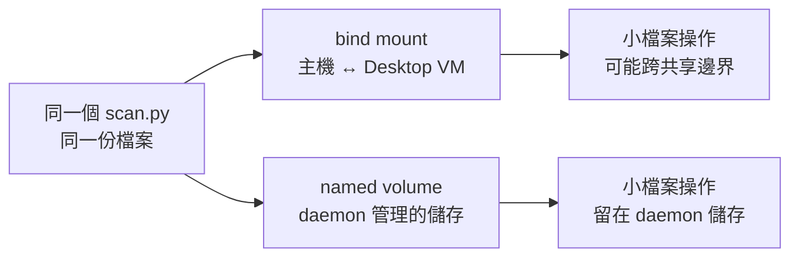

# 11｜不是程式慢？把小檔暫搬進去試一次

**現有掛載功能；新增掃描程式；平台相關。** 已完成本版 Desktop Linux／arm64 核心實驗；適用環境與未驗邊界見[證據附錄](appendix-d-evidence.md)。

## 先把背景補齊：同一個檔案，可能走過不同的 I/O 邊界

在原生 Linux 上，容器與主機通常共享同一個核心與檔案系統路徑；在 Docker Desktop 上，Linux container 通常是在一個 Linux VM 裡執行。主機的 bind mount 需要穿過 Desktop 的檔案共享後端，named volume 則由 VM 裡的 Docker daemon 管理。兩者對程式來說都叫「目錄」，但每次 `open`、`stat`、讀取小檔案所走的路徑可能不同。

這不代表 named volume 永遠比較快，也不代表 CPU 沒滿就一定是 I/O；它只提供一個值得用對照實驗檢查的假設。若資料內容、程式、image 和檔案數量都固定，只把 bind mount 換成 volume，時間差才有機會指向儲存邊界。本章因此先搬一小批可重建的 fixture，不直接搬正式專案，也把同步與版本辨認的成本算進來。



## 這一招其實在教什麼：先定義量測邊界

把同一份資料搬到 named volume，不是在宣稱 volume 永遠比較快；它是在把工作從主機與 Desktop VM 的共享邊界移開一次。這和 C++ 判斷 CPU、磁碟、IPC 或檔案系統瓶頸一樣：先固定輸入與程式，再只改 I/O 路徑，否則秒數沒有可比較性。

## 現場症狀：CPU 沒滿，測試卻跑不完

同一個專案，主機直接跑很快，搬進 Desktop 的容器後卻慢得離譜。CPU 圖沒有貼頂，資料也不大。第一個直覺可能是容器有額外負擔，於是調更多核心或開始重寫程式。

先看看工作是不是反覆打開大量小檔案：依賴掃描、測試探索、模組載入，常有這種形狀。總容量很小，不代表檔案操作次數少。Stephen Turner 在 Docker 的工程文章解釋過 Desktop 主機與 VM 間檔案共享的成本；這提供一個值得試的假設，沒有提供本書可直接套用的加速倍率。[2022 年原文](https://www.docker.com/blog/file-sharing-with-docker-desktop/)

## 小招式：固定資料，把儲存路徑換一次

不用先搬整個專案。準備有限的小檔案集合，在 bind mount 上掃一遍，再複製到專用 named volume，用同一個程式掃一遍。若差異穩定出現，才值得深入檔案共享邊界。

這個招式暫時犧牲「主機一改，容器立刻看見」的便利，換取更清楚的對照。省下的是在錯誤瓶頸上優化的時間；移轉出去的成本則是資料複製、同步與辨認版本。不要只比較最快那一輪，然後把同步成本藏起來。

## 必要原理：同一份資料，不同的讀取路徑

Desktop 的 Linux daemon 在 VM 裡；bind mount 會經過檔案共享機制。named volume 由 Docker 管理，通常讓這批資料留在 daemon 管理的儲存路徑。原生 Linux 與 Desktop 的 I/O 邊界不相同，Desktop 也有不同 VMM 與共享後端，不能把舊文章的結果當成今天每台電腦的預測。[Desktop 設定](https://docs.docker.com/desktop/settings-and-maintenance/settings/)、[Volumes](https://docs.docker.com/engine/storage/volumes/)

| 對照項 | 固定 | 改變 |
|---|---|---|
| 程式 | 同一個 scan.py、同一 image ID | 不改程式邏輯 |
| 輸入 | 路徑名稱、檔案數、內容摘要相同 | bind 或 volume |
| 執行 | 相同 CPU 配額，無其他刻意新增負載 | 輪次順序交錯 |

頁面快取是額外狀態。本章沒有可攜且不干擾主機的「清除所有 OS cache」操作，因此把第一次稱為首輪，不假裝它是嚴格冷快取。後續輪次是重複量測；真正需要冷快取研究時，再另外設計隔離環境。

## 親手實驗：先核對內容，再看秒數

需要主機 Python 3、Bash 與 Linux container daemon。使用自己的測試目錄和 volume；如果同名 volume 已存在，換一個新名稱，不拿舊資料湊這輪結果。

```bash
field_dir=$(mktemp -d "${TMPDIR:-/tmp}/field11.XXXXXX")
cd "$field_dir"
mkdir files
docker pull python:3.13-alpine
field_image=$(docker image inspect python:3.13-alpine --format '{{.Id}}')
field_volume="field11-$(date +%s)-$$"
docker volume create "$field_volume"
python3 - <<'PY'
from pathlib import Path
for n in range(3000):
    Path('files', f'{n:05}.txt').write_text(f'{n}:field-trick\n')
PY
cat > scan.py <<'PY'
import hashlib
from pathlib import Path
import time


def scan(root):
    digest = hashlib.sha256()
    paths = sorted(root.glob('*.txt'))
    for path in paths:
        digest.update(path.name.encode() + b'\0')
        digest.update(path.read_bytes() + b'\0')
    return len(paths), digest.hexdigest()


if __name__ == '__main__':
    started = time.perf_counter()
    count, digest = scan(Path('/data'))
    elapsed = time.perf_counter() - started
    assert count == 3000, f'wrong fixture: {count}'
    print(f'{count}\t{digest}\t{elapsed:.6f}')
PY
```

程式把檔名和內容都納入摘要。對比秒數前，先確定前兩欄一致；否則「比較快」可能只是漏讀了一批檔案。這個 workload 包含目錄列舉、開檔與內容讀取，也包含少量 Python/hash 成本，不能把整段耗時直接命名為純磁碟延遲。

將資料複製進去，另外記複製耗時。因為 volume 這輪才建立，不會混到前輪舊檔：

```bash
time docker run --rm --cpus 1 \
  --mount "type=bind,src=$field_dir/files,dst=/source,readonly" \
  --mount "type=volume,src=$field_volume,dst=/target" \
  "$field_image" sh -c 'cp -R /source/. /target/'
```

下面用一個小 shell 函式減少命令複製錯誤；它只服務本章，沒有建立通用 benchmark 系統。計時從程式開始掃描才起算，**不含容器啟動**。如果真實工作本身只有數毫秒，這種排除是否合理就要另想。

```bash
field_scan() {
  field_kind=$1
  if [ "$field_kind" = bind ]; then
    field_mount="type=bind,src=$field_dir/files,dst=/data,readonly"
  else
    field_mount="type=volume,src=$field_volume,dst=/data,readonly"
  fi
  docker run --rm --cpus 1 \
    --mount "$field_mount" \
    --mount "type=bind,src=$field_dir/scan.py,dst=/scan.py,readonly" \
    "$field_image" python /scan.py
}
field_scan bind > first-bind.tsv
field_scan volume > first-volume.tsv
for field_round in 1 2 3 4; do
  if [ $((field_round % 2)) -eq 1 ]; then
    field_scan bind >> bind.tsv
    field_scan volume >> volume.tsv
  else
    field_scan volume >> volume.tsv
    field_scan bind >> bind.tsv
  fi
done
```

首輪與後續分開保存，AB／BA 交錯減少固定先後順序的影響。它仍不能完全消除共同主機負載和 cache 狀態；保留所有值比挑最快一次更誠實。

```bash
python3 - <<'PY'
from pathlib import Path
from statistics import median

all_rows = []
for name in ['first-bind', 'first-volume', 'bind', 'volume']:
    rows = [line.split() for line in Path(name + '.tsv').read_text().splitlines()]
    assert len(rows) == (1 if name.startswith('first-') else 4)
    assert all(row[0] == '3000' and len(row) == 3 for row in rows)
    all_rows.extend(rows)
    values = [float(row[2]) for row in rows]
    print(name, 'median=', median(values), 'range=', (min(values), max(values)))
assert len({row[1] for row in all_rows}) == 1, '不同資料，不能比較耗時'
PY
```

輸出表由讀者執行後取得。量測值由每次執行取得，不將本版秒數當作你的預測值。請再記錄 Desktop 版本、VMM、共享後端、主機 OS/CPU 及 image ID，否則別人無從解釋為什麼得到不同結果。

## 本版實測記錄

本次只測一台 macOS Desktop 的 Linux VM，3000 個小檔案，容器 CPU 配額為 1；所有未改動輸入的內容摘要一致。四輪 AB／BA 的掃描秒數如下，**不含容器啟動與資料複製**：

| 路徑 | 首輪秒數（非嚴格冷快取） | 後四輪中位數 | 後四輪範圍 |
|---|---:|---:|---:|
| bind | 0.334203 | 0.361868 | 0.340454–0.387376 |
| volume | 0.030156 | 0.030503 | 0.029103–0.033819 |

本輪複製命令含容器啟動共 0.617 秒。更改主機單一檔案後，兩個摘要分歧，確認 volume 未自動同步；專用 volume 已移除。VMM／共享後端的有效設定未確認，故此表只能描述本次環境，不能外推其他 Desktop 設定或原生 Linux。

## 結果解讀：差異要大到值得追，也要穩定

如果重複量測中 volume 持續較快、兩組範圍很少重疊，檔案共享路徑值得優先調查。下一步把真實專案的一小段同類工作搬進去，確認收益沒有消失。這不是請你立即把整個原始碼搬走。

如果兩組範圍大量重疊，這次測量不足以支持遷移。可能 workload 太小、CPU 才是瓶頸，或當前共享後端已經夠快。也可能第一組暖了全機共同狀態；看首輪和順序效應，必要時換時段或擴大同一類工作量，再做一輪有理由的測試。

應該把複製時間算回工作流程：若每次測試前都要同步、每次只跑一次掃描，掃描省下的時間可能還不夠補償複製。若資料固定而每天掃很多遍，同一筆同步成本才有機會攤提。這是採用判斷，不能由單輪最快秒數替你決定。

## 失效反例：資料變舊也會讓你誤以為省事

在主機 `files` 裡只改一個測試檔，再分別掃 bind 與 volume。預期摘要開始不同，因為 volume 不會自動收到那個改動。此時不要比較速度；這個反例正好顯示便宜捷徑把哪一筆帳轉移出去。

```bash
printf 'changed-on-host\n' > files/00000.txt
field_scan bind > changed-bind.tsv
field_scan volume > unchanged-volume.tsv
python3 - <<'PY'
from pathlib import Path
a = Path('changed-bind.tsv').read_text().split()
b = Path('unchanged-volume.tsv').read_text().split()
assert a[0] == b[0] == '3000'
assert a[1] != b[1], 'volume 尚未同步，摘要應不同'
print('stale-volume counterexample confirmed')
PY
```


如果要正式採用，可把「會編輯的原始碼」和「可重建但不常改的依賴」分開處理，並有明確更新規則。資料 volume 不是永久正確的快取；沒有失效方法，半年後可能變成更難查的版本問題。

這章也不能替網路瓶頸、記憶體壓力或模擬異架構執行作診斷。若同一工作換路徑完全無差異，就把注意力轉到下一個有證據的候選，不需要為了證明招式好用而增加檔案直到出現漂亮數字。

## 從土招到正式工程

若差異穩定且足以影響開發流程，正式決策應記錄平台、檔案數量、冷熱快取、同步成本與資料保管方式，再選 volume、bind mount 或其他 storage layout。一次本機量測只能指出值得追的邊界，不能直接變成跨 OS 或 production 的效能承諾。

## 收尾與撤回

```bash
docker volume inspect "$field_volume"
docker volume rm "$field_volume"
printf '原始資料與結果仍在 %s\n' "$field_dir"
unset -f field_scan
```

先看 inspect 確認是本輪名稱，再移除。主機原始資料仍在，正式專案完全沒有搬動。從一次小對照得到「暫時值得追」或「暫時不用追」，兩者都是有用成果。本章已取得一台 Desktop 的觀察；需再補原生 Linux 與有效共享後端設定，才能討論跨平台差異。
