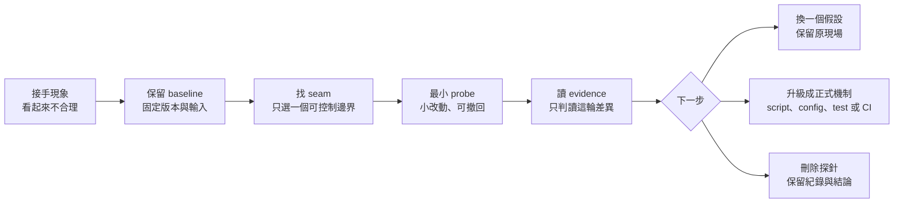

# Docker 現場招式：接手陌生系統時，先建立證據

有時候，你不需要再學一百個 Docker 參數。你需要知道：明明 `COPY` 了卻找不到檔案，老手會先拿掉哪個掛載；容器一啟動就死，怎樣留下足夠時間看一眼；服務偶爾連不上，為什麼故意讓它更慢反而比較容易查。

這本書以能讀 C++、看 build error、使用 debugger 與測試工具的工程師為起點，陪你接手一個陌生的 Docker 化專案。它不把 Docker 當成孤立的指令集，而是把 image、container、Compose、build cache、logs 與 signal 接回你已經熟悉的工程概念：建置產物、程序生命週期、fixture、觀測管線、副作用邊界與停止契約。

每章只追一個問題：做一個改動小、回饋快、能撤回的動作，看到足以決定下一步的差異。這些招式有時候看起來不合規，甚至故意硬編碼、手動切換或暫時繞過入口；它們在本書中不是長期設計，而是用來建立證據的診斷探針。你可以按症狀跳讀，也可以沿著接手專案的開發流讀完整本書。

> **第一版：13 章核心實驗已在 Docker Desktop Linux／arm64 重現。** 本版以 2026-09-22 的固定映像與工具版本執行，各章分列預期判準及實測結果。原生 Linux、WSL 2 與其他架構未做交叉驗證；第 11 章效能只代表這台機器的有限樣本。[驗證環境與邊界](appendix-d-evidence.md)

## 先拿到一個小成果

| 你現在卡住的地方 | 先試哪一章 |
|---|---|
| build 成功，執行時卻缺檔 | [01 拿掉掛載](01-remove-mount.md) |
| 改了 .env，restart 仍讀舊值 | [02 印出實際配置](02-effective-config.md) |
| 容器退出，exec 進不去 | [03 停止後取檔](03-copy-after-exit.md) |
| 還沒看清楚就退出 | [04 暫換入口](04-bypass-entrypoint.md) |
| 極簡映像沒工具可測網路 | [05 借網路工具](05-borrow-network-tools.md) |
| 程式活著，logs 沒字 | [06 先查輸出緩衝](06-unbuffer-logs.md) |
| 每次都要重點介面才能重現 | [07 固定輸入重播](07-replay-stdin.md) |
| Dockerfile 搬家後 COPY 壞了 | [08 改建置 context](08-build-context.md) |
| 前面建得出來，最後映像卻沒檔案 | [09 停在中間 stage](09-stop-at-stage.md) |
| 改輸入，build 卻一直用舊結果 | [10 只讓一段重跑](10-invalidate-one-stage.md) |
| Desktop 掃小檔特別慢 | [11 暫換存放位置](11-move-small-files.md) |
| 第一次啟動失敗，第二次就好 | [12 故意延後 ready](12-delay-readiness.md) |
| 每次 stop 都等滿 | [13 查訊號交給誰](13-forward-stop-signal.md) |

第一次閱讀若要學「接手陌生系統」的開發流，建議分四段讀：先用 01、03、06 建立檔案、生命週期與觀測邊界；再用 07、02、04 固定輸入、配置與入口；接著用 08、09、10 理解 build graph、產物交付與快取失效；最後讀 05、12、13、11，把網路、ready、shutdown 與效能量測接回 runtime 契約。若你正在處理一個具體事故，仍以症狀索引為入口。

## 這本書真正要教的開發流

Docker 只是材料；真正的主題是工程師接手未知系統時，如何從「看起來很怪」走到「我知道下一步該驗什麼」。資深工程師常用的不是一次猜中根因，而是先保留基準，找到可以控制的一個 seam，做一次最小改動，再依證據決定要繼續追、把招式升級，或把它刪掉。



你可以把它翻譯成 C++ 工程師熟悉的語言：

| C++ 開發時熟悉的東西 | Docker 現場的對應 | 本書要你辨認的邊界 |
|---|---|---|
| 編譯輸出、object、build directory | image layer、build stage、cache | 產物是在哪一站產生、在哪一站遺失 |
| debugger 看到的 process 與執行位置 | container、PID 1、entrypoint | 程序、容器物件與啟動 wrapper 是否同一個生命週期 |
| `argv`、環境變數、設定檔 | Compose 渲染、container environment、mount | 設定從哪裡來、何時被固定、誰最後看到它 |
| test fixture、重播輸入 | stdin、一次性 container、固定資料 | 這次重現保留了哪些輸入，漏掉哪些時序 |
| logger、stdout、trace | container stdout、logging driver、`docker logs` | 輸出是否真的走到你正在看的觀測點 |
| child process、signal、cleanup | PID 1、`docker stop`、`exec` | 誰擁有停止責任，清理是否真的完成 |

這張表不是要把 Docker 假裝成 C++。它的用途是讓你在遇到新名詞時，先找到相同的工程問題，再學這個 runtime 的具體語法。

## 土招的工作契約

`test_mode` 寫進程式後手動開關，可能是最快確認某條分支的方法；但它只有在範圍、證據與撤回方式都清楚時，才是一個好的臨時探針。Python 的 `uv` script 也不只是方便執行的小工具：把依賴與命令放在一起，能讓一次性的檢查變得可重跑、可交接；它仍然不自動等於正式產品元件。

本書中的土招至少要有這五個條件：

| 條件 | 要回答的問題 |
|---|---|
| 範圍 | 這個改動只會碰本機、測試容器或診斷副本嗎？ |
| 基準 | 改之前是否保留了版本、輸入、設定與原始輸出？ |
| 單一變數 | 這輪是否只改一個條件，成功後才知道是哪個差異有效？ |
| 證據 | 你預期觀察什麼，結果又只支持哪個窄結論？ |
| 期限 | 何時撤回，或要升級成 script、config、test seam、CI gate？ |

如果一個手動開關必須靠某個人記得「上線前關掉」，它就已經是 release 流程的一部分；如果一個診斷 script 反覆被使用，它就值得進入版本庫、固定依賴並加入最小驗收。後面的每章都會把 Docker 招式接回這條判準。

## 先把 Docker 的時間線放在腦中

如果你還不熟 Docker，先不要把 `image`、`container` 和 Compose 檔當成同一件事。很多「明明改了卻沒變」的問題，其實是改動發生在一個時間點，觀察卻落在另一個時間點：

| 時間點 | 發生什麼 | 這時主要看什麼 |
|---|---|---|
| `build` | Dockerfile 加上 build context 產生 image | build log、layer、最後留下的檔案 |
| `run`／`up` | 用 image 建立 container，套上環境、掛載、入口與網路 | `docker inspect` 的實際設定 |
| 執行／停止 | container 裡的主程序工作、退出；停止不必然等於刪除 | `logs`、`diff`、`cp`、exit code |

Compose 又多一層：Compose 檔先被 CLI 渲染成設定模型，再由 Engine 建立或重建 container。你改了 Compose 檔，不代表已存在的 container 會被原地改寫；`restart`、`up` 和 `--force-recreate` 的效果也不同。後面每章都會在開頭先指出這次正在看的時間點。

## 每一招都欠哪一筆帳

暫時拿掉掛載，會失去即時同步；繞過入口，要自己補回初始化；保存固定輸入，可能漏掉真實併發；借別的容器測網路，它的憑證與環境又不一定一樣。

這些代價不表示招式不能用，而是決定結果該怎麼讀。每章都用同一節奏：先把背景補齊、指出它對應的工程概念、現場症狀、小動作、必要原理、親手實驗、結果解讀、從土招到正式工程、失效反例、收尾。你會看到硬編碼、假輸入與暫時等待，但每次都要問「這次只證明什麼」以及「這個探針何時該消失」。

書中的少量 Python、shell 和探針是教學程式，並非 Docker 內建功能。例子刻意不用通用實驗框架，讓讀者能看清楚每個動作。命令成功也不自動代表原問題解決；真正的成果可能只是排除一個候選原因。

需要理解關係或時序的章節會先放一張小型 Mermaid 圖。圖用來回答「誰先發生、哪一層看得到什麼」；細節、例外和實際命令仍以圖下的文字為準。

## 動手前的共同約定

主線使用 **Linux containers、Bash 及本機 daemon**。macOS 可用 Desktop；Windows 的 shell 命令請在 WSL 執行，不直接貼進 PowerShell。原生 Windows containers、Swarm、Kubernetes 與 GPU 不在這版範圍。跨平台路徑、共享後端及程序行為仍需在你的環境核對。

第 06、11 章另需主機 Python 3。含 `set -euo pipefail` 的完整區塊請存成獨立 Bash 腳本或在新 shell 操作，避免改動正在使用的工作階段。

每章建立新的暫存工作目錄，使用 `field01` 到 `field13` 的專用名稱，不依賴前章檔案。請按區塊順序執行，確認前一步成功再往下；如果已經有相同名稱，先辨認是不是自己的上一輪練習。不要拿正式服務、正式密鑰或真正的資料卷代替教學資料。

幾個詞在全書保持同一意思：

| 詞 | 這本書的用法 |
|---|---|
| 映像 image | 用來建立容器的檔案與設定基礎；以 ID/digest 固定比較對象 |
| 容器 container | 一次建立出的執行環境；停止不等於刪除 |
| 重建映像 build | 重新執行建置流程；與重新建立 container 不同 |
| 重建容器 recreate | 用配置建立新容器；原容器可寫層不會自動搬過去 |
| fixture | 為對照保留的小份固定輸入、檔案或測試程式 |
| 預期 | 操作前依機制寫下的判準；實際結果另外記錄，兩者不能混寫 |

先收集版本；`docker version` 必須同時能取得 Server，才表示可以開始容器實驗：

```bash
docker version
docker compose version
docker buildx version
docker context show
docker info --format '{{.LoggingDriver}}'
```

本書使用的 `alpine:3.21`、`python:3.13-alpine` 是可讀的下載起點，tag 可以移動，不是最新版本推薦；本次實測的確切 digest 另列於證據附錄。各章 pull 後會記錄 image ID 或 repository digest：同機 `run` 可固定 ID；建置 FROM 固定可解析的 repository digest。A／B 中途不再 pull，避免把映像更新混成操作效果。不同 CPU 架構還要另記 platform，不能只對 tag 名稱。

需要 `docker logs` 的章節假設測試容器使用可讀取的日誌設定；若 daemon 預設 driver 不提供本機讀取，先按第 06 章核對輸出去向，不能把 logs 錯誤當成程式沒有輸出。

容器內測試程式有些故意失敗。請看失敗訊息是否符合本輪假設，不只看「非零就算成功」。如果前面的 build 失敗，後面卻拿舊同名 tag 跑出漂亮結果，那是很常見的假對照。

## 如何留下下次能用的經驗

把本輪固定條件、唯一改動、原始輸出與撤回記入[實驗紀錄卡](appendix-b-record.md)。先回答「這個差異夠不夠指引下一步」，再考慮是否值得收進正式流程。反覆有用的招式可以變成一條檢查；只用一次的 workaround 就讓它隨案例結束。

[症狀索引](appendix-a-symptoms.md)幫你找到下一站，[收尾表](appendix-c-rollback.md)列出各章留下的資源，[證據附錄](appendix-d-evidence.md)則保留案例的日期與適用邊界。全書不引用廠商效能百分比作承諾，也不靠付費工具或產品推薦完成實驗。
