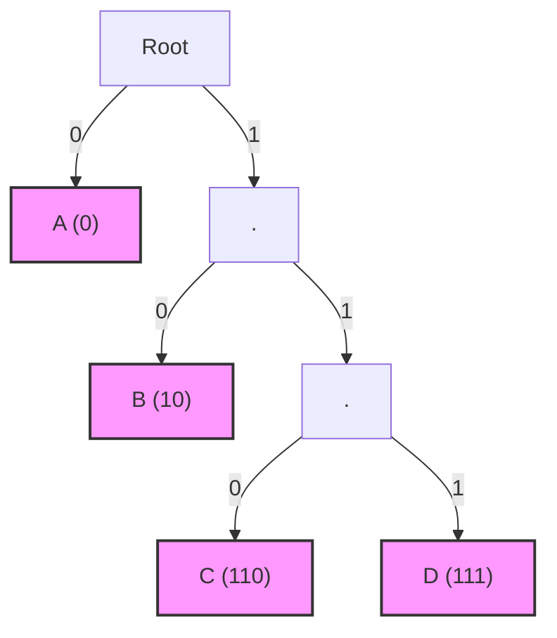

# 第 2 章：無前綴碼 (Prefix-Free Codes)

本章節我們將探討如何設計用於無失真資料壓縮的代碼，特別是「無前綴碼」(Prefix-Free Codes)。我們將從解碼的角度出發，介紹前綴樹 (Prefix-Free Tree) 的資料結構，並學習如何設計最佳化的無前綴碼。

## 2.1 唯一可解碼性 (Uniquely Decodable Codes)

在通訊與壓縮系統中，最基本的要求是「無失真」(Lossless)。如果我們有一組代碼，我們希望接收端在收到一長串連續的編碼比特流後，能夠明確無誤地還原出原始的符號序列。

如果沒有任何兩種不同的符號序列會被編碼為相同的位元流，我們就稱這個代碼是**唯一可解碼的** (Uniquely Decodable)。舉例來說，傳統的摩斯密碼 (Morse Code) 如果不加上停頓 (空白)，就不是唯一可解碼的，因為點和線的組合可能會產生歧義。

## 2.2 無前綴碼 (Prefix-Free Codes)

在唯一可解碼的代碼中，有一類特別容易處理且效率極高的代碼，稱為**無前綴碼** (Prefix-Free Codes)，有時也被稱為即時碼 (Instantaneous Codes)。

**定義**：如果一個代碼中，沒有任何一個編碼是另一個編碼的前綴 (Prefix)，則該代碼稱為無前綴碼。

舉例來說，假設我們有以下的代碼表：
| 符號 | 編碼 |
|---|---|
| A | 0 |
| B | 10 |
| C | 110 |
| D | 111 |

這個代碼是無前綴碼，因為沒有任何一個編碼是其他編碼的開頭。例如，`0` 不是 `10`, `110`, `111` 的開頭；`10` 也不是 `110` 或 `111` 的開頭。

### 即時解碼與前綴樹 (Prefix-Free Tree)

無前綴碼的一個重要特性是可以「即時解碼」：解碼器只要逐位讀取位元，一旦發現符合的編碼，就可以立刻解碼，不需向後看 (Look-ahead)。

為了解碼更有效率，我們可以用**前綴樹 (Prefix-Free Tree)** 來表示無前綴碼。前綴樹是一棵二元樹，根節點出發，左分支代表 `0`，右分支代表 `1`。

**重要性質**：在無前綴碼對應的前綴樹中，所有的編碼必定落在**葉節點 (Leaf Nodes)** 上。

以下是前面代碼的前綴樹範例：

解碼演算法非常直覺：
1. 從根節點開始。
2. 讀取下一個位元，如果是 `0` 往左走，是 `1` 往右走。
3. 如果到達葉節點，則輸出對應的符號，並回到根節點重新開始。
4. 重複上述步驟直到讀完所有位元。

## 2.3 如何設計良好的無前綴碼？

如果我們知道各個符號出現的機率，我們要如何分配編碼長度，才能讓平均編碼長度最短呢？

### 基本法則

1. **高機率符號應有較短的編碼**：如果 $P(s_1) \geq P(s_2)$，則我們應該分配 $l(s_1) \leq l(s_2)$。否則我們只要交換這兩個符號的編碼，就能得到更短的平均長度。
2. **夏農經驗法則 (Shannon's Thumb Rule)**：符號的最佳編碼長度大約是機率倒數的以 2 為底的對數：
   $$ l_{\text{optimal}}(s) \approx \log_2 \frac{1}{P(s)} $$

我們可以從兩個特殊情況驗證這個法則：
- **均勻分佈 (Uniform Distribution)**：如果有 $k$ 個機率相同的符號，每符號機率為 $1/k$。最佳長度 $\log_2(k)$，如果 $k$ 是 2 的次方，我們可以直接使用固定長度編碼。
- **二進制分佈 (Dyadic Distribution)**：如果所有符號的機率都是 $2^{-l_i}$ 的形式 (例如 1/2, 1/4, 1/8...)，那麼對應的編碼長度剛好是整數 $l_i$。

## 2.4 夏農編碼法 (Shannon Code Construction)

對於一般的機率分佈，$\log_2(1/P(s))$ 通常不是整數。一個合理且直觀的目標長度是將其無條件進位：
$$ l(s) = \lceil \log_2 \frac{1}{P(s)} \rceil $$

夏農提出了一個簡單的建構方式來產生具有上述長度的無前綴碼：
1. **計算長度**：對於每個符號 $s$，計算 $l(s) = \lceil \log_2(1/P(s)) \rceil$。
2. **排序**：將符號依照長度由小到大排序。
3. **貪婪指派 (Greedy Assignment)**：從長度最短的符號開始，在前綴樹中深度為 $l(s)$ 的位置尋找尚未被佔用、且不違反無前綴條件的葉節點進行指派。

### 夏農編碼法一定會成功嗎？

可以透過歸納法證明，由於機率總和為 1，即 $\sum P(s) = 1$，且 $2^{-l(s)} \leq P(s)$，我們有：
$$ \sum 2^{-l(s)} \leq 1 $$
這個條件 (Kraft 不等式的一部分) 保證了在指派的過程中，只要按照長度遞增的順序分配，樹中永遠會有足夠的空位可以指派，不會發生因為前面的指派把整棵樹佔滿而找不到節點的狀況。

## 2.5 總結

1. **無前綴碼**是最實用的一類符號代碼，保證唯一可解碼，且具有瞬間解碼的特性。
2. 透過**前綴樹**可以高效地解碼。
3. 最理想的編碼長度符合 $l(s) \approx \log_2(1/P(s))$。
4. **夏農編碼**藉由無條件進位給出了簡單的構造方式，保證這組長度分配總是能找到對應的無前綴碼。

---
## 相關作業與材料

本章節的實作與練習對應於 Stanford EE274 官方提供的作業與專案：
- **對應內容**：HW1: Prefix-Free Codes, Kraft Inequality, Entropy

> **注意**：為了遵守學術誠信與課程規範，本書不提供作業的解答代碼。強烈建議讀者親自前往 [EE274 課程筆記網站 (Homeworks 區塊)](https://stanforddatacompressionclass.github.io/notes/) 下載 starter code 並實作，以深化對演算法的理解。
