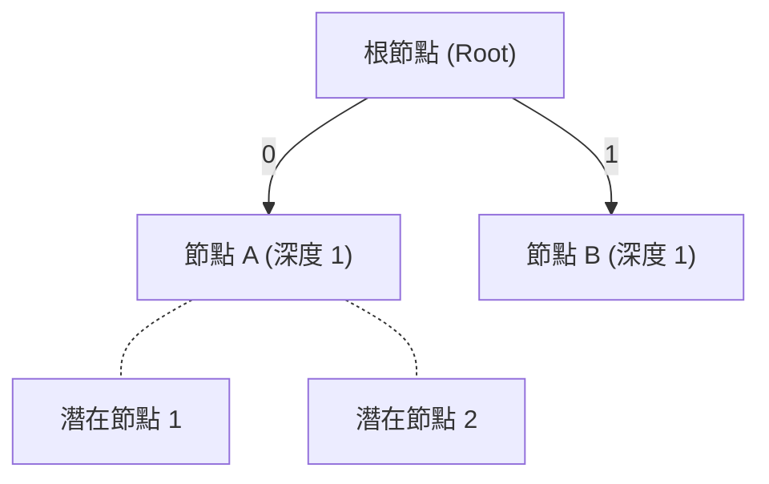

# 第 3 講：Kraft 不等式、熵與 SCL 簡介

本講重點在於理解無損壓縮的理論基礎。我們將探討什麼是最好的無損壓縮，以及我們能達到的極限在哪裡。

## 1. Stanford Compression Library (SCL) 簡介
史丹佛壓縮函式庫（Stanford Compression Library, SCL）是一個為學習與研究而設計的 Python 函式庫。許多真實世界的壓縮工具是用 C 語言等低階語言編寫，難以閱讀；SCL 的目標是提供清晰、易懂的實作。
SCL 提供了處理位元陣列（Bit Arrays）的工具，以及前綴樹解碼（Prefix-free decoding）的基本架構，讓你能專注於演算法的設計。

## 2. Kraft 不等式 (Kraft Inequality)

在上一講中我們學習了前綴碼（Prefix-free codes）以及如何透過二元樹來表示它們。**Kraft 不等式** 為前綴碼的碼長提供了一個數學上的充要條件。

### 定理：Kraft 不等式
假設一個二元樹的葉節點（對應到碼字）深度分別為 $l_1, l_2, \dots, l_k$，則這些深度滿足以下不等式：
$$ \sum_{i=1}^k 2^{-l_i} \leq 1 $$

### 證明直覺
令 $l_{max} = \max(l_i)$。我們可以將 Kraft 不等式兩邊同乘 $2^{l_{max}}$：
$$ \sum_{i=1}^k 2^{l_{max} - l_i} \leq 2^{l_{max}} $$
這個式子有著非常直觀的意義：
- $2^{l_{max}}$ 是深度為 $l_{max}$ 時，二元樹最多能擁有的節點總數。
- 每一個深度為 $l_i$ 的葉節點，若繼續往下延伸到 $l_{max}$，會涵蓋 $2^{l_{max} - l_i}$ 個潛在的葉節點。
- 因為是前綴碼，這些葉節點彼此的子樹不會重疊。因此，各個葉節點涵蓋的潛在子節點總數，不可能超過最大可能節點數 $2^{l_{max}}$。

**Kraft 不等式的逆定理**也成立：如果有一組整數 $l_1, l_2, \dots, l_k$ 滿足上述不等式，我們必定可以建構出一個對應此碼長的前綴碼。

## 3. 資訊理論基礎 (Information Theory Basics)

為了推導出最佳的碼長，我們需要引入克勞德·香農（Claude Shannon）在 1948 年提出的資訊理論中的重要概念。

### 3.1 熵 (Entropy)
對於一個離散隨機變數 $X$，其機率分佈為 $P = \{p_1, p_2, \dots, p_k\}$，**熵 $H(X)$** 定義為：
$$ H(X) = \sum_{i=1}^k p_i \log_2 \frac{1}{p_i} $$
熵的單位為「位元 (bits)」。

**熵的重要性質：**
1. **非負性**：$H(X) \geq 0$。
2. **最大值**：當 $X$ 為均勻分佈時，熵達到最大值 $\log_2 k$。如果變數是完全確定的（deterministic），熵為 0。
3. **獨立變數的聯合熵**：如果 $X_1$ 與 $X_2$ 是獨立隨機變數，則 $H(X_1, X_2) = H(X_1) + H(X_2)$。
4. **下界性質**：對於任意機率分佈 $q(X)$，必定有 $H(X) \leq \mathbb{E}_P \left[ \log_2 \frac{1}{q(X)} \right]$。

熵可以看作是訊息中包含的「不確定性」或「資訊量」，這也正是我們能將資料壓縮的極限。

### 3.2 KL 散度 (KL-Divergence)
KL 散度衡量兩個機率分佈 $p$ 與 $q$ 之間的距離：
$$ D_{KL}(p||q) = \sum_{i=1}^k p_i \log_2 \frac{p_i}{q_i} $$
其最重要的性質為 $D_{KL}(p||q) \geq 0$，且等號成立若且唯若 $p = q$。

## 4. 最佳無損壓縮 (Optimal Lossless Compression)

### 熵作為壓縮的下界
有了 Kraft 不等式，尋找最佳前綴碼的問題可以轉換為一個最佳化問題：
- **目標**：最小化預期碼長 $\sum_{i=1}^k p_i l_i$
- **限制條件**：$\sum_{i=1}^k 2^{-l_i} \leq 1$

我們可以構造一個虛擬的分佈 $q_i = 2^{-l_i}$（假設 Kraft 不等式恰好等於 1）。那麼預期碼長為：
$$ \sum_{i=1}^k p_i l_i = \sum_{i=1}^k p_i \log_2 \frac{1}{q_i} $$
根據熵的性質，我們知道：
$$ \sum_{i=1}^k p_i \log_2 \frac{1}{q_i} \geq \sum_{i=1}^k p_i \log_2 \frac{1}{p_i} = H(X) $$
這證明了 **任何前綴碼的預期碼長必定大於或等於熵 $H(X)$**。這不僅適用於前綴碼，也適用於所有可唯一解碼的符號碼。

### 拇指法則 (Thumb Rule) 與 Shannon 編碼
當等號成立時，必須有 $q_i = p_i$，也就是 $2^{-l_i} = p_i$，即 $l_i = \log_2 \frac{1}{p_i}$。這完美解釋了我們在上一講中使用的拇指法則！

**Shannon 編碼的表現**：
由於碼長必須為整數，Shannon 編碼將碼長設定為 $l_i = \lceil \log_2 \frac{1}{p_i} \rceil$。其預期碼長滿足：
$$ H(X) \leq \mathbb{E}[L] < H(X) + 1 $$
也就是說，Shannon 編碼可以保證與最佳極限（熵）的差距在 1 個位元之內。

### 區塊編碼 (Block Coding) 逼近極限
如果 1 個位元的差距還是太大，我們可以將 $n$ 個符號組成一個「區塊」來進行編碼。根據獨立變數的聯合熵性質，區塊的熵為 $n \cdot H(X)$。對區塊應用 Shannon 編碼，預期碼長界於 $n \cdot H(X)$ 與 $n \cdot H(X) + 1$ 之間。
平均到每個符號上，我們得到的碼長上限為：
$$ H(X) + \frac{1}{n} $$
當 $n$ 越大時，我們就能**無限逼近熵**。然而，區塊編碼會導致字母表大小呈指數增長，計算複雜度變高。在後續的講次中，我們將介紹如 Huffman 編碼、算術編碼等更有效率的演算法來解決這些問題。

---
## 相關作業與材料

本章節的實作與練習對應於 Stanford EE274 官方提供的作業與專案：
- **對應內容**：HW1: Kraft Inequality, Entropy

> **注意**：為了遵守學術誠信與課程規範，本書不提供作業的解答代碼。強烈建議讀者親自前往 [EE274 課程筆記網站 (Homeworks 區塊)](https://stanforddatacompressionclass.github.io/notes/) 下載 starter code 並實作，以深化對演算法的理解。
