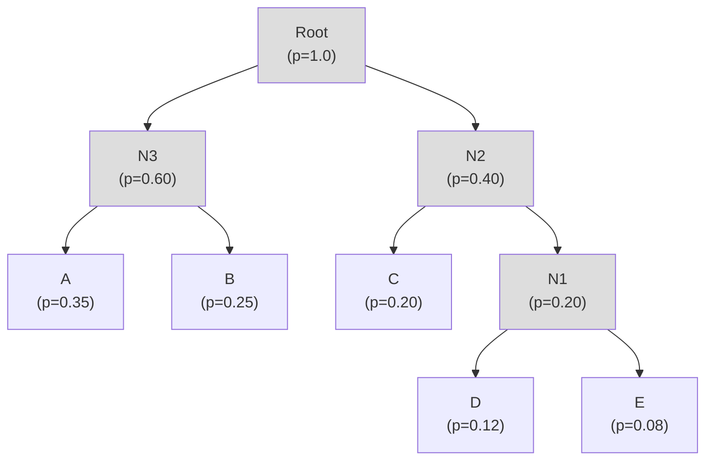

# 第四章：霍夫曼編碼 (Huffman Codes)

## 4.1 簡介與動機 (Introduction and Motivation)

在前一章中，我們探討了夏農編碼 (Shannon Codes) 並了解到最佳前綴碼的預期長度下界為資料的熵 (Entropy)。雖然夏農編碼的長度設定為 $l_i = \lceil \log_2(1/p_i) \rceil$，但它並不總是最佳的選擇。

舉個極端的例子，假設有一個高度偏斜的伯努利分布 (Bernoulli Distribution)，其中 $P(0) = 0.999$，$P(1) = 0.001$。其資訊熵大約只有 0.011 bits。然而，如果使用夏農編碼：
- 對於 0：$l_0 = \lceil \log_2(1/0.999) \rceil = 1$ bit
- 對於 1：$l_1 = \lceil \log_2(1/0.001) \rceil = 10$ bits

這樣得到的預期碼長為 $0.999 \times 1 + 0.001 \times 10 = 1.009$ bits/symbol。比起極低的熵 (0.011)，我們每個符號還是花費了大約 1 個 bit，這顯然存在極大的浪費。雖然區塊編碼 (Block Coding) 可以藉由將多個符號綁在一起編碼來逼近熵，但當區塊變大時，系統的複雜度會呈指數上升，變得不切實際。

因此，我們需要一種演算法，能為單一符號（或固定區塊）找到真正的**最佳前綴碼 (Optimal Prefix-Free Code)**。這就是本章的主題——霍夫曼編碼 (Huffman Codes)。

---

## 4.2 最佳前綴碼的必要條件 (Necessary Conditions for Optimal Prefix Codes)

在進入演算法之前，讓我們先探討任何最佳前綴碼（給定機率分布 $P=\{p_1, p_2, \dots, p_k\}$）必須具備的兩個條件：

1. **碼長與機率成反比 (Inverse Probability-Length Ordering)**：  
   機率越高的符號，其碼長應該越短或相等。也就是說，如果 $p_i > p_j$，則必然滿足 $l_i \le l_j$。如果違反這個條件，我們只要將這兩個符號的碼字交換，就能得到一個預期長度更小的編碼方式。

2. **最長碼字的孿生性質 (Sibling Property)**：  
   在最佳前綴碼中，**最長的兩個碼字長度必須完全相同**，且它們只有最後一個位元不同（互為兄弟節點）。如果最長碼字只有一個，或者最長的兩個碼字長度不同，我們大可直接將最長碼字的最後一個位元刪去（縮短碼長）。這麼做並不會違反前綴碼的條件，卻能減少預期碼長，這就與「最佳」的假設矛盾。

---

## 4.3 霍夫曼編碼建構演算法 (Huffman Code Construction Algorithm)

霍夫曼編碼是由 David Huffman 在 1951 年於 MIT 修讀 Robert Fano 的資訊理論課程時，作為期末報告發明的。這是一個非常經典且優雅的**貪婪演算法 (Greedy Algorithm)**。

### 演算法步驟

1. **初始化**：將所有符號及其對應機率轉換為獨立的樹節點，並放入一個列表中。
2. **尋找與合併**：當列表中還有大於一個節點時，重複以下步驟：
   - 找出列表中**機率最小的兩個節點**。
   - 建立一個新的內部節點，作為這兩個節點的父節點。
   - 新節點的機率設定為這兩個子節點機率的總和。
   - 將這兩個最小的節點從列表中移除，並將新節點加入列表中。
3. **完成**：當列表中只剩下一個節點時，這個節點即為霍夫曼樹的根節點 (Root)，建構完成。

> [!NOTE]
> 在步驟 2 中，如果有多個節點具有相同的最小機率，我們可以**任意打破平局 (Break ties arbitrarily)**。這意味著針對同一組機率分布，可能會產生結構不同的霍夫曼樹，但它們計算出來的預期碼長絕對是一樣的，都是最佳解。

### 範例：建構霍夫曼樹

假設我們有五個符號與機率：A (0.35), B (0.25), C (0.20), D (0.12), E (0.08)。
建構過程如下圖所示：

*(根據 Cover 和 Thomas 的《資訊理論基礎》第 5 章，霍夫曼編碼的最佳性可透過數學歸納法嚴格證明：合併兩個最小機率節點後的子問題，其最佳解與原問題的最佳解等價。)*

---

## 4.4 霍夫曼編碼的實務應用與快速解碼 (Practical Huffman Coding and Fast Decoding)

霍夫曼編碼至今仍廣泛存在於我們日常的運算中，例如 HTTP/2 標頭壓縮、JPEG 影像編碼，以及 DEFLATE (GZIP, PNG) 等系統。

### 1. 優先佇列 (Priority Queue) 加速建構
在實作霍夫曼樹時，反覆尋找最小值最有效率的方法是使用 **Min-Heap (最小積點樹 / 優先佇列)**。如此一來，每次取出兩個最小值與插入新節點的時間複雜度都能維持在 $O(\log n)$。

### 2. 樹狀解碼的效能瓶頸
在理論上，解碼前綴碼非常直觀：從樹的根節點出發，讀到 0 往左走，讀到 1 往右走，走到葉節點就輸出符號。
但**在實務上，沒有人會這樣寫解碼器**。
因為這樣在程式碼中會產生大量的 `if-else` 分支判斷。現代 CPU 高度依賴指令管線化 (Pipelining) 與分支預測 (Branch Prediction)。這種走樹狀圖的隨機分支會導致嚴重的分支預測失敗 (Branch Misprediction)，迫使 CPU 頻繁清空管線，嚴重拖垮解碼速度。

### 3. 表格驅動快速解碼 (Table-based Fast Decoding)
為了解決上述問題，現代解碼器通常採用**狀態查表法**：
- 取出一段固定長度的位元流（長度等於霍夫曼樹的**最大深度**）。
- 將這段位元直接作為陣列索引，去查一個預先建好的**解碼狀態表 (Decode State Table)**，表中會直接告訴你這個前綴對應什麼符號。
- 解碼出符號後，去查**編碼長度表 (Encode Length Table)** 得知該符號實際佔用了幾個位元，然後將位元流的指標往前推進相應的長度。

這種方法消除了大量的迴圈與分支，速度極快。
但代價是記憶體：表格的大小為 $2^{\text{max\_depth}}$。如果樹的最大深度過深（例如遇到費波那契數列構造出的極端斜樹），表格會大到無法放進 CPU 快取 (Cache) 中。
因此，實務上（如 GZIP）通常會使用 **限制深度的霍夫曼編碼 (Length-constrained Huffman Codes)**，強行將最大深度限制在 16 或 24 bits 內。

---

## 4.5 壓縮與加密的衝突 (Compression vs. Encryption)

最後，一個有趣的實務觀察：**你無法壓縮已經加密的資料**。

現代強加密演算法（例如 AES）會將資料的結構徹底打亂，使密文看起來完全像是隨機的均勻分布 (IID Uniform Distribution)。
如果我們對這類資料進行霍夫曼編碼，會發現每一種位元組 (0~255) 的出現機率都幾乎一樣。演算法建構出的霍夫曼樹，所有葉節點都會落在完全相同的深度（固定長度編碼，每個符號 8 bits）。這意味著資料大小完全沒有縮減。
> [!WARNING]
> 實務守則：如果同時需要壓縮和加密資料，**必須先壓縮，後加密**！

---

## 4.6 總結

- 霍夫曼編碼是建構最佳前綴碼的貪婪演算法。
- 建構原則是反覆將機率最小的兩個節點合併，確保高機率符號有較短的碼長，並滿足最長碼字的孿生性質。
- 實務解碼上為了避免 CPU 分支預測懲罰，會採用基於狀態查表的快速解碼法，並搭配限制深度的霍夫曼樹來控制記憶體開銷。

---
## 相關作業與材料

本章節的實作與練習對應於 Stanford EE274 官方提供的作業與專案：
- **對應內容**：HW1: Huffman Coding (Theory & Implementation)

> **注意**：為了遵守學術誠信與課程規範，本書不提供作業的解答代碼。強烈建議讀者親自前往 [EE274 課程筆記網站 (Homeworks 區塊)](https://stanforddatacompressionclass.github.io/notes/) 下載 starter code 並實作，以深化對演算法的理解。
