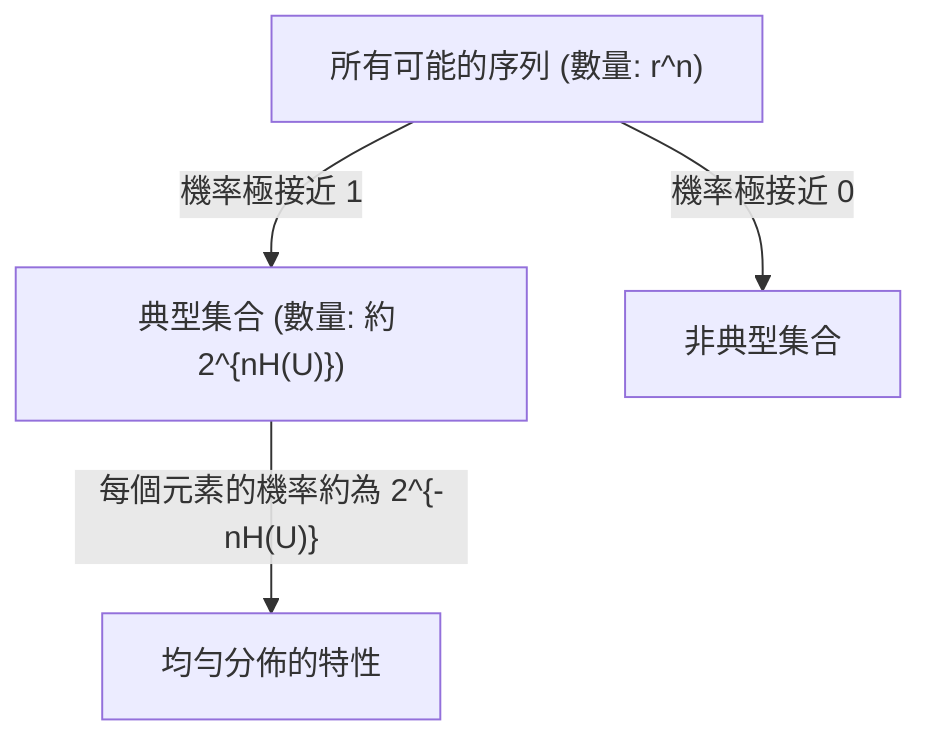

# 第五章：漸進等同分割性 (Asymptotic Equipartition Property)

在本章中，我們將透過一個截然不同的角度來探討資料壓縮的基本限制與理論基礎：**漸進等同分割性 (Asymptotic Equipartition Property, AEP)**。AEP 的核心思想在於，對於一個隨機資料來源，當產生的序列長度夠長時，我們只需關注那些「典型 (typical)」的序列。這個概念讓我們能夠以非建構性 (non-constructive) 的方式，證明無失真壓縮的極限。

## 1. 基本符號與定義

在探討 AEP 之前，我們先定義一些基本符號：
- **字母表 (Alphabet)**：$U = \{1, 2, \dots, r\}$ 表示隨機變數可能取值的集合。
- **獨立同分布 (IID) 來源**：假設序列中的每個符號都是獨立且服從相同分布的，記為 $U_1, U_2, \dots \stackrel{iid}{\sim} U$。
- **來源序列 (Source Sequence)**：長度為 $n$ 的序列記為 $U^n = (U_1, \dots, U_n)$。
- **機率 (Probability)**：在 IID 假設下，序列的機率為 $P(U^n) = \prod_{i=1}^n P(U_i)$。

## 2. 漸進等同分割性與弱大數法則

AEP 是機率論中**弱大數法則 (Weak Law of Large Numbers, LLN)** 的直接應用。弱大數法則指出，一組獨立同分布隨機變數的樣本平均值，當樣本數趨近無限大時，會收斂至其期望值。

對於隨機變數 $U$，我們考慮新的隨機變數 $-\log P(U)$。根據弱大數法則：
$$ \lim_{n \to \infty} P\left( \left| -\frac{1}{n} \log P(U^n) - E[-\log P(U)] \right| < \epsilon \right) = 1 $$

由於 $E[-\log P(U)]$ 正是亂度 (Entropy) $H(U)$，這表示當 $n$ 夠大時，序列的經驗亂度會非常接近真實的亂度 $H(U)$。

## 3. 典型集合 (The $\epsilon$-Typical Set)

基於上述概念，我們定義 **$\epsilon$-典型集合 ($\epsilon$-typical set)** $A_\epsilon^{(n)}$，它包含了所有滿足以下條件的長度 $n$ 序列：
$$ \left| -\frac{1}{n} \log P(U^n) - H(U) \right| \le \epsilon $$

這等價於說，典型集合中的每個序列，其發生機率大約是 $2^{-nH(U)}$：
$$ 2^{-n(H(U)+\epsilon)} \le P(U^n) \le 2^{-n(H(U)-\epsilon)} $$

### 典型集合的三大性質

1. **機率趨近於 1**：當 $n \to \infty$ 時，$P(U^n \in A_\epsilon^{(n)}) \to 1$。也就是說，幾乎所有出現的序列都會落在典型集合中。
2. **集合大小**：典型集合中的元素數量大約是 $2^{nH(U)}$。嚴格來說，$\left| A_\epsilon^{(n)} \right| \le 2^{n(H(U)+\epsilon)}$。
3. **最小的高機率集合**：任何大小顯著小於典型集合（例如大小不大於 $2^{n(H(U)-\delta)}$）的集合，其發生的總機率當 $n \to \infty$ 時趨近於 0。這意味著我們無法使用少於 $H(U)$ 位元/符號的長度來對序列進行可靠的壓縮。

## 4. 基於典型集合的壓縮演算法

既然典型集合包含了幾乎所有的機率質量，且其大小只有大約 $2^{nH(U)}$，我們可以設計一個基於 AEP 的無失真壓縮機制：

1. **對於典型序列**：由於共有約 $2^{nH(U)}$ 個典型序列，我們可以給每一個序列分配一個索引，這需要 $\approx nH(U)$ 個位元。我們在開頭加上一個位元 `0`，表示這是一個典型序列。
2. **對於非典型序列**：我們直接用原始的 $n \log_2 r$ 個位元來表示，並在開頭加上一個位元 `1`。

因為非典型序列出現的機率趨近於 0，這個機制的平均編碼長度 $E[L]$ 會是：
$$ E[L] \le (1-\epsilon)(nH(U) + n\epsilon + 1) + \epsilon(n \log_2 r + 1) $$
將其除以 $n$ 可得每個符號的平均編碼長度：
$$ \frac{1}{n} E[L] \approx H(U) + O(\epsilon) $$
這證明了我們可以將資料壓縮至極限值 $H(U)$ 位元/符號！

## 5. 錯配壓縮 (Mismatched Compression)

假設資料的真實分佈為 $P$，但我們設計編碼器時錯誤地認為分佈是 $Q$ (例如設計 Shannon Code 時使用 $\log \frac{1}{Q(x)}$ 作為碼長)。
在這種情況下，預期的平均碼長會增加：
$$ E_P[L] = \sum_x P(x) \log \frac{1}{Q(x)} = \sum_x P(x) \log \frac{P(x)}{Q(x) P(x)} = H(P) + D_{KL}(P || Q) $$
其中 $D_{KL}(P || Q)$ 是 **Kullback-Leibler 散度 (KL Divergence)**，也被稱為相對熵 (Relative Entropy)。這告訴我們，錯配壓縮所付出的代價精確等於這兩個分佈之間的 KL 散度。

## 6. 實務上的挑戰與正規霍夫曼編碼 (Canonical Huffman Codes)

雖然典型集合編碼與 Shannon/Huffman Block Coding 都能在區塊長度 $n$ 增加時逼近亂度極限，但它們都有一個致命的問題：**複雜度呈指數增長**。隨著 $n$ 變大，建立與儲存編碼表所需的時間和空間都會以指數級增加，這在實務上是不可行的。

為了解決複雜度與儲存問題，實務上 (例如 gzip 與 DEFLATE 演算法) 會使用 **正規霍夫曼編碼 (Canonical Huffman Codes)**：
1. **排序規則**：編碼長度從左到右遞增；若長度相同，則依字典序排列。
2. **表示法優勢**：在這種規範下，我們不需要傳遞整棵霍夫曼樹或機率分佈，**只需要傳輸每個符號的編碼長度**，解碼端就能唯一重建出該霍夫曼樹。
3. 為了追求極致的壓縮，gzip 甚至會再對這些「編碼長度」進行一次霍夫曼編碼！

## 7. 結論

漸進等同分割性 (AEP) 提供了資料壓縮理論上最美麗的數學證明之一。它告訴我們，長序列的世界最終會由一群機率相等的「典型」序列所主宰，而這正是我們能將每個符號壓縮至 $H(U)$ 位元的根本原因。然而，為了在實務中高效地實現這個極限，我們需要後續章節即將介紹的其他演算法。

---
## 相關作業與材料

本章節的實作與練習對應於 Stanford EE274 官方提供的作業與專案：
- **對應內容**：HW1: Asymptotic Equipartition Property (AEP)

> **注意**：為了遵守學術誠信與課程規範，本書不提供作業的解答代碼。強烈建議讀者親自前往 [EE274 課程筆記網站 (Homeworks 區塊)](https://stanforddatacompressionclass.github.io/notes/) 下載 starter code 並實作，以深化對演算法的理解。
