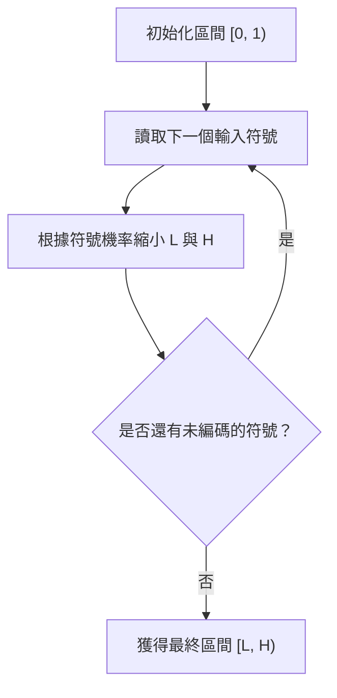
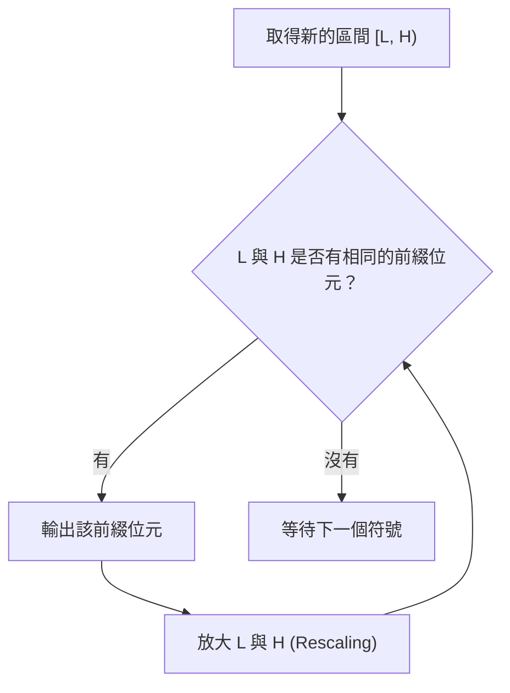

# 第 6 章：算術編碼 (Arithmetic Coding)

## 6.1 前言與動機

在先前的章節中，我們探討了 **Huffman 編碼** 等符號編碼 (Symbol Codes) 的限制。這類編碼演算法必須為每個符號分配整數個位元，當某個符號的最佳資訊量 $\log_2(1/p)$ 不是整數時，就會產生無可避免的額外開銷 (overhead)。對於單一符號的編碼，這個開銷最多可達 1 bit/symbol。

為了解決這個問題，我們曾考慮將資料分塊 (Block Coding)。將 $B$ 個符號組合成一個新符號進行編碼，可將額外開銷均攤為 $1/B$ bits/symbol。然而，這種做法在實務上並不可行，因為當區塊大小 $B$ 增加時，編碼表的大小會呈指數級成長 ($|X|^B$)，這不僅會耗盡記憶體，還會帶來嚴重的延遲問題。

**算術編碼 (Arithmetic Coding)** 的出現徹底解決了這個問題。它能在不使用龐大編碼表的情況下，針對任意長度的資料序列實現極致的壓縮率，將模型 (Model) 與編碼 (Entropy Coding) 完美分離。

## 6.2 算術編碼的核心直覺

算術編碼不再為個別符號分配位元，而是**將整段輸入序列映射到 $[0, 1)$ 數線上的一個極小區間**。

其背後的核心直覺有兩個：
1. **較大的區間能用較少的位元來表示**：若要向接收端精確地傳達一個極小的區間，我們需要很多位數的二進位小數；反之，如果區間很大，我們只需要少數幾位小數即可。
2. **高機率的序列應分配到較大的區間**：為達到資料壓縮的目的，我們希望發生機率越高的序列，其對應的數線區間越長，從而使用越少的位元來編碼。

結合這兩點，我們就能理解：**機率越高的序列 $\rightarrow$ 區間越長 $\rightarrow$ 所需位元數越少**。

## 6.3 算術編碼演算法

算術編碼的過程可以分為兩個主要步驟：尋找區間，以及傳遞區間。

### 步驟一：尋找序列對應的區間

編碼器一開始將範圍初始化為 $[L, H) = [0, 1)$。接著，針對輸入序列的每一個符號，根據該符號在機率分佈中的**累計機率**與**符號機率**，將目前的區間按照比例再次切割，並選擇該符號對應的子區間。

假設符號 $s$ 的機率為 $P(s)$，其累計機率 (排在它前面所有符號的機率總和) 為 $C(s)$，則區間更新規則為：

$$ L' = L + C(s) \times (H - L) $$
$$ H' = L' + P(s) \times (H - L) $$

每處理一個符號，區間的長度就會乘上該符號的機率。因此，經過 $n$ 個符號後，最終區間的長度 $(H - L)$ 剛好等於整個序列的機率 $p(x_1^n)$。這完美符合了我們先前的直覺。

### 步驟二：傳遞區間 (產出位元串)

有了最終的區間 $[L, H)$，接下來只需在這個區間內挑選一個數字 $Z$ 傳遞給解碼器。通常我們會選擇區間的中點：

$$ Z = \frac{L + H}{2} $$

然而，$Z$ 的二進位表示可能會無限延伸。為達到壓縮效果，我們會將 $Z$ 截斷 (truncate) 為 $k$ 個位元，形成 $\hat{Z}$。為了確保截斷後的 $\hat{Z}$ (以及其任何可能的二進位後綴延伸) 依然落在 $[L, H)$ 區間內，我們需要的位元數 $k$ 滿足：

$$ k \le \lceil \log_2 \frac{1}{H-L} \rceil + 1 $$

也就是說，編碼整個序列 $x_1^n$ 的總位元數：
$$ \text{codelen} \le \log_2 \frac{1}{p(x_1^n)} + 2 $$

這意味著，**對整段序列而言，算術編碼最多只比理論上的香農極限 (Shannon limit) 多出 2 個位元的開銷**。若序列長度為 $n$，平均每個符號的額外開銷為 $2/n$ bits，當 $n$ 夠大時，這個開銷幾乎可以忽略不計。

## 6.4 解碼過程

解碼器已知各個符號的機率分佈。當它接收到代表數字 $Z$ 的位元串時，解碼過程就像是編碼的逆向推導：

1. 解碼器將 $[0, 1)$ 依據各符號的累計機率切分為數個子區間。
2. 觀察 $Z$ 落在這其中的哪一個子區間，即可推斷出第一個符號。
3. 確定符號後，解碼器會將當前區間縮小到該符號對應的子區間。
4. 在新的子區間內再次進行切分，看 $Z$ 落在哪裡，藉此解碼出第二個符號。
5. 重複上述步驟。

需要注意的是，由於 $Z$ 可以被無限次解碼下去，我們必須提供解碼器一個**停止條件**。實務上通常有兩種做法：
* 在位元串開頭先寫入序列的總長度 $n$。
* 在字典檔中加入一個特殊的 `EOF` (End Of File) 符號，解碼器一看到此符號即停止。

## 6.5 實務上的挑戰與解決方案

儘管算術編碼在理論上非常完美，但在軟體實作上會面臨一些挑戰。

### 浮點數精度溢位 (Underflow)
隨著我們編碼越來越多的符號，區間 $[L, H)$ 會以指數級別迅速縮小。在一般電腦的 64 位元浮點數架構中，大約處理幾十個符號後，區間就會小到讓 $L$ 與 $H$ 在電腦內部表示為同一個數值，導致演算法崩潰。

### 區間重縮放 (Rescaling / Renormalization)
為了解決精度問題，我們不需等到整段序列編碼完才輸出位元，而是採用串流 (Streaming) 的方式。
如果我們觀察到 $L$ 和 $H$ 的前綴位元變得相同 (例如兩者都以二進位的 `011` 開頭)，代表最終答案 $Z$ 的開頭也必定是 `011`。此時我們就可以提早將 `011` 輸出，並將 $L$ 和 $H$ 同時放大 (Rescale)，以回收失去的精度空間。

### 運算速度與 Range Coding
算術編碼的核心迴圈牽涉到多次的乘法與加法運算，這使其執行速度明顯慢於只需要查表的 Huffman 編碼。實務上，為提升速度，通常會採用整數運算取代浮點數，並衍生出 **Range Coding**。Range Coding 的概念是每次以 Byte (8 bits) 為單位來進行 Rescaling 與輸出，而非以單一位元為單位，這會犧牲極少量的壓縮率，但能帶來極大的速度提升。

## 6.6 總結

算術編碼的偉大之處在於它成功解耦了「模型建立 (Modeling)」與「熵編碼 (Entropy Coding)」。只要能提供準確的機率模型 $P(x)$ (甚至是可以隨時間改變的自適應模型)，算術編碼就能像一個黑盒子一樣，將該機率以近乎最佳化的方式轉換為位元流。

在後續的章節中，我們將探討如何利用這個特性，搭配更複雜的脈絡模型 (Context-based Models) 來達到驚人的壓縮效果；同時，我們也會介紹非對稱數字系統 (Asymmetric Numeral Systems, ANS)，它結合了算術編碼的壓縮率與 Huffman 編碼的速度，是現代壓縮演算法的新寵兒。

---
## 相關作業與材料

本章節的實作與練習對應於 Stanford EE274 官方提供的作業與專案：
- **對應內容**：HW2: Arithmetic Coding

> **注意**：為了遵守學術誠信與課程規範，本書不提供作業的解答代碼。強烈建議讀者親自前往 [EE274 課程筆記網站 (Homeworks 區塊)](https://stanforddatacompressionclass.github.io/notes/) 下載 starter code 並實作，以深化對演算法的理解。
