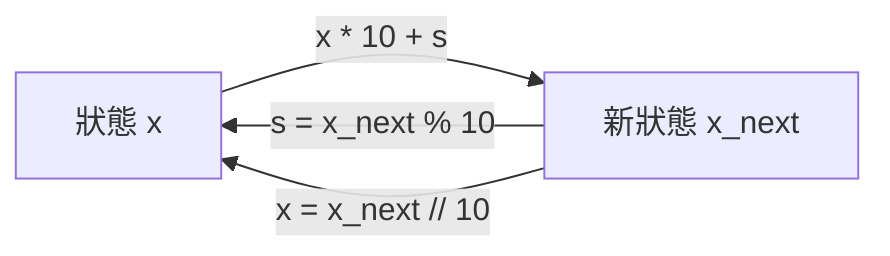
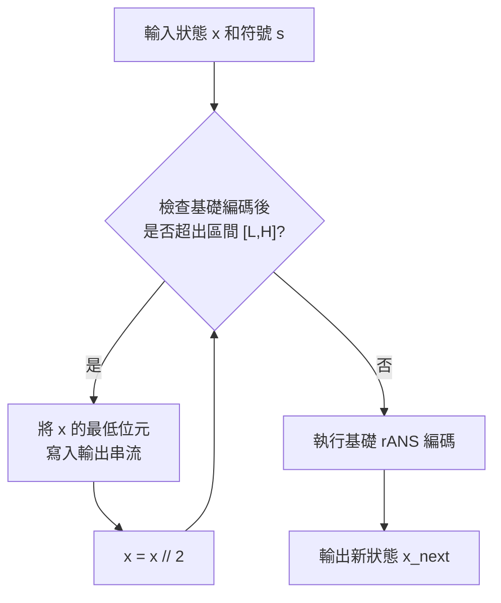

# 第七章：非對稱進制系統 (Asymmetric Numeral Systems)

## 1. 簡介

在前面的章節中，我們學習了算術編碼 (Arithmetic Coding) 和霍夫曼編碼 (Huffman Coding)。算術編碼能提供接近最佳的壓縮率（熵），但其編碼與解碼速度較慢；霍夫曼編碼解碼速度快，但壓縮率不如算術編碼。

本章將介紹由 Jarek Duda 於 2014 年左右提出的**非對稱進制系統 (Asymmetric Numeral Systems, ANS)**。ANS 是目前最先進的無失真資料壓縮演算法之一，它結合了算術編碼的高壓縮率和霍夫曼編碼的高速解碼特性。現今許多實用的壓縮工具（如 Zstd）都採用了 ANS 演算法。

ANS 家族主要有兩個極端變體：
- **rANS (Range ANS)**：可直接取代算術編碼，提供更高的執行速度。
- **tANS (Table ANS)**：可直接取代霍夫曼編碼，在極快速度下提供更佳的壓縮率。

---

## 2. 對稱進制系統 (Symmetric Numeral System)

為了理解 ANS，我們先從一個大家熟知的概念開始：對稱進制系統。假設我們有一連串由 $0$ 到 $9$ 構成的數字序列（例如 `3, 2, 4, 1, 5`），我們可以如何用一個數字來表示這整個序列？

很直觀地，我們可以將其編碼為一個整數 $x = 32415$。這過程可以看作是不斷更新一個狀態 (state) $x$：

初始狀態 $x = 0$。
每次讀取一個新符號 $s$，更新狀態：
$$x_{next} = x \times 10 + s$$

在解碼時，我們從最終狀態出發，執行反向操作：
符號 $s = x \bmod 10$
前一個狀態 $x_{prev} = x \mathrel{//} 10$

> [!NOTE]
> 在這個系統中，解碼輸出的符號順序與編碼輸入的順序是**相反的 (Reverse Order)**。

這個系統將狀態放大約 $10$ 倍，相當於每個符號消耗了 $\log_2(10)$ 個位元。如果 $0$ 到 $9$ 的機率都是 $1/10$，則此編碼是最佳的。但如果符號機率分佈不均勻，這個「對稱」的方法就不再是最佳化。最佳情況下，若符號 $s$ 的機率為 $p(s)$，其狀態應該大約放大 $1 / p(s)$ 倍。

---

## 3. 基礎 rANS (Range ANS)

為了解決非均勻機率分佈的問題，我們引入了**非對稱進制系統 (ANS)**。

定義符號的機率為：
$$p(s) \approx \frac{freq[s]}{M}$$
其中 $freq[s]$ 為符號 $s$ 的整數頻率，$M = \sum freq[s]$ 為總頻率。
同時定義累積頻率 $cumul[s]$ 為排在 $s$ 之前的符號頻率總和。

### 3.1 rANS 編碼步驟
為了讓狀態 $x$ 放大約 $M / freq[s]$ 倍，基礎 rANS 的狀態更新公式為：
$$x_{next} = \left( x \mathrel{//} freq[s] \right) \times M + cumul[s] + \left( x \bmod freq[s] \right)$$

### 3.2 rANS 解碼步驟
解碼的目標是從 $x$ 找出符號 $s$ 並還原前一個狀態 $x_{prev}$。
1. **取得 slot 和 block_id**：
   $$block\_id = x \mathrel{//} M$$
   $$slot = x \bmod M$$
2. **尋找符號 $s$**：
   由於 $cumul[s] \le slot < cumul[s+1]$，我們可以使用二分搜尋法在累積頻率表中找出唯一的符號 $s$。
3. **還原前一個狀態**：
   $$x_{prev} = block\_id \times freq[s] + slot - cumul[s]$$

這保證了編碼與解碼過程是無損且完全可逆的。

---

## 4. 串流 rANS (Streaming rANS)

基礎 rANS 存在一個實用上的問題：隨著符號不斷編碼，狀態 $x$ 會呈指數增長，很快就會發生整數溢位。

為了解決這個問題，**串流 rANS** 將狀態 $x$ 限制在一個固定的區間 $[L, H]$ 內。
我們通常選擇 $L = M \cdot t$ 和 $H = 2 \cdot M \cdot t - 1$，其中 $t$ 是一個常數。

### 4.1 編碼端的狀態縮小 (Shrink State)
在呼叫基礎編碼公式之前，我們必須確保產生出的 $x_{next}$ 落在 $[L, H]$ 中。
如果 $x$ 太大，我們會透過輸出 $x$ 的較低位元來**縮小 (shrink)** 狀態，直到條件滿足為止。
每次將 $x$ 除以 2，並將餘數 (位元) 寫入輸出串流。

### 4.2 解碼端的狀態放大 (Expand State)
在基礎解碼提取出符號 $s$ 並還原出 $x_{shrunk}$ 後，該狀態可能小於 $L$。此時，我們必須從位元串流中讀取位元，將狀態**放大 (expand)** 回到區間 $[L, H]$ 內：
$$x = x \times 2 + bit$$

---

## 5. Table ANS (tANS)

rANS 已經十分有效率，但仍然需要進行除法與二分搜尋。在實際應用中（如處理器中），查表 (Lookup Table) 的速度遠高於執行運算。這引出了 **Table ANS (tANS)** 的概念。

tANS 透過**快取 (Caching)** 將運算預先計算好，儲存在表中。
為使 tANS 高效運作，通常會將 $M$ 設定為 2 的次方（例如 $M = 2^{16}$）。

### 解碼端的快取
解碼時所需的表：
1. `decode_table_s[x]`：直接給出符號 $s$。
2. `decode_table_x_shrunk[x]`：直接給出縮小後的狀態 $x_{shrunk}$。
3. `expand_state_num_bits[x_shrunk]`：告訴我們需要從串流中讀取多少個位元。

透過這些查找表，tANS 解碼器每個符號只需要幾次記憶體存取、位元移位和加法，而無需任何除法或條件分支。這也是為什麼 tANS 能夠達到極快的解碼速度，同時維持與算術編碼相當的壓縮率。

## 6. 總結

- **理論之美與實務結合**：ANS 巧妙地利用了非對稱狀態的轉移，達到最佳壓縮，並透過串流與區間限制，解決了整數溢位問題。
- **效能優勢**：rANS 與 tANS 分別在高速與極速領域提供了可取代算術編碼與霍夫曼編碼的方案。
- **現代應用**：ANS 已經成為當代資料壓縮（如 Zstandard、Apple LZFSE）的核心基石，是資料壓縮領域近十年來最重要的進展之一。

---
## 相關作業與材料

本章節的實作與練習對應於 Stanford EE274 官方提供的作業與專案：
- **對應內容**：HW2: Asymmetric Numeral Systems (ANS)

> **注意**：為了遵守學術誠信與課程規範，本書不提供作業的解答代碼。強烈建議讀者親自前往 [EE274 課程筆記網站 (Homeworks 區塊)](https://stanforddatacompressionclass.github.io/notes/) 下載 starter code 並實作，以深化對演算法的理解。
