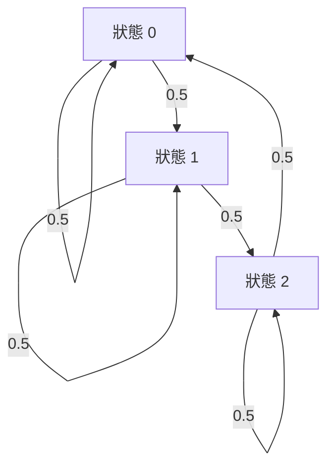

# 第八章：超越 IID 分佈與條件熵 (Conditional Entropy)

在前面的章節中，我們專注於各種熵編碼技術（如霍夫曼編碼、算術編碼以及 rANS/tANS）。這些方法的理論基礎建立在資料源是獨立且同分布（Independent and Identically Distributed, IID）的假設上。然而，真實世界中的資料往往存在著強烈的相依性。本章我們將探討如何處理非 IID 的資料源，並引入條件熵與熵率的概念，為接下來的情境建模與通用壓縮奠定基礎。

## 1. 真實資料的特性與非 IID 資料源

讓我們進行一個簡單的實驗，嘗試壓縮一本真實的英文小說（例如福爾摩斯的《巴斯克維爾的獵犬》）。如果我們假設這本書的字元是 IID 的，並計算其經驗熵（Empirical Entropy），我們會得到一個理論壓縮下界。然而，當我們使用 gzip 或 bzip2 等常見的壓縮工具時，會發現壓縮後的檔案大小竟然遠低於這個基於 IID 假設的熵下界。

為什麼這些壓縮演算法能打破所謂的「下界」？原因在於，IID 假設並不符合真實資料的特性。根據機率的連鎖律（Chain Rule of Probability）：
$$ P(U_1, U_2, \dots, U_n) = \prod_{i=1}^n P(U_i \mid U_1, \dots, U_{i-1}) $$

對於 IID 資料源，知道歷史資訊並不能幫助我們預測下一個符號。但對於常見的資料，歷史資訊非常有用：
- **文字**：在英文中，知道前面的字母或單詞有助於預測接下來的內容。例如，如果上一個字母是「Q」，下一個字母極有可能是「U」。
- **影像**：在典型的影像中，相鄰的像素通常具有相似的亮度和顏色（邊緣除外）。
- **影片**：連續的影片幀通常非常相似，只存在少量的平移或旋轉。

## 2. 隨機過程與平穩過程

為了解決非 IID 的問題，我們需要定義更廣泛的數學模型來描述資料源。

給定字母表 $\mathcal{X}$，**隨機過程 (Stochastic Process)** $(U_1, U_2, \dots)$ 可以具有任意的元素相依性。然而，完全任意的隨機過程太過廣泛，難以發展實用的理論或演算法。因此，我們主要關注具有時間不變性的過程。

### 2.1 平穩過程 (Stationary Process)
平穩過程是指機率分佈不隨時間（即序列中的索引）改變的隨機過程。具體而言，對於所有的 $n$、所有的偏移量 $l$ 以及所有的符號序列，滿足：
$$ P(U_1=u_1, \dots, U_n=u_n) = P(U_{l+1}=u_1, \dots, U_{l+n}=u_n) $$

特別的是，平穩過程的統計特徵（如平均值、變異數和熵）不隨時間改變。大多數真實資料源若不是接近平穩的，就是可以透過可逆轉換變成平穩資料源。

### 2.2 $k$-階馬可夫資料源 ($k$-th order Markov Source)
在平穩過程中，符號之間可能存在任意長時間的相依性（即無限記憶）。但在實務上，相依性通常在鄰近元素間最強，並隨著距離迅速減弱。因此，我們常使用具有有限記憶 $k$ 的模型來逼近。

**$k$-階馬可夫資料源**的定義為：給定整個過去的歷史，當前符號的條件機率僅取決於過去的 $k$ 個符號：
$$ P(U_n \mid U_{n-1}, U_{n-2}, \dots, U_1) = P(U_n \mid U_{n-1}, U_{n-2}, \dots, U_{n-k}) $$

值得注意的是，0-階馬可夫資料源其實就是 IID 資料源。

#### 範例：一階馬可夫模型
考慮以下一階平穩馬可夫資料源：
- $U_1 \sim \text{Unif}(\{0, 1, 2\})$
- $U_{i+1} = (U_i + Z_i) \bmod 3$
- $Z_i \sim \text{Ber}(0.5)$

我們可以使用 Mermaid 狀態圖來表示這個狀態轉移：

在這個模型中，給定前一個符號，下一個符號只能以相等的機率跳轉到兩種可能的值中。

## 3. 條件熵與熵率

為衡量給定歷史資訊下的不確定性，我們引入條件熵。

### 3.1 條件熵 (Conditional Entropy)
隨機變數 $U$ 給定 $V$ 的條件熵定義為：
$$ H(U \mid V) \triangleq \mathbb{E}\left[\log \frac{1}{P(U \mid V)}\right] = \sum_{v \in V} P(v) H(U \mid V=v) $$

**重要性質**：
1. **條件會降低熵 (Conditioning reduces entropy)**：$H(U \mid V) \le H(U)$，當且僅當 $U$ 和 $V$ 獨立時等號成立。這表示在平均情況下，獲得額外資訊 $V$ 會減少我們對 $U$ 的不確定性。
2. **熵的連鎖律 (Chain Rule of Entropy)**：
   $$ H(U, V) = H(U) + H(V \mid U) = H(V) + H(U \mid V) $$
   這也意味著 $H(U, V) \le H(U) + H(V)$。

### 3.2 熵率 (Entropy Rate)
對於平穩過程，我們定義**熵率 (Entropy Rate, $H(\mathcal{U})$)** 來代表每個符號的平均不確定性或最佳壓縮極限。這有兩個等價的極限定義：
1. 新增一個符號所帶來的條件熵極限：
   $$ H(\mathcal{U}) = \lim_{n \to \infty} H(U_{n+1} \mid U_1, U_2, \dots, U_n) $$
2. 平均每個符號的聯合熵極限：
   $$ H(\mathcal{U}) = \lim_{n \to \infty} \frac{1}{n} H(U_1, U_2, \dots, U_n) $$

**熵率的運作意義**：
如同 IID 資料源中的熵，熵率在平穩資料源中扮演著壓縮下界的角色。根據 **Shannon-McMillan-Breiman 定理（平穩資料源的 AEP 性質）**：
$$ -\frac{1}{n} \log_2 P(U_1, U_2, \dots, U_n) \to H(\mathcal{U}) \quad \text{幾乎必然成立} $$

#### 範例：英文文本的熵率
夏農 (Claude Shannon) 曾在 1951 年進行過一項著名實驗，透過讓人預測英文文本的下一個字母來估計英文的熵率。隨著模型考慮的上下文越多（即馬可夫階數 $k$ 越高），熵率逐漸下降。
- IID (0-階): 約 4.76 bits/letter
- 1-階: 約 4.03 bits/letter
- 4-階: 約 2.8 bits/letter
- 人類預測: 約 1.3 bits/letter (由於人類能理解語意和跨句子的長距離依賴)

## 4. 如何達到熵率？

在 IID 資料源中，算術編碼可以有效達到熵的下界。對於一階馬可夫資料源，我們同樣可以使用算術編碼來達到熵率 $H(U_2 \mid U_1)$。

方法很直觀：**在算術編碼的每一步中，不再使用邊際機率 $P(U_i)$ 來切割區間，而是使用條件機率 $P(U_i \mid U_{i-1})$**（更一般地，使用 $P(U_i \mid \text{全部過去資訊})$）。

編碼序列 $u_1, u_2, \dots, u_n$ 後的最終區間長度將為：
$$ P(u_1) P(u_2 \mid u_1) \dots P(u_n \mid u_{n-1}) $$
這需要的編碼位元數約為 $\log_2(1 / \text{區間長度})$，計算其期望值後，每個符號的平均位元數為：
$$ \frac{1}{n} H(U_1) + \frac{n-1}{n} H(U_2 \mid U_1) \approx H(U_2 \mid U_1) $$
如此一來，只要我們能精確地建立條件機率模型，我們就能透過條件算術編碼（Context-based Arithmetic Coding）完美達到熵率的壓縮下界。我們將在下一章深入探討如何透過上下文與自適應機率模型來實現這一點。

---
## 相關作業與材料

本章節的實作與練習對應於 Stanford EE274 官方提供的作業與專案：
- **對應內容**：HW3: Conditional Entropy & Markov Sources

> **注意**：為了遵守學術誠信與課程規範，本書不提供作業的解答代碼。強烈建議讀者親自前往 [EE274 課程筆記網站 (Homeworks 區塊)](https://stanforddatacompressionclass.github.io/notes/) 下載 starter code 並實作，以深化對演算法的理解。
