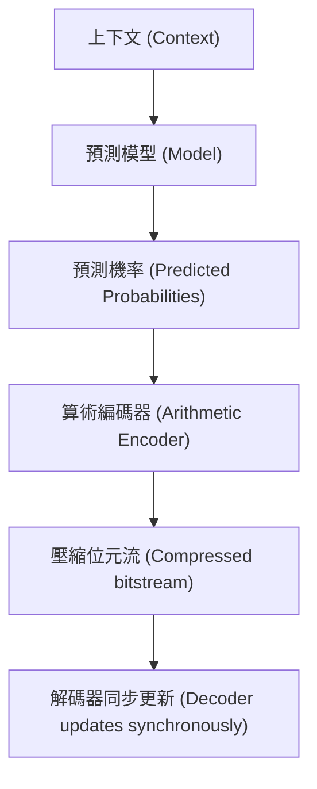

# 第九章：基於上下文的算術編碼與大語言模型壓縮 (Context-based Arithmetic Coding & LLM Compression)

## 1. 簡介 (Introduction)
在先前的章節中，我們討論了平穩過程 (Stationary processes)、馬可夫鏈 (Markov chains)、條件熵 (Conditional entropy) 以及熵率 (Entropy rate)。我們知道，對於平穩資料源，熵率是無失真壓縮的基本極限。
本章將探討如何壓縮馬可夫或平穩資料源，核心技術為**基於上下文的算術編碼 (Context-based Arithmetic Coding)**。

## 2. 達到馬可夫資料源的熵率 (Achieving Entropy Rate for Markov Sources)
對於一階馬可夫資料源，其熵率可以表示為：
$$ H(\mathcal{U}) = \lim_{n \to \infty} \frac{H(U_1, U_2, \dots, U_n)}{n} = H(U_2 | U_1) $$

這暗示了兩種壓縮的方法：
1. **區塊編碼 (Block coding)**：將符號分組成越來越大的區塊進行編碼。然而，隨著區塊大小增加，複雜度會呈指數增長。
2. **增量編碼 (Incremental coding)**：利用條件機率逐步編碼，這是我們本章的重點。

在算術編碼中，我們根據符號的機率來分割區間。若使用條件機率 $P(U_i | U_{i-1})$（或更一般地，$P(U_i | \text{past})$）來分割區間，就能在每一步根據先前的上下文來預測下一個符號。這就是基於上下文的算術編碼的核心思想。每個符號所需的編碼位元數約為 $\log_2 \frac{1}{P(U_i | \text{past})}$。

## 3. 自適應模型與兩次掃描 (Adaptive vs. Two-pass Approach)
在實際應用中，我們往往不知道資料的真實機率分佈，必須從資料中建立模型。常見的方法有兩種：

- **兩次掃描方法 (Two-pass approach)**：
  - ✅ 能從完整資料中學習模型，可能獲得更好的壓縮率。
  - ❌ 需要在壓縮檔中儲存模型。
  - ❌ 需要掃描資料兩次，不適合串流傳輸。
- **自適應方法 (Adaptive approach)**：
  - ✅ 無需儲存模型。
  - ✅ 適合串流處理。
  - ❌ 初始階段模型未訓練完成，效率較低。
  - ✅ 實務上表現良好。

需要特別注意的是，在自適應編碼中，**編碼器與解碼器必須在每一步保持完全相同的模型狀態**。解碼器在解碼出符號後，才能用該符號更新模型。

## 4. 預測與壓縮的關係 (Compression and Prediction)
這兩者有著極為密切的關聯。在機器學習中，用於預測的交叉熵損失 (Cross-entropy loss) 定義為：
$$ \sum_{c \in \mathcal{C}} \mathbb{1}_{y_i = c} \log_2 \frac{1}{\hat{P}(c | y_1, \dots, y_{i-1})} $$
當真實標籤為 $y_i$ 時，損失為 $\log_2 \frac{1}{\hat{P}(y_i | y_1, \dots, y_{i-1})}$。這完全等於算術編碼所使用的位元數！因此我們可以說：
- **好的預測模型 = 好的壓縮 (Good prediction $\Rightarrow$ Good compression)**
- 每一種壓縮器都在內部隱含了一個預測器 (Each compressor induces a predictor)。

## 5. k階自適應算術編碼 (k-th Order Adaptive Arithmetic Coding)
我們可以建立一個 k 階自適應模型，透過記錄過去 k 個符號出現的頻率來預測下一個符號。
然而，隨著 k 的增加，我們會遇到**稀疏計數問題 (Sparse count problem)**：
- 記憶體複雜度隨 k 呈指數增長。
- 當 k 很大時，許多上下文在資料中從未出現過，導致預測能力變差。

為解決此問題，出現了更進階的模型，如 PPM (Prediction by Partial Matching) 與 CTW (Context Tree Weighting)，這些模型會混合不同階數的預測結果。

## 6. 最小描述長度原則 (Minimum Description Length, MDL)
隨著模型階數 (k) 的增加，模型的預測能力雖然增強（經驗條件熵下降），但模型的儲存成本也急劇增加。MDL 原則指出，我們應最小化「模型大小」加上「給定模型下資料壓縮後的大小」的總和，從而找到最佳的模型複雜度。

## 7. 大語言模型與資料壓縮 (LLM-based Compression)
近年來，大型語言模型 (LLM) 在預測任務上展現了驚人的能力。既然好的預測等同於好的壓縮，我們能否使用 LLM 來進行資料壓縮？
答案是肯定的（參見論文 "Language Modeling Is Compression"）。當我們不計較模型本身的儲存成本（假設傳收雙方都已擁有該 LLM），我們可以直接將其作為極其強大的預測器。

- **長上下文的優勢**：提供給 LLM 的上下文越長，預測越準確，壓縮率越高，甚至能超越目前最強的傳統壓縮器 (如 CMIX, NNCP)。
- **模型與資料的匹配**：如果壓縮的資料（例如古梵文的羅馬拼音）與 LLM 訓練資料分佈差異過大，LLM 的壓縮效果可能會輸給 gzip 或 bzip2 等不預設資料分佈的通用壓縮器。
- **過度擬合 (Overfitting) 的現象**：若壓縮的文本（例如《福爾摩斯》）已經存在於 LLM 的訓練集內，LLM 將會給出驚人的壓縮率（如 0.2 bits/byte），因為它實質上已經「記住」了資料。在壓縮領域，這種過度擬合若能在收發雙方共享模型的條件下，反而是一件好事。

## 總結
從簡單的馬可夫模型到強大的大語言模型，核心思想始終如一：利用上下文進行精準預測，再透過算術編碼將預測轉化為極致的壓縮率。

---
## 相關作業與材料

本章節的實作與練習對應於 Stanford EE274 官方提供的作業與專案：
- **對應內容**：HW3: Context-based AC & LLM Compression

> **注意**：為了遵守學術誠信與課程規範，本書不提供作業的解答代碼。強烈建議讀者親自前往 [EE274 課程筆記網站 (Homeworks 區塊)](https://stanforddatacompressionclass.github.io/notes/) 下載 starter code 並實作，以深化對演算法的理解。
