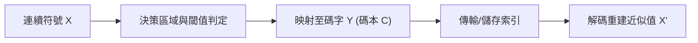
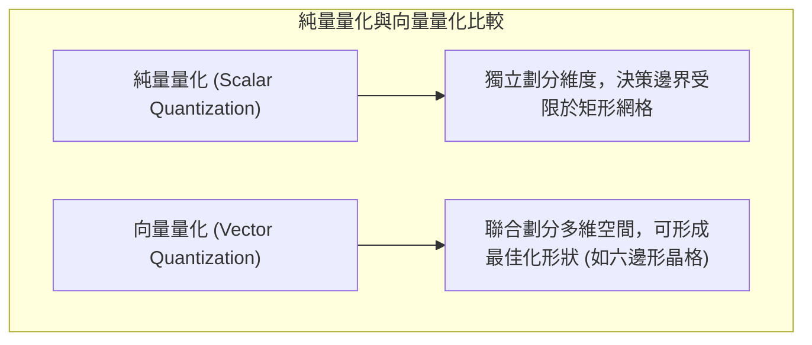

# 第十一章：失真壓縮基礎與量化 (Lossy Compression Basics and Quantization)

## 1. 引言 (Introduction)
在先前的章節中，我們探討了無失真壓縮 (Lossless Compression) 的技術及其基本極限（由熵決定）。無失真壓縮假設資料源是離散的 (Discrete)，且我們希望在不遺失任何資訊的情況下將其還原。

然而，現實世界中的許多資料源（如音訊、影像、視訊或物理感測器數據）本質上是連續的 (Continuous)。根據數學理論，連續資料源包含無限的資訊量（因為任意兩個實數之間存在無限多個實數），因此無法用有限的位元進行無失真數位化表示。我們必須透過「量化 (Quantization)」來近似這些連續值，這無可避免地會引入資訊的損失或失真。這正是失真壓縮 (Lossy Compression) 的核心，而無失真壓縮可以視為失真度為零的特例。

## 2. 速率-失真權衡 (Rate-Distortion Tradeoff)
失真壓縮的核心在於兩個關鍵指標的權衡：
- **失真 (Distortion, $D$)**：衡量近似或量化過程所引入的資訊損失。常見的失真指標包括均方誤差 (Mean Squared Error, MSE)：$D = E[(X - \hat{X})^2]$，以及平均絕對誤差 (Mean Absolute Error, MAE)：$D = E[|X - \hat{X}|]$。失真指標的選擇高度取決於具體應用場景。
- **速率 (Rate, $R$)**：表示每個樣本用來表示失真近似值的位元數 (bits per sample)。

速率與失真之間存在著基本的權衡關係：
- 較高的速率意味著我們可以使用更多位元來更精確地表示資料源，從而獲得較低的失真。
- 較低的速率意味著我們必須容忍更多的失真以達到更高的壓縮率。

在設計失真壓縮器時，我們始終致力於尋找最佳的速率-失真權衡：在給定容許的失真上限下最小化速率，或在給定網路頻寬（速率）限制下最小化失真（即尋找 Pareto 最佳邊界）。

## 3. 量化基礎與純量量化 (Scalar Quantization)
量化是將連續資料源映射到離散資料源的過程。這是在失真壓縮中最基礎也是不可或缺的一步。
- 經過量化的值稱為**符號 (Symbols)** 或 **碼字 (Codewords)**。
- 所有可用量化值的集合稱為**碼本 (Codebook)** 或 **字典 (Dictionary)**。

如果一個碼本的大小為 $N$，則其速率為 $R = \lceil \log_2(N) \rceil$ 位元/符號。換句話說，使用 $R$ 個位元可以表示 $2^R$ 種不同的量化值。

### 純量量化 (Scalar Quantization)
純量量化是指獨立地對每個符號進行量化。量化器 $Q(\cdot)$ 可以視為一個函數，將輸入空間劃分為 $N$ 個不重疊的**決策區域 (Decision Regions)**，並透過設定**決策閾值 (Decision Thresholds)**，將每個區域內的連續值映射到碼本中對應的最佳量化值。

**範例：高斯分佈的純量量化**
假設資料源 $X \sim \mathcal{N}(0, 1)$，我們希望以 1 bit/symbol 的速率進行壓縮。1 bit 代表碼本大小為 2。
基於高斯分佈對稱於零的特性，我們可以簡單地編碼 $X$ 的正負號（決策閾值為 0）。在已知符號為正的情況下，為了最小化均方誤差 (即使用 Minimum Mean Square Estimator, MMSE)，最佳的重建值為該區域的條件期望值：
$$E[X | \hat{X} > 0] = \sqrt{\frac{2}{\pi}}$$
因此，在給定 1 bit 限制與 MSE 失真標準下，最佳碼本為 $C = \{\sqrt{2/\pi}, -\sqrt{2/\pi}\}$。

## 4. 向量量化 (Vector Quantization, VQ)
相較於獨立量化單一符號，向量量化將 $k$ 個符號組成一個區塊（向量）進行聯合量化。
若速率限制為 $R$ bits/symbol，則這 $k$ 維空間中的可用碼本大小為 $N = 2^{kR}$，也就是說速率 $R = \frac{\log_2 N}{k}$。

### 向量量化的優勢：
1. **利用分量間的相關性 (Exploit Dependence)**：如果向量的不同維度之間存在高度相關性（例如，影像中相鄰像素通常顏色相近），VQ 可以根據真實的機率密度動態調整決策區域，避免將位元浪費在機率為零的空間中。
2. **更具一般性的決策區域**：在純量量化中，決策區域受限於多維空間中的正交矩形網格。但在向量量化中，決策區域可以呈現更複雜的幾何形狀。即使對於獨立同分佈 (IID) 的均勻分佈，VQ 也能達到更好的表現。在二維均勻分佈的情況下，理論上的最佳區域為六邊形晶格 (Hexagonal Lattice，又稱 Voronoi Diagram)。即使分量間完全獨立，這種蜂巢狀的劃分也能將 MSE 降低約 3.8%。

## 5. 向量量化演算法 (K-means / Lloyd-Max Algorithm)
一般情況下，非均勻或高維度的最佳量化區域很難直接用解析數學方法求得。因此，我們在實務上需要依賴迭代演算法來設計最佳的碼本與決策邊界。

這套演算法在機器學習領域被廣泛稱為 **K-means 分群演算法**，而在壓縮與訊號處理領域中，它被稱為 **Lloyd-Max 演算法** 或 **廣義 Lloyd 演算法 (Generalized Lloyd Algorithm, GLA)**。

演算法的核心概念為**交替最佳化 (Alternating Optimization)**，步驟如下：
1. **初始化**：隨機選擇 $N$ 個點作為初始碼本 (Centroids)。
2. **分配資料點 (Partitioning)**：給定目前的碼本，計算每個連續資料點到各碼字的距離（基於選定的失真指標，如 MSE），並將資料點分配給距離最近的碼字。這確立了決策區域 (Clusters)。
3. **更新碼本 (Centroid Update)**：給定目前的分配結果，針對每個區域內的資料點，重新計算能最小化區域內失真的最佳代表值（如 MSE 下的最佳代表值為該區域資料點的平均值）。
4. **收斂判定**：重複步驟 2 與 3，直到碼本不再發生顯著改變，演算法收斂。

透過 Lloyd-Max 演算法，我們可以在實踐中描繪出經驗上的速率-失真曲線。隨著後續課程的深入，我們將會進一步探討如何求出理論上的最佳速率-失真下界（例如高斯分佈在均方誤差下的理論極限為 $D(R) = 2^{-2R}$）。

---
## 相關作業與材料

本章節的實作與練習對應於 Stanford EE274 官方提供的作業與專案：
- **對應內容**：HW4: Scalar and Vector Quantization

> **注意**：為了遵守學術誠信與課程規範，本書不提供作業的解答代碼。強烈建議讀者親自前往 [EE274 課程筆記網站 (Homeworks 區塊)](https://stanforddatacompressionclass.github.io/notes/) 下載 starter code 並實作，以深化對演算法的理解。
