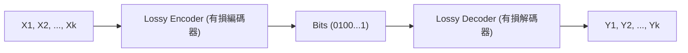

# 第 12 章：互資訊與率失真函數 (Mutual Information and Rate-Distortion Function)

在無損壓縮中，我們學到「熵 (Entropy)」是衡量壓縮極限的基本單位。然而在許多應用場景中（例如連續數據、影音資料），我們願意容忍一定的誤差以換取更高的壓縮率，這便是**有損壓縮 (Lossy Compression)**。本章將介紹互資訊 (Mutual Information) 的概念，並探討香農 (Shannon) 提出的率失真理論 (Rate-Distortion Theory)，這是衡量有損壓縮極限的基石。

## 1. 熵與條件熵回顧 (Entropy and Conditional Entropy Recap)

在深入率失真理論之前，我們先回顧幾個核心的資訊理論物理量。假設 $X, Y$ 為離散隨機變數。

- **熵 (Entropy)**：
  $$ H(X) = \sum_{x} p(x) \log_2 \frac{1}{p(x)} $$
  代表隨機變數 $X$ 的不確定性。在無損壓縮中，對於獨立同分布 (i.i.d.) 的信源，熵 $H(X)$ 代表每個符號所需的最佳平均位元數。

- **聯合熵 (Joint Entropy)**：
  $$ H(X,Y) = \sum_{x,y} p(x,y) \log_2 \frac{1}{p(x,y)} $$

- **條件熵 (Conditional Entropy)**：
  $$ H(Y|X) = \sum_{x,y} p(x,y) \log_2 \frac{1}{p(y|x)} = \sum_{x} P(x) H(Y|X=x) $$
  一個重要的性質是**條件化會減少熵 (Conditioning reduces entropy)**：$H(Y|X) \leq H(Y)$。也就是說，知道另一個變數的資訊，平均而言只會減少或保持我們對原變數的不確定性。

## 2. 互資訊 (Mutual Information)

互資訊 $I(X;Y)$ 衡量兩個隨機變數之間「共享」的資訊量，定義為：
$$ I(X;Y) = H(X) + H(Y) - H(X,Y) $$

直觀上，它是兩個隨機變數各自的熵總和減去聯合熵的差值。互資訊具備以下重要性質：
1. **對稱性**：$I(X;Y) = I(Y;X)$。
2. **與條件熵的關係**：
   $$ I(X;Y) = H(X) - H(X|Y) = H(Y) - H(Y|X) $$
   這表示互資訊等同於已知 $Y$ 後，$X$ 不確定性的減少量。
3. **KL 散度 (KL Divergence)**：
   $$ I(X;Y) = D_{KL}(p(x,y) || p(x)p(y)) $$
   它量化了 $X$ 與 $Y$ 之間的相依程度。若 $X$ 和 $Y$ 獨立，則 $I(X;Y) = 0$。
4. **非負性**：$I(X;Y) \geq 0$。

> [!NOTE]
> 儘管熵無法直接套用於連續隨機變數（其值會發散至無限大），但互資訊可以自然地推廣到連續隨機變數甚至更抽象的空間中。

## 3. 有損壓縮設定 (Lossy Compression Setup)

假設我們有一組長度為 $k$ 的數據序列 $X_1, X_2, \dots, X_k$。我們的目標是使用有損編碼器將其編碼為 $n = \log_2(N)$ 個位元，再由解碼器重建為 $Y_1, Y_2, \dots, Y_k$。

這裡有兩個衡量性能的關鍵指標：
- **壓縮率 (Rate) $R$**：平均每個來源符號使用的位元數。
  $$ R = \frac{\log_2(N)}{k} = \frac{n}{k} $$
- **失真 (Distortion) $D$**：衡量重建資料 $Y_1^k$ 偏離原始資料 $X_1^k$ 的程度。我們通常關注每個符號的平均期望失真 $\bar{D} = E[d(X, Y)]$。

常見的失真度量函數有：
- **漢明失真 (Hamming Distortion)**，適用於離散數據：$d(x,y) = \mathbf{1}(x \neq y)$。
- **均方誤差失真 (MSE Distortion)**，適用於連續數據：$d(x,y) = (x-y)^2$。

## 4. 率失真函數與香農定理 (Rate-Distortion Theory)

一個核心的問題是：「如果我們能容忍的最大失真為 $D$，我們能達到的最佳壓縮率 $R$ 是多少？」
這個極限值被定義為**率失真函數 $R(D)$**。

香農 (Shannon) 的有損壓縮定理精確地解答了這個問題。對於獨立同分布 (i.i.d.) 的信源資料 $X$，給定最大失真 $D$，其最佳壓縮率為：
$$ R(D) = \min_{q(y|x): E[d(X,Y)] \leq D} I(X;Y) $$

這是一個最小化問題：在所有滿足預期失真不大於 $D$ 的條件機率分佈 $q(y|x)$ 中，尋找使互資訊 $I(X;Y)$ 最小化的值。

## 5. 兩個經典範例

### 5.1 伯努利信源與漢明失真 (Bernoulli Source with Hamming Distortion)

假設信源為拋擲一枚偏誤硬幣 $X \sim \text{Bern}(p)$，其中 $p \leq 0.5$。我們使用漢明失真 $d(x,y) = \mathbf{1}(x \neq y)$。

其率失真函數為：
$$
R(D) = 
\begin{cases} 
h(p) - h(D) & \text{for } 0 \leq D \leq p \\
0 & \text{for } D > p 
\end{cases}
$$
其中 $h(\cdot)$ 為二元熵函數 (Binary Entropy Function)。

- 當 $D = 0$（無損壓縮），所需率為信源的熵 $h(p)$。
- 當 $D \geq p$ 時，我們可以總是猜測 $0$（全部輸出 $0$），因為 $X=1$ 的機率只有 $p$，所以期望失真就是 $p$。這種情況下我們不需要任何位元資訊，因此 $R(D) = 0$。
- 函數 $R(D)$ 是凸函數 (convex)，反映了我們可以透過時間共享 (time-sharing) 來在不同極端點之間取得平衡。

### 5.2 高斯信源與均方誤差失真 (Gaussian Source with MSE Distortion)

這是一個連續變數的例子，假設資料為標準常態分佈 $X \sim \mathcal{N}(0,1)$，失真函數為均方誤差 (MSE) $d(x,y) = (x-y)^2$。

其率失真函數為：
$$
R(D) = 
\begin{cases} 
\frac{1}{2} \log_2 \left(\frac{1}{D}\right) & \text{for } 0 \leq D \leq 1 \\
0 & \text{for } D > 1 
\end{cases}
$$

**直觀幾何解釋 (體積保留法則)：**
對於長度為 $k$ 的 i.i.d. $\mathcal{N}(0,1)$ 序列，根據大數法則，這 $k$ 個樣本的平方和將趨近於 $k$（因為變異數為 1）。在幾何上，這代表在 $k$ 維空間中，數據點以極高的機率落於半徑為 $\sqrt{k}$ 的高維球體內。

若要達成最大均方誤差失真 $D$，相當於我們需要用半徑為 $\sqrt{kD}$ 的較小球體（代表重建碼字 $Y$ 的覆蓋範圍）來填滿這個大球體。
這所需的最小小球體數量 $N$ 可以透過體積比估算：
$$ N \approx \frac{\text{Volume}(\sqrt{k})}{\text{Volume}(\sqrt{kD})} = \left( \frac{\sqrt{k}}{\sqrt{kD}} \right)^k = \left( \frac{1}{\sqrt{D}} \right)^k = \left( \frac{1}{D} \right)^{k/2} $$

所需的壓縮率為：
$$ R \leq \frac{\log_2 N}{k} \approx \frac{1}{k} \log_2 \left( \left( \frac{1}{D} \right)^{k/2} \right) = \frac{1}{2} \log_2 \frac{1}{D} $$
這個直觀證明不僅漂亮地解釋了高斯分布率失真函數的結構，更顯示了在高維度中利用向量量化 (Vector Quantization) 達成理論最佳壓縮極限的可能性。

---
## 相關作業與材料

本章節的實作與練習對應於 Stanford EE274 官方提供的作業與專案：
- **對應內容**：HW4: Rate-Distortion Theory

> **注意**：為了遵守學術誠信與課程規範，本書不提供作業的解答代碼。強烈建議讀者親自前往 [EE274 課程筆記網站 (Homeworks 區塊)](https://stanforddatacompressionclass.github.io/notes/) 下載 starter code 並實作，以深化對演算法的理解。
