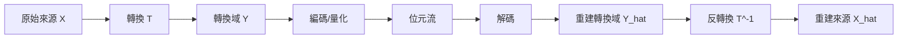

# 第 13 章：高斯率失真、注水理論直覺與轉換編碼 (Gaussian RD, Water-Filling Intuition; Transform Coding)

本章將延續率失真理論 (Rate-Distortion Theory)，探討對於高斯分佈以及具相關性資料的率失真極限，並介紹「轉換編碼 (Transform Coding)」的基本概念與 Karhunen-Loève 轉換 (KLT)。

## 1. 高斯來源與均方誤差 (Gaussian Sources and MSE)

回顧夏農 (Shannon) 的率失真定理，對於無記憶來源 (Memoryless Sources)，給定失真上限 $D$ 的最佳壓縮率為：
$$ R(D) = \min_{E[d(X,\hat{X})] \le D} I(X; \hat{X}) $$

對於常態分佈來源 $X \sim \mathcal{N}(0, \sigma^2)$ 以及均方誤差 (Mean Square Error, MSE) 測度，其率失真函數為：
$$
R(D) = \begin{cases}
\frac{1}{2} \log_2(\frac{\sigma^2}{D}) & \text{if } D < \sigma^2 \\
0 & \text{if } D \ge \sigma^2
\end{cases}
$$
或者可以緊湊地寫成 $R(D) = \left[ \frac{1}{2} \log_2\left(\frac{\sigma^2}{D}\right) \right]^+$。

**直覺意義**：如果我們能容忍的失真 $D$ 大於資料本身的變異數 $\sigma^2$，我們完全不需要傳送任何位元 (Rate = 0)，因為直接用平均值 (此處為 0) 作為重建值的誤差就已經小於 $D$ 了。變異數越大的資料，需要分配越多的位元來維持相同的失真度。

## 2. 獨立高斯來源的注水理論 (Water-Filling Intuition)

假設我們有兩個獨立的高斯來源 $X_1 \sim \mathcal{N}(0, \sigma_1^2)$ 與 $X_2 \sim \mathcal{N}(0, \sigma_2^2)$，並將它們視為一個區塊 (Block) 共同壓縮。我們的目標是在滿足平均失真限制 $D$ 的前提下最小化總位元率：
$$ R(D) = \min_{\frac{1}{2}(D_1+D_2) \le D} \frac{1}{2} \left[ R_G(\sigma_1^2, D_1) + R_G(\sigma_2^2, D_2) \right] $$

這是一個凸最佳化問題，其最佳解可以透過**反向注水演算法 (Reverse Water-filling)** 求得。給定一個參數 $\theta$，我們為各分量分配的失真為：
$$ D_i = \min(\theta, \sigma_i^2) $$
而總失真為 $D = \frac{1}{2}(D_1 + D_2)$。

**反向注水直覺**：
- 當要求的失真 $D$ 很小時，$\theta$ 也會很小 ($\theta < \sigma_1^2, \sigma_2^2$)，此時兩個分量均分失真 $D_1 = D_2 = D$。
- 當 $\theta$ 大於某個分量 (例如 $\sigma_1^2$) 的變異數時，我們直接將該分量的失真設為 $\sigma_1^2$ (亦即不分配任何位元給它，Rate為 0)，並將剩餘的容許失真配額轉讓給變異數較大的分量。
- 結論是：**在有限的資源下，應該優先將位元分配給變異數 (能量) 較大的分量。** 這個原則可以推廣至多個獨立的高斯分量。

## 3. 轉換編碼 (Transform Coding)

在現實應用中，資料 (如影像、音訊) 通常不是獨立的，且具有高度相關性。為了能有效地壓縮這類資料並利用上述的「注水理論」來進行位元分配，我們引入了**轉換編碼**。

### 轉換編碼流程

**為什麼要在轉換域 (Transform Domain) 工作？**
1. **去相關性 (Decorrelation)**：透過合適的轉換，可以消除資料分量間的相關性，讓它們在轉換域中接近獨立，從而簡化量化器與編碼器的設計。
2. **能量集中 (Energy Compaction)**：好的轉換能將原始訊號的能量 (變異數) 集中至少數幾個分量上。結合注水理論，我們只需對能量大的分量分配位元，並直接捨棄能量小的分量，便能以較低的位元率達成很好的壓縮效果。

### 正交轉換 (Orthonormal Transforms)
在實務上，我們常使用線性正交轉換 $Y = UX$，其中 $U$ 滿足 $U^T U = I$。正交轉換有兩個非常重要的特性：
1. **能量守恆 (Parseval's Theorem)**：$\|Y\|^2 = \|X\|^2$。
2. **保持歐幾里得距離**：$\|Y_1 - Y_2\|^2 = \|X_1 - X_2\|^2$。
這代表在轉換域計算出來的均方誤差 (MSE) 等同於在原始域的 MSE。因此，我們可以在轉換域中無縫套用最佳的量化策略，並確信其失真表現將如實反映在最終重建結果上。

## 4. Karhunen-Loève 轉換 (KLT)

什麼是最理想的轉換矩陣？這引出了 **Karhunen-Loève 轉換 (KLT)**。
給定來源資料的共變異數矩陣 (Covariance Matrix) $\Sigma_X$，我們可以對其進行特徵值分解 (Eigenvalue Decomposition, EVD)：
$$ \Sigma_X = U \Lambda U^T $$
其中 $U$ 是正交矩陣 (由特徵向量組成)，$\Lambda$ 是對角矩陣 (由特徵值 $\lambda_i$ 組成)。

若我們選用 $T = U^T$ 作為轉換矩陣，得到的轉換域信號 $Y = U^T X$ 將具有以下性質：
- **完全去相關**：$Y$ 的共變異數矩陣恰好是 $\Lambda$，為對角矩陣，表示各分量完全無相關。
- **最佳的能量集中**：$Y$ 各分量的變異數即為特徵值 $\lambda_i$。KLT 能產生最極端分佈的變異數，從而在位元分配時獲得最大的壓縮效益。

### KLT 的實務挑戰
儘管 KLT 在理論上是最佳的線性轉換，但在實務上卻很少直接使用，原因有二：
1. **資料相依 (Data-dependent)**：KLT 的轉換矩陣 $U$ 取決於輸入資料的共變異數矩陣。對於不同的資料區塊，我們必須重新計算共變異數及執行複雜的特徵值分解。
2. **計算成本極高**：每一區塊都需即時解 EVD 並傳送對應的轉換矩陣，負擔過重。

因此，實務上通常會採用與資料無關 (Data-independent) 但對一般自然訊號有近似 KLT 效果的固定轉換，如**離散餘弦轉換 (Discrete Cosine Transform, DCT)**，這將是現代影像壓縮技術 (如 JPEG) 的核心。

---
## 相關作業與材料

本章節的實作與練習對應於 Stanford EE274 官方提供的作業與專案：
- **對應內容**：HW4: Gaussian RD & Transform Coding

> **注意**：為了遵守學術誠信與課程規範，本書不提供作業的解答代碼。強烈建議讀者親自前往 [EE274 課程筆記網站 (Homeworks 區塊)](https://stanforddatacompressionclass.github.io/notes/) 下載 starter code 並實作，以深化對演算法的理解。
