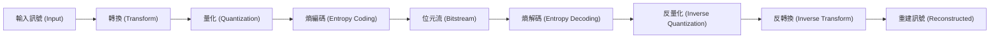

# 第 14 章：轉換編碼的實際應用 (Transform Coding in Real-Life)

在本章中，我們將探討轉換編碼 (Transform Coding) 在實際應用中的設計與實作。我們將從理論上的 Karhunen-Loève 轉換 (KLT) 出發，透過一個高斯-馬可夫 (Gauss-Markov) 訊號源的例子來建立直覺，接著介紹實務上廣泛使用的離散餘弦轉換 (DCT)，最後透過一個簡單的音訊壓縮器來展示如何將這些元件組合起來。

## 1. 轉換編碼回顧與核心概念

在前幾章中，我們學到了失真壓縮 (Lossy Compression) 的「注水演算法 (Water-filling)」直覺：**在給定的失真度量下，我們應該分配更多的位元給變異數 (或能量) 較高的訊號分量**。

轉換編碼引入了一個線性轉換步驟，主要帶來兩個巨大的好處：
1. **去相關性 (Decorrelation)**：將原本相關的輸入訊號轉換為彼此不相關的分量，使得我們可以使用較簡單的量化器 (例如純量量化) 就達到良好的壓縮效果。
2. **能量集中 (Energy Compaction)**：將訊號的能量集中在少數幾個轉換分量上，讓我們能有針對性地分配位元 (甚至完全丟棄低能量的高頻分量)。

### 實用轉換編碼管線 (Transform Coding Pipeline)

一個典型的轉換編碼管線如下圖所示：

在量化步驟中，我們通常會將轉換後的各個分量視為獨立的資料流 (Streams)，並為每個資料流獨立設計量化策略。

## 2. 實例解析：高斯-馬可夫訊號源 (Gauss-Markov Source)

為了具體理解 KLT 的作用，考慮一個一階的自迴歸過程 (AR(1))，也稱為高斯-馬可夫過程：
$$ x_n = \rho x_{n-1} + \sqrt{1-\rho^2} w_n $$
其中 $w_n$ 是 IID 的標準常態分佈雜訊 $\mathcal{N}(0, \sigma^2)$。

這個訊號源具有相鄰符號高度相關的特性。如果我們將相鄰的兩個符號 $(x_0, x_1)$ 組成區塊進行 $2 \times 2$ 的協方差矩陣 (Covariance Matrix) 計算，我們會得到：
$$ \Sigma = \begin{bmatrix} \sigma^2 & \rho\sigma^2 \\ \rho\sigma^2 & \sigma^2 \end{bmatrix} $$

對其進行特徵值分解 (Eigenvalue Decomposition)，可得到 KLT 的轉換矩陣。轉換後的兩個分量 $y_1$ 與 $y_2$ (分別對應訊號的和與差) 的變異數將會是：
- $\text{Var}(y_1) = (1 + \rho)\sigma^2$
- $\text{Var}(y_2) = (1 - \rho)\sigma^2$

**結果分析：**
當訊號高度相關 ($\rho$ 接近 1) 時，能量會極度集中在第一個分量上。這賦予我們極大的彈性：我們可以分配大多數 (或所有) 的位元給 $y_1$，並將 $y_2$ 丟棄。實驗證明，相較於直接對 $(x_0, x_1)$ 進行向量量化 (VQ)，**轉換編碼加上適當的位元分配**，能在相同的複雜度下達到低得多的失真。

## 3. 轉換編碼的實務設計抉擇 (Design Knobs)

當我們著手設計一個轉換編碼器時，有幾個關鍵的參數與決策 (Knobs) 需要調整：

1. **轉換區塊大小 (Block Size)**：決定一次要處理多少個樣本 (例如 $8 \times 8$、$16 \times 16$)。
2. **位元分配 (Bit Allocation)**：決定每個轉換分量 (或稱為通道/資料流) 應該分配多少位元。
3. **量化器選擇 (Quantizer Choice)**：對於每個分量，我們可以選擇使用純量量化 (Scalar Quantization) 或向量量化 (Vector Quantization)，以及決定各自的碼本大小 (Codebook Size)。

在實務上，工程師通常會掃描這些參數的不同組合，從中挑選出在特定目標位元率下，產生最小失真的配置。

## 4. 實用轉換技術：離散餘弦轉換 (Discrete Cosine Transform, DCT)

### KLT 的侷限性
儘管 KLT 在數學上是最佳的，但它在實務上極少被直接使用，原因有二：
1. **資料相依 (Data-dependent)**：KLT 需要先估計資料的協方差矩陣，這表示對於不同的資料需要重新計算轉換矩陣。
2. **計算成本高**：每次計算特徵值分解都會消耗大量的運算資源。

### 為什麼選擇 DCT？
離散餘弦轉換 (DCT) 是為了解決上述問題而誕生的完美替代方案：
- **固定的轉換矩陣**：DCT 不依賴於輸入資料的統計特性，矩陣是固定的。
- **高效計算**：類似於快速傅立葉轉換 (FFT)，DCT 有快速演算法可供實作。
- **優異的能量集中性**：對於許多真實世界的訊號 (特別是具有高度馬可夫相關性的影像與音訊)，DCT 的表現非常逼近 KLT。
- **實數運算**：與傅立葉轉換不同，DCT 的輸出全為實數，這在編碼上非常方便。

### 自然訊號的特性與人類感知
DCT 之所以能在多媒體壓縮 (如 JPEG, MP3) 中取得巨大成功，還依賴於兩個核心原因：
1. **自然訊號偏向低頻**：真實世界的影像和音訊，其能量絕大部分集中在低頻區域。DCT 能將這些低頻特徵萃取出來。
2. **人類感知的極限**：人眼和人耳對於高頻訊號的細節不敏感 (例如，人耳聽不到 20kHz 以上的聲音，人眼對高頻噪聲的容忍度較高)。

因此，在壓縮時，我們可以**放心地將 DCT 的高頻分量以極低的位元率進行量化，甚至直接截斷 (設為零)**，人類在感官上幾乎察覺不到差異。這也是為什麼「均方誤差 (MSE)」有時不如「人類視覺/聽覺模型」來得重要的原因。

## 5. 實務應用：音訊壓縮器 (Audio Compressor)

讓我們將上述概念組合成一個極簡版的音訊壓縮器：

1. **區塊化與轉換**：將音訊樣本分塊，並對每一塊應用 DCT。
2. **頻率截斷 (Frequency Cut-off)**：人為地將超過特定頻率閾值的 DCT 係數設為零。
3. **純量量化 (Scalar Quantization)**：對保留下來的低頻 DCT 係數進行均勻量化。
4. **重建**：反量化後，應用反離散餘弦轉換 (iDCT) 恢復音訊。

**聽覺實驗中的權衡 (Trade-offs)**：
- **降低截斷頻率**：如果我們丟棄過多的高頻成分，音訊會聽起來非常「沉悶 (Dull)」，就像隔著牆壁聽聲音。
- **減少量化階數**：如果我們保留所有頻率，但為了降低位元率而大幅減少量化階數，則會引入明顯的「靜電噪音 (Static Noise)」或「量化雜訊」。

透過同時調整「頻率截斷點」與「量化階數」，我們可以在不同的位元率下繪製出多個率失真點 (Rate-Distortion Points)，並找出最佳的 Pareto 邊界。現代的串流服務 (如 Spotify, Netflix) 正是透過建立龐大的編碼表，為各種不同的網路環境提供最佳的壓縮參數。

## 6. 總結

- **轉換編碼** 透過將訊號轉移到新的基底上，實現了去相關性與能量集中，為後續的量化與位元分配提供了絕佳的基礎。
- **DCT** 是解決 KLT 實務困難的關鍵技術，其固定的轉換矩陣與優異的低頻能量集中特性，使其成為多媒體壓縮的霸主。
- **位元分配與量化** 是轉換編碼器中最重要的兩個旋鈕，針對不同頻率分量的特性與人類感知極限進行微調，是實用壓縮技術的核心精神。

---
## 相關作業與材料

本章節的實作與練習對應於 Stanford EE274 官方提供的作業與專案：
- **對應內容**：HW4: Transform Coding in real-life

> **注意**：為了遵守學術誠信與課程規範，本書不提供作業的解答代碼。強烈建議讀者親自前往 [EE274 課程筆記網站 (Homeworks 區塊)](https://stanforddatacompressionclass.github.io/notes/) 下載 starter code 並實作，以深化對演算法的理解。
