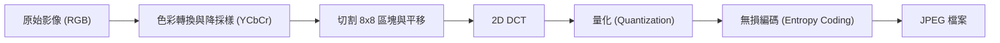

# 第 15 章：影像壓縮與 JPEG、BPG

本章將帶領讀者進入實用的有損影像壓縮世界。我們將整合先前學過的轉換編碼 (Transform Coding)、量化 (Quantization) 以及無損壓縮 (Lossless Compression) 技術，並探討經典的 JPEG 標準及其現代改良版 BPG (Better Portable Graphics)。

## 1. 為什麼需要影像壓縮？

### 未壓縮影像的巨大體積
一張影像本質上是一個三維矩陣：高度 $\times$ 寬度 $\times$ 通道數（例如 RGB 三通道）。以一張 764 $\times$ 512 的 RGB 影像為例，每個像素由三個 8-bit 數值（共 24 bits 或 3 Bytes）組成，未壓縮的大小高達約 1.1 MB。若不進行壓縮，儲存與傳輸這些資料將會極度耗費資源。

### 壓縮的威力與率失真權衡 (Rate-Distortion Tradeoff)
透過 JPEG 壓縮，我們可以將上述影像縮小 40 倍（約 27 KB），且肉眼幾乎看不出差異。然而，當我們嘗試進行更極端的壓縮（例如 137 倍）時，JPEG 影像會出現明顯的「區塊瑕疵」(Blocky Artifacts)。相對地，較現代的壓縮標準如 BPG 或是基於機器學習的壓縮器，在相同的極低位元率下，仍能保留平滑且清晰的影像結構。

### 均方誤差 (MSE) 與人類視覺
在之前的理論中，我們常以「均方誤差」(MSE) 作為失真的衡量標準。但在影像壓縮中，MSE 其實是有缺陷的。兩張具有相同 MSE 的重建影像，在人類眼中可能一張清晰自然，另一張卻佈滿雜訊。人類視覺對於結構和亮度的敏感度遠大於細微的色彩變化。因此，實務上的影像壓縮標準（如 JPEG）雖然部分基於 MSE，但也引入了大量基於人類視覺特性的啟發式設計 (Heuristics)。

## 2. 基礎影像壓縮概念

在深入 JPEG 之前，我們先來看看幾個直觀的壓縮策略：

1. **空間降採樣 (Downsampling)：**
   最簡單的壓縮方法就是直接丟棄一半的長寬像素（達成 4 倍壓縮）。解碼時再利用內插法 (Interpolation) 將影像放大。這在多媒體影片中非常常見（例如從 4K 降至 720p 傳輸，電視端再升頻）。
   
2. **色彩量化 (Color Quantization)：**
   將原本高達 1600 萬種可能的顏色（24-bit）對應到一個較小的調色盤（例如 256 色或 16 色）。這利用了自然影像中色彩多樣性有限的特性。

3. **利用空間相關性 (Spatial Correlation)：**
   相鄰的像素通常具有高度相似的顏色。早期的「色彩單元壓縮」(Color Cell Compression) 將影像切分為 4x4 的區塊，並規定每個區塊只能使用兩種顏色。如此一來，每個像素平均只需 2 bits 即可表示，大幅降低了資料量。

## 3. 二維離散餘弦轉換 (2D DCT)

為了解相關性並將信號能量集中，我們使用轉換編碼。對於二維的影像區塊，我們採用 2D DCT。

- **可分離性 (Separability)：** 
  2D DCT 具有可分離的優點。要計算一個 $N \times N$ 區塊的 2D DCT，我們只需先對每一「行」進行 1D DCT，接著再對每一「列」進行 1D DCT。這將運算複雜度從 $N^2 \times N^2$ 降至 $2 \times N^2$。
- **頻率分佈：** 
  轉換後的矩陣中，**左上角**的值為 DC 分量（代表該區塊的平均像素值）。越往右代表水平方向的高頻，越往下代表垂直方向的高頻。
- **稀疏性 (Sparsity)：**
  自然影像通常變化平緩，因此經過 2D DCT 轉換後，絕大多數的能量會集中在左上角的低頻區域，而高頻區域的值趨近於零，這為後續的量化與壓縮提供了絕佳的基礎。

## 4. JPEG 壓縮流程

JPEG 編碼器結合了我們學過的各種工具。以下是完整的 JPEG 壓縮管線：

### 步驟 1：色彩轉換與 Chroma 降採樣
JPEG 首先將 RGB 轉換為 YCbCr 色彩空間。其中 Y 是亮度 (Luma)，Cb 和 Cr 是色度 (Chroma)。
因為人類視覺對亮度變化非常敏感，但對色彩變化的敏感度較低，JPEG 會對 Chroma 進行降採樣（例如 4:2:0 格式）。這不僅直接減少了資料量，經過降採樣的信號也更加平滑，使得後續的壓縮效率更高。

### 步驟 2：區塊處理
將影像切分為獨立的 $8 \times 8$ 像素區塊。為了方便轉換，會將 8-bit 的像素值（0~255）減去 128，使其以零為中心 (Zero-centered)。

### 步驟 3：二維 DCT
對每一個 $8 \times 8$ 區塊進行 2D DCT，將空間域的像素轉換為頻率域的係數。

### 步驟 4：量化 (Rate Controller)
這是決定壓縮率與失真程度的核心步驟。JPEG 使用預先定義好的**量化表 (Quantization Table)**。
做法是將每個 DCT 係數除以對應的量化值並取整數。左上角（低頻）的除數較小，保留了大部分細節；右下角（高頻）的除數較大，大量高頻係數會被量化為零。不同的壓縮品質 (Quality) 對應不同的量化表。

### 步驟 5：無損編碼
最後，對量化後的整數進行無損壓縮：
1. **Z 字形掃描 (Zigzag Scan)：** 將 $8 \times 8$ 的二維陣列以 Z 字形讀取為一維陣列。這樣做能將低頻係數與高頻係數聚集，使得末端出現大量連續的零。
2. **游程編碼 (Run-Length Encoding, RLE)：** 將連續的零合併表示。
3. **改進版霍夫曼編碼 (Modified Huffman Coding)：** JPEG 將數值編碼為一個三元組 `(前面的零個數, 數值所需位元數, 實際數值)`，並使用霍夫曼編碼來壓縮這個結構。
4. **DC 與 AC 分開處理：** 由於 DC 分量包含了影像的基礎結構，相鄰區塊的 DC 值高度相關，因此 JPEG 對 DC 分量採用跨區塊的預測編碼 (Predictive Coding)；而 AC 分量則在各區塊內獨立編碼。

## 5. BPG 與現代壓縮的改進

雖然 JPEG 取得了巨大的成功，但其架構存在一些限制（例如固定 $8 \times 8$ 區塊導致的高壓縮率區塊瑕疵，以及假設區塊間 AC 係數完全獨立）。

BPG (Better Portable Graphics) 針對這些痛點進行了改良：
1. **可變區塊大小 (Variable Block Sizes)：** BPG 允許大於 $8 \times 8$ 且大小可變的區塊。在影像平滑的區域使用大區塊可以得到更好的解相關效果，而在細節豐富的區域則使用小區塊。
2. **預測編碼 (Predictive Coding)：** 區塊之間不再是完全獨立的。BPG 大量利用相鄰的已解碼區塊來預測當前區塊的像素或係數，進一步減少需要儲存的資訊量。

這些改進使得 BPG 在相同的位元率下，能夠提供遠超 JPEG 的影像品質。未來的課程中，我們還將探索基於機器學習 (ML-based) 的影像壓縮技術，打破傳統線性轉換的限制。

---
## 相關作業與材料

本章節的實作與練習對應於 Stanford EE274 官方提供的作業與專案：
- **對應內容**：HW4: Image Compression (JPEG, BPG)

> **注意**：為了遵守學術誠信與課程規範，本書不提供作業的解答代碼。強烈建議讀者親自前往 [EE274 課程筆記網站 (Homeworks 區塊)](https://stanforddatacompressionclass.github.io/notes/) 下載 starter code 並實作，以深化對演算法的理解。
