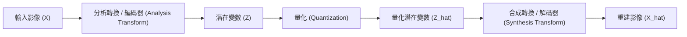

# 第 16 章：基於學習的影像壓縮 (Learned Image Compression)

在過去的章節中，我們探討了 JPEG、JPEG 2000 與 BPG 等傳統影像壓縮技術。這些技術在壓縮效能上取得了巨大的成功，但如果我們將壓縮率推向極致（例如將圖片壓縮 100 倍以上），即便是 BPG 也會出現明顯的失真（如方塊效應、振鈴效應）。本章將介紹如何利用機器學習（Machine Learning, ML）技術，突破傳統壓縮演算法的極限，達到更高的壓縮品質。

## 1. 簡介與動機 (Introduction and Motivation)

傳統的影像壓縮編解碼器（Codecs）大多依賴以下設計：
1. **線性轉換 (Linear Transforms)：** 如離散餘弦轉換（DCT）或離散小波轉換（DWT）。這些線性轉換可以去除相鄰像素間的相關性，但在處理真實世界複雜的影像分佈時，線性邊界不一定是最佳的。
2. **手動設計的啟發式參數 (Hand-tuned Heuristics)：** 例如 JPEG 中的量化矩陣（Quantization Matrices）、8x8 的區塊大小等。這些參數是經過無數專家和心理視覺實驗精心調整出來的，但我們很難證明它們對於「所有影像」或「所有壓縮率」都是最佳解。

**基於學習的壓縮技術 (Learned Compression)** 的核心動機在於：
- **非線性轉換：** 使用深度神經網路（Deep Neural Networks）來取代傳統的線性轉換，從而更有效地捕捉資料中的非線性關係。
- **端到端學習 (End-to-End Learning)：** 將整個壓縮與解壓縮過程視為一個模型，並使用資料驅動（Data-driven）的方式，直接針對最終的率失真（Rate-Distortion）目標進行最佳化，避免依賴手動調整的參數。

## 2. 機器學習與自編碼器基礎 (ML and Autoencoders Basics)

在進入壓縮管線之前，我們先簡單回顧機器學習的三個核心元素：
1. **資料 (Data)：** 用來訓練模型的輸入與輸出。
2. **參數化模型 (Parametric Model)：** 一個由參數（$\theta$）定義的非線性模型（$f(x; \theta)$），在深度學習中通常是多層的神經網路。
3. **損失函數 (Loss Function)：** 衡量模型預測與真實目標差異的函數，訓練的目標是透過梯度下降（Gradient Descent）來最小化這個損失。

在影像壓縮中，我們最常使用一種稱為 **自編碼器 (Autoencoder)** 的網路架構：

- **編碼器 (Encoder)：** 透過多層卷積網路提取影像特徵，降低維度，產生代表影像的**潛在變數 (Latent Variables, $Z$)**。
- **量化 (Quantizer)：** 將連續的潛在變數轉換為離散的符號 ($\hat{Z}$)，以便進行熵編碼。
- **解碼器 (Decoder)：** 從離散符號中還原出**重建影像 ($\hat{X}$)**。

## 3. 基於學習的影像壓縮管線

一個完整的 ML 影像壓縮管線需要涵蓋傳統壓縮的所有步驟，並且設定適當的損失函數來引導網路學習。

### 率失真損失函數 (Rate-Distortion Loss)
在影像壓縮中，我們希望同時最小化「檔案大小（率，Rate）」以及「重建影像的誤差（失真，Distortion）」。因此，損失函數定義為：

$$ L = R + \lambda \cdot D $$

- **失真 ($D$)：** 衡量原始影像 $X$ 與重建影像 $\hat{X}$ 之間的差異，可以使用 L1 距離、MSE（均方誤差）或是更符合人類視覺感知的 MS-SSIM。
- **率 ($R$)：** 代表位元流的長度，可以近似為離散潛在變數 $\hat{Z}$ 的資訊熵，即 $R \approx \log_2(1 / P(\hat{Z}))$。
- **$\lambda$ (Lambda)：** 用來控制率與失真之間權衡的超參數（Hyperparameter）。

## 4. 解決不可微問題 (Solving Non-Differentiability)

為了能使用反向傳播（Backpropagation）演算法進行端到端訓練，整個模型必須是**可微的 (Differentiable)**。然而，壓縮管線中有兩個致命的不可微步驟，研究人員為此提出了巧妙的解決方法。

### 挑戰一：量化 (Quantization)
量化（例如四捨五入到最近整數）是一個階梯函數，其導數幾乎處處為零，這會讓梯度消失，無法更新網路權重。
- **解決方案 (Workaround 1)：**
  - **前向傳播 (Forward Pass)：** 在訓練階段，我們不使用四捨五入，而是加入一個均勻分佈的雜訊（Uniform noise $\mathcal{U}(-0.5, 0.5)$）來模擬量化帶來的誤差。
  - **反向傳播 (Backward Pass)：** 使用**直通估計器 (Straight-through estimator)**，亦即在計算梯度時，直接將量化層視為恆等映射（Identity function），假裝它不存在。

### 挑戰二：離散機率模型 (Probability Model for Rate)
為了計算率損失 $R \approx \log_2(1 / P(\hat{Z}))$，我們需要一個離散機率分佈。但我們無法對一個離散的機率查詢表求梯度。
- **解決方案 (Workaround 2)：**
  - 我們假設潛在變數服從一個連續的先驗分佈（例如標準常態分佈 $\mathcal{N}(0, 1)$）。
  - 我們將離散符號 $\hat{Z}$ 的機率值，近似為連續分佈的累積分佈函數（CDF）的差值：
    $$ P(\hat{Z}) \approx \text{CDF}(\hat{Z} + 0.5) - \text{CDF}(\hat{Z} - 0.5) $$
  - 由於 CDF 是連續且可微的（其導數即為機率密度函數 PDF），因此我們就可以順利地將梯度回傳。
  - 在訓練過程中，網路會自動調整其參數，使得輸出的 $\hat{Z}$ 的分佈盡可能地符合我們假設的連續分佈，以降低率損失。

## 5. 率失真權衡 (Rate-Distortion Trade-off)

在基於學習的壓縮模型中，率失真的權衡是透過損失函數中的 **$\lambda$** 來控制的：
- **提高 $\lambda$：** 損失函數給予「失真」更高的權重。網路傾向於保留更多細節，產生較大的檔案大小（低失真、高比特率）。
- **降低 $\lambda$：** 損失函數給予「率」更高的權重。網路傾向於將 $\hat{Z}$ 集中分佈，產生更小的檔案，但影像會更加模糊（高失真、低比特率）。

通常情況下，一個訓練好的模型只能對應一組特定的率失真權衡。如果需要支援不同的壓縮等級，可能需要訓練多個模型，或是設計特殊的架構來支援變動的 $\lambda$。

## 6. 優勢與挑戰 (Advantages and Challenges)

### 優勢 (Advantages)
1. **無需手動調整參數：** 演算法會自動從資料中學習出最佳的特徵轉換方式。
2. **領域適應性 (Domain Adaptability)：** 我們可以針對特定的影像類型（如醫療影像、卡通、衛星雲圖）訓練專屬的壓縮模型，達到極致的壓縮表現。
3. **靈活的失真度量：** 傳統模型很難直接針對人類感知進行最佳化。而在 ML 模型中，只要失真函數是可微的（如 MS-SSIM 甚至感知神經網路損失），我們就能直接將其放入損失函數中進行端到端最佳化。
4. **卓越的效能：** 在同等位元率下，基於學習的壓縮技術已能穩定超越現有最強的傳統編解碼器（如 VVC/H.266）。

### 挑戰 (Challenges)
1. **計算複雜度與速度：** 推論（解碼）神經網路需要大量的矩陣運算。傳統編解碼器可能只需 1 毫秒，而神經網路可能需要數十倍甚至更長的時間。不過，隨著專用 AI 硬體加速器（如 Apple 神經網路引擎、Nvidia GPU 等）的普及，這個差距正在迅速縮小。
2. **跨硬體的確定性 (Determinism)：** 不同的 CPU 或 GPU 架構在處理浮點數運算時可能存在微小差異。對於熵編碼器而言，機率預測哪怕有百萬分之一的差異，都會導致解碼失敗。因此，確保神經網路在不同裝置上輸出完全一致的結果，是實際部署時的一大挑戰。

---
## 相關作業與材料

本章節的實作與練習對應於 Stanford EE274 官方提供的作業與專案：
- **對應內容**：Project: Learnt Image Compression Exploration

> **注意**：為了遵守學術誠信與課程規範，本書不提供作業的解答代碼。強烈建議讀者親自前往 [EE274 課程筆記網站 (Homeworks 區塊)](https://stanforddatacompressionclass.github.io/notes/) 下載 starter code 並實作，以深化對演算法的理解。
