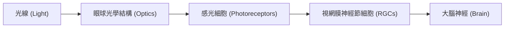
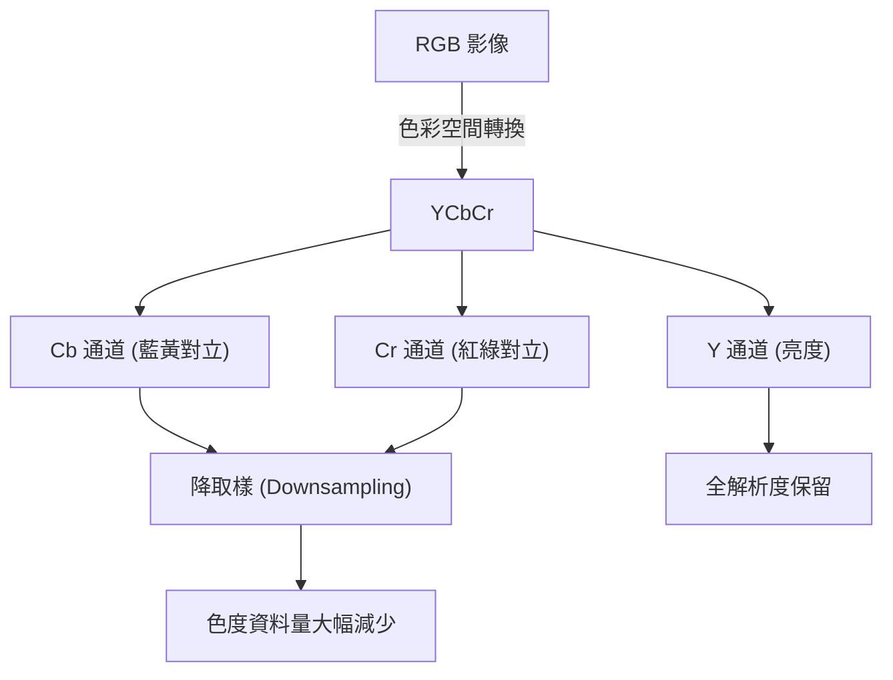

# 第十七章：人類與壓縮 (Humans and Compression)

在本課程進入尾聲之際，我們將探討一個失真壓縮（Lossy Compression）中極為重要卻常被傳統資訊理論忽略的面向——**人類感知 (Human Perception)**。無論是圖片、音訊還是影片，多媒體資料最終的消費者都是人類。因此，理解人類感官系統的運作方式，對於設計實用且高效的壓縮演算法至關重要。

## 1. 為何需要考量人類感知？

在先前的章節中，我們主要使用均方誤差（Mean Squared Error, MSE）作為失真（Distortion）的衡量標準。然而，MSE 並不能完美反映人類的視覺體驗。

- **音訊壓縮的例子**：常見的 MP3 音訊檔通常使用雙聲道（Stereo）與 44.1 kHz 的取樣率。這並非隨機選擇：
  - 雙聲道是因為人類有兩隻耳朵。
  - 44.1 kHz 的取樣率源於人類最高能聽到的頻率約為 20 kHz，根據奈奎斯特（Nyquist）定理，需要 40 kHz 來避免混疊。加上濾波器的緩衝空間以及 44.1 具備多種因數（便於降取樣處理），最終成為了標準。
- **影像壓縮的例子**：幾張相對於原圖具有相同 MSE 的重建圖片，在人類眼中可能品質差異極大。有些看起來模糊，有些布滿噪點，而有些則平滑且自然。這說明了若僅依賴 MSE 設計壓縮器，可能會產生人類無法接受的結果。

## 2. 人類視覺基礎

要設計好的影像壓縮，必須先了解人類視覺系統（Human Visual System, HVS）的基本生理結構。

### 光學低通濾波
在光線抵達視網膜前，眼睛的光學結構就已經對信號進行了**低通濾波（Low-pass Filtering）**。這意味著過高頻率的細節在物理層面上就已經被模糊化了，這也解釋了為何壓縮演算法可以捨棄高頻資訊而不會引起我們的注意。

### 視網膜與感光細胞
視網膜將光信號轉換為大腦能處理的電信號。這裡有兩種主要的感光細胞：
1. **視桿細胞 (Rods)**：
   - 負責編碼**光強度（Intensity）**。
   - 具有極高的動態範圍，能適應從烈日下到暗室的亮度變化（即韋伯定律 Weber's Law，人類對相對亮度變化更敏感）。
   - 分布於整個視網膜（除盲點外）。
2. **視錐細胞 (Cones)**：
   - 負責編碼**色彩（Color）**與細節。
   - 高度集中於視網膜中央的一個微小區域——**中央窩（Fovea）**。

### 微眼跳與注視渲染
既然我們的高解析度視覺（視錐細胞）只集中在中央窩一小塊區域，為何我們感覺看到了整個清晰的世界？這是因為我們的眼睛並非靜止不動，而是不斷進行快速的微小移動，稱為**眼跳（Saccades）**。大腦會將這些快速掃描的片段拼接成一幅完整的影像。
在現代科技中，這項特性能被應用於虛擬實境（VR）的**注視渲染（Foveated Rendering）**技術：只需追蹤眼球位置，將高位元率分配給使用者注視的區域，周邊區域則大幅降低位元率，從而節省大量頻寬。

## 3. 色彩視覺與壓縮設計

### 色彩理論
為何我們常用 RGB？這源於**三原色理論 (Trichromatic Theory)**。人類擁有三種視錐細胞（L、M、S），分別對長波長（紅）、中波長（綠）與短波長（藍）最敏感。

然而，我們的視覺神經在處理這些信號時，其實採用了**對立過程理論 (Opponent Process Theory)**。大腦將信號轉換為對立的色彩通道：
- 黑與白（亮度）
- 藍與黃
- 紅與綠
這正是我們在 JPEG 壓縮中，將 RGB 轉換為 **YCbCr (YUV)** 色彩空間的生理學基礎。其中 Y 代表亮度（Luma），而 Cb 與 Cr 則代表色度（Chroma）。

### 對比敏感度與色度抽樣
**對比敏感度函數 (Contrast Sensitivity Function, CSF)** 描述了人類對不同空間頻率的感知能力。一個關鍵的發現是：**人類對色彩的高頻細節非常不敏感**，遠低於對亮度高頻細節的敏感度。

因此，壓縮器廣泛採用**色度抽樣 (Chroma Subsampling)**（例如 4:2:0）。在 4:2:0 中，我們保留 Y 通道的完整解析度，但將 Cb 與 Cr 通道在空間上進行平均或捨棄，使其資料量降為原來的四分之一。這不僅直接減少了檔案大小，也提升了通道內像素的相關性，讓後續的壓縮算法發揮更好。

## 4. 現代感知失真度量 (Perceptual Metrics)

既然 MSE 無法準確衡量人類的視覺感受，研究人員開發了多種更符合感知的失真度量標準：

1. **基於低階視覺特徵的模型**：
   - **SSIM (Structural Similarity)**：不單純計算像素差異，而是結合了兩幅影像的**亮度 (Luminance, Mean)**、**對比度 (Contrast, Variance)**與**結構 (Structure, Covariance)**。
   - **MS-SSIM**：多尺度版本的 SSIM，能在不同空間頻率下捕捉感知差異。
2. **基於深度學習的模型**：
   - **LPIPS (Learned Perceptual Image Patch Similarity)**：將影像輸入深度神經網路，並測量網路中間層特徵（Embeddings）之間的距離。實驗證明，神經網路學習到的特徵空間與人類感知有高度的一致性。
3. **混合模型**：
   - **VMAF (Video Multimethod Assessment Fusion)**：由 Netflix 推廣的標準。它提取多種預先設計的特徵（如空間特徵、動態特徵），並透過一個基於大量人類主觀評分訓練出來的機器學習模型，將這些特徵融合為單一分數。

## 5. 速率-失真-感知權衡 (Rate-Distortion-Perception Tradeoff)

隨著深度學習與生成模型（如 GAN、Diffusion Models）在壓縮領域的應用，近年來出現了新的理論框架：**速率-失真-感知權衡 (RDP Tradeoff)**。

傳統上我們只在速率（Rate）與失真（Distortion）之間做權衡（$R + \lambda D$）。而在 RDP 框架中，引入了第三個維度：**感知 (Perception)**，通常以影像機率分佈的差異來衡量。

**實務意義**：
假設你要壓縮一張草地的照片。在極低位元率下：
- 僅追求**低失真（MSE）**：你可能會得到一張綠色模糊的圖片（因為去除了所有高頻細節以降低誤差）。
- 追求**好感知（Perception）**：壓縮器可以利用生成模型「無中生有」地生成統計特徵相似的草葉紋理。雖然這些草的位置與原圖完全不同（導致極高的 MSE），但在人類眼中，這是一張清晰逼真的草地照片。

在現代基於深度學習的壓縮模型中，損失函數（Loss Function）往往會同時包含失真項（如 MAE，確保整體結構不偏離太多）與感知項（如 LPIPS 或 GAN Discriminator，確保生成的紋理逼真且符合人類視覺習慣）。

---

理解人類如何看待這個世界，是壓縮技術邁向更高效率與更佳體驗的基石。在面對新的感測器數據（如 VR 追蹤、醫療影像）時，探究資料的最終用途與人類消費者的特性，將永遠是設計優秀壓縮演算法的第一步。

---
## 相關作業與材料

本章節的實作與練習對應於 Stanford EE274 官方提供的作業與專案：
- **對應內容**：Project: Perception and Compression

> **注意**：為了遵守學術誠信與課程規範，本書不提供作業的解答代碼。強烈建議讀者親自前往 [EE274 課程筆記網站 (Homeworks 區塊)](https://stanforddatacompressionclass.github.io/notes/) 下載 starter code 並實作，以深化對演算法的理解。
