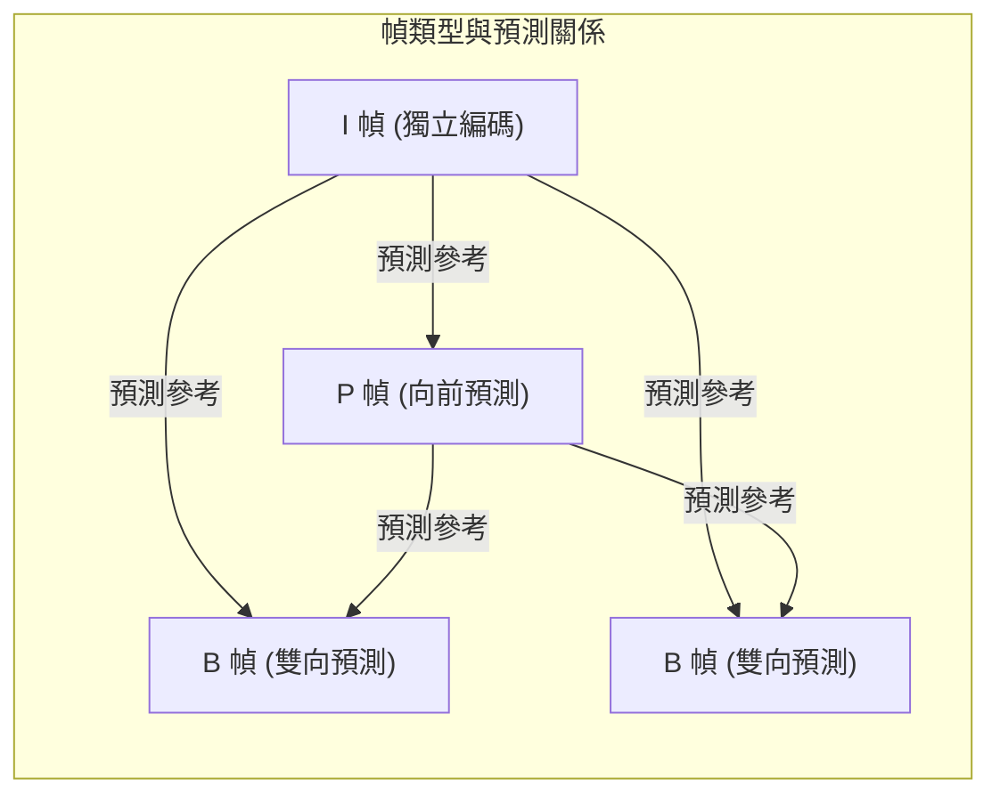

# 第十八章：影片壓縮 (Video Compression)

在本章中，我們將從影像壓縮進入到影片壓縮的領域。未經壓縮的原始影片會佔用極大的資料量，因此影片壓縮技術是現代串流影音、視訊通話等應用的核心基石。

## 影片的基本概念

影片可以視為一連串連續的影像（稱為「幀」或 Frame）。當我們討論影片時，有幾個重要的基本參數：
- **解析度 (Resolution)**：每一幀影像的像素大小，如 720p、1080p 或 4K。
- **幀率 (FPS, Frames Per Second)**：每秒顯示的幀數，常見有 30 FPS 或 60 FPS。
- **色彩空間 (Color Scheme)**：如 YUV 4:2:0（利用人類視覺對亮度比彩度敏感的特性，對彩度進行降採樣）。

以一段 720p、30 FPS 的未壓縮影片為例，其資料傳輸率可能高達 330 Mbps 以上。這遠遠超出了大多數家庭網路的頻寬，因此需要如 H.264 (AVC)、H.265 (HEVC)、VP9、AV1 等影片編解碼器 (Codec) 來進行大幅度壓縮。由於影片編解碼極度消耗運算資源，現代設備（如 Apple M 系列晶片）通常配備專屬的硬體媒體引擎 (Media Engine) 來處理這些工作。

## 影片壓縮的核心原理：去除時域冗餘

影片中連續的影格之間通常有極高的相似性。影片壓縮最大的關鍵就是找出並去除這些「時域冗餘 (Temporal Redundancy)」。根據壓縮方式的不同，影片的幀被分為以下三種主要類型：

### 1. I 幀 (I-frame, Intra-coded picture)
I 幀的壓縮方式與一般的影像壓縮（如 JPEG）非常相似。它完全獨立進行編碼，不依賴其他幀的資訊。
- **優點**：提供隨機存取點 (Random Access Point)。當你在 YouTube 上拖曳時間軸時，播放器必須先找到最近的 I 幀才能開始解碼畫面。此外，影片編輯時（如 ProRes 格式）常使用純 I 幀編碼，以降低編輯時的運算負擔。
- **缺點**：壓縮率最低，佔用最大的資料量。

### 2. P 幀 (P-frame, Predictive coded picture)
P 幀利用**前一幀**（已經解碼的 I 幀或 P 幀）來預測當前的畫面。
- **運動估計 (Motion Estimation)**：編碼器會將畫面切割成許多小區塊，並在前一幀中尋找最相似的區塊，藉此計算出**運動向量 (Motion Vectors)**。
- **殘差編碼 (Residual Encoding)**：將當前畫面減去預測畫面，得到「殘差 (Residual)」。因為畫面間差異通常很小，殘差矩陣中大部分的值都會接近零，這使得它能被極高效率地壓縮。

### 3. B 幀 (B-frame, Bi-predictive coded picture)
B 幀會同時參考**過去**與**未來**的幀來進行雙向內插 (Interpolation) 預測。
- **優點**：內插預測通常比外插預測（P 幀）更準確，因此能產生更小的殘差，達到極高的壓縮率。
- **缺點**：為了編碼或解碼當前的 B 幀，系統必須先處理未來的參考幀，這會引入明顯的**延遲 (Latency)**。

## 應用場景與權衡 (Trade-offs)

由於 I、P、B 幀各自的特性，不同的應用場景會採取不同的編碼策略：
- **低延遲需求 (視訊會議)**：如 Zoom、FaceTime 等需要即時互動的軟體，無法容忍 B 幀帶來的延遲，因此主要依賴 I 幀與 P 幀。
- **高壓縮需求 (隨選視訊)**：如 Netflix、YouTube 等預先編碼好的影片，因為播放時不需要即時互動，所以會大量使用 B 幀以最大化壓縮率並節省頻寬。

## 機器學習在影片壓縮中的潛力

傳統的區塊比對演算法在低位元率 (Low Bitrate) 下容易產生「區塊偽影 (Blocky Artifacts)」。近年來，基於機器學習 (ML) 的影片編碼技術開始蓬勃發展：
1. **平滑的運動向量**：ML 模型可以學習到更自然、平滑的光流 (Optical Flow) 與運動表徵，減少生硬的區塊感。
2. **感知優化**：ML 模型可以直接針對人類視覺感知的指標（如 MS-SSIM）進行優化，而不僅是針對傳統的均方誤差 (MSE) 或 PSNR。
3. 挑戰在於如何讓這些龐大的 ML 模型在使用者設備上達到即時 (Real-time) 編解碼的要求。

## EE274 課程總結

這是資料壓縮課程的最後一講，回顧整個課程，我們涵蓋了：
- **無損壓縮 (Lossless Compression)**：探討資訊熵 (Entropy) 的理論極限，並學習了霍夫曼編碼 (Huffman Coding)、算術編碼 (Arithmetic Coding)、LZ77/LZ78 以及基於模型的通用壓縮。
- **有損壓縮 (Lossy Compression)**：從標量/向量量化 (Quantization) 到轉換編碼 (Transform Coding，如 DCT 分解)，並探討了 JPEG 影像壓縮。
- **進階與未來應用**：分散式壓縮 (Distributed Compression)、簡明資料結構 (Succinct Data Structures，在壓縮狀態下維持隨機存取能力)、神經網路模型的量化壓縮、AR/VR 影像壓縮以及基因體資料壓縮。這些領域展示了壓縮技術在未來科技中的關鍵地位。

---
## 相關作業與材料

本章節的實作與練習對應於 Stanford EE274 官方提供的作業與專案：
- **對應內容**：Project: Video Compression Applications

> **注意**：為了遵守學術誠信與課程規範，本書不提供作業的解答代碼。強烈建議讀者親自前往 [EE274 課程筆記網站 (Homeworks 區塊)](https://stanforddatacompressionclass.github.io/notes/) 下載 starter code 並實作，以深化對演算法的理解。
