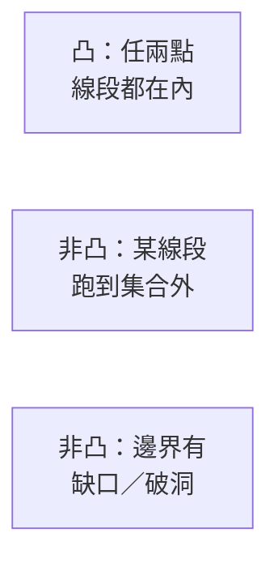
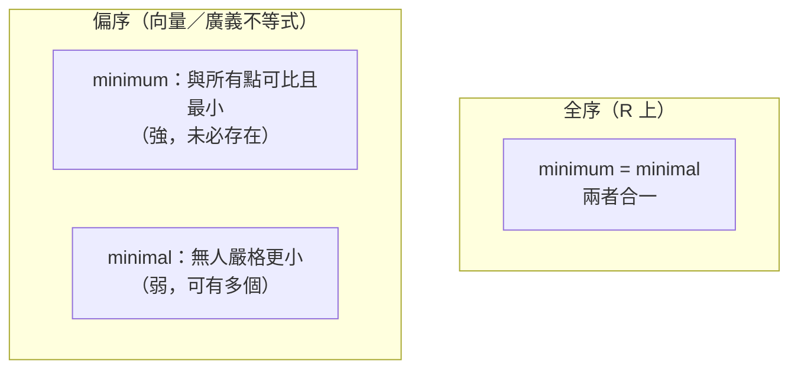

# 凸集

對應逐字稿：`data/EE364A/transcripts/Stanford EE364A Convex Optimization I Stephen Boyd I 2023 I Lecture 2 [2H4_7izio9Y].en.txt`

本章已完整閱讀逐字稿，閱讀筆記見 [Lecture 2 閱讀筆記](notes/lecture-02-convex-sets.md)。

> Boyd 在開場再次預告：接下來兩週幾乎是純數學，會和應用暫時脫節。「如果你此刻懷疑當初為什麼選這門課，那完全正常。」他的建議是先抓大方向、拿到七成掌握度即可，等到後半段做統計、控制、訊號處理時，這些抽象概念會突然全部串起來。本章因此把重點放在「常見凸集的目錄」與「如何用保凸運算構造並辨識凸集」，這正是本課要訓練的實務技能。

## 一點歷史：為什麼凸優化值得學

進入數學之前，Boyd 給了一段簡短的歷史定位，幫我們理解這門學問的位置：

- 作為**數學領域**，凸性至少有 120 年歷史。19 世紀末人們就在寫下我們今天稱為「凸性」的不等式，20 世紀初被正式命名——因為「大家一直看到同一個蠢不等式，乾脆給它取個名字」。到 1970 年代，凸分析作為純數學基本上已經「收工」，有一本寫得很漂亮的凸分析教科書把它包得乾乾淨淨。但純數學不談「怎麼用、怎麼算、怎麼真的解出這些問題」。
- 對我們而言真正有趣的歷史，始於 1940 年代——這**不是巧合地**與電腦的誕生同步。Boyd 強調本課的魅力在於「everything is actionable（一切都可付諸實行）」，這和純數學課很不一樣。這時期出現了求解線性規劃的 **simplex 演算法**，推廣者之一 George Dantzig 正是 Stanford 教授。
- 1960–80 年代，超越線性規劃的大量工作發生在**蘇聯**。2000 年後，統計與機器學習接手（logistic regression、SVM 等）。有趣的轉折是：當年為凸問題發展、但本課不教的 subgradient 類方法，後來反而成了訓練神經網路這類**非凸**問題的主流方法。
- 應用其實更早：1950 年代航太就在設計「能承受動靜態載重的最輕結構」（每一克結構都在吃掉酬載，對航太極其重要）；1960 年代電機在設計 FIR 濾波器。真正「開閘」是 1990 年代末到 2000 年代初的控制、訊號處理與通訊——人們發現「替一堆無線系統分配功率」這類問題往往就是凸的。

## 從一條線開始：仿射與凸

回到最基本的地方。給定兩個相異點 $x_1, x_2 \in \mathbf{R}^n$，考慮帶兩個係數、且**係數和為 1** 的組合：

$$
x = \theta x_1 + (1-\theta) x_2 .
$$

當 $\theta$ 掃過所有實數時，這條式子**參數化**了通過 $x_1, x_2$ 的整條直線：$\theta=1$ 在 $x_1$、$\theta=0$ 在 $x_2$、$\theta=\tfrac12$ 在中點。這種「係數和為 1」的線性組合叫做**仿射組合（affine combination）**。

由此往上疊三層條件，得到本章一切的骨架：

| 組合類型 | 係數條件 | 幾何／別名 |
|---|---|---|
| 線性組合 | 無 | 整個子空間 |
| 仿射組合 | $\sum \theta_i = 1$ | 通過各點的直線／仿射集 |
| 凸組合 | $\sum \theta_i = 1$ 且 $\theta_i \ge 0$ | 線段／mixture／加權平均／期望值 |
| 錐組合 | $\theta_i \ge 0$（不必和為 1） | 由原點張出的扇形／錐 |

Boyd 特別點出：凸組合就是機率裡的**期望值**——若把 $\theta_i$ 看成隨機向量取值 $x_i$ 的機率，這個組合正是 $\mathbf{E}[X]$。所以「mixture、加權平均、期望值」講的都是同一件事。

**仿射集（affine set）**：包含集合中任兩相異點所決定的整條直線。一個經典且**通用**的例子是線性方程組的解集 $\{x : Ax=b\}$——不僅它是仿射集，而且**每個仿射集都能寫成這種形式**。仿射集一定是凸的。

> Boyd 的「稽核」建議：他大部分斷言都不會證明。他建議你「每十個斷言，就挑一個，機率 0.1 地動手驗一下」。例如要驗 $\{x:Ax=b\}$ 是仿射集，就設 $x_1,x_2$ 都滿足 $Ax=b$，取任意 $\theta$，代入 $\theta x_1+(1-\theta)x_2$ 檢查是否仍滿足——很直接。

**凸集（convex set）**：把 $\theta$ 限制在 $[0,1]$，仿射組合就描出 $x_1$ 與 $x_2$ 之間的**線段**。凸集就是「含任兩點之線段」的集合，或者用 Boyd 的話：集合內任兩點**彼此有清楚的視線（line of sight）**。

**凸包（convex hull）** $\mathbf{conv}\,S$ 是 $S$ 中所有點的所有凸組合之集，等價地說，它是**包含 $S$ 的最小凸集**。注意凸組合的係數不唯一（同一點若落在不同三角形內，可有不同的權重表示）。

## 常見凸集目錄

本講的前半就是「逛一遍最常見的凸集」，目的是讓你下次看到它們就直接知道是凸的。

### 超平面與半空間

- **超平面（hyperplane）**：單一非零線性方程的解集 $\{x : a^\top x = b\}$。二維是直線、三維是平面、更高維就叫超平面。
- **半空間（half space）**：把等號換成不等號，$\{x : a^\top x \le b\}$——單一非零線性**不等式**的解集。$a$ 是這個半空間的**外法向量（outward normal）**：normal 指垂直於超平面，outward 指指向外。「外向」這種帶方向的概念在線性代數裡是沒有的——凸分析就像是「替線性代數引入不對稱」。

半空間與超平面都是凸的。

### Euclidean 球與橢球

採用標準記號：$\|\cdot\|_2$ 是 Euclidean 範數，不帶下標的 $\|\cdot\|$ 是一般範數。

**球（ball）**：中心 $x_c$、半徑 $r>0$，

$$
B(x_c, r) = \{ x : \|x - x_c\|_2 \le r \}.
$$

**橢球（ellipsoid）**：允許各方向有不同「直徑」，一種寫法是用二次型

$$
\mathcal{E} = \{ x : (x-x_c)^\top P^{-1} (x-x_c) \le 1 \},\quad P \succ 0 .
$$

當 $P = r^2 I$ 時橢球退化成球。這裡用 $P^{-1}$ 只是慣例，用 $P$ 也可以，因為正定矩陣的逆仍正定。橢球還有另一種參數化 $\{x_c + Au : \|u\|_2 \le 1\}$。Boyd 提醒一個「物件導向」的小陷阱：橢球的 `==`（判斷兩橢球相等）並不簡單——用 $(P, x_c)$ 表示時要 $P,x_c$ 各自相等；用 $A$ 表示時，兩個 $A$ 只需相差一個旋轉即代表同一橢球。若強制 $A$ 對稱正定，判等才變簡單。約在第 5 週，本課會用不同參數化來解「最大內接橢球／最小外覆橢球」這類問題。

這裡引入貫穿全課的記號：$\mathbf{S}^n$ 是 $n\times n$ 對稱矩陣的集合（一個向量空間），$\mathbf{S}^n_{++}$ 是正定、$\mathbf{S}^n_+$ 是半正定。

### 範數、範數球與範數錐

**範數（norm）** 是任何滿足以下三條的函數 $\|\cdot\|$（雙豎線是要喚起實數絕對值的推廣）：

1. 非負且**定性（definite）**：$\|x\|\ge 0$，且 $\|x\|=0 \iff x=0$；
2. **一次齊次**：$\|tx\| = |t|\,\|x\|$；
3. **三角不等式**：$\|x+y\| \le \|x\| + \|y\|$。

**範數球**把 Euclidean 換成任意範數即可。例如 $\ell_\infty$ 範數 $\|x\|_\infty = \max_i |x_i|$，其球 $\{x : \|x - (1,1)\|_\infty \le \tfrac12\}$ 是一個正方形。

**範數錐（norm cone）** 是本課反覆出現的手法：處理 $\mathbf{R}^n$ 的集合時，常抬升到 $\mathbf{R}^{n+1}$ 多帶一個純量（就像函數的 graph 活在高一維）。定義

$$
K = \{ (x, t) : \|x\| \le t \} \subseteq \mathbf{R}^{n+1}.
$$

要驗它是錐：把 $(x,t)$ 乘以 7，範數放大 7 倍、$t$ 也放大 7 倍，仍在錐內。Euclidean 版稱 **second-order cone（二階錐）**，也叫 **Lorentzian cone**（源自狹義相對論的不等式，嚴格說相對論的是上下兩半，這裡只取上半）。曾有人想推廣叫它「ice cream cone（冰淇淋甜筒）」，Boyd「非常高興地報告：這名字沒流行起來」。

### 多面體與 polytope

先引入逐元素不等式記號：向量間的波浪不等式 $Ax \preceq b$ 表示**逐元素**成立，即每一列 $a_i^\top x \le b_i$ 是一個半空間。

**多面體（polyhedron）** 就是一組線性不等式（可含等式）的解集，幾何上是**有限多個半空間的交集**：

$$
P = \{ x : a_i^\top x \le b_i,\ i=1,\dots,m \}.
$$

它必為凸。有些作者稱之為 **polytope**；更混亂的是「有界時才叫 polytope」這個約定，兩派作者的用法**恰好相反**。本課不區分，統一看待。

### 半正定錐

$\mathbf{S}^n$ 的維數是 $n(n+1)/2$（$n^2$ 個數，但上三角與下三角重複）。加下標得半正定錐 $\mathbf{S}^n_+$。這裡**重載**了波浪不等式：出現在向量間是逐元素，出現在對稱矩陣間則表示「差為半正定」（Löwner 序）。

以 $2\times 2$ 為例，一般對稱矩陣 $\begin{bmatrix} x & y \\ y & z\end{bmatrix}$ 半正定的條件是

$$
x \ge 0,\quad z \ge 0,\quad xz \ge y^2 .
$$

（對角元非負、行列式非負。）畫在 $(x,y,z)$ 空間裡，它的邊界「歪頭一看」其實就是一個旋轉過的二階錐。半正定矩陣在許多領域出現：共變異數矩陣、橢球的參數化等，因此這個「PSD 錐」會不斷回來。

## 核心方法論：用保凸運算做語法驗證

看完目錄，Boyd 轉入本講真正的重點——實務上**怎麼判斷一個集合是不是凸的**。他借**微積分**作比喻：微積分之所以好用，是因為給你少數「atoms（如 $\sin$ 的導數是 $\cos$）」加上少數「規則（乘法律、連鎖律）」，記熟三四十個 atom 就能算各種導數。凸性驗證要做「精神上完全相同」的事：

- **atoms**＝上面那份基本凸集清單（半空間、多面體、範數球、範數錐……）；
- **規則**＝一組**保凸運算（operations that preserve convexity）**。

於是你把目標集合 $C$ **構造**成「對已知凸集施加保凸運算」的結果，這就是對凸性的**語法式（syntactic）驗證**——「這是橢球、那是半空間、取個交集，所以凸」。回到定義硬證（取 $x_1,x_2,\theta$ 逐步論證）應該是**最後手段**，幾乎永遠不該是第一選擇。

> **「Method zero」——街頭實戰啟發式（不是證明）。** Boyd 半開玩笑地補充一招沒放進投影片的方法：寫段程式隨機抽兩點與 $\theta$，檢查凸組合是否還在集合內，一找到反例就停。若找到反例，你**確定**它非凸（然後「刪掉腳本、別 push、之後跟朋友說『憑直覺』」）。但若跑了一億對都沒反例呢？「你什麼都不知道」——這只是啟發式，證不了凸性。這段用來強調：語法構造才是可靠的證明，隨機測試只能否證、不能肯定。

### 保凸運算一：交集

凸集的交集仍凸，甚至**無限多個**凸集的交集也凸（例如無限多個半空間之交）。

一個漂亮的例子是**三角多項式**。設

$$
f(t) = x_1 \cos t + x_2 \cos 2t + \cdots ,
$$

集合 $S$ 是使 $|f(t)| \le 1$ 對所有 $|t| \le \pi/3$ 都成立的**係數** $x$ 之集。它是凸的：固定某個 $t=t_0$，$\{x : |f(t_0)| \le 1\}$ 其實是係數空間裡的一個 **slab（板）**——兩個平行半空間 $\{x : |a^\top x| \le b\}$ 夾出來的區域。於是

$$
S = \bigcap_{t \in [0,\pi/3]} \{ x : |f(t)| \le 1 \}
$$

就是**無限多個 slab 的交集**，故凸。這種「把看似複雜的集合拆成無限交集」是很有用的視角。

### 保凸運算二：仿射函數的像與反像

**仿射函數**＝線性函數加常數。Boyd 順帶抱怨大家常把 affine 和 linear 混用（「piecewise linear」其實多半指 piecewise affine）——「只有在你百分之百清楚差別時，才准混用」。

若 $f$ 是仿射函數，$C$ 凸，則：

- **像（image）** $f(C) = \{ f(x) : x \in C \}$ 凸；
- **反像（inverse image）** $f^{-1}(C) = \{ x : f(x) \in C \}$ 凸。

這裡的 $f^{-1}$ 是**反像**（把所有映進 $C$ 的點收集起來），**不需要 $f$ 可逆**，它不是反函數——這是全世界通用的標準數學用法。例如取「五次三角多項式的前兩個係數」這個線性映射，其反像可描述為「所有能被補全成滿足 $|f(t)|\le1$ 之三角多項式的前兩個係數」。

### 保凸運算三：透視函數與線性分式函數

**透視函數（perspective function）** 把 $(x,t) \in \mathbf{R}^{n+1}$（$x$ 是向量、$t$ 是純量）映成

$$
P(x,t) = x/t,\quad \operatorname{\mathbf{dom}} P = \{ (x,t) : t > 0 \}.
$$

它顯然**不是線性的**（固定 $t$ 時對 $x$ 線性，但對 $t$ 完全非線性）。**透視函數的像與反像仍保凸**——Boyd 強調這「一點都不顯然」。把透視與仿射函數複合，得到**線性分式函數（linear-fractional function）**（更精確該叫 affine-fractional），約定分母恆正。它在很多場合出現：機率裡的**條件化（conditioning）** 本質上就是對機率質量函數做線性分式；電腦視覺的**成像**也是。

> Boyd 用一支鉛筆做幾何直覺：把 3D 場景投影到（假設是平的）視網膜上。**線段會映成線段**，這就夠了——若集合裡每條線段都映成線段，凸性就保住了。但注意：線段的**中點不會映到像的中點**（除非物體離得很遠、近似線性，像望遠鏡頭那樣）。想像把一張圖平放地面、用無人機低空俯視，近的一端因為 **foreshortening（透視縮短）** 而顯得放大——這就是線性分式映射的樣子，也是為什麼它對我們的眼睛如此自然。

## 廣義不等式與 minimum／minimal

### 由 proper cone 定義的序

最後 Boyd 用凸錐把「不等式」推廣到向量。一個 **proper cone（正常錐）** $K$ 需滿足：

- **closed（閉）**：含極限點（屬 analysis，本課不深究）；
- **solid（實心）**：有非空內部；
- **pointed（尖）**：不含任何整條直線。

Boyd 誇這三個詞選得極好、很傳神，並在 $\mathbf{R}^2$ 給反例：一條 **ray（射線）** 不 solid；一個 **half space** 不 pointed（含直線）；而一個真正的扇形錐才三者兼備。常見的 proper cone 有非負卦限與半正定錐（PSD 錐是閉、實心、尖的——除了 0，沒有哪個半正定矩陣的負也半正定）。

由 proper cone 定義**廣義不等式**：

$$
x \preceq_K y \iff y - x \in K .
$$

- 取非負卦限 $\mathbf{R}^n_+$，$\preceq_K$ 就是**逐元素不等式**；
- 取 PSD 錐，$\preceq_K$ 就是**矩陣（Löwner）序**。

之後就把下標省略，看到向量間的波浪不等式即逐元素、對稱矩陣間即半正定序。Boyd 借此談「符號設計」：好的記號要**喚起既有直覺**（如 $a\preceq b, c\preceq d \Rightarrow a+c\preceq b+d$ 這類你猜多半成立的性質），但有些看似成立的性質其實為假——分辨真假就是你的工作。

### 全序的破裂：minimum vs minimal

實數上的 $\le$ 是**全序（total ordering）**：任兩數必可比。但向量序**不是**全序，容易找到兩個互不 $\preceq$ 的向量。這個差別在後續「多目標」情境很關鍵——例如同時想要「訓練誤差小」和「模型複雜度低」，兩個設計常常**無法比較**。

因為序不再是全序，R 上原本合一的「最小」概念**分裂成兩個**：

| 概念 | 定義 | 直覺 |
|---|---|---|
| **minimum（最小元）** | $x$ 使集合中**每個**點都與它可比且 $\succeq x$ | 很強：它比所有人都小；不一定存在 |
| **minimal（極小元）** | 集合中**沒有**其他點 $\preceq x$（除自己） | 較弱：沒人嚴格比它小，但可能有人與它不可比 |

幾何上用（平移的）卦限判斷：以 $x_1$ 為頂點、朝 $\succeq$ 方向張開的卦限，若**整個集合**都落在其中，$x_1$ 就是 minimum；而 $x_2$ 為 minimal，是指「$\preceq x_2$ 的那塊卦限」與集合的交集只剩 $x_2$ 自己。這類點在不同領域叫 **Pareto 點** 或 **efficient design**，後續多目標優化會回來詳談。

## 本章小結

- 凸性作為數學已超過一世紀、1970 年代收工；真正起飛與電腦（1940s）同步，因為「一切都可付諸實行」。
- 三種組合層層堆疊：仿射（係數和為 1）、凸（再加非負，即 mixture／期望值）、錐（只要非負）。仿射集皆凸；凸集＝含任兩點線段。
- 凸包＝所有凸組合＝含 $S$ 的最小凸集。
- 常見凸集目錄：超平面、半空間（$a$ 為外法向量）、球與橢球、範數球、範數錐（二階／Lorentzian 錐）、多面體、半正定錐（$\dim \mathbf{S}^n = n(n+1)/2$；$2\times2$ 條件 $x,z\ge0,\ xz\ge y^2$）。
- 核心方法論：把集合**構造**成對已知凸集施加**保凸運算**的結果，做語法式驗證；回到定義硬證是最後手段。
- 保凸運算：交集（可無限）、仿射函數的像與反像（反像不需可逆）、透視函數 $x/t$、線性分式函數。三角多項式＝無限多 slab 的交集。
- 透視／線性分式保凸「不顯然」，用視網膜成像／無人機俯視直覺理解：線段映成線段，但中點不映到中點。
- 廣義不等式 $x\preceq_K y \iff y-x\in K$ 由 proper cone（閉、實心、尖）定義；非負卦限給逐元素序、PSD 錐給 Löwner 序。
- 向量序非全序，故「最小」分裂為 minimum（強、未必存在）與 minimal（弱、可多個，即 Pareto／efficient 點）。

## 相關教材與材料

此段只建立關聯，不提供作業解答。若材料尚未核對或資訊不足，保留 `待補`。

- 對應 slides：`data/EE364A/course material/slids/02_Convex sets.pdf`（Convex sets）。狀態：待核對與逐字稿的逐頁對應。
- 對應教科書：《Convex Optimization》（Boyd & Vandenberghe）第 2 章 Convex sets；`data/EE364A/course material/` 內有 PDF。狀態：待核對頁碼、定義與定理編號（`待補`）。
- 版本注意：逐字稿為 Boyd 2023 版，行政資訊（作業、考試、評分）屬另一學期版本，集中於附錄，不與本章內容混寫。Boyd 於本講提到 Homework 1 已指派。
- 缺少的材料或 URL：橢球各參數化間的精確轉換、線性分式映射保凸的完整證明，逐字稿未展開，標 `待補`，不自行補證。
