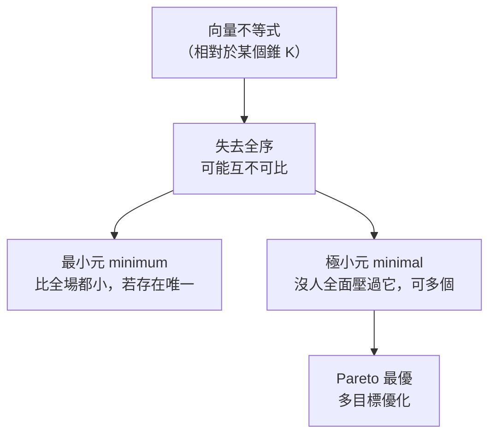
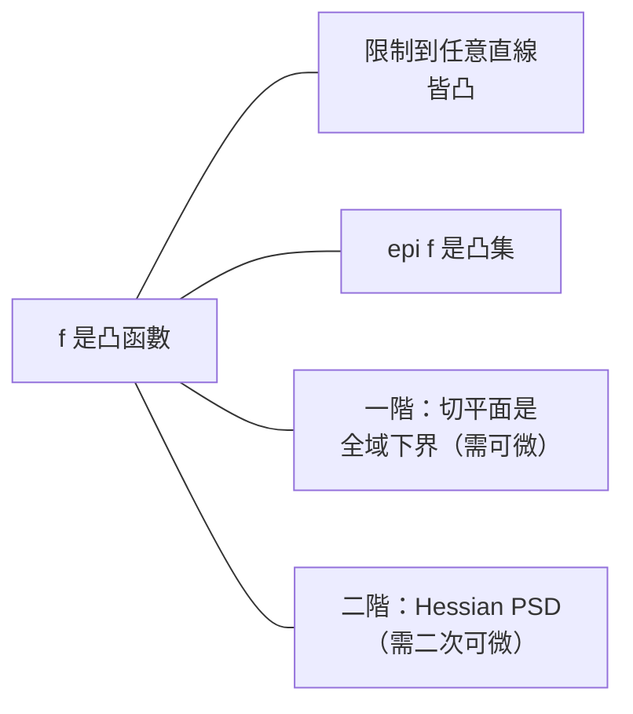

# 凸函數

對應逐字稿：`data/EE364A/transcripts/Stanford EE364A Convex Optimization I Stephen Boyd I 2023 I Lecture 3 [1menqhfNzzo].en.txt`

本章已完整閱讀逐字稿，閱讀筆記見 [Lecture 3 閱讀筆記](notes/lecture-03-convex-functions.md)。

> Boyd 在本講開頭再次誠實預告：此刻仍是「完全沒有動機的背景數學（unmotivated background material）」，本週（大約到週五）會把這段純數學走完，之後「太陽就會出來」，課程才會變得真正有趣。但他也提醒：這些現在看似枯燥的工具，整個下半學期都會用到——很多人上到第八、九份作業、真的拿它去擬合模型或優化網路流量時，才恍然大悟。本章把這一講分成兩半：前半替「凸集」章節收尾（極小元、分離／支撐超平面、對偶錐），後半正式進入本章主角——**凸函數**。

## 一、凸集章節的收尾

### 廣義不等式不是全序

上一講用一個 **proper cone（正常錐）** $K$ 定義廣義不等式 $x \preceq_K y \iff y - x \in K$。實務上幾乎只用兩個錐：

- **非負卦限（nonnegative orthant）** $\mathbf{R}^n_+$：逐元素比較兩個向量。
- **半正定錐（PSD cone）** $\mathbf{S}^n_+$：比較兩個對稱矩陣，$A \preceq B$ 意指 $B - A$ 半正定。

「不等式」這個符號與名稱本身就是強大的記號（powerful notation），會讓你聯想到實數的大小關係——就像看到 $Ax = b$ 會想起小學解方程，只是這裡的 $A$ 是 $2000 \times 1000$ 的矩陣。推廣的意義在於：舊世界的許多性質仍然成立，少數不成立。**最關鍵的失去**是：向量不等式**不是線性序／全序（total ordering）**。對兩個實數，必然一個 $\le$ 另一個；但兩個向量可能**互不可比**——既非 $x \preceq y$，也非 $y \preceq x$。這個看似顯然的事實，後面會有大量實際後果。

（附帶提醒：對無限集合，$\min$ 要換成 **infimum（下確界）**。若不熟這個詞，暫時就當成 $\min$，只是它對無限集合也有定義。）

### 最小元 vs 極小元

因為失去全序，「最小」這個概念**分裂成兩個很不一樣的概念**：

| 概念 | 定義（相對於錐 $K$） | 個數 | 直覺 |
|---|---|---|---|
| 最小元（minimum） | 集合中某點 $x$，使**其餘所有點**都可比且 $\succeq_K x$ | 若存在則唯一 | 「打遍全場、比誰都小」 |
| 極小元（minimal） | 集合中某點 $x$，**沒有**其他點 $\preceq_K x$（除自身） | 可以有很多個 | 「沒人能全面壓過它」 |

兩者**永遠是相對於某個特定錐**而言。Boyd 現場示範：把 R2 裡的錐換成另一個較窄的小錐，重新檢查同一點 $x_2$ 是否仍為極小——方法是找出「所有 $\preceq$ 該點」的區域，與集合 $S$ 取交集，若交集只剩該點本身，它就是極小。換錐後結論仍成立。

### 分離超平面定理

**分離超平面定理（separating hyperplane theorem）**：若兩個凸集 $C$、$D$ **不相交（disjoint）**，則存在非零向量 $a$ 與純量 $b$，使

$$
a^\top x \le b \ \ (\forall x \in C), \qquad a^\top x \ge b \ \ (\forall x \in D).
$$

也就是可以「塞一張超平面把兩者隔開」。Boyd 對它評價極高：**幾乎整門課都可以說建立在這一張圖上**，因此值得在腦中留一張能「說明一切」的圖。它現在沒有脈絡，但到第五週會化身為經濟學的**無套利（no arbitrage）** 條件；機器學習裡兩組點「線性可分」也是同一件事。至於「嚴格分離」等各種變體，看書見到一兩個即可，不必背。

### 支撐超平面定理

**支撐超平面（supporting hyperplane）**：集合（不必凸）邊界上一點處，一張**通過該點、且把整個集合放在其一側**的超平面（大致就是切平面）。

**支撐超平面定理**：凸集在**每一個邊界點**都存在支撐超平面。幾何細節：

- 平滑邊界點：支撐超平面唯一（切線）。
- **kink（尖角向外）**：可以有**多個**支撐超平面。
- **凹進去的角點**：**沒有**支撐超平面——這正是非凸的表徵。

**逆定理**也成立：若一個集合在每個邊界點都有支撐超平面，則它是凸的。

### 對偶錐與廣義不等式

**對偶錐（dual cone）** 定義為

$$
K^* = \{\, y \mid y^\top x \ge 0 \ \text{for all } x \in K \,\}.
$$

即「與 $K$ 中每個向量都夾角不超過 $90°$（內積非負）」的所有向量。它是線性代數中**正交補** $V^\perp$（把「等於 0」換成「$\ge 0$」）的推廣——Boyd 說本章某種意義上就是「用不等式做線性代數」。幾個要記住的例子：

| 錐 $K$（在 R2） | 對偶錐 $K^*$ | 觀察 |
|---|---|---|
| Singleton $\{0\}$ | 全空間 $\mathbf{R}^2$ | 錐越小，對偶越大 |
| $\mathbf{R}^2$ | $\{0\}$ | 錐越大，對偶越小 |
| 射線 ray | 半空間 half space | 尖 ↔ 鈍 |
| 非負卦限 $\mathbf{R}^n_+$ | $\mathbf{R}^n_+$ 自身 | **自對偶（self-dual）** |

兩個反覆出現的「meta 概念」：（1）**小錐 ↔ 大錐**，就像共軛關係——時間上很窄的訊號，其傅立葉轉換很寬。（2）**對偶的對偶＝自身**（$K^{**}=K$），如同複數的共軛之共軛、$V^{\perp\perp}=V$。這些等式常需用到 Cauchy–Schwarz 之類的不等式才能嚴格證明，適合放在作業練習。

### 對偶錐如何刻畫最小元與極小元

對偶錐把「最小／極小」翻譯成**線性掃描**，這是後續多目標優化與對偶的種子：

- **最小元**：$x$ 是 $S$ 的最小元 $\iff$ 對**任意** $\lambda \succ_{K^*} 0$，$x$ 都是 $\min_{z\in S}\ \lambda^\top z$ 的唯一最小者。以非負卦限為例：**不論你怎麼給正權重**，加權後最小化總是到達同一點——這正是「最小元全面最好」的體現。
- **極小元**：取**某一個**正權重 $\lambda \succ_{K^*} 0$ 去最小化線性函數 $\lambda^\top z$，得到的解保證是**極小點**。這就是多目標優化裡「取非負加權組合再最小化」得到 **Pareto 最優** 的做法。

一個經濟學嬰兒範例：一個**生產集合（production set）** 描述所有可行的投入組合（例如 fuel 與 labor）。只要每種投入都是正價值，「往左下移動」就更好；把明明可以少用資源卻多用的選擇稱為不效率——Boyd 的技術名詞是「stupid choice」。有人反問「你還沒告訴我價格怎麼知道更好？」，答案是：只要價格為正就一定更好。這就是效率／極小點／Pareto 最優。

## 二、凸函數

### 定義

**凸函數（convex function）** $f:\mathbf{R}^n\to\mathbf{R}$，其 **domain（定義域）** 為凸集，且對所有 $x,y$ 與 $0\le\theta\le1$：

$$
f\big(\theta x + (1-\theta) y\big) \ \le\ \theta f(x) + (1-\theta) f(y).
$$

幾個等價讀法：

- **弦在圖形上方**：連接圖上兩點的**弦（chord）** 永遠不低於函數圖形。
- **非負曲率**：函數「向上彎」；零曲率即 affine（既凸又凹，落在邊界上）。
- 「函數作用於混合 $\le$ 函數值的混合」——先取加權平均再代入，總是拿到 $\le$。
- 談的其實就是**二階導數的正負號**。

相關定義：$f$ 是 **concave（凹）** 若 $-f$ 凸（向下彎）；$f$ 是 **strictly convex（嚴格凸）** 若上式在 $0<\theta<1$ 時嚴格成立。

### R 上的例子（用眼睛畫圖檢查）

在一維，檢查凸性就是「在腦中畫圖」。

| 凸 | 凹 |
|---|---|
| affine $ax+b$（等號成立） | $\sqrt{x}$ |
| $e^{ax}$（任意 $a$） | $x^{0.7}$（$0\le a\le1$ 的冪） |
| 冪 $x^a$，$a\ge1$ 或 $a<0$（如 $1/x$） | $\log x$ |
| negative entropy $x\log x$ | entropy $-x\log x$ |

### $\mathbf{R}^n$ 與矩陣上的例子

- **affine 函數** $a^\top x + b$：既凸又凹（零曲率）。
- **任意範數（norm）**：都是凸的，包含 $p$-norm（$p\ge1$）：1-範數（絕對值之和）、2-範數（歐氏）、$\infty$-範數（取最大）。三範數（立方和的立方根）也凸，只是很少用。
- **矩陣的 affine 函數**：向量情形是 $a^\top x+b$；矩陣情形是 $\mathrm{tr}(A^\top X)+b$。Boyd 現場驗證了關鍵事實——

$$
\mathrm{tr}(A^\top B) = \sum_{i,j} A_{ij} B_{ij},
$$

也就是說 $\mathrm{tr}(A^\top B)$ **就是兩個矩陣的內積**（把矩陣拉直後的向量內積），從此看到這個式子就不再是神秘的矩陣公式。

- **譜範數（spectral norm）**＝最大奇異值 $\sigma_{\max}(X)$：凸函數。有趣的是，只要 $X$ 任一維度 $>5$，就**寫不出解析式**（要解五次以上多項式的根，無根式解），但這絲毫不妨礙大家天天用它——它是「很複雜卻凸」的代表。

### 判準一：限制到一條直線

一個實用的等價判準：

> $f$ 凸 $\iff$ 對每一條直線，限制函數 $g(t)=f(x_0+tv)$ 都是（單變數）凸函數。

它甚至能當**數值檢查法**：隨機生成很多條直線、畫出限制函數，只要看到任何一處出現負曲率就宣告「非凸」；反之若條條向上彎，雖不嚴謹卻很有信心。

用它可以漂亮地證明一個「1905 年就已知」的結果：

$$
f(X) = \log\det X \quad\text{在正定矩陣上是 concave（凹）}.
$$

板書推導（沿 $X + tV$，$V$ 對稱但不必半正定）：把 $X^{1/2}$ 提到內外，得

$$
\log\det(X+tV) = \log\det X + \sum_i \log(1 + t\lambda_i),
$$

其中 $\lambda_i$ 是 $X^{-1/2} V X^{-1/2}$ 的特徵值。因為 $\log(1+t\lambda)$ 對任何 $\lambda$ 都是 $t$ 的凹函數，而**凹函數之和仍凹**，故 $\log\det$ 沿每條直線都凹，因此凹。（順帶一提：實務上算 $\log\det$ 不展開行列式的 $n!$ 項，而是做 Cholesky 分解後把對角元的對數加起來，$O(n^3)$ 遠優於 $n!$。）

### 擴充值延拓

凸函數可以很優雅地處理定義域邊界。定義**擴充值延拓（extended-value extension）**：

$$
\tilde f(x) = \begin{cases} f(x), & x \in \operatorname{dom} f \\ +\infty, & x \notin \operatorname{dom} f. \end{cases}
$$

出界就回傳 $+\infty$（Boyd 用「out of domain」的程式比喻）。這樣凸性不等式仍然成立，且方便**用 $+\infty$ 來表達約束**——後面會反覆利用這個記帳技巧。

### 判準二與三：一階與二階條件

**一階條件**：$f$ 可微，則 $f$ 凸 $\iff$ domain 凸且

$$
f(y) \ \ge\ f(x) + \nabla f(x)^\top (y - x) \quad \text{對所有 } x, y.
$$

意義極為深刻：**一階泰勒近似是全域下界（global underestimator）**。微積分（1770 年就會）只告訴你泰勒近似在**附近**很準（誤差是「距離的平方」量級）；凸性把這個**局部**陳述升級成**全域**不等式——切平面永遠在函數下方。Boyd 說：

> 「從局部資訊，你竟然得到全域的不等式……老實說，這其實就是整門課的重點。」

這正是為什麼你日後能對兩千變數的問題說「最優值是 3.1」時，意思是「任何其他可行的 $x$，目標值都 $\ge 3.1$」——一個看似狂妄、卻因凸性而成立的全域斷言。（記號提醒：梯度 $\nabla f(x)$ 是**行向量**，即所有偏導數的堆疊。）

**二階條件**：$f$ 二次可微，則 $f$ 凸 $\iff$ **Hessian 在所有點半正定**：

$$
\nabla^2 f(x) \succeq 0 \quad \text{對所有 } x \in \operatorname{dom} f.
$$

Hessian 就是「曲率」的度量；一維退化成「$f''\ge0$」。例如要證 entropy $-x\log x$ 凹，微分兩次得到永遠非正即可。

### 更多例子

- **二次函數** $\tfrac12 x^\top P x + q^\top x + r$（$P$ 對稱；非對稱可換成對稱部分不改變值）：$\nabla f = Px+q$，$\nabla^2 f = P$（常曲率），凸 $\iff P \succeq 0$。
- **最小平方目標** $\|Ax-b\|_2^2$：梯度是所謂 normal equations 的形式，Hessian $=2A^\top A \succeq 0$，故凸。
- **$f(x,y)=x^2/y$（$y>0$）**：不只各別凸，而是**聯合凸（jointly convex）**；Hessian 可寫成 rank-1 半正定矩陣（因此每點都有一個平坦方向與一個彎曲方向）。

### 一個重要陷阱：各別凸 ≠ 聯合凸

「$f$ 對兩個變數**聯合凸** ⟹ 固定其一對另一凸」為真（限制到座標軸方向的直線即可）。但**逆命題為假**：各別凸不保證聯合凸。標準反例：

$$
f(x,y) = xy = \tfrac12 \begin{bmatrix} x & y \end{bmatrix}\begin{bmatrix} 0 & 1 \\ 1 & 0 \end{bmatrix}\begin{bmatrix} x \\ y \end{bmatrix}.
$$

固定 $y$ 對 $x$ 線性（既凸又凹），固定 $x$ 對 $y$ 線性，但其圖形是**鞍面（saddle）**，並非凸。判準：該對稱矩陣 $\begin{bmatrix}0&1\\1&0\end{bmatrix}$ 特徵值為 $\pm 1$，出現負特徵值即非半正定。（Boyd 順帶提到一條性質：半正定矩陣的任一元素 $\le$ 對應兩對角元的幾何平均；這裡 $1 \le \sqrt{0\cdot0}=0$ 不成立，故非 PSD。）

### log-sum-exp 與幾何平均

$$
f(x) = \log\!\left(\sum_{i=1}^n e^{x_i}\right)
$$

是凸函數。它在許多領域被「各自重新發明」，名字包括 **softmax**（機器學習，Boyd 偏好此名，因為它是 $\max$ 的光滑近似）、**Boltzmann function**（存疑），以及電機領域的 **dB 合成公式**（把多路以分貝計的功率相加求總功率）。當某個 $x_i$ 明顯大過其餘，指數放大後幾乎由該項主導，取對數又拉回原尺度，於是近似 $\max$。凸性證明：Hessian 是「一個 PSD 矩陣減去一個 rank-1 項」，結果仍 PSD（需要額外證明，Boyd 未展開，標「需證」）。

**幾何平均** $\big(\prod_i x_i\big)^{1/n}$（$x_i\ge0$）則是**凹**函數。

### 凸集與凸函數的橋樑

「凸」同時用於集合與函數，兩者確有關聯，但也許不是你以為的那個：

- **次水平集（sublevel set）** $C_\alpha = \{x \mid f(x) \le \alpha\}$：當 $f$ 成為被最小化的目標時，這正是「表現達到水準 $\alpha$ 或更好」的所有點。**凸函數的次水平集為凸**（但反之不真——次水平集全凸的函數未必凸，例如 quasiconvex）。
- **上圖（epigraph）** $\operatorname{epi} f = \{(x,t)\mid f(x)\le t\}$（圖形正上方的區域）才是真正的橋樑：

$$
f \text{ 凸} \iff \operatorname{epi} f \text{ 是凸集}.
$$

（另外提醒：有「凹函數」，但**沒有「凹集」** 這種東西。）

一個統計味的例子：擬合模型時最小化**負對數似然**，其次水平集＝對數似然的**超水平集**＝**信賴區域（confidence region）**。在最大似然點附近略微放寬，這些超水平集在多維呈**橢球**，其曲率由 **Fisher 資訊矩陣** 給出——這說明「靠近最大似然」的參數在統計上難以被區分。

### Jensen 不等式

**Jensen 不等式**其實就是凸函數的定義本身，並可推廣到期望：對任意隨機變數 $Z$，

$$
f\big(\mathbf{E}\,Z\big) \ \le\ \mathbf{E}\, f(Z).
$$

（兩點分布：$Z$ 以機率 $\theta$、$1-\theta$ 取 $x$、$y$，即回到定義式。）Jensen 大約 120 年前把眾人各自使用的同一類不等式**編碼**成「凸性」這一個概念。直覺讀法：「**抖動／風險使目標變差**」——把 $X$ 寫成標稱值加上零均值的擾動，經凸函數後，無論擾動往上或往下，值都落在切線之上，於是平均而言總是被抬高。

## 三、通往可落地的凸性分析

Boyd 在收尾時揭示接下來的路線：辨識凸性**不靠回到定義、不靠算 Hessian、不靠梯度**（後兩者對 $\log\det$ 這種函數會變成四指標張量 $\partial^2/\partial X_{ij}\partial X_{kl}$，常人無法操作），而是像做**微積分**一樣：

1. **atoms（原子）**：一批已知凸／凹的函數（$\log$ 凹、$\exp$ 凸、log-sum-exp 凸、$\log\det$ 凹……），數量不多，大約 20–50 個，你會全部記熟。
2. **calculus rules（組合規則）**：如何把原子組起來仍保持凸／凹。已見的幾條：
   - 正倍數：$3.7 f$ 凸（曲率整體放大仍非負）。
   - 和：兩凸函數之和凸。
   - **affine 預合成**：$f(Ax+b)$，若 $f$ 凸則對 $x$ 凸。

範例——**log-barrier（對數障壁）**，後面內點法會用到：

$$
\phi(x) = -\sum_{i=1}^m \log\big(b_i - a_i^\top x\big),
$$

定義域是所有嚴格滿足 $a_i^\top x < b_i$ 的 $x$（否則 log 無意義；本課 log 的定義域固定為 $\mathbf{R}_{++}$）。用「口語化的規則」判讀：$b_i - a_i^\top x$ 是 affine，$\log(\text{affine})$ 是 **concave of affine → concave**，concave 之和仍 concave，最後**負號把 concave 轉成 convex**。Boyd 說三週後你會像「解析英文句法」一樣脫口而出這串推理。

這套**建構式凸性分析（constructive convexity analysis）** 最大的好處是「100% 可落地成程式碼」——它正是兩週後 DCP／CVXPY 自動驗證凸性的核心機制。本講到此打住，下一講接著把組合規則講完。

## 本章小結

- 廣義不等式**不是全序**，導致「最小」分裂成**最小元（唯一、全面最好）** 與**極小元（可多個、Pareto）**，兩者都相對於特定錐。
- **分離超平面**（不相交凸集可隔開）與**支撐超平面**（凸集每邊界點都有）是後續對偶與經濟學無套利的幾何基礎。
- **對偶錐** $K^*=\{y\mid y^\top x\ge0,\forall x\in K\}$：小錐 ↔ 大錐、對偶的對偶＝自身、非負卦限自對偶；它把最小／極小翻成線性掃描。
- **凸函數**＝弦在圖上方＝非負曲率＝二階導非負；concave 是 $-f$ 凸。
- 三個等價判準：限制到任意直線凸、epi $f$ 凸、一階切平面為全域下界（可微）、Hessian PSD（二次可微）。
- **一階條件的核心哲學**：從局部資訊得到全域下界——Boyd 稱這「就是整門課的重點」，也是「最優值是可信全域界」的來源。
- 常見凸函數：affine、任意範數、譜範數、二次型（$P\succeq0$）、最小平方、$x^2/y$、log-sum-exp（softmax）；凹的有 $\log\det$、幾何平均、$\log$、$\sqrt{\cdot}$。
- **陷阱**：各別凸 ≠ 聯合凸（反例 $xy$，Hessian 特徵值 $\pm1$）。
- 次水平集凸（反之不真）；epigraph 才是凸集與凸函數的真正橋樑；Jensen 不等式＝定義的期望版，直覺是「風險使目標變差」。
- 未來辨識凸性靠 **atoms + calculus rules** 的建構式分析，可直接落地為 DCP／CVXPY 程式碼。

## 相關教材與材料

此段只建立關聯，不提供作業解答。未核對處保留 `待補`。

- 對應 slides：`data/EE364A/course material/slids/02_Convex sets.pdf`（本講前半：對偶錐、廣義不等式、分離／支撐超平面、最小元／極小元，屬第 2 章尾段）與 `data/EE364A/course material/slids/03_Convex functions.pdf`（本講後半凸函數主體）。狀態：待核對頁碼對應。
- 對應教科書：《Convex Optimization》(Boyd & Vandenberghe) 第 2 章尾（分離／支撐超平面、對偶錐、廣義不等式）＋第 3 章前段（凸函數定義、例子、判準、epigraph、Jensen）。狀態：待核對節號與頁碼（待補）。
- 行政資訊（作業、考試、評分）屬 2025–2026 學期版本，集中於附錄，不與 2023 逐字稿混寫。2023 逐字稿僅提及本週為背景數學、homework 1 有挑戰性、卡關就先放下。
- 缺少的材料或 URL：slides 精確頁碼、log-sum-exp／幾何平均 Hessian PSD 的完整證明（Boyd 未展開，標「需證」）。狀態：`待補`。
