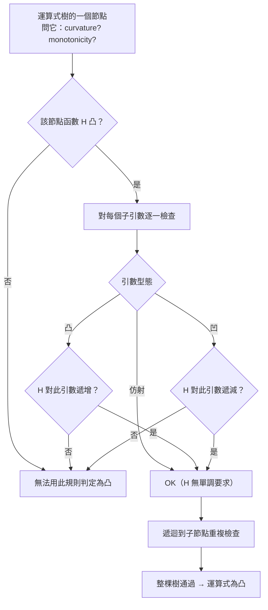

# 保凸運算與擬凸性

對應逐字稿：`data/EE364A/transcripts/Stanford EE364A Convex Optimization I Stephen Boyd I 2023 I Lecture 4 [U2HRwA7XePU].en.txt`

本章已完整閱讀逐字稿，閱讀筆記見 [Lecture 4 閱讀筆記](notes/lecture-04-operations-and-quasiconvexity.md)。

> 這一講幾乎全是「數學工具」，正是 Lecture 1 預告的前三週純數學的核心。但 Boyd 一再強調：它離「超級有用」只差幾週。本章要建立的是一種能力——**看到一個外表嚇人的運算式，不查定義、不算 Hessian，就能判斷它凸不凸**。這正是所有凸優化軟體背後的機制。

## 一個心態：建構式凸分析（constructive convex analysis）

有人問「這是凸的還是凹的？」時，你**幾乎不會**真的回去套定義，或去算一個 Hessian、看它是不是半正定。那太罕見了。實務上（以及軟體內部）的做法是**建構式**的，像一套微積分：

1. 先記住一批**基礎凸函數**與**基礎凸集**。
2. 再學一組**運算規則**：把這些基礎物件組合、轉換，並且知道「這個組合／轉換也保持凸性」。

只要把運算式一路用保凸規則搭起來，凸性就自動被保證。本章其餘部分就是在盤點這些規則，從最顯然的開始，逐步走到一點都不顯然、卻威力極大的 **composition 規則**——它是後面八週你會反覆使用的工具，也是 DCP 的唯一核心。

Boyd 的提醒：這些規則大多是「三行證明」，他不會一一證。你應該偶爾自己抓一條下來親手證一遍，因為「總得有人證，只是不會是我」。

## 從顯然到不顯然的保凸規則

### 縮放、加總、仿射前置

最基本的幾條，直覺上就成立：

- **正數縮放**：$f$ 凸 $\Rightarrow 3.7 f$ 凸。函數向上彎，乘個正數就彎得更兇。
- **相加**：$f_1, f_2$ 凸 $\Rightarrow f_1 + f_2$ 凸。
- **仿射前置（precomposition with affine）**：先把 $x$ 映成 $Ax+b$，再套凸函數 $f$，則 $f(Ax+b)$ 仍凸。

### 逐點最大與 supremum

**逐點最大（pointwise maximum）** 保凸：一堆凸函數取 max，圖形是各函數的上包絡，肉眼就看得出仍向上彎。

$$
f(x) = \max\{f_1(x), \dots, f_m(x)\}\ \text{凸，若各 } f_i \text{ 凸}.
$$

這帶出幾個有用的建構：

- **分段線性（piecewise-linear）函數**：一種標準寫法是給 $\mathbb{R}^n$ 一個 Voronoi 分割、每區指定一個仿射函數；但更好用的表示是「一組仿射函數取 max」，如此得到的必是凸的分段線性函數。
- **最大 $k$ 個分量之和**：$f(x)=$（$x$ 中最大的 4 個分量之和）。它不可微、沒有 Hessian，卻是凸的——因為它等於「從 $n$ 個分量裡選 4 個相加」的**所有 $\binom{n}{4}$ 種組合取 max**，每種都是線性的。
- 甚至「最大 **5.6** 個分量之和」也有明確意義且是凸的：等於最大 5 個分量之和，再加上 $0.6\times$ 第 6 大的分量。

把 max 推廣到無窮多個就是 **supremum**（可視為「無限多個數取最大」，可能是 $+\infty$）。看到 $\sup$，多半可以先在心裡換成 $\max$ 來理解。關鍵是：被 sup 掉的那個變數 $y$ **可以是任何東西**——向量、圖上的一條路徑、一個排列，都行。

$$
f(x) = \sup_{y \in \mathcal{A}} g(x, y)\ \text{凸，若每個 } g(\cdot, y) \text{ 對 } x \text{ 凸}.
$$

三個經典例子：

| 建構 | 定義 | 為何凸 |
|---|---|---|
| support function | $S_C(x)=\sup_{y\in C} y^\top x$ | 對每個 $y$ 是 $x$ 的線性函數；$C$ **不必凸** |
| 到集合的最遠距離 | $\sup_{y\in C}\|x-y\|$ | 每個 $\|x-y\|$ 對 $x$ 凸；如基地台選址要覆蓋合約區的最遠點 |
| 對稱矩陣最大特徵值 | $\lambda_{\max}(X)=\sup_{\|y\|=1} y^\top X y$ | $y^\top X y$ 對 $X$ 是**線性**的 |

最大特徵值這一例特別能訓練「隨時盯著誰是變數」的習慣：$y^\top X y = \sum_{i,j} y_i y_j X_{ij}$ 對 $y$ 是二次的，但**對 $X$ 是線性的**。特徵值本身沒有解析公式（五次以上多項式無根式解，約 200 年前已證），但它作為一堆線性函數的 supremum，凸性一目了然。

## Composition：一條統包一切的規則

Boyd 對這一段特別鄭重：**接下來八週（很可能更久）你會一直用它。**

### 純量版

問題是：$h(g(x))$ 何時凸？我們已知一個特例——$g$ 仿射時就是前面的仿射前置。現在放寬 $g$：

- $h$ **凸且遞增**、$g$ **凸** $\Rightarrow h\circ g$ 凸。
- $h$ **凸且遞減**、$g$ **凹** $\Rightarrow h\circ g$ 凸。

（嚴格說「遞增」要理解為對 extended-value extension 的非遞減，但直覺上就當遞增。）最有名的例子：$g$ 凸 $\Rightarrow e^{g(x)}$ 凸，所以 $e^{x^2}$ 一定凸。另一個：$g$ 是**正的凹函數** $\Rightarrow 1/g(x)$ 凸（因為 $1/x$ 在正半軸凸且遞減）。

**助記法**：忘了規則時，就假設一切在 $\mathbb{R}$ 且可微，回到微積分。一次微分得 $h'(g)\,g'$，二次微分得

$$
f''(x) = h''(g(x))\,g'(x)^2 + h'(g(x))\,g''(x).
$$

所有假設其實只是在規定 0/1/2 階導數的**符號**，接著用最笨的符號算術判號。以「$h$ 凸遞減、$g$ 凹」為例：$g''\le 0$ 且 $h'(g)\le 0$，相乘 $\ge 0$；$g'^2\ge 0$ 且 $h''(g)\ge 0$，相乘 $\ge 0$；兩個非負相加仍非負，故 $f''\ge 0$，即凸。

一個學生的好問題：反過來成立嗎？**不成立**。composition rule 的假設**成立**時你能斷定凸；但假設**不成立**時函數仍可能凸。規則是充分、非必要。

### 向量版（一般式）

真正威力來自 $h$ 有多個引數的情形。設 $H$ 是凸函數，$g(x)=(g_1(x),\dots,g_k(x))$，考慮 $f(x)=H(g_1(x),\dots,g_k(x))$。**最一般的規則**是：

> $f$ 凸，只要 $H$ 凸，且**對每一個引數**下列三者擇一成立：
>
> - (a) 該引數是**仿射**——此時 $H$ 對它**無單調性要求**；
> - (b) 該引數**凸**，且 $H$ 對它**遞增**（非遞減）；
> - (c) 該引數**凹**，且 $H$ 對它**遞減**（非遞增）。

你可以對不同引數自由 **mix and match** 仿射／凸／凹與單調性。這條規則的迷人之處在於它**統包了先前所有規則**。例如要證「$k$ 個凸函數之和為凸」，取 $H(z_1,\dots,z_k)=\sum z_i$：它凸、對每個引數遞增，代入凸的 $g_i$ 即得。要證「max 為凸」，取 $H=\max$：它凸、對每個引數非遞減，同理成立。實務上人們仍習慣先記「和」「max」這些直覺版，再往一般式收斂。

一個立刻有用的推論：**log-sum-exp（soft max）套一堆凸函數仍凸**，因為 $\log\sum_i e^{z_i}$ 凸且對每個引數遞增；這些 $z_i$ 可以是你在配統計模型時的各項損失。

### 這就是 DCP

把上面的檢查機械化，就是所有凸優化軟體的基礎——**disciplined convex programming（DCP）**。它的意思不多不少：**你寫下的每個運算式，都能用這一條 composition 規則驗證**。

在真正的語言裡，這幾乎是一行遞迴：走運算式樹（expression tree），從葉節點往上，對每個節點問它的 curvature 與 monotonicity，並對每個子引數呼叫同一個方法。整式若通過檢查即為凸。再次提醒：**逆命題為假**——檢查失敗不代表函數非凸。

### 一個病態範例

Boyd 用一個「街上大概沒人認得是凸的」函數示範，先給最簡單的原型 $x^2/y$（$y>0$）：它 jointly convex、對 $x$ 一般**非單調**、對 $y$ **遞減**。於是根據一般式，$x$ 位置可放**仿射**運算式、$y$ 位置可放**凹**運算式。組出來的怪物：

$$
f(x) = \frac{(\mathbf{1}^\top x)^2}{\min\{\,2,\ \sqrt{x_3}\,\}}.
$$

逐節點檢查：分子 $(\mathbf{1}^\top x)^2$ 的底 $\mathbf{1}^\top x$ 是仿射（合法放進 $x$ 位置）；分母要凹，而 $\sqrt{x_3}$ 凹（$\sqrt{\cdot}$ 凹前置線性取分量）、常數 $2$ 凹，兩個凹函數取 **min 仍凹**（對偶於「兩凸取 max 仍凸」）。整體通過 → 凸。若沒有這套規則，「祝你好運」去證這種函數是凸的。

> 一個微妙處：**單調性可依定義域附加資訊而變**。$x^2/y$ 對 $x$ 一般非單調，但若已知 $x\ge 0$，它就對 $x$ 遞增。這叫「sign-dependent monotonicity」。

## 另外三種保凸運算

### Partial minimization（偏最小化）

取 max（sup）保凸時 $y$ 幾乎無條件；但取 **min** 要小心：

$$
g(x) = \inf_{y\in C} f(x, y)\ \text{凸，若 } f \text{ 對 }(x,y)\text{ jointly convex，且 } C \text{ 凸}.
$$

這叫 **partial minimization（偏最小化）保凸**。注意 **jointly convex 是強條件**：$f$ 對 $x$（固定 $y$）凸、對 $y$（固定 $x$）凸，**不足以**推出 jointly convex。反例就是 $f(x,y)=xy$——固定任一變數都線性，但沿 45 度斜切時曲率向下。幾何上，joint convex 要求你**沿任意方向**（不只水平／垂直）走都有正確曲率。

這正是 **dynamic programming** 背後的原理：要對一個大函數最小化，先對一個變數 min 得到 value function，偏最小化保凸告訴你這個 value function 何時仍凸。

二次型的例子最漂亮。設

$$
f(x,y) = \begin{bmatrix} x \\ y \end{bmatrix}^\top \begin{bmatrix} A & B \\ B^\top & C \end{bmatrix} \begin{bmatrix} x \\ y \end{bmatrix},
$$

它 jointly convex 的條件是那個分塊矩陣**半正定**。對 $y$ 取梯度、解出 $y$、代回，得到一個仍是 $x$ 的二次型：

$$
\inf_y f(x,y) = x^\top (A - B C^{-1} B^\top) x.
$$

$A - B C^{-1} B^\top$ 就是 **Schur complement（舒爾補）**。兩個結論：二次型在偏最小化下封閉；且原分塊矩陣 PSD $\Rightarrow$ Schur complement 亦 PSD。它出現在 conditioning Gaussian 隨機向量、電路端點條件、幾乎所有工程領域，只是常被藏在難看的記號裡而沒被點名。

### Perspective（透視）

回憶 perspective 映射：把最後一個（正的）分量拿來除掉其餘。函數的 perspective 定義為

$$
g(x, t) = t\, f(x/t), \quad t > 0.
$$

**$f$ 凸 $\Rightarrow$ 其 perspective $g$ 凸。** 這一條不顯然，但成立，而且好用。兩個例子：

- $f(x)=x^\top x$（各分量平方和，凸）$\Rightarrow g(x,t)=\dfrac{x^\top x}{t}=\sum_i \dfrac{x_i^2}{t}$，一堆 quadratic-over-linear，凸——不必再動 Hessian。
- $f(x)=-\log x$（凸）$\Rightarrow g(x,t)=-t\log(x/t)$，這正是**相對熵（relative entropy）**，進而連到 **KL divergence** 等。

### Conjugate（共軛函數）

這是本講最後、也最中心的一個建構，Boyd 說它在經濟學、統計、機率裡「絕對核心」：

$$
f^*(y) = \sup_x \left( y^\top x - f(x) \right).
$$

$f^*$ 稱為 **conjugate（共軛）**，記號幾乎是通用的 $f^*$。**即使 $f$ 不是凸的，$f^*$ 一定凸**——因為對每個固定 $x$，$y\mapsto y^\top x - f(x)$ 是 $y$ 的**仿射**函數，而一堆仿射函數的 supremum 只可能是凸的。所以哪怕有人在街上寫出充滿雙曲餘弦與正弦的鬼東西問你凸不凸，你只要認出「這是個 conjugate」就能保持冷靜。

**經濟解讀**（Boyd 會在 Duality 章展開）：$x$ 是各產品產量、$f(x)$ 是生產成本、$y$ 是各產品市價，則 $y^\top x$ 是毛收入、$y^\top x - f(x)$ 是利潤，於是 $f^*(y)$ 就是「**價格為 $y$ 時的最優利潤**」。

**Biconjugate 與 convex envelope**：對 $f^*$ 再取共軛得 $f^{**}$。因為每次共軛結果都凸，若 $f$ 起初就非凸，$f^{**}\ne f$。$f^{**}$ 有個漂亮名字——**convex envelope（凸包絡）**，是「塞在 $f$ 底下的最大凸函數」；等價地，取 $f$ 的 epigraph、再取其 convex hull，就是 $f^{**}$ 的 epigraph。當 $f$ 凸（且滿足一個小的閉性技術條件）時，$f^{**}=f$——這會是後續許多理論的基礎。

兩個算得出來的共軛：$-\log x$ 的共軛大致仍像個 $\log$（換號、加常數偏移）；$\tfrac12 x^\top Q x$（$Q\succ 0$）的共軛是 $\tfrac12 y^\top Q^{-1} y$，用**逆矩陣**給出。

## 凸性的推廣：quasiconvex

數學裡有一整個「推廣凸性」的子行業（pseudoconvex、quasiconvex⋯⋯，書上約 300 頁會有張嚇人的蘊含關係圖）。本講只挑**真正有用**的兩個：**quasiconvex（本講）** 與 **log-convex（下一講預告）**。

**定義**：$f$ **quasiconvex（擬凸）**，若它的**每個 sublevel set 都是凸集**。另一個常見名字是 **unimodal（單峰）**。

$$
S_\alpha = \{ x : f(x) \le \alpha \}\ \text{對所有 } \alpha \text{ 皆凸}.
$$

一維直覺：先下降、到某點後上升。檢查方式就是逐一抬高水平線 $\alpha$：太低時 $S_\alpha=\varnothing$（空集是凸的）；恰觸底時是單點（凸）；再高是一段區間（凸）。例子：$\sqrt{|x|}$ 既非凸也非凹，但擬凸；天花板函數 $\lceil x\rceil$（階梯狀）也擬凸。

sublevel set 的實務意義很直接：若 $f$ 是你要最小化的**目標**（例如損失函數），那麼 $S_\alpha$ 就是「所有把資料配得**至少和 $\alpha$ 一樣好**的參數」的集合；quasiconvex 保證這個集合是凸的。

> **插曲：整數值的凸函數。** Boyd 帶大家玩了一輪——整數值又凸的函數，基本上**只有常數**（$1$、$2$、$-13$⋯⋯）。你可以構造病態的邊界反例（例如在 $[-3,2]$ 內取值 7、在端點 $-3$ 取 10、在 $2$ 取 12，用弦來驗證確實凸），但「別跟會舉這種例子的人來往」。修正後的準則是：**內部有任何不連續，就不是凸**。

**插曲的用處——cardinality。** 定義 $t(z)=0$（$z=0$）、$=1$（$z\ne0$），則

$$
\operatorname{card}(x) = \sum_i t(x_i) = x \text{ 的非零分量個數}.
$$

若 $x$ 是投資組合，$\operatorname{card}(x)$ 就是你實際持有的資產數（業界說法約是「number of names」）。它**不是凸的**（有不連續），但與凸性的連結（如何用凸方法逼近稀疏性）留待後續 L1 相關章節。

### 應用：內部報酬率（IRR）是 quasiconcave

一個很實際的例子。給一段跨 $n+1$ 期的現金流 $x=(x_0,x_1,\dots,x_n)$（例如買債券：$x_0<0$ 是買價，之後是票息，到期領回票息加面額）。假設 $x_0<0$（先投入）且 $\sum_i x_i>0$（總額為正，至少不是災難）。以利率 $R$ 折現的**淨現值（net present value）**：

$$
\text{PV}(x, R) = \sum_{i=0}^{n} x_i (1+R)^{-i}.
$$

**內部報酬率 IRR** 是使 $\text{PV}(x,R)=0$ 的最小利率。它作為 $x$ 的函數是 **quasiconcave**（accounting 的人多半不知道這件事）。要證 quasiconcave，就證**上水平集（super-level set）** 為凸。考慮「IRR $\ge R$」：這等價於在 $[0,R]$ 上**每個**利率 $r$ 的淨現值都 $\ge 0$。對固定的 $r$，$\text{PV}(x,r)$ 對 $x$ **線性**，故 $\{x:\text{PV}(x,r)\ge 0\}$ 是一個（開）**半空間**（凸）。要 IRR $\ge R$ 就得落在 $[0,R]$ 上**所有這些半空間的交集**裡——凸集的交集仍凸，得證。（這裡的交集是對不可數多個 $r$ 取，沒問題：max/min 的規則本就可推廣到無窮集合。）

> 小提醒：沒有「concave set（凹集）」這種東西。集合只有凸與否；concave 一詞留給函數（與凹透鏡、凹面鏡）。

### quasiconvex 的 Jensen 不等式

凸函數的 Jensen 說「混合的函數值 $\le$ 函數值的混合」。quasiconvex 版把右邊換成 **max**：

$$
f\big(\theta x + (1-\theta) y\big) \le \max\{ f(x),\ f(y) \}, \quad 0\le\theta\le1.
$$

也就是弦不必壓在圖形上方，但圖形必須落在兩端點值的 **max 以下**。

## 尾聲與預告

Boyd 在結尾說：這條「數學長征」還剩約 10–15 分鐘的內容；下一個推廣是 **log-convexity（對數凸性）**——一個「幾乎、又不完全」算是凸性推廣的概念，本講未展開。他打趣：「太陽會在下週二上課約 20 分鐘後出來。」意指應用即將登場。

## 本章小結

- 辨識凸性的實務主流是**建構式凸分析**：記住基礎凸函數／凸集，再用保凸規則組合，而非回定義或算 Hessian。
- 簡單規則：正數縮放、相加、仿射前置 $f(Ax+b)$ 皆保凸。
- 逐點 max / sup 保凸：分段線性（仿射取 max）、最大 $k$ 個分量之和、support function、到集合最遠距離、$\lambda_{\max}(X)=\sup_{\|y\|=1}y^\top Xy$；被 sup 的變數可以是任何東西。
- **Composition 一般式**是全講核心也是 **DCP** 的唯一規則：$H$ 凸，且對每個引數（仿射／凸配遞增／凹配遞減）擇一成立即保凸；它統包和與 max。逆命題為假。
- 助記：$f''=h''(g)g'^2+h'(g)g''$，用 0/1/2 階導數符號算術判斷。
- **Partial minimization** 對 jointly convex 的 $f$、在凸集上對 $y$ 取 min 保凸；二次型給出 **Schur complement**，連結 dynamic programming。joint convex 是強條件（$xy$ 為反例）。
- **Perspective** $t\,f(x/t)$ 保凸；例：quadratic-over-linear、相對熵。
- **Conjugate** $f^*(y)=\sup_x(y^\top x-f(x))$ 即使 $f$ 非凸也必凸（仿射之 sup）；經濟意義為最優利潤；$f^{**}$ 是 convex envelope，$f$ 凸且閉時 $f^{**}=f$。
- **Quasiconvex（unimodal）**＝所有 sublevel set 凸；IRR 為 quasiconcave（super-level set 是半空間的交集）；cardinality 非凸；有 max 版 Jensen 不等式。log-convex 留待下一講。

## 相關教材與材料

此段只建立關聯，不提供作業解答。若材料尚未核對或資訊不足，保留 `待補`。

- 對應 slides：`data/EE364A/course material/slids/03_Convex functions.pdf`（Convex functions 後半：operations that preserve convexity、composition、conjugate、quasiconvex）。狀態：待核對逐頁對應。
- 對應教科書：《Convex Optimization》（Boyd & Vandenberghe）第 3 章 Convex functions，約 §3.2 保凸運算、§3.2.4–3.2.5 composition／minimization／perspective、§3.3 conjugate、§3.4 quasiconvex。狀態：`待補`（頁碼未核對）。
- 一般式 composition 規則：Boyd 提到「應有一題作業，其實本該是書上的題目」。作業編號（2023 版）：`待補`。
- 行政資訊（作業、考試、評分）屬 2025–2026 學期版本，集中於附錄，不與 2023 逐字稿內容混寫。
- log-convex（教科書 §3.5）本講僅口頭預告，內容歸入下一講。
